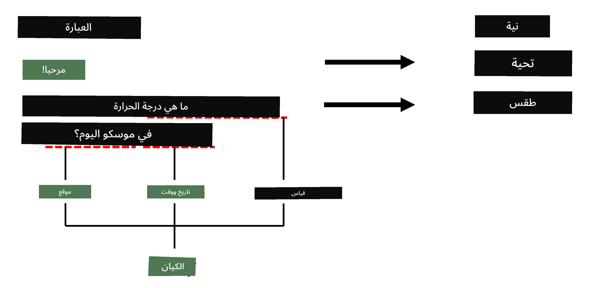
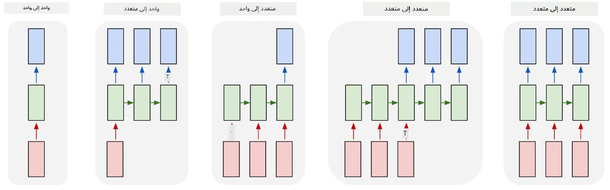

# التعرف على الكيانات المسماة

حتى الآن، كنا نركز بشكل أساسي على مهمة واحدة في معالجة اللغة الطبيعية - التصنيف. ومع ذلك، هناك مهام أخرى يمكن تحقيقها باستخدام الشبكات العصبية. واحدة من هذه المهام هي **[التعرف على الكيانات المسماة](https://wikipedia.org/wiki/Named-entity_recognition)** (NER)، والتي تتعامل مع التعرف على كيانات محددة داخل النص، مثل الأماكن، أسماء الأشخاص، فترات الزمن، الصيغ الكيميائية، وغيرها.

## [اختبار ما قبل المحاضرة](https://ff-quizzes.netlify.app/en/ai/quiz/37)

## مثال على استخدام NER

افترض أنك تريد تطوير روبوت دردشة يعتمد على اللغة الطبيعية، مشابه لـ Amazon Alexa أو Google Assistant. الطريقة التي تعمل بها روبوتات الدردشة الذكية هي *فهم* ما يريده المستخدم من خلال تصنيف النص في الجملة المدخلة. نتيجة هذا التصنيف تُعرف بـ **النية**، والتي تحدد ما يجب أن يقوم به روبوت الدردشة.

> الصورة من إعداد المؤلف

ومع ذلك، قد يقدم المستخدم بعض المعطيات كجزء من العبارة. على سبيل المثال، عند طلب حالة الطقس، قد يحدد الموقع أو التاريخ. يجب أن يكون الروبوت قادرًا على فهم هذه الكيانات وملء المعطيات المناسبة قبل تنفيذ الإجراء. هذا هو بالضبط دور NER.

> ✅ مثال آخر يمكن أن يكون [تحليل الأوراق العلمية الطبية](https://soshnikov.com/science/analyzing-medical-papers-with-azure-and-text-analytics-for-health/). أحد الأمور الرئيسية التي نحتاج إلى البحث عنها هي المصطلحات الطبية المحددة، مثل الأمراض والمواد الطبية. بينما يمكن استخراج عدد صغير من الأمراض باستخدام البحث عن النصوص الفرعية، فإن الكيانات الأكثر تعقيدًا، مثل المركبات الكيميائية وأسماء الأدوية، تحتاج إلى نهج أكثر تعقيدًا.

## NER كتصنيف للرموز

نماذج NER هي في الأساس **نماذج تصنيف الرموز**، لأننا بحاجة إلى تحديد لكل رمز مدخل ما إذا كان ينتمي إلى كيان أم لا، وإذا كان كذلك - إلى أي فئة كيان ينتمي.

لنأخذ عنوان الورقة التالي كمثال:

**ارتجاع الصمام ثلاثي الشرفات** و **كربونات الليثيوم** **سمية** في رضيع حديث الولادة.

الكيانات هنا هي:

* ارتجاع الصمام ثلاثي الشرفات هو مرض (`DIS`)
* كربونات الليثيوم هي مادة كيميائية (`CHEM`)
* السمية هي أيضًا مرض (`DIS`)

لاحظ أن الكيان الواحد يمكن أن يمتد عبر عدة رموز. وكما في هذه الحالة، نحتاج إلى التمييز بين كيانين متتاليين. لذلك، من الشائع استخدام فئتين لكل كيان - واحدة تحدد الرمز الأول للكيان (غالبًا ما يتم استخدام البادئة `B-`، لـ **بداية**)، والأخرى - استمرار الكيان (`I-`، لـ **داخل الكيان**). كما نستخدم `O` كفئة لتمثيل جميع الرموز **الأخرى**. هذا النوع من تصنيف الرموز يُعرف بـ [تصنيف BIO](https://en.wikipedia.org/wiki/Inside%E2%80%93outside%E2%80%93beginning_(tagging)) (أو IOB). عند التصنيف، سيبدو العنوان كما يلي:

الرمز | التصنيف
------|-----
ارتجاع | B-DIS
الصمام | I-DIS
ثلاثي | I-DIS
الشرفات | I-DIS
و | O
كربونات | B-CHEM
الليثيوم | I-CHEM
سمية | B-DIS
في | O
رضيع | O
حديث | O
الولادة | O
. | O

نظرًا لأننا بحاجة إلى بناء تطابق واحد لواحد بين الرموز والفئات، يمكننا تدريب نموذج شبكة عصبية **كثيرة إلى كثيرة** من الصورة التالية:

> *الصورة مأخوذة من [هذه المقالة](http://karpathy.github.io/2015/05/21/rnn-effectiveness/) بواسطة [أندريه كارباتي](http://karpathy.github.io/). نماذج تصنيف الرموز لـ NER تتوافق مع بنية الشبكة الموجودة في أقصى اليمين في هذه الصورة.*

## تدريب نماذج NER

نظرًا لأن نموذج NER هو في الأساس نموذج تصنيف الرموز، يمكننا استخدام الشبكات العصبية المتكررة التي تعرفنا عليها بالفعل لهذه المهمة. في هذه الحالة، سيقوم كل كتلة من الشبكة المتكررة بإرجاع معرف الرمز. المثال التالي في دفتر الملاحظات يوضح كيفية تدريب LSTM لتصنيف الرموز.

## ✍️ دفاتر ملاحظات أمثلة: NER

واصل التعلم من خلال دفتر الملاحظات التالي:

* [NER باستخدام TensorFlow](NER-TF.ipynb)

## الخاتمة

نموذج NER هو **نموذج تصنيف الرموز**، مما يعني أنه يمكن استخدامه لتنفيذ تصنيف الرموز. هذه مهمة شائعة جدًا في معالجة اللغة الطبيعية، حيث تساعد في التعرف على كيانات محددة داخل النص بما في ذلك الأماكن، الأسماء، التواريخ، والمزيد.

## 🚀 التحدي

أكمل المهمة المرتبطة أدناه لتدريب نموذج التعرف على الكيانات المسماة للمصطلحات الطبية، ثم جربه على مجموعة بيانات مختلفة.

## [اختبار ما بعد المحاضرة](https://ff-quizzes.netlify.app/en/ai/quiz/38)

## المراجعة والدراسة الذاتية

اقرأ المقالة [الفعالية غير المعقولة للشبكات العصبية المتكررة](http://karpathy.github.io/2015/05/21/rnn-effectiveness/) واتبع قسم القراءة الإضافية في تلك المقالة لتعميق معرفتك.

## [المهمة](lab/README.md)

في المهمة الخاصة بهذه الدرس، ستحتاج إلى تدريب نموذج التعرف على الكيانات الطبية. يمكنك البدء بتدريب نموذج LSTM كما هو موضح في هذا الدرس، ثم الانتقال إلى استخدام نموذج BERT. اقرأ [التعليمات](lab/README.md) للحصول على جميع التفاصيل.

---

