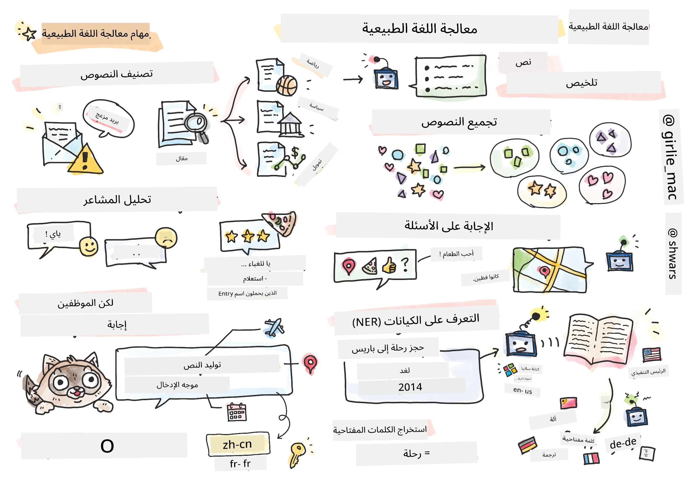

# معالجة اللغة الطبيعية



في هذا القسم، سنركز على استخدام الشبكات العصبية لمعالجة المهام المتعلقة بـ **معالجة اللغة الطبيعية (NLP)**. هناك العديد من مشاكل معالجة اللغة الطبيعية التي نرغب في أن تتمكن الحواسيب من حلها:

* **تصنيف النصوص** هو مشكلة تصنيف نموذجية تتعلق بتسلسلات النصوص. تشمل الأمثلة تصنيف رسائل البريد الإلكتروني كرسائل مزعجة أو غير مزعجة، أو تصنيف المقالات كرياضة، أعمال، سياسة، إلخ. أيضًا، عند تطوير روبوتات المحادثة، غالبًا ما نحتاج إلى فهم ما يريد المستخدم قوله - في هذه الحالة نتعامل مع **تصنيف النوايا**. غالبًا ما يتطلب تصنيف النوايا التعامل مع العديد من الفئات.
* **تحليل المشاعر** هو مشكلة انحدار نموذجية، حيث نحتاج إلى إسناد رقم (مشاعر) يعبر عن مدى إيجابية/سلبية معنى الجملة. نسخة أكثر تقدمًا من تحليل المشاعر هي **تحليل المشاعر القائم على الجوانب** (ABSA)، حيث نُسند المشاعر ليس إلى الجملة بأكملها، بل إلى أجزاء مختلفة منها (الجوانب)، مثل: *في هذا المطعم، أعجبتني المأكولات، لكن الجو كان سيئًا للغاية*.
* **التعرف على الكيانات المسماة** (NER) يشير إلى مشكلة استخراج كيانات معينة من النصوص. على سبيل المثال، قد نحتاج إلى فهم أن الكلمة *غدًا* في العبارة *أحتاج إلى السفر إلى باريس غدًا* تشير إلى تاريخ، و*باريس* هي موقع.
* **استخراج الكلمات المفتاحية** يشبه NER، لكننا نحتاج إلى استخراج الكلمات المهمة لمعنى الجملة تلقائيًا، دون تدريب مسبق على أنواع الكيانات المحددة.
* **تجميع النصوص** يمكن أن يكون مفيدًا عندما نريد تجميع الجمل المتشابهة معًا، على سبيل المثال، الطلبات المتشابهة في محادثات الدعم الفني.
* **الإجابة على الأسئلة** تشير إلى قدرة النموذج على الإجابة على سؤال محدد. يتلقى النموذج مقطع نصي وسؤال كمدخلات، ويحتاج إلى تحديد مكان في النص يحتوي على الإجابة (أو، في بعض الأحيان، توليد نص الإجابة).
* **توليد النصوص** هي قدرة النموذج على توليد نص جديد. يمكن اعتبارها مهمة تصنيف تتنبأ بالحرف/الكلمة التالية بناءً على *موجه نصي*. نماذج توليد النصوص المتقدمة، مثل GPT-3، قادرة على حل مهام معالجة اللغة الطبيعية الأخرى مثل التصنيف باستخدام تقنية تسمى [برمجة الموجهات](https://towardsdatascience.com/software-3-0-how-prompting-will-change-the-rules-of-the-game-a982fbfe1e0) أو [هندسة الموجهات](https://medium.com/swlh/openai-gpt-3-and-prompt-engineering-dcdc2c5fcd29).
* **تلخيص النصوص** هي تقنية نريد فيها أن يقوم الحاسوب بـ "قراءة" نص طويل وتلخيصه في بضع جمل.
* **الترجمة الآلية** يمكن اعتبارها مزيجًا من فهم النص بلغة واحدة، وتوليد النص بلغة أخرى.

في البداية، تم حل معظم مهام معالجة اللغة الطبيعية باستخدام طرق تقليدية مثل القواعد. على سبيل المثال، في الترجمة الآلية، تم استخدام المحللات لتحويل الجملة الأولية إلى شجرة تركيبية، ثم تم استخراج هياكل دلالية أعلى لتمثيل معنى الجملة، وبناءً على هذا المعنى وقواعد اللغة المستهدفة تم توليد النتيجة. في الوقت الحاضر، يتم حل العديد من مهام معالجة اللغة الطبيعية بشكل أكثر فعالية باستخدام الشبكات العصبية.

> يتم تنفيذ العديد من طرق معالجة اللغة الطبيعية الكلاسيكية في مكتبة Python [Natural Language Processing Toolkit (NLTK)](https://www.nltk.org). هناك [كتاب NLTK](https://www.nltk.org/book/) رائع متاح عبر الإنترنت يغطي كيفية حل مهام معالجة اللغة الطبيعية المختلفة باستخدام NLTK.

في دورتنا، سنركز بشكل أساسي على استخدام الشبكات العصبية لمعالجة اللغة الطبيعية، وسنستخدم NLTK عند الحاجة.

لقد تعلمنا بالفعل كيفية استخدام الشبكات العصبية للتعامل مع البيانات الجدولية والصور. الفرق الرئيسي بين تلك الأنواع من البيانات والنصوص هو أن النصوص عبارة عن تسلسل بطول متغير، بينما يكون حجم المدخلات في حالة الصور معروفًا مسبقًا. بينما يمكن للشبكات الالتفافية استخراج الأنماط من البيانات المدخلة، فإن الأنماط في النصوص أكثر تعقيدًا. على سبيل المثال، يمكن أن تكون النفي مفصولة عن الموضوع بعدد كبير من الكلمات (مثل: *أنا لا أحب البرتقال*، مقابل *أنا لا أحب تلك البرتقالة الكبيرة الملونة اللذيذة*)، ويجب أن يتم تفسير ذلك كأنه نمط واحد. لذلك، لمعالجة اللغة، نحتاج إلى تقديم أنواع جديدة من الشبكات العصبية، مثل *الشبكات المتكررة* و*المحولات*.

## تثبيت المكتبات

إذا كنت تستخدم تثبيت Python محلي لتشغيل هذه الدورة، قد تحتاج إلى تثبيت جميع المكتبات المطلوبة لمعالجة اللغة الطبيعية باستخدام الأوامر التالية:

**لـ PyTorch**
```bash
pip install -r requirements-torch.txt
```
**لـ TensorFlow**
```bash
pip install -r requirements-tf.txt
```

> يمكنك تجربة معالجة اللغة الطبيعية باستخدام TensorFlow على [Microsoft Learn](https://docs.microsoft.com/learn/modules/intro-natural-language-processing-tensorflow/?WT.mc_id=academic-77998-cacaste)

## تحذير حول GPU

في هذا القسم، في بعض الأمثلة سنقوم بتدريب نماذج كبيرة جدًا.
* **استخدام حاسوب مزود بـ GPU**: يُنصح بتشغيل دفاتر الملاحظات على حاسوب مزود بـ GPU لتقليل أوقات الانتظار عند العمل مع نماذج كبيرة.
* **قيود ذاكرة GPU**: قد يؤدي التشغيل على GPU إلى حالات نفاد ذاكرة GPU، خاصة عند تدريب نماذج كبيرة.
* **استهلاك ذاكرة GPU**: يعتمد مقدار ذاكرة GPU المستهلكة أثناء التدريب على عوامل مختلفة، بما في ذلك حجم الدفعة الصغيرة.
* **تقليل حجم الدفعة الصغيرة**: إذا واجهت مشاكل في ذاكرة GPU، فكر في تقليل حجم الدفعة الصغيرة في الكود الخاص بك كحل محتمل.
* **إصدار ذاكرة GPU في TensorFlow**: قد لا تقوم الإصدارات القديمة من TensorFlow بإصدار ذاكرة GPU بشكل صحيح عند تدريب نماذج متعددة داخل نواة Python واحدة. لإدارة استخدام ذاكرة GPU بشكل فعال، يمكنك تكوين TensorFlow لتخصيص ذاكرة GPU فقط عند الحاجة.
* **إدراج الكود**: لتعيين TensorFlow لتوسيع تخصيص ذاكرة GPU فقط عند الحاجة، قم بإدراج الكود التالي في دفاتر الملاحظات الخاصة بك:

```python
physical_devices = tf.config.list_physical_devices('GPU') 
if len(physical_devices)>0:
    tf.config.experimental.set_memory_growth(physical_devices[0], True) 
```

إذا كنت مهتمًا بتعلم معالجة اللغة الطبيعية من منظور تعلم الآلة الكلاسيكي، قم بزيارة [هذه المجموعة من الدروس](https://github.com/microsoft/ML-For-Beginners/tree/main/6-NLP)

## في هذا القسم
في هذا القسم سنتعلم عن:

* [تمثيل النصوص كـ Tensors](13-TextRep/README.md)
* [تمثيلات الكلمات](14-Emdeddings/README.md)
* [نمذجة اللغة](15-LanguageModeling/README.md)
* [الشبكات العصبية المتكررة](16-RNN/README.md)
* [الشبكات التوليدية](17-GenerativeNetworks/README.md)
* [المحولات](18-Transformers/README.md)

**إخلاء المسؤولية**:  
تم ترجمة هذا المستند باستخدام خدمة الترجمة بالذكاء الاصطناعي [Co-op Translator](https://github.com/Azure/co-op-translator). بينما نسعى لتحقيق الدقة، يرجى العلم أن الترجمات الآلية قد تحتوي على أخطاء أو معلومات غير دقيقة. يجب اعتبار المستند الأصلي بلغته الأصلية المصدر الرسمي. للحصول على معلومات حاسمة، يُوصى بالاستعانة بترجمة بشرية احترافية. نحن غير مسؤولين عن أي سوء فهم أو تفسيرات خاطئة تنشأ عن استخدام هذه الترجمة.