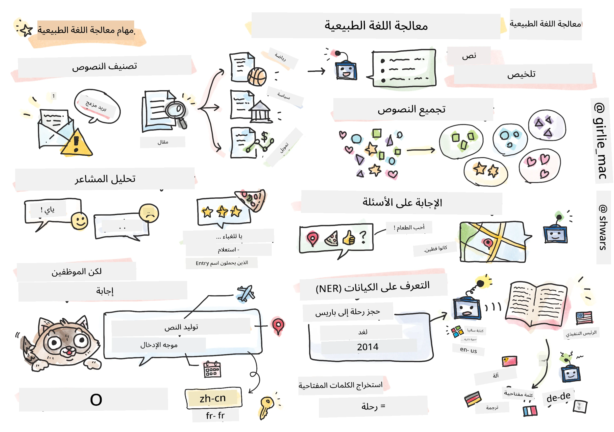

# معالجة اللغة الطبيعية



في هذا القسم، سنركز على استخدام الشبكات العصبية للتعامل مع المهام المتعلقة ب**معالجة اللغة الطبيعية (NLP)**. هناك العديد من مشكلات الـNLP التي نريد من الحواسيب أن تكون قادرة على حلها:

* **تصنيف النصوص** هو مشكلة تصنيف نموذجية تتعلق بتسلسلات النصوص. تشمل الأمثلة تصنيف رسائل البريد الإلكتروني كبريد مزعج مقابل غير مزعج، أو تصنيف المقالات كرياضة أو أعمال أو سياسة وما إلى ذلك. أيضًا، عند تطوير روبوتات المحادثة، نحتاج غالبًا إلى فهم ما أراد المستخدم قوله — في هذه الحالة نتعامل مع **تصنيف النية**. غالبًا، في تصنيف النية نحتاج إلى التعامل مع العديد من الفئات.
* **تحليل المشاعر** هو مشكلة انحدار نموذجية، حيث نحتاج إلى إسناد رقم (مشاعر) يعبر عن مدى إيجابية/سلبية معنى الجملة. نسخة متقدمة من تحليل المشاعر هي **تحليل المشاعر بناءً على الجوانب** (ABSA)، حيث ننسب المشاعر ليس إلى الجملة بأكملها، بل إلى أجزاء مختلفة منها (الجوانب)، مثل *في هذا المطعم، أحببت المأكولات، لكن كان الجو رهيبًا*.
* **التعرف على الكيانات المسماة** (NER) تشير إلى مشكلة استخراج كيانات معينة من النص. على سبيل المثال، قد نحتاج إلى فهم أن في العبارة *أحتاج للسفر إلى باريس غدًا* كلمة *غدًا* تشير إلى التاريخ، و*باريس* هي موقع.  
* **استخراج الكلمات المفتاحية** مشابه لـNER، لكننا نحتاج إلى استخراج الكلمات المهمة لمعنى الجملة تلقائيًا، بدون تدريب مسبق لأنواع كيانات محددة.
* **تجميع النصوص** يمكن أن يكون مفيدًا عندما نريد جمع جمل متشابهة معًا، على سبيل المثال، طلبات متشابهة في محادثات دعم فني.
* **الإجابة على الأسئلة** تشير إلى قدرة نموذج على الإجابة عن سؤال محدد. يستقبل النموذج مقطع نص وسؤال كمدخلات، ويحتاج إلى توفير مكان في النص يحتوي على إجابة السؤال (أو، أحيانًا، توليد نص الإجابة).
* **توليد النصوص** هي قدرة نموذج على توليد نص جديد. يمكن اعتبارها مهمة تصنيف تتنبأ بالحرف/الكلمة التالية بناءً على *موجه نصي* معين. النماذج المتقدمة لتوليد النصوص، مثل GPT-3، قادرة على حل مهام NLP أخرى مثل التصنيف باستخدام تقنية تسمى [برمجة الموجهات](https://towardsdatascience.com/software-3-0-how-prompting-will-change-the-rules-of-the-game-a982fbfe1e0) أو [هندسة الموجهات](https://medium.com/swlh/openai-gpt-3-and-prompt-engineering-dcdc2c5fcd29)
* **تلخيص النصوص** هي تقنية نريد فيها من الحاسوب "قراءة" نص طويل وتلخيصه في بضع جمل.
* **الترجمة الآلية** يمكن رؤيتها كمزيج من فهم النص بلغة معينة، وتوليد النص بلغة أخرى.

في البداية، كانت معظم مهام NLP تُحل باستخدام طرق تقليدية مثل القواعد اللغوية. على سبيل المثال، في الترجمة الآلية كان يُستخدم المحللون اللغويون لتحويل الجملة الأولية إلى شجرة تركيب، ثم تُستخرج هياكل معنوية أعلى مستوى لتمثيل معنى الجملة، وبناءً على هذا المعنى وقواعد اللغة الهدف تُنشأ النتيجة. اليوم، تُحل العديد من مهام NLP بشكل أكثر فعالية باستخدام الشبكات العصبية.

> العديد من طرق NLP التقليدية مُنفذة في مكتبة بايثون [Natural Language Processing Toolkit (NLTK)](https://www.nltk.org). هناك كتاب رائع [NLTK Book](https://www.nltk.org/book/) متاح عبر الإنترنت يشرح كيف يمكن حل مهام NLP المختلفة باستخدام NLTK.

في دورتنا، سنركز بشكل أساسي على استخدام الشبكات العصبية لمعالجة اللغة الطبيعية، وسنستخدم NLTK عند الحاجة.

لقد تعلمنا بالفعل عن استخدام الشبكات العصبية للتعامل مع البيانات الجدولية والصور. الفرق الرئيسي بين تلك الأنواع من البيانات والنص هو أن النص سلسلة ذات طول متغير، بينما حجم الإدخال في حالة الصور معروف مسبقًا. بينما يمكن للشبكات الالتفافية استخراج أنماط من بيانات الإدخال، الأنماط في النص أكثر تعقيدًا. على سبيل المثال، يمكن أن يكون النفي مفصولًا عن الموضوع بكلمات متعددة (مثلًا *أنا لا أحب البرتقال*، مقابل *أنا لا أحب تلك البرتقالات الكبيرة الملونة اللذيذة*)، ويجب أن يُفسر ذلك كنمط واحد. لذا، للتعامل مع اللغة نحتاج إلى إدخال أنواع جديدة من الشبكات العصبية، مثل *الشبكات العودية* و*المحولات*.

## تثبيت المكتبات

إذا كنت تستخدم تثبيت بايثون محلي لتشغيل هذه الدورة، قد تحتاج إلى تثبيت جميع المكتبات المطلوبة لـNLP باستخدام الأوامر التالية:

**لـPyTorch**
```bash
pip install -r requirements-pytorch.txt
```
**لـTensorFlow**
```bash
pip install -r requirements-tf.txt
```

> يمكنك تجربة NLP مع TensorFlow على [Microsoft Learn](https://docs.microsoft.com/learn/modules/intro-natural-language-processing-tensorflow/?WT.mc_id=academic-77998-cacaste)

## تحذير بشأن وحدة معالجة الرسومات (GPU)

في هذا القسم، في بعض الأمثلة سنقوم بتدريب نماذج كبيرة إلى حد ما.
* **استخدم جهاز مزود بوحدة معالجة رسومات**: من المستحسن تشغيل دفاتر الملاحظات الخاصة بك على جهاز مزود بوحدة معالجة رسومات لتقليل أوقات الانتظار عند العمل مع النماذج الكبيرة.
* **قيود ذاكرة وحدة معالجة الرسومات**: التشغيل على GPU قد يؤدي إلى مواقف حيث تنفد ذاكرة GPU، خاصة عند تدريب نماذج كبيرة.
* **استهلاك ذاكرة GPU**: كمية ذاكرة GPU المستهلكة أثناء التدريب تعتمد على عوامل مختلفة، بما في ذلك حجم الحزمة الجزئية.
* **تقليل حجم الحزمة الجزئية**: إذا واجهت مشكلات في ذاكرة GPU، فكر في تقليل حجم الحزمة الجزئية في كودك كحل محتمل.
* **تحرير ذاكرة GPU في TensorFlow**: الإصدارات القديمة من TensorFlow قد لا تحرر ذاكرة GPU بشكل صحيح عند تدريب نماذج متعددة داخل نواة بايثون واحدة. لإدارة استخدام ذاكرة GPU بفعالية، يمكنك تكوين TensorFlow لتخصيص ذاكرة GPU فقط عند الحاجة.
* **شمول الكود**: لتعيين TensorFlow للنمو التدريجي في تخصيص ذاكرة GPU فقط عند الحاجة، أدرج الكود التالي في دفاتر ملاحظاتك:

```python
physical_devices = tf.config.list_physical_devices('GPU') 
if len(physical_devices)>0:
    tf.config.experimental.set_memory_growth(physical_devices[0], True) 
```

إذا كنت مهتمًا بتعلم NLP من منظور تعلّم الآلة الكلاسيكي، قم بزيارة [هذه المجموعة من الدروس](https://github.com/microsoft/ML-For-Beginners/tree/main/6-NLP)

## في هذا القسم
في هذا القسم سنتعلم عن:

* [تمثيل النصوص كمصفوفات](13-TextRep/README.md)
* [تضمين الكلمات](14-Embeddings/README.md)
* [نمذجة اللغة](15-LanguageModeling/README.md)
* [الشبكات العصبية العودية](16-RNN/README.md)
* [الشبكات التوليدية](17-GenerativeNetworks/README.md)
* [المحولات](18-Transformers/README.md)

---

<!-- CO-OP TRANSLATOR DISCLAIMER START -->
**تنويه**:
تمت ترجمة هذا المستند باستخدام خدمة الترجمة بالذكاء الاصطناعي [Co-op Translator](https://github.com/Azure/co-op-translator). بينما نسعى للدقة، يرجى العلم أن الترجمات الآلية قد تحتوي على أخطاء أو عدم دقة. يجب اعتبار المستند الأصلي بلغته الأصلية المصدر الرسمي والمعتمد. للمعلومات الهامة، يُنصح بالاستعانة بترجمة بشرية محترفة. نحن غير مسؤولين عن أي سوء فهم أو تفسير ناتج عن استخدام هذه الترجمة.
<!-- CO-OP TRANSLATOR DISCLAIMER END -->