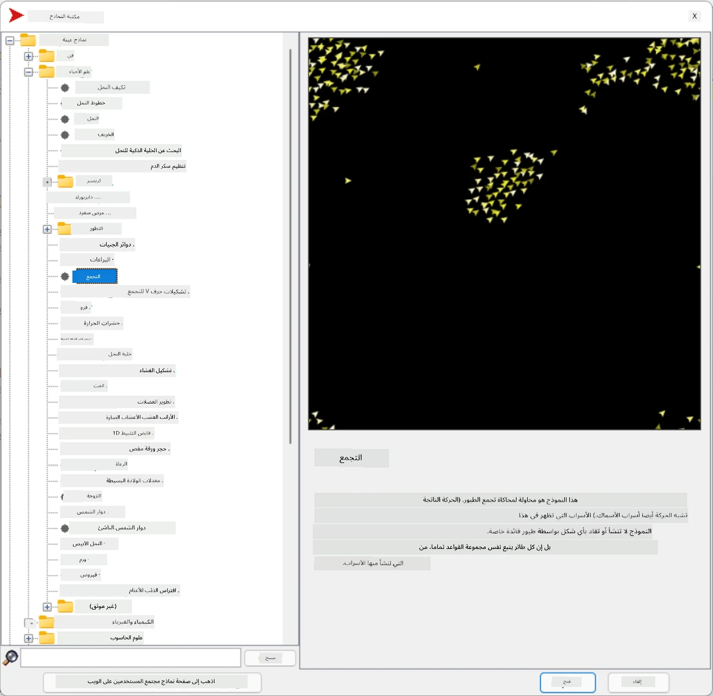
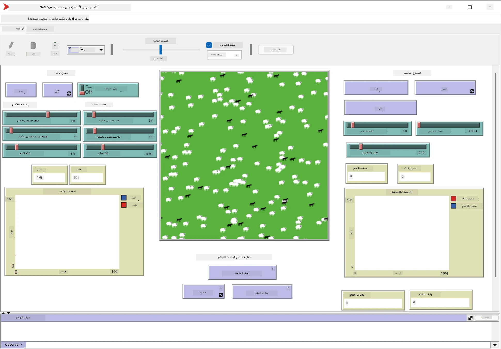

# الأنظمة متعددة الوكلاء

إحدى الطرق الممكنة لتحقيق الذكاء هي النهج المعروف بـ **الظهور** (أو **التآزر**)، والذي يعتمد على حقيقة أن السلوك المشترك للعديد من الوكلاء البسيطين نسبيًا يمكن أن يؤدي إلى سلوك أكثر تعقيدًا (أو ذكاءً) للنظام ككل. نظريًا، يعتمد هذا على مبادئ [الذكاء الجماعي](https://en.wikipedia.org/wiki/Collective_intelligence)، [الظهورية](https://en.wikipedia.org/wiki/Global_brain)، و[السيبرنتيك التطوري](https://en.wikipedia.org/wiki/Global_brain)، التي تنص على أن الأنظمة ذات المستوى الأعلى تكتسب نوعًا من القيمة المضافة عند دمجها بشكل صحيح من أنظمة ذات مستوى أدنى (ما يسمى *مبدأ الانتقال بين الأنظمة*).

## [اختبار ما قبل المحاضرة](https://ff-quizzes.netlify.app/en/ai/quiz/45)

ظهر اتجاه **الأنظمة متعددة الوكلاء** في الذكاء الاصطناعي في التسعينيات كرد فعل على نمو الإنترنت والأنظمة الموزعة. يركز أحد كتب الذكاء الاصطناعي الكلاسيكية، [الذكاء الاصطناعي: نهج حديث](https://en.wikipedia.org/wiki/Artificial_Intelligence:_A_Modern_Approach)، على وجهة نظر الذكاء الاصطناعي الكلاسيكي من منظور الأنظمة متعددة الوكلاء.

المفهوم المركزي في نهج الأنظمة متعددة الوكلاء هو مفهوم **الوكيل** - وهو كيان يعيش في بيئة معينة، يمكنه إدراكها والتفاعل معها. هذا تعريف واسع جدًا، ويمكن أن يكون هناك العديد من الأنواع والتصنيفات المختلفة للوكلاء:

* بناءً على قدرتهم على التفكير:
   - الوكلاء **التفاعليون** عادةً ما يكون لديهم سلوك بسيط من نوع الطلب-الاستجابة.
   - الوكلاء **التدبيريون** يستخدمون نوعًا من التفكير المنطقي و/أو قدرات التخطيط.
* بناءً على مكان تنفيذ الوكيل لرمزه:
   - الوكلاء **الثابتون** يعملون على عقدة شبكة مخصصة.
   - الوكلاء **المتنقلون** يمكنهم نقل رمزهم بين عقد الشبكة.
* بناءً على سلوكهم:
   - الوكلاء **السلبيون** ليس لديهم أهداف محددة. يمكنهم التفاعل مع المحفزات الخارجية، لكنهم لن يبادروا بأي إجراءات بأنفسهم.
   - الوكلاء **النشطون** لديهم أهداف يسعون لتحقيقها.
   - الوكلاء **الإدراكيون** يشملون التخطيط المعقد والتفكير.

تُستخدم الأنظمة متعددة الوكلاء اليوم في عدد من التطبيقات:

* في الألعاب، العديد من الشخصيات غير القابلة للعب تستخدم نوعًا من الذكاء الاصطناعي، ويمكن اعتبارها وكلاء أذكياء.
* في إنتاج الفيديو، يتم عادةً استخدام محاكاة متعددة الوكلاء لتقديم مشاهد ثلاثية الأبعاد معقدة تتضمن حشودًا.
* في نمذجة الأنظمة، يتم استخدام نهج متعدد الوكلاء لمحاكاة سلوك نموذج معقد. على سبيل المثال، تم استخدام نهج متعدد الوكلاء بنجاح للتنبؤ بانتشار مرض COVID-19 عالميًا. يمكن استخدام نهج مشابه لنمذجة حركة المرور في المدينة ومعرفة كيفية استجابتها لتغييرات قواعد المرور.
* في أنظمة الأتمتة المعقدة، يمكن لكل جهاز أن يعمل كوكيل مستقل، مما يجعل النظام بأكمله أقل تكتلًا وأكثر قوة.

لن نقضي الكثير من الوقت في التعمق في الأنظمة متعددة الوكلاء، ولكن سننظر في مثال واحد عن **نمذجة متعددة الوكلاء**.

## NetLogo

[NetLogo](https://ccl.northwestern.edu/netlogo/) هو بيئة نمذجة متعددة الوكلاء تعتمد على نسخة معدلة من لغة البرمجة [Logo](https://en.wikipedia.org/wiki/Logo_(programming_language)). تم تطوير هذه اللغة لتعليم مفاهيم البرمجة للأطفال، وتتيح لك التحكم في وكيل يسمى **السلحفاة**، الذي يمكنه التحرك وترك أثر خلفه. يتيح ذلك إنشاء أشكال هندسية معقدة، وهو طريقة مرئية جدًا لفهم سلوك الوكيل.

في NetLogo، يمكننا إنشاء العديد من السلاحف باستخدام أمر `create-turtles`. يمكننا بعد ذلك أن نأمر جميع السلاحف بتنفيذ بعض الإجراءات (في المثال أدناه - التحرك للأمام بمقدار 10 نقاط):

```
create-turtles 10
ask turtles [
  forward 10
]
```

بالطبع، ليس من المثير للاهتمام عندما تقوم جميع السلاحف بنفس الشيء، لذا يمكننا استخدام أمر `ask` لمجموعات من السلاحف، مثل تلك الموجودة بالقرب من نقطة معينة. يمكننا أيضًا إنشاء سلاحف من أنواع مختلفة باستخدام أمر `breed [cats cat]`. هنا `cat` هو اسم النوع، ويجب علينا تحديد الكلمة بصيغة المفرد والجمع، لأن الأوامر المختلفة تستخدم أشكالًا مختلفة للوضوح.

> ✅ لن نتعمق في تعلم لغة NetLogo نفسها - يمكنك زيارة المورد الرائع [قاموس NetLogo التفاعلي للمبتدئين](https://ccl.northwestern.edu/netlogo/bind/) إذا كنت مهتمًا بالتعلم أكثر.

يمكنك [تحميل](https://ccl.northwestern.edu/netlogo/download.shtml) وتثبيت NetLogo لتجربته.

### مكتبة النماذج

الشيء الرائع في NetLogo هو أنه يحتوي على مكتبة من النماذج الجاهزة التي يمكنك تجربتها. انتقل إلى **File &rightarrow; Models Library**، وستجد العديد من الفئات للاختيار من بينها.



> لقطة شاشة لمكتبة النماذج بواسطة Dmitry Soshnikov

يمكنك فتح أحد النماذج، على سبيل المثال **Biology &rightarrow; Flocking**.

### المبادئ الرئيسية

بعد فتح النموذج، يتم نقلك إلى الشاشة الرئيسية لـ NetLogo. هنا نموذج يصف سكان الذئاب والخراف، مع موارد محدودة (العشب).



> لقطة شاشة بواسطة Dmitry Soshnikov

على هذه الشاشة، يمكنك رؤية:

* قسم **الواجهة** الذي يحتوي على:
  - الحقل الرئيسي، حيث يعيش جميع الوكلاء.
  - عناصر التحكم المختلفة: أزرار، منزلقات، إلخ.
  - الرسوم البيانية التي يمكنك استخدامها لعرض معلمات المحاكاة.
* علامة تبويب **الكود** التي تحتوي على المحرر، حيث يمكنك كتابة برنامج NetLogo.

في معظم الحالات، تحتوي الواجهة على زر **Setup**، الذي يهيئ حالة المحاكاة، وزر **Go** الذي يبدأ التنفيذ. يتم التعامل مع هذه الأزرار بواسطة معالجات مقابلة في الكود تبدو كالتالي:

```
to go [
...
]
```

يتكون عالم NetLogo من الكائنات التالية:

* **الوكلاء** (السلاحف) الذين يمكنهم التحرك عبر الحقل والقيام بشيء ما. يمكنك إصدار أوامر للوكلاء باستخدام صيغة `ask turtles [...]`، ويتم تنفيذ الكود داخل الأقواس بواسطة جميع الوكلاء في وضع السلحفاة.
* **البقع** هي مناطق مربعة من الحقل، يعيش عليها الوكلاء. يمكنك الإشارة إلى جميع الوكلاء على نفس البقعة، أو يمكنك تغيير ألوان البقع وبعض الخصائص الأخرى. يمكنك أيضًا استخدام `ask patches` للقيام بشيء ما.
* **المراقب** هو وكيل فريد يتحكم في العالم. يتم تنفيذ جميع معالجات الأزرار في وضع المراقب.

> ✅ جمال بيئة متعددة الوكلاء هو أن الكود الذي يتم تشغيله في وضع السلحفاة أو وضع البقعة يتم تنفيذه في نفس الوقت بواسطة جميع الوكلاء بالتوازي. وبالتالي، من خلال كتابة القليل من الكود وبرمجة سلوك الوكيل الفردي، يمكنك إنشاء سلوك معقد للنظام المحاكي ككل.

### السلوك الجماعي

كمثال على السلوك متعدد الوكلاء، دعونا نعتبر **[السلوك الجماعي](https://en.wikipedia.org/wiki/Flocking_(behavior))**. السلوك الجماعي هو نمط معقد يشبه إلى حد كبير كيفية طيران أسراب الطيور. عند مشاهدتها تطير، قد تعتقد أنها تتبع نوعًا من الخوارزمية الجماعية، أو أنها تمتلك نوعًا من *الذكاء الجماعي*. ومع ذلك، ينشأ هذا السلوك المعقد عندما يلاحظ كل وكيل فردي (في هذه الحالة، *طائر*) بعض الوكلاء الآخرين على مسافة قصيرة منه، ويتبع ثلاث قواعد بسيطة:

* **المحاذاة** - يتجه نحو الاتجاه المتوسط للوكلاء المجاورين.
* **التماسك** - يحاول التوجه نحو الموقع المتوسط للجيران (*جذب بعيد المدى*).
* **الانفصال** - عندما يقترب جدًا من الطيور الأخرى، يحاول الابتعاد (*تنافر قصير المدى*).

يمكنك تشغيل مثال السلوك الجماعي وملاحظة السلوك. يمكنك أيضًا تعديل المعلمات، مثل *درجة الانفصال* أو *مدى الرؤية*، الذي يحدد مدى رؤية كل طائر. لاحظ أنه إذا قمت بتقليل مدى الرؤية إلى 0، تصبح جميع الطيور عمياء ويتوقف السلوك الجماعي. إذا قمت بتقليل الانفصال إلى 0، تتجمع جميع الطيور في خط مستقيم.

> ✅ انتقل إلى علامة تبويب **الكود** وشاهد أين يتم تنفيذ القواعد الثلاثة للسلوك الجماعي (المحاذاة، التماسك، والانفصال) في الكود. لاحظ كيف نشير فقط إلى الوكلاء الذين هم في مجال الرؤية.

### نماذج أخرى يمكن مشاهدتها

هناك بعض النماذج المثيرة للاهتمام التي يمكنك تجربتها:

* **Art &rightarrow; Fireworks** يظهر كيف يمكن اعتبار الألعاب النارية سلوكًا جماعيًا لتيارات النار الفردية.
* **Social Science &rightarrow; Traffic Basic** و **Social Science &rightarrow; Traffic Grid** يظهران نموذج حركة المرور في المدينة في شبكة 1D و2D مع أو بدون إشارات المرور. كل سيارة في المحاكاة تتبع القواعد التالية:
   - إذا كانت المساحة أمامها فارغة - تسارع (حتى سرعة قصوى معينة).
   - إذا رأت عقبة أمامها - تبطئ (ويمكنك تعديل مدى رؤية السائق).
* **Social Science &rightarrow; Party** يظهر كيف يتجمع الناس معًا خلال حفلة كوكتيل. يمكنك العثور على مجموعة من المعلمات التي تؤدي إلى أسرع زيادة في سعادة المجموعة.

كما ترى من هذه الأمثلة، يمكن أن تكون المحاكاة متعددة الوكلاء طريقة مفيدة جدًا لفهم سلوك نظام معقد يتكون من أفراد يتبعون نفس المنطق أو منطق مشابه. يمكن استخدامها أيضًا للتحكم في الوكلاء الافتراضيين، مثل [الشخصيات غير القابلة للعب](https://en.wikipedia.org/wiki/NPC) في ألعاب الكمبيوتر، أو الوكلاء في العوالم ثلاثية الأبعاد المتحركة.

## الوكلاء التدبيريون

الوكلاء الموصوفون أعلاه بسيطون جدًا، يتفاعلون مع التغيرات في البيئة باستخدام نوع من الخوارزمية. وبالتالي، فهم **وكلاء تفاعليون**. ومع ذلك، في بعض الأحيان يمكن للوكلاء التفكير والتخطيط لأفعالهم، وفي هذه الحالة يُطلق عليهم **تدبيريون**.

مثال نموذجي سيكون وكيل شخصي يتلقى تعليمات من إنسان لحجز رحلة سياحية. لنفترض أن هناك العديد من الوكلاء الذين يعيشون على الإنترنت، يمكنهم مساعدته. يجب عليه بعد ذلك الاتصال بوكلاء آخرين لمعرفة الرحلات المتاحة، وأسعار الفنادق في تواريخ مختلفة، ومحاولة التفاوض للحصول على أفضل سعر. عندما يتم الانتهاء من خطة الرحلة وتأكيدها من قبل المالك، يمكنه المضي قدمًا في الحجز.

للقيام بذلك، يحتاج الوكلاء إلى **التواصل**. وللتواصل الناجح، يحتاجون إلى:

* بعض **اللغات القياسية لتبادل المعرفة**، مثل [تنسيق تبادل المعرفة](https://en.wikipedia.org/wiki/Knowledge_Interchange_Format) (KIF) و[لغة استعلام ومعالجة المعرفة](https://en.wikipedia.org/wiki/Knowledge_Query_and_Manipulation_Language) (KQML). تم تصميم هذه اللغات بناءً على [نظرية أفعال الكلام](https://en.wikipedia.org/wiki/Speech_act).
* يجب أن تتضمن هذه اللغات أيضًا بعض **البروتوكولات للتفاوض**، بناءً على أنواع مختلفة من **المزادات**.
* **علم مشترك** للاستخدام، بحيث يشيرون إلى نفس المفاهيم مع معرفة دلالاتها.
* طريقة **لاكتشاف** ما يمكن للوكلاء المختلفين القيام به، أيضًا بناءً على نوع من العلم.

الوكلاء التدبيريون أكثر تعقيدًا بكثير من التفاعليين، لأنهم لا يتفاعلون فقط مع التغيرات في البيئة، بل يجب أن يكونوا قادرين أيضًا على *بدء* الإجراءات. إحدى البنى المقترحة للوكلاء التدبيريين هي ما يسمى وكيل الإيمان-الرغبة-النية (BDI):

* **الإيمان** يشكل مجموعة من المعرفة حول بيئة الوكيل. يمكن أن تكون منظمة كقاعدة بيانات معرفية أو مجموعة من القواعد التي يمكن للوكيل تطبيقها على موقف معين في البيئة.
* **الرغبات** تحدد ما يريد الوكيل القيام به، أي أهدافه. على سبيل المثال، هدف وكيل المساعد الشخصي أعلاه هو حجز رحلة، وهدف وكيل الفندق هو زيادة الربح.
* **النيات** هي إجراءات محددة يخطط الوكيل لتنفيذها لتحقيق أهدافه. عادةً ما تغير الإجراءات البيئة وتسبب التواصل مع وكلاء آخرين.

هناك بعض المنصات المتاحة لبناء أنظمة متعددة الوكلاء، مثل [JADE](https://jade.tilab.com/). [هذه الورقة](https://arxiv.org/ftp/arxiv/papers/2007/2007.08961.pdf) تحتوي على مراجعة لمنصات متعددة الوكلاء، مع تاريخ موجز للأنظمة متعددة الوكلاء وسيناريوهات استخدامها المختلفة.

## الخاتمة

يمكن أن تأخذ الأنظمة متعددة الوكلاء أشكالًا مختلفة جدًا وتُستخدم في العديد من التطبيقات المختلفة. 
تركز جميعها على السلوك الأبسط للوكيل الفردي، وتحقق سلوكًا أكثر تعقيدًا للنظام ككل بسبب **تأثير التآزر**.

## 🚀 التحدي

خذ هذه الدرس إلى العالم الحقيقي وحاول تصور نظام متعدد الوكلاء يمكنه حل مشكلة. ماذا، على سبيل المثال، يجب أن يفعل نظام متعدد الوكلاء لتحسين مسار حافلة المدرسة؟ كيف يمكن أن يعمل في مخبز؟

## [اختبار ما بعد المحاضرة](https://ff-quizzes.netlify.app/en/ai/quiz/46)

## المراجعة والدراسة الذاتية

راجع استخدام هذا النوع من الأنظمة في الصناعة. اختر مجالًا مثل التصنيع أو صناعة ألعاب الفيديو واكتشف كيف يمكن استخدام الأنظمة متعددة الوكلاء لحل مشاكل فريدة.

## [واجب NetLogo](assignment.md)

---

