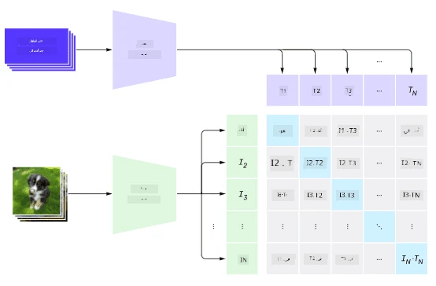
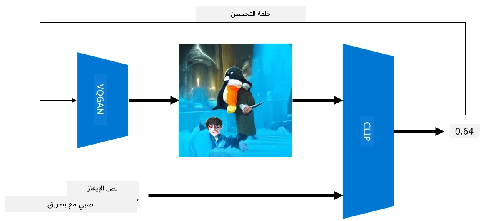

# الشبكات متعددة الوسائط

بعد نجاح نماذج المحولات (Transformers) في حل مهام معالجة اللغة الطبيعية (NLP)، تم تطبيق نفس البنى أو مشابهة لها على مهام رؤية الحاسوب. هناك اهتمام متزايد ببناء نماذج تجمع بين قدرات الرؤية واللغة الطبيعية. إحدى هذه المحاولات قامت بها OpenAI، وتُعرف بـ CLIP وDALL.E.

## التدريب التبايني للصور (CLIP)

الفكرة الرئيسية لـ CLIP هي القدرة على مقارنة النصوص التوضيحية مع الصور وتحديد مدى تطابق الصورة مع النص.

> *الصورة مأخوذة من [هذه المقالة](https://openai.com/blog/clip/)*

يتم تدريب النموذج على صور مأخوذة من الإنترنت مع تسميات توضيحية لها. لكل دفعة، نأخذ N زوجًا من (صورة، نص)، ونحولها إلى تمثيلات متجهية I وT. 

تتم مطابقة هذه التمثيلات معًا. يتم تعريف دالة الخسارة بحيث تزيد من التشابه الكوني (cosine similarity) بين المتجهات التي تمثل زوجًا واحدًا (مثل I وT)، وتقلل التشابه الكوني بين جميع الأزواج الأخرى. ولهذا السبب يُطلق على هذا النهج اسم **التبايني**.

نموذج/مكتبة CLIP متاحة من [GitHub الخاص بـ OpenAI](https://github.com/openai/CLIP). تم وصف النهج في [هذه المقالة](https://openai.com/blog/clip/)، وبالتفصيل في [هذه الورقة البحثية](https://arxiv.org/pdf/2103.00020.pdf).

بمجرد تدريب هذا النموذج، يمكننا إعطاؤه دفعة من الصور ودفعة من النصوص التوضيحية، وسيعيد لنا مصفوفة احتمالات. يمكن استخدام CLIP في عدة مهام:

**تصنيف الصور**

لنفترض أننا بحاجة إلى تصنيف الصور بين، على سبيل المثال، القطط، الكلاب والبشر. في هذه الحالة، يمكننا إعطاء النموذج صورة وسلسلة من النصوص التوضيحية: "*صورة لقط*", "*صورة لكلب*", "*صورة لإنسان*". في المتجه الناتج الذي يحتوي على 3 احتمالات، نحتاج فقط إلى اختيار المؤشر الذي يحتوي على أعلى قيمة.

> *الصورة مأخوذة من [هذه المقالة](https://openai.com/blog/clip/)*

**البحث عن الصور بناءً على النصوص**

يمكننا أيضًا القيام بالعكس. إذا كان لدينا مجموعة من الصور، يمكننا تمرير هذه المجموعة إلى النموذج مع نص توضيحي - وسيعيد لنا الصورة الأكثر تطابقًا مع النص المعطى.

## ✍️ مثال: [استخدام CLIP لتصنيف الصور والبحث عن الصور](../../../../../lessons/X-Extras/X1-MultiModal/Clip.ipynb)

افتح دفتر الملاحظات [Clip.ipynb](../../../../../lessons/X-Extras/X1-MultiModal/Clip.ipynb) لرؤية CLIP قيد التنفيذ.

## توليد الصور باستخدام VQGAN+CLIP

يمكن أيضًا استخدام CLIP لتوليد الصور من نصوص توضيحية. للقيام بذلك، نحتاج إلى **نموذج توليد** يمكنه إنشاء صور بناءً على مدخلات متجهية. أحد هذه النماذج يُعرف بـ [VQGAN](https://compvis.github.io/taming-transformers/) (شبكة GAN المكممة بالمتجهات).

الأفكار الرئيسية التي تميز VQGAN عن [GAN التقليدية](../../4-ComputerVision/10-GANs/README.md) هي كالتالي:
* استخدام بنية محول تلقائي لتوليد تسلسل من الأجزاء البصرية الغنية بالسياق التي تشكل الصورة. يتم تعلم هذه الأجزاء البصرية باستخدام [الشبكات العصبية الالتفافية (CNN)](../../4-ComputerVision/07-ConvNets/README.md).
* استخدام مميز فرعي للصورة يكتشف ما إذا كانت أجزاء الصورة "حقيقية" أو "مزيفة" (على عكس النهج "الكل أو لا شيء" في GAN التقليدية).

تعرف على المزيد حول VQGAN من خلال موقع [Taming Transformers](https://compvis.github.io/taming-transformers/).

أحد الفروقات المهمة بين VQGAN وGAN التقليدية هو أن الأخيرة يمكنها إنتاج صورة جيدة من أي متجه مدخلات، بينما من المحتمل أن ينتج VQGAN صورة غير متماسكة. لذلك، نحتاج إلى توجيه عملية إنشاء الصورة بشكل أكبر، ويمكن القيام بذلك باستخدام CLIP.

لإنشاء صورة تتوافق مع نص توضيحي، نبدأ بمتجه ترميز عشوائي يتم تمريره عبر VQGAN لإنتاج صورة. ثم يتم استخدام CLIP لإنتاج دالة خسارة تُظهر مدى تطابق الصورة مع النص التوضيحي. الهدف بعد ذلك هو تقليل هذه الخسارة باستخدام الانتشار العكسي لتعديل معلمات متجه المدخلات.

مكتبة رائعة تنفذ VQGAN+CLIP هي [Pixray](http://github.com/pixray/pixray).

 |   | 
----|----|----
صورة تم إنشاؤها من النص *صورة قريبة بالألوان المائية لمعلم شاب للأدب يحمل كتابًا* | صورة تم إنشاؤها من النص *صورة قريبة بالزيت لمُدرسة شابة لعلوم الحاسوب مع جهاز كمبيوتر* | صورة تم إنشاؤها من النص *صورة قريبة بالزيت لمعلم مسن للرياضيات أمام السبورة*

> الصور من مجموعة **المعلمون الاصطناعيون** بواسطة [ديمتري سوشنيكوف](http://soshnikov.com)

## DALL-E
### [DALL-E 1](https://openai.com/research/dall-e)
DALL-E هو نسخة من GPT-3 تم تدريبها لتوليد الصور من النصوص التوضيحية. تم تدريبه باستخدام 12 مليار معلمة.

على عكس CLIP، يتلقى DALL-E النص والصورة كتيار واحد من الرموز لكل من الصور والنصوص. وبالتالي، يمكن من خلال النصوص المختلفة توليد صور بناءً على النص.

### [DALL-E 2](https://openai.com/dall-e-2)
الفرق الرئيسي بين DALL-E 1 وDALL-E 2 هو أن الأخير يولد صورًا وفنونًا أكثر واقعية.

أمثلة على الصور التي تم إنشاؤها باستخدام DALL-E:
 |   | 
----|----|----
صورة تم إنشاؤها من النص *صورة قريبة بالألوان المائية لمعلم شاب للأدب يحمل كتابًا* | صورة تم إنشاؤها من النص *صورة قريبة بالزيت لمُدرسة شابة لعلوم الحاسوب مع جهاز كمبيوتر* | صورة تم إنشاؤها من النص *صورة قريبة بالزيت لمعلم مسن للرياضيات أمام السبورة*

## المراجع

* ورقة VQGAN: [Taming Transformers for High-Resolution Image Synthesis](https://compvis.github.io/taming-transformers/paper/paper.pdf)
* ورقة CLIP: [Learning Transferable Visual Models From Natural Language Supervision](https://arxiv.org/pdf/2103.00020.pdf)

**إخلاء المسؤولية**:  
تم ترجمة هذا المستند باستخدام خدمة الترجمة بالذكاء الاصطناعي [Co-op Translator](https://github.com/Azure/co-op-translator). بينما نسعى لتحقيق الدقة، يرجى العلم أن الترجمات الآلية قد تحتوي على أخطاء أو معلومات غير دقيقة. يجب اعتبار المستند الأصلي بلغته الأصلية المصدر الرسمي. للحصول على معلومات حاسمة، يُوصى بالاستعانة بترجمة بشرية احترافية. نحن غير مسؤولين عن أي سوء فهم أو تفسيرات خاطئة تنشأ عن استخدام هذه الترجمة.