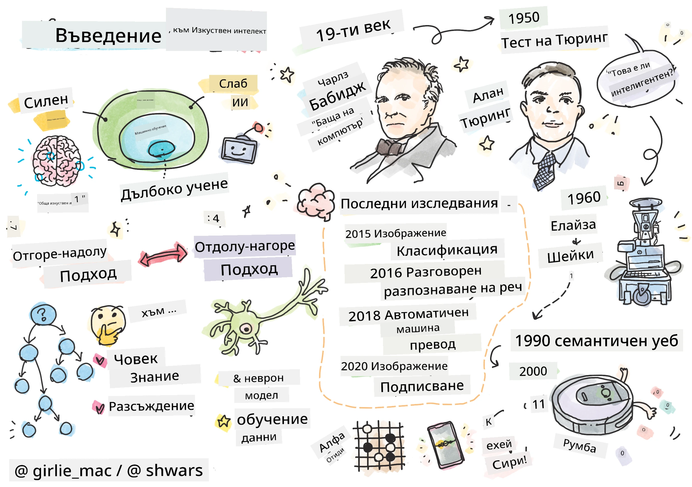
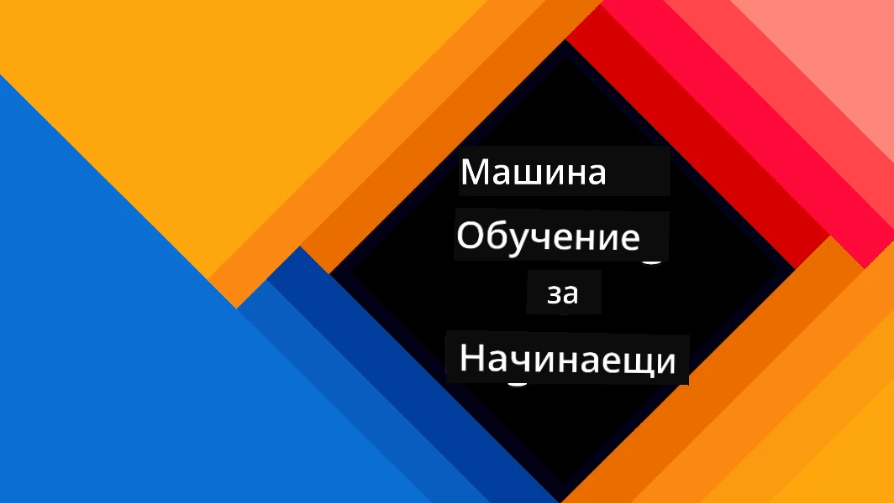
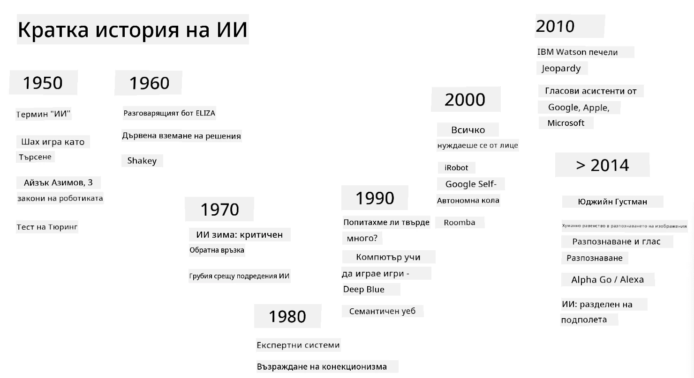

# Въведение в AI

> Рисунка от [Tomomi Imura](https://twitter.com/girlie_mac)

## [Тест преди лекцията](https://ff-quizzes.netlify.app/en/ai/quiz/1)

**Изкуственият интелект** е вълнуваща научна дисциплина, която изучава как можем да накараме компютрите да проявяват интелигентно поведение, например да извършват неща, в които хората са добри.

Първоначално компютрите са били изобретени от [Чарлз Бабидж](https://en.wikipedia.org/wiki/Charles_Babbage), за да работят с числа, следвайки добре дефинирана процедура – алгоритъм. Съвременните компютри, макар и значително по-усъвършенствани от оригиналния модел, предложен през 19-ти век, все още следват същата идея за контролирани изчисления. Следователно е възможно да програмираме компютър да извърши нещо, ако знаем точната последователност от стъпки, които трябва да изпълним, за да постигнем целта.

> Снимка от [Vickie Soshnikova](http://twitter.com/vickievalerie)

> ✅ Определянето на възрастта на човек от негова снимка е задача, която не може да бъде изрично програмирана, защото не знаем как стигаме до числото в главата си, когато го правим.

---

Има задачи, които обаче не знаем изрично как да решим. Помислете за определянето на възрастта на човек от негова снимка. Ние някак си се научаваме да го правим, защото сме виждали много примери на хора на различна възраст, но не можем изрично да обясним как го правим, нито можем да програмираме компютър да го направи. Именно този тип задачи са интересни за **Изкуствения интелект** (съкратено AI).

✅ Помислете за някои задачи, които бихте могли да прехвърлите на компютър, който би се възползвал от AI. Разгледайте областите на финансите, медицината и изкуствата – как тези области се възползват днес от AI?

## Слаб AI срещу Силен AI

Слаб AI | Силен AI
---------------------------------------|-------------------------------------
Слабият AI се отнася до AI системи, които са проектирани и обучени за конкретна задача или тесен набор от задачи.|Силният AI, или Изкуствен Общ Интелект (AGI), се отнася до AI системи с интелигентност и разбиране на човешко ниво.
Тези AI системи не са общо интелигентни; те се отличават в изпълнението на предварително дефинирана задача, но им липсва истинско разбиране или съзнание.|Тези AI системи имат способността да изпълняват всяка интелектуална задача, която човек може да направи, да се адаптират към различни области и да притежават форма на съзнание или самосъзнание.
Примери за слаб AI включват виртуални асистенти като Siri или Alexa, алгоритми за препоръки, използвани от стрийминг услуги, и чатботове, предназначени за специфични задачи за обслужване на клиенти.|Постигането на Силен AI е дългосрочна цел на AI изследванията и би изисквало разработването на AI системи, които могат да разсъждават, учат, разбират и се адаптират в широк спектър от задачи и контексти.
Слабият AI е силно специализиран и не притежава когнитивни способности, подобни на човешките, или общи способности за решаване на проблеми извън своята тясна област.|Силният AI в момента е теоретична концепция и няма AI система, която да е достигнала това ниво на обща интелигентност.

За повече информация вижте **[Изкуствен Общ Интелект](https://en.wikipedia.org/wiki/Artificial_general_intelligence)** (AGI).

## Определението за интелигентност и тестът на Тюринг

Един от проблемите при работа с термина **[Интелигентност](https://en.wikipedia.org/wiki/Intelligence)** е, че няма ясно определение за този термин. Може да се твърди, че интелигентността е свързана с **абстрактно мислене** или със **самосъзнание**, но не можем да я дефинираме правилно.

> [Снимка](https://unsplash.com/photos/75715CVEJhI) от [Amber Kipp](https://unsplash.com/@sadmax) от Unsplash

За да видите двусмислието на термина *интелигентност*, опитайте да отговорите на въпроса: "Интелигентна ли е котката?". Различни хора са склонни да дават различни отговори на този въпрос, тъй като няма универсално приет тест, който да докаже дали твърдението е вярно или не. А ако мислите, че има – опитайте да подложите котката си на тест за IQ...

✅ Помислете за минута как дефинирате интелигентността. Интелигентна ли е врана, която може да реши лабиринт и да стигне до храна? А дете интелигентно ли е?

---

Когато говорим за AGI, трябва да имаме някакъв начин да определим дали сме създали наистина интелигентна система. [Алън Тюринг](https://en.wikipedia.org/wiki/Alan_Turing) предложи метод, наречен **[Тест на Тюринг](https://en.wikipedia.org/wiki/Turing_test)**, който също действа като определение за интелигентност. Тестът сравнява дадена система с нещо, което е присъщо интелигентно – истински човек, и тъй като всяко автоматично сравнение може да бъде заобиколено от компютърна програма, използваме човешки разпитващ. Така че, ако човек не може да различи истински човек от компютърна система в текстов диалог – системата се счита за интелигентна.

> Чатбот, наречен [Eugene Goostman](https://en.wikipedia.org/wiki/Eugene_Goostman), разработен в Санкт Петербург, се доближи до преминаването на теста на Тюринг през 2014 г., използвайки хитър трик с личността. Той обяви предварително, че е 13-годишно украинско момче, което обяснява липсата на знания и някои несъответствия в текста. Ботът убеди 30% от съдиите, че е човек след 5-минутен диалог, метрика, която Тюринг вярваше, че машината ще може да премине до 2000 г. Въпреки това трябва да се разбере, че това не показва, че сме създали интелигентна система или че компютърна система е заблудила човешкия разпитващ – системата не е заблудила хората, а по-скоро създателите на бота!

✅ Били ли сте някога заблудени от чатбот, мислейки, че говорите с човек? Как ви убеди?

## Различни подходи към AI

Ако искаме компютърът да се държи като човек, трябва някак си да моделираме в компютъра нашия начин на мислене. Следователно трябва да се опитаме да разберем какво прави човека интелигентен.

> За да можем да програмираме интелигентност в машина, трябва да разберем как работят нашите собствени процеси на вземане на решения. Ако направите малко самоанализ, ще осъзнаете, че има някои процеси, които се случват подсъзнателно – например можем да различим котка от куче, без да мислим за това – докато други включват разсъждения.

Има два възможни подхода към този проблем:

Подход отгоре-надолу (Символично разсъждение) | Подход отдолу-нагоре (Невронни мрежи)
---------------------------------------|-------------------------------------
Подходът отгоре-надолу моделира начина, по който човек разсъждава, за да реши проблем. Той включва извличане на **знания** от човек и представянето им в компютърно четим вид. Също така трябва да разработим начин за моделиране на **разсъждения** в компютър. | Подходът отдолу-нагоре моделира структурата на човешкия мозък, състоящ се от огромен брой прости единици, наречени **неврони**. Всеки неврон действа като претеглена средна стойност на своите входове и можем да обучим мрежа от неврони да решава полезни проблеми, като предоставим **обучителни данни**.

Има и някои други възможни подходи към интелигентността:

* **Емергентен**, **синергетичен** или **мултиагентен подход** се основава на факта, че сложното интелигентно поведение може да бъде получено чрез взаимодействие на голям брой прости агенти. Според [еволюционната кибернетика](https://en.wikipedia.org/wiki/Global_brain#Evolutionary_cybernetics), интелигентността може да *възникне* от по-просто, реактивно поведение в процеса на *метасистемен преход*.

* **Еволюционен подход**, или **генетичен алгоритъм**, е процес на оптимизация, базиран на принципите на еволюцията.

Ще разгледаме тези подходи по-късно в курса, но засега ще се съсредоточим върху двата основни направления: отгоре-надолу и отдолу-нагоре.

### Подходът отгоре-надолу

При **подхода отгоре-надолу** се опитваме да моделираме нашето разсъждение. Тъй като можем да следваме мислите си, когато разсъждаваме, можем да се опитаме да формализираме този процес и да го програмираме в компютъра. Това се нарича **символично разсъждение**.

Хората обикновено имат някои правила в главата си, които ръководят процесите им на вземане на решения. Например, когато лекар диагностицира пациент, той или тя може да осъзнае, че човек има треска и следователно може да има възпаление в тялото. Прилагайки голям набор от правила към конкретен проблем, лекарят може да стигне до окончателната диагноза.

Този подход разчита силно на **представяне на знания** и **разсъждения**. Извличането на знания от човешки експерт може да бъде най-трудната част, защото лекарят в много случаи може да не знае точно защо стига до определена диагноза. Понякога решението просто изниква в главата му или й без изрично мислене. Някои задачи, като определяне на възрастта на човек от снимка, изобщо не могат да бъдат сведени до манипулиране на знания.

### Подходът отдолу-нагоре

Алтернативно, можем да се опитаме да моделираме най-простите елементи в нашия мозък – неврон. Можем да изградим така наречената **изкуствена невронна мрежа** в компютър и след това да се опитаме да я научим да решава проблеми, като й даваме примери. Този процес е подобен на начина, по който новородено дете научава за заобикалящата го среда чрез наблюдения.

✅ Направете малко проучване за това как бебетата учат. Какви са основните елементи на мозъка на бебето?

> | А какво да кажем за ML?         |      |
> |--------------|-----------|
> | Част от Изкуствения интелект, която се основава на компютърното обучение за решаване на проблем въз основа на някои данни, се нарича **Машинно обучение**. Няма да разглеждаме класическото машинно обучение в този курс – насочваме ви към отделната учебна програма [Машинно обучение за начинаещи](http://aka.ms/ml-beginners). |       |

## Кратка история на AI

Изкуственият интелект започва като област в средата на двадесети век. Първоначално символичното разсъждение е преобладаващ подход и води до редица важни успехи, като експертни системи – компютърни програми, които могат да действат като експерт в някои ограничени проблемни области. Въпреки това скоро става ясно, че такъв подход не се мащабира добре. Извличането на знания от експерт, представянето им в компютър и поддържането на точна база от знания се оказва много сложна задача и твърде скъпа, за да бъде практична в много случаи. Това води до така наречената [AI зима](https://en.wikipedia.org/wiki/AI_winter) през 70-те години.

> Изображение от [Dmitry Soshnikov](http://soshnikov.com)

С течение на времето изчислителните ресурси стават по-евтини и повече данни стават достъпни, така че подходите с невронни мрежи започват да демонстрират страхотна производителност в конкуренцията с хора в много области, като компютърно зрение или разбиране на реч. През последното десетилетие терминът Изкуствен интелект най-често се използва като синоним на невронни мрежи, защото повечето успехи на AI, за които чуваме, се основават на тях.

Можем да наблюдаваме как подходите се променят, например при създаването на компютърна програма за игра на шах:

* Ранните шахматни програми се основават на търсене – програмата изрично се опитва да оцени възможните ходове на противника за даден брой следващи ходове и избира оптимален ход въз основа на оптималната позиция, която може да бъде постигната след няколко хода. Това води до разработването на така наречения [алгоритъм за отрязване алфа-бета](https://en.wikipedia.org/wiki/Alpha%E2%80%93beta_pruning).
* Стратегиите за търсене работят добре към края на играта, където пространството за търсене е ограничено от малък брой възможни ходове. Въпреки това, в началото на играта пространството за търсене е огромно и алгоритъмът може да бъде подобрен чрез учене от съществуващи мачове между човешки играчи. Последващите експерименти използват така нареченото [разсъждение, базирано на случаи](https://en.wikipedia.org/wiki/Case-based_reasoning), където програмата търси случаи в базата от знания, много подобни на текущата позиция в играта.
* Съвременните програми, които побеждават човешки играчи, се основават на невронни мрежи и [усилващо обучение](https://en.wikipedia.org/wiki/Reinforcement_learning), където програмите се учат да играят единствено като играят дълго време срещу себе си и се учат от собствените си грешки – точно както хората правят, когато се учат да играят шах. Въпреки това компютърна програма може да играе много повече игри за много по-малко време и следователно може да учи много по-бързо.

✅ Направете малко проучване за други игри, които са били играни от AI.

По подобен начин можем да видим как подходът към създаването на „говорещи програми“ (които могат да преминат теста на Тюринг) се е променил:

* Ранните програми от този вид, като [Eliza](https://en.wikipedia.org/wiki/ELIZA), се основават на много прости граматически правила и преформулиране на входното изречение във въпрос.
* Съвременните асистенти, като Cortana, Siri или Google Assistant, са хибридни системи, които използват невронни мрежи за преобразуване на реч в текст и разпознаване на нашето намерение, а след това използват някои разсъждения или изрични алгоритми за изпълнение на необходимите действия.
* В бъдеще можем да очак
> Изображение от Дмитрий Сошников, [снимка](https://unsplash.com/photos/r8LmVbUKgns) от [Марина Абросимова](https://unsplash.com/@abrosimova_marina_foto), Unsplash

## Последни изследвания в областта на изкуствения интелект

Големият ръст в изследванията на невронните мрежи започна около 2010 година, когато станаха достъпни големи публични набори от данни. Огромна колекция от изображения, наречена [ImageNet](https://en.wikipedia.org/wiki/ImageNet), която съдържа около 14 милиона анотирани изображения, даде началото на [ImageNet Large Scale Visual Recognition Challenge](https://image-net.org/challenges/LSVRC/).

> Изображение от [Дмитрий Сошников](http://soshnikov.com)

През 2012 година [Конволюционни невронни мрежи](../4-ComputerVision/07-ConvNets/README.md) за първи път бяха използвани за класификация на изображения, което доведе до значително намаляване на грешките при класификация (от почти 30% до 16.4%). През 2015 година архитектурата ResNet от Microsoft Research [постигна точност на ниво човек](https://doi.org/10.1109/ICCV.2015.123).

Оттогава невронните мрежи демонстрират много успешни резултати в множество задачи:

---

Година | Постигнато равенство с човека
-------|------------------------------
2015   | [Класификация на изображения](https://doi.org/10.1109/ICCV.2015.123)
2016   | [Разпознаване на разговорна реч](https://arxiv.org/abs/1610.05256)
2018   | [Автоматичен машинен превод](https://arxiv.org/abs/1803.05567) (от китайски към английски)
2020   | [Генериране на описания за изображения](https://arxiv.org/abs/2009.13682)

През последните няколко години станахме свидетели на огромни успехи с големи езикови модели като BERT и GPT-3. Това се случи основно благодарение на наличието на голямо количество общ текстов материал, който позволява да се обучават модели за улавяне на структурата и значението на текстовете, предварително да се обучават върху общи текстови колекции и след това да се специализират за по-конкретни задачи. Ще научим повече за [Обработка на естествен език](../5-NLP/README.md) по-късно в този курс.

## 🚀 Предизвикателство

Направете обиколка в интернет, за да определите къде, според вас, изкуственият интелект се използва най-ефективно. Дали е в приложение за картографиране, услуга за преобразуване на реч в текст или видеоигра? Проучете как е създадена системата.

## [Тест след лекцията](https://ff-quizzes.netlify.app/en/ai/quiz/2)

## Преглед и самостоятелно обучение

Прегледайте историята на изкуствения интелект и машинното обучение, като прочетете [този урок](https://github.com/microsoft/ML-For-Beginners/tree/main/1-Introduction/2-history-of-ML). Изберете елемент от скицата в началото на този урок или този и го проучете по-задълбочено, за да разберете културния контекст, който е повлиял на неговото развитие.

**Задача**: [Game Jam](assignment.md)

---

<!-- CO-OP TRANSLATOR DISCLAIMER START -->
**Отказ от отговорност**:  
Този документ е преведен с помощта на AI услуга за превод [Co-op Translator](https://github.com/Azure/co-op-translator). Въпреки че се стремим към точност, моля, имайте предвид, че автоматизираните преводи може да съдържат грешки или неточности. Оригиналният документ на неговия роден език трябва да се счита за авторитетен източник. За критична информация се препоръчва професионален човешки превод. Не носим отговорност за недоразумения или погрешни интерпретации, произтичащи от използването на този превод.
<!-- CO-OP TRANSLATOR DISCLAIMER END -->