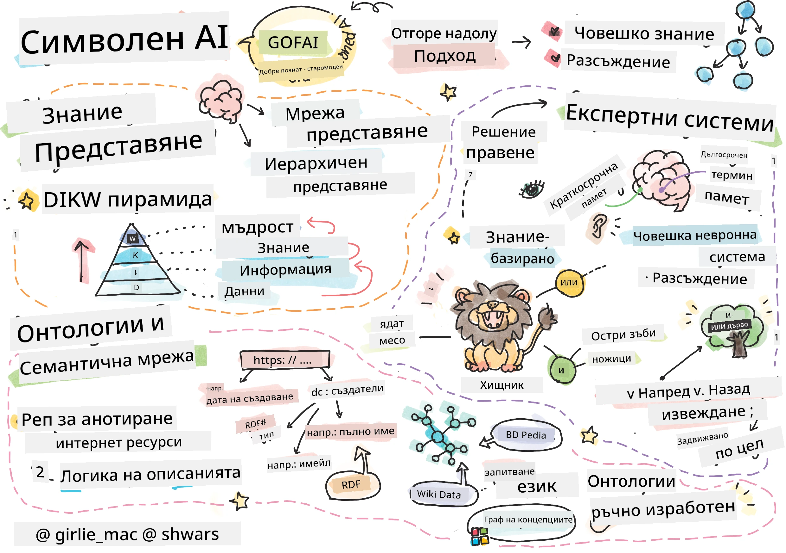
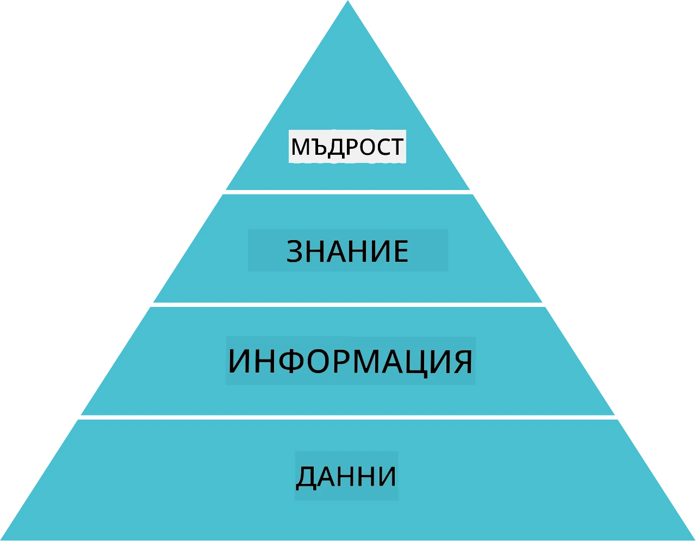
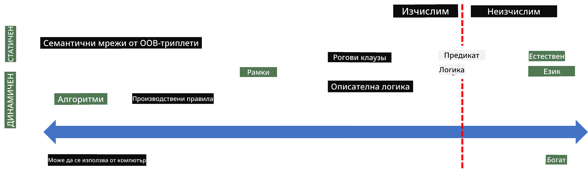
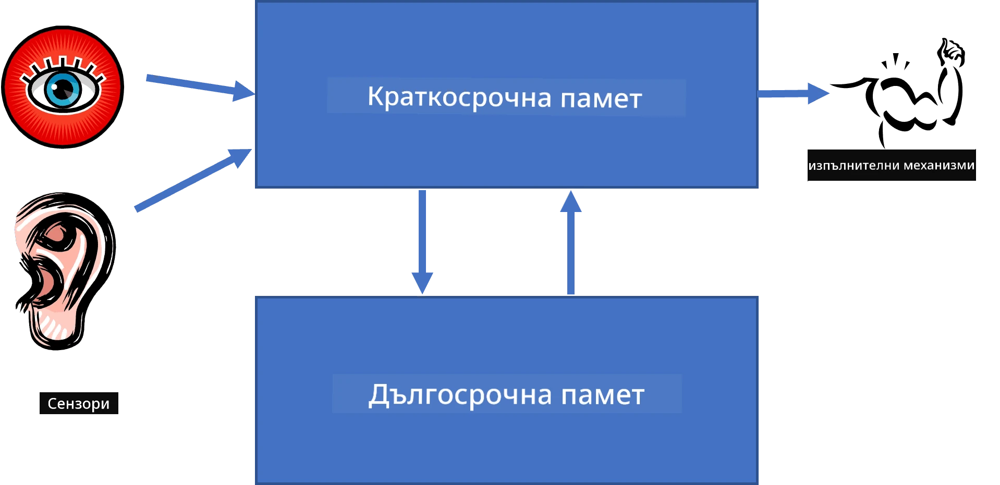
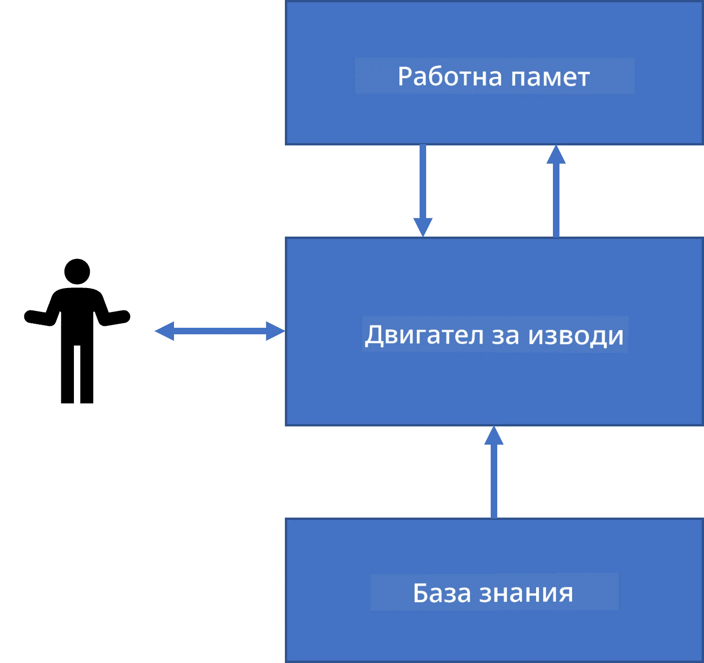
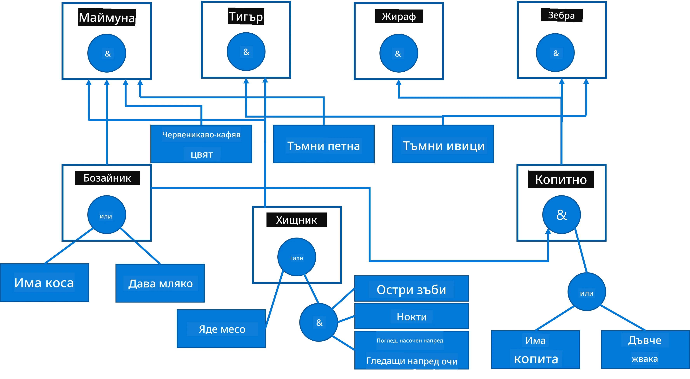
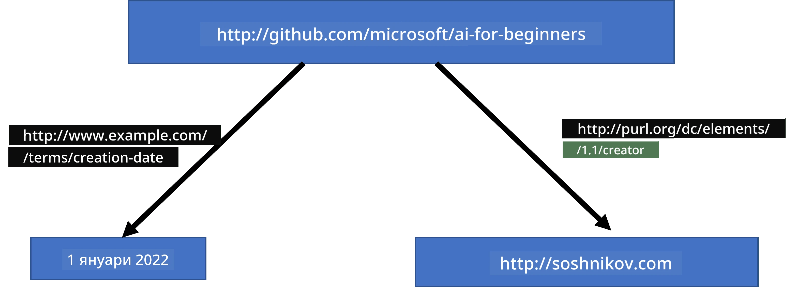
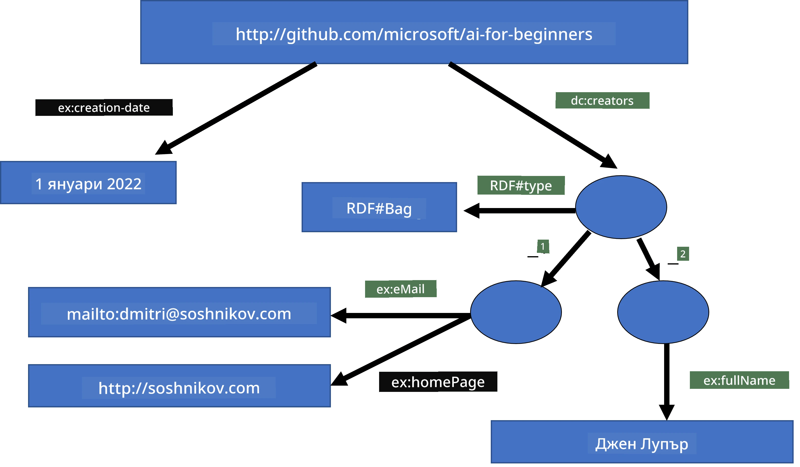
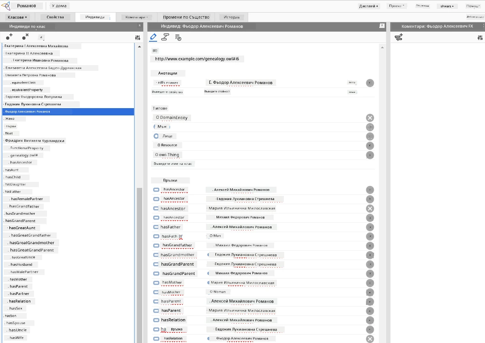

# Представяне на знания и експертни системи



> Скетчноут от [Tomomi Imura](https://twitter.com/girlie_mac)

Търсенето на изкуствен интелект се основава на търсенето на знания, за да разберем света по начин, подобен на човешкия. Но как можем да постигнем това?

## [Предварителен тест](https://ff-quizzes.netlify.app/en/ai/quiz/3)

В ранните дни на ИИ, подходът отгоре-надолу за създаване на интелигентни системи (обсъден в предишния урок) беше популярен. Идеята беше да се извлекат знания от хората в някаква машина разчетлива форма и след това да се използват за автоматично решаване на проблеми. Този подход се основаваше на две големи идеи:

* Представяне на знания
* Разсъждение

## Представяне на знания

Една от важните концепции в Символичния ИИ е **знанието**. Важно е да се разграничат знанията от *информация* или *данни*. Например, може да се каже, че книгите съдържат знания, защото човек може да учи от книги и да стане експерт. Въпреки това, това което книгите съдържат всъщност се нарича *данни*, и чрез четене на книги и интегриране на тези данни в нашия модел на света ние преобразуваме тези данни в знания.

> ✅ **Знанието** е нещо, което съдържаме в главата си и представя нашето разбиране за света. То се получава чрез активен процес на **учене**, при който парчета информация, които получаваме, се интегрират в активния ни модел на света.

Най-често не дефинираме строго знанието, а го съгласуваме с други свързани концепции, използвайки [пирамида DIKW](https://en.wikipedia.org/wiki/DIKW_pyramid). Тя съдържа следните понятия:

* **Данни** са неща, представени във физически носители, като писмен текст или говорими думи. Данните съществуват независимо от хората и могат да се предават между тях.
* **Информация** е как интерпретираме данните в главата си. Например, когато чуем думата *компютър*, имаме някакво разбиране какво е това.
* **Знание** е информация, интегрирана в нашия модел на света. Например, след като научим какво е компютър, започваме да имаме някакви идеи за това как работи, колко струва и за какво може да се използва. Тази мрежа от взаимосвързани концепции формира нашето знание.
* **Мъдрост** е още едно ниво на нашето разбиране за света и представлява *метазнание*, например някакъв усет кога и как трябва да се използват знанията.



*Изображение [от Wikipedia](https://commons.wikimedia.org/w/index.php?curid=37705247), от Longlivetheux - собствена работа, CC BY-SA 4.0*

Така, проблемът с **представянето на знания** е да се намери ефективен начин за представяне на знания в компютър под формата на данни, за да станат автоматично използваеми. Това може да се разглежда като спектър:



> Изображение от [Dmitry Soshnikov](http://soshnikov.com)

* Вляво са много прости типове представяне на знания, които могат ефективно да се използват от компютрите. Най-простият е алгоритмичният, когато знанието се представя чрез компютърна програма. Това обаче не е най-добрият начин за представяне на знание, защото не е гъвкав. Знанията в главата ни често не са алгоритмични.
* Вдясно са представяния като естествения текст. Това е най-мощната форма, но не може да се използва за автоматично разсъждение.

> ✅ Помислете за момент как представяте знания в главата си и как ги превръщате в бележки. Има ли формат, който ви помага по-добре да ги запомните?

## Класификация на представянията на знания в компютри

Можем да класифицираме различните методи за представяне на знания в компютри в следните категории:

* **Мрежови представяния** се базират на факта, че в главата ни имаме мрежа от взаимосвързани концепции. Можем да опитаме да пресъздадем същите мрежи като граф в компютър - така наречената **семантична мрежа**.

1. **Обект-атрибут-стойност тройки** или **двойки атрибут-стойност**. Тъй като графът може да се представи в компютър като списък от възли и ръбове, можем да представим семантична мрежа чрез списък с тройки, съдържащи обекти, атрибути и стойности. Например, изграждаме следните тройки за програмни езици:

Обект | Атрибут | Стойност
------|---------|---------
Python | е | Без видове
Python | изобретен от | Guido van Rossum
Python | синтаксис на блокове | отстъпи
Без видове | няма | дефиниции на типове

> ✅ Помислете как тройките могат да се използват за представяне на други типове знания.

2. **Йерархични представяния** акцентират върху факта, че често създаваме йерархия от обекти в главата си. Например знаем, че канарчето е птица, а всички птици имат крила. Имаме и представа за цвета на канарчето и скоростта, с която лети.

   - **Рамковото представяне** се основава на представяне на всеки обект или клас обекти като **рамка**, която съдържа **слотове**. Слотовете имат възможни стойности по подразбиране, ограничения на стойностите или съхранени процедури, които могат да се извикат за получаване на стойност. Всички рамки образуват йерархия, подобна на обектна йерархия в обектно-ориентираните програмни езици.
   - **Сценариите** са специален вид рамки, които представят сложни ситуации, развиващи се във времето.

**Python**

Слот | Стойност | Стойност по подразбиране | Интервал |
-----|----------|---------------------------|----------|
Име  | Python   |                           |          |
Дали е | Без видове |                         |          |
Начин на изписване на променлива | | CamelCase                 |          |
Дължина на програмата | |                           | 5-5000 реда |
Синтаксис на блокове | Отстъп |                           |          |

3. **Процедурни представяния** се основават на представяне на знания чрез списък от действия, които могат да се изпълнят при настъпване на определено условие.
   - Правилата за продукция са if-then изрази, които ни позволяват да извеждаме заключения. Например, един лекар може да има правило, което гласи: **АКО** пациентът има висока температура **ИЛИ** висока концентрация на С-реактивен протеин в кръвта **ТОГАВА** има възпаление. След като се срещне едно от условията, можем да направим заключение за възпаление и да го използваме при по-нататъшни разсъждения.
   - Алгоритмите могат да се разглеждат като друга форма на процедурно представяне, въпреки че почти никога не се използват директно в системи, базирани на знания.

4. **Логика** първоначално е предложена от Аристотел като начин за представяне на универсалните човешки знания.
   - Предикатната логика като математическа теория е твърде богата, за да бъде изчислима, затова обикновено се използва някакво подмножество, като например Horn клаузите, използвани в Prolog.
   - Описателната логика е семейство логически системи, използвани за представяне и разсъждение върху йерархии от обекти, разпределени представяния на знания като *семантичния уеб*.

## Експертни системи

Един от ранните успехи на символичния ИИ бяха т.нар. **експертни системи** – компютърни системи, проектирани да действат като експерт в някаква ограничена предметна област. Те се базираха на **база знания**, извлечена от един или повече човешки експерти, и съдържаха **инференциален механизъм**, който извършваше разсъждения върху нея.

 | 
---------------------------------------------|------------------------------------------------
Оптимизирана структура на човешката нервна система | Архитектура на система базирана на знания

Експертните системи са изградени като човешката система за разсъждение, която съдържа **краткосрочна памет** и **дългосрочна памет**. По същия начин при системи базирани на знания разграничаваме следните компоненти:

* **Памет на проблема**: съдържа знания за проблема, който в момента се решава, например температурата или кръвното налягане на пациент, дали има възпаление и др. Това знание се нарича и **статично знание**, защото представлява снимка на това, което в момента знаем за проблема – т.нар. *състояние на проблема*.
* **База знания**: представлява дългосрочните знания за предметната област. Извлича се ръчно от човешки експерти и не се променя от консултация на консултация. Тъй като позволява навигация от едно състояние на проблема до друго, тя се нарича и **динамично знание**.
* **Инференциален механизъм**: оркестрира целия процес на търсене в пространството на състоянията на проблема, задава въпроси на потребителя когато е необходимо. Отговаря за намирането на правилата, които да се прилагат за всяко състояние.

Като пример нека разгледаме следната експертна система за определяне на животно по неговите физически характеристики:



> Изображение от [Dmitry Soshnikov](http://soshnikov.com)

Тази диаграма се нарича **AND-OR дърво** и е графично представяне на набор от производствени правила. Чертането на дървото е полезно в началото при извличането на знания от експерта. За да представим знанията в компютъра, е по-удобно да използваме правила:

```
IF the animal eats meat
OR (animal has sharp teeth
    AND animal has claws
    AND animal has forward-looking eyes
) 
THEN the animal is a carnivore
```
  
Можете да забележите, че всяко условие в лявата страна на правилото и действието са по същество обект-атрибут-стойност (OAV) тройки. **Работната памет** съдържа множеството от OAV тройки, които съответстват на проблема, който в момента се решава. **Двигател на правилата** търси правила, чиито условия са изпълнени, и ги прилага, добавяйки още една тройка в работната памет.

> ✅ Напишете ваше собствено AND-OR дърво по тема, която ви е интересна!

### Фордуърд срещу беквард (напредни срещу назад) извод

Процесът, описан по-горе, се нарича **фордуърд извод**. Той започва с някакви начални данни за проблема, налични в работната памет, и изпълнява следния цикъл на разсъждение:

1. Ако целевият атрибут присъства в работната памет – спри и дай резултата
2. Търси всички правила, чиито условие е в момента изпълнено – получава се **конфликтен набор** от правила.
3. Извършва се **решаване на конфликти** – избира се едно правило, което ще се изпълни този ход. Могат да се използват различни стратегии за решаване на конфликти:
   - Избери първото приложимо правило в базата знания
   - Избери случайно правило
   - Избери *по-конкретно* правило, т.е. това, което удовлетворява най-много условия в "лявата страна" (LHS)
4. Прилагай избраното правило и вмъкни ново парче знание в състоянието на проблема
5. Повтори от стъпка 1.

Въпреки това, в някои случаи може да искаме да започнем с празни знания за проблема и да задаваме въпроси, които да ни помогнат да стигнем до заключение. Например, при медицинска диагноза, обикновено не правим всички медицински анализи предварително, а ги правим когато е необходима извод.

Този процес може да се моделира чрез **беквард извод**. Той се движи от **целта** – атрибутът, който искаме да намерим:

1. Избери всички правила, които могат да ни дадат стойност за целта (т.е. с целта в дясната страна (RHS)) – получава се конфликтен набор
2. Ако няма правила за този атрибут, или има правило, което казва, че трябва да попитаме потребителя – питай, в противен случай:
3. Използвай стратегия за решаване на конфликти, за да избереш едно правило, което ще използваш като *хипотеза* – ще се опитаме да я докажем
4. Рекурзивно повтори процеса за всички атрибути в лявата страна (LHS) на правилото, опитвайки се да ги докажеш като цели
5. Ако по някое време процесът се провали – използвай друго правило на стъпка 3.

> ✅ При какви ситуации фордуърд извод е по-подходящ? А какво за беквард извод?

### Имплементиране на експертни системи

Експертните системи могат да се имплементират с различни инструменти:

* Програмиране директно на някой високо ниво език. Това обаче не е най-добрата идея, защото основното предимство на система базирана на знания е, че знанието е отделено от изводите, и потенциално експерт от предметната област трябва да може да пише правила без да разбира детайлите на процеса на извод.
* Използване на **шкаф за експертни системи**, т.е. система, специално проектирана да се попълва с знания чрез някакъв език за представяне на знания.

## ✍️ Упражнение: Извод за животно

Вижте [Animals.ipynb](https://github.com/microsoft/AI-For-Beginners/blob/main/lessons/2-Symbolic/Animals.ipynb) за пример за имплементиране на експертна система с фордуърд и беквард извод.

> **Забележка**: Този пример е доста опростен и дава само представа как изглежда една експертна система. Когато започнете да създавате такава система, ще забележите *интелигентно* поведение едва когато достигнете определен брой правила, около 200+. В един момент правилата стават твърде сложни, за да се помнят всички, и тогава може да се зачудите защо системата взима определени решения. Важно качество на системите базирани на знания е, че винаги можете да *обясните* точно как и защо е било взето някое решение.

## Онтологии и семантичния уеб

В края на 20-ти век имаше инициатива за използване на представяне на знания за анотации на интернет ресурси, така че да бъде възможно да се намират ресурси с много специфични заявки. Това движение се наричаше **Семантичен уеб** и се основаваше на няколко концепции:

- Специално представяне на знания основано на **[описателна логика](https://en.wikipedia.org/wiki/Description_logic)** (DL). То е подобно на рамковото представяне на знания, защото изгражда йерархия от обекти със свойства, но има формална логическа семантика и извод. Съществува цял род DL, които балансират между експресивност и алгоритмична сложност на извода.
- Разпределено представяне на знания, където всички концепции се представят чрез глобален URI идентификатор, което прави възможно създаването на йерархии от знания, обхващащи целия интернет.
- Семейство XML-базирани езици за описание на знания: RDF (Resource Description Framework), RDFS (RDF Schema), OWL (Ontology Web Language).

Основна концепция в Семантичния уеб е концепцията за **Онтология**. Тя се отнася до явна спецификация на проблемна област, използваща някакво формално представяне на знания. Най-простата онтология може да бъде просто йерархия от обекти в проблемната област, но по-сложните онтологии ще включват правила, които могат да се използват за извеждане.

В семантичния уеб всички представяния са базирани на тройки. Всеки обект и всяко отношение са уникално идентифицирани чрез URI. Например, ако искаме да заявим факта, че тази AI учебна програма е разработена от Дмитрий Сошников на 1 януари 2022 г. - ето тройките, които можем да използваме:



```
http://github.com/microsoft/ai-for-beginners http://www.example.com/terms/creation-date “Jan 1, 2022”
http://github.com/microsoft/ai-for-beginners http://purl.org/dc/elements/1.1/creator http://soshnikov.com
```

> ✅ Тук `http://www.example.com/terms/creation-date` и `http://purl.org/dc/elements/1.1/creator` са някои добре известни и универсално приети URI за изразяване на концепциите *създател* и *дата на създаване*.

В по-сложен случай, ако искаме да дефинираме списък със създатели, можем да използваме някои структури от данни, дефинирани в RDF.



> Диаграми по-горе от [Dmitry Soshnikov](http://soshnikov.com)

Напредъкът в изграждането на Семантичния уеб беше донякъде забавен от успеха на търсачките и техниките за обработка на естествен език, които позволяват извличане на структурирани данни от текст. Въпреки това, в някои области все още се полагат значителни усилия за поддържане на онтологии и бази от знания. Няколко проекта, които заслужават внимание:

* [WikiData](https://wikidata.org/) е колекция от машинно-прочетени бази от знания, свързани с Уикипедия. Повечето от данните се добиват от *InfoBoxes* в Уикипедия, парчета структурирано съдържание вътре в страници от Уикипедия. Можете да [заявявате](https://query.wikidata.org/) wikidata чрез SPARQL, специален език за заявки за Семантичния уеб. Ето примерна заявка, която показва най-популярните цветове на очите сред хората:

```sparql
#defaultView:BubbleChart
SELECT ?eyeColorLabel (COUNT(?human) AS ?count)
WHERE
{
  ?human wdt:P31 wd:Q5.       # human instance-of homo sapiens
  ?human wdt:P1340 ?eyeColor. # human eye-color ?eyeColor
  SERVICE wikibase:label { bd:serviceParam wikibase:language "en". }
}
GROUP BY ?eyeColorLabel
```

* [DBpedia](https://www.dbpedia.org/) е друг проект, подобен на WikiData.

> ✅ Ако искате да експериментирате с изграждане на свои собствени онтологии или да отворите вече съществуващи, има чудесен визуален редактор на онтологии, наречен [Protégé](https://protege.stanford.edu/). Изтеглете го или го използвайте онлайн.



*Web Protégé редактор отворен с онтологията на фамилията Романови. Скриншот от Дмитрий Сошников*

## ✍️ Упражнение: Онтология на семейство

Вижте [FamilyOntology.ipynb](https://github.com/Ezana135/AI-For-Beginners/blob/main/lessons/2-Symbolic/FamilyOntology.ipynb) за пример за използване на техники от Семантичния уеб за разсъждения върху семейни отношения. Ще вземем семейно дърво, представено в общ формат GEDCOM, и онтология на семейните отношения, за да изградим граф на всички семейни отношения за даден набор от индивиди.

## Microsoft Concept Graph

В повечето случаи онтологиите се създават внимателно на ръка. Възможно е обаче и да се **добиват** онтологии от неструктурирани данни, например от текстове на естествен език.

Такова усилие беше предприето от Microsoft Research и доведе до [Microsoft Concept Graph](https://blogs.microsoft.com/ai/microsoft-researchers-release-graph-that-helps-machines-conceptualize/?WT.mc_id=academic-77998-cacaste).

Това е голяма колекция от обекти, групирани заедно с използване на наследствената връзка `is-a`. Тя позволява отговарянето на въпроси като „Какво е Microsoft?“ - отговорът е нещо като „компания с вероятност 0.87 и бранд с вероятност 0.75“.

Графът е достъпен или като REST API, или като голям сваляем текстов файл, който изброява всички двойки обекти.

## ✍️ Упражнение: Граф на концепции

Опитайте [MSConceptGraph.ipynb](https://github.com/microsoft/AI-For-Beginners/blob/main/lessons/2-Symbolic/MSConceptGraph.ipynb), за да видите как можем да използваме Microsoft Concept Graph, за да групираме новинарски статии в няколко категории.

## Заключение

В наши дни AI често се смята за синоним на *Машинно обучение* или *Невронни мрежи*. Обаче човекът също проявява явни разсъждения, които в момента не се обработват от невронните мрежи. В реални проекти явните разсъждения все още се използват за изпълнението на задачи, които изискват обяснения или способността да се променя поведението на системата по контролиран начин.

## 🚀 Предизвикателство

В ноутбука Family Ontology, свързан с този урок, има възможност да експериментирате с други семейни връзки. Опитайте се да откриете нови връзки между хора в семейното дърво.

## [Квиз след лекцията](https://ff-quizzes.netlify.app/en/ai/quiz/4)

## Преглед и самостоятелно учене

Направете проучване в интернет, за да откриете области, в които хората са се опитвали да количествено оценят и кодифицират знания. Разгледайте таксономията на Блум и се върнете назад в историята, за да научите как хората са се опитвали да разбират своя свят. Изследвайте работата на Линей, създал таксономия на организмите, и наблюдавайте начина, по който Дмитрий Менделеев е създал начин за описание и групиране на химичните елементи. Какви други интересни примери можете да намерите?

**Задача**: [Създаване на онтология](assignment.md)

---

<!-- CO-OP TRANSLATOR DISCLAIMER START -->
**Декларация за отказ от отговорност**:
Този документ е преведен с помощта на AI преводаческа услуга [Co-op Translator](https://github.com/Azure/co-op-translator). Въпреки че се стремим към точност, имайте предвид, че автоматизираните преводи могат да съдържат грешки или неточности. Оригиналният документ на неговия роден език трябва да се счита за авторитетен източник. За критична информация се препоръчва професионален превод от човек. Ние не носим отговорност за каквито и да е недоразумения или неправилни тълкувания, произтичащи от използването на този превод.
<!-- CO-OP TRANSLATOR DISCLAIMER END -->