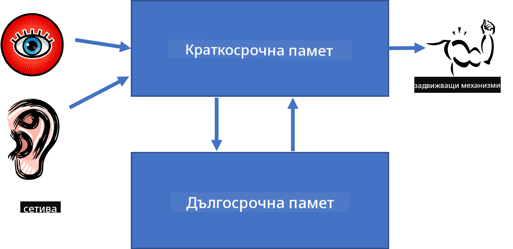
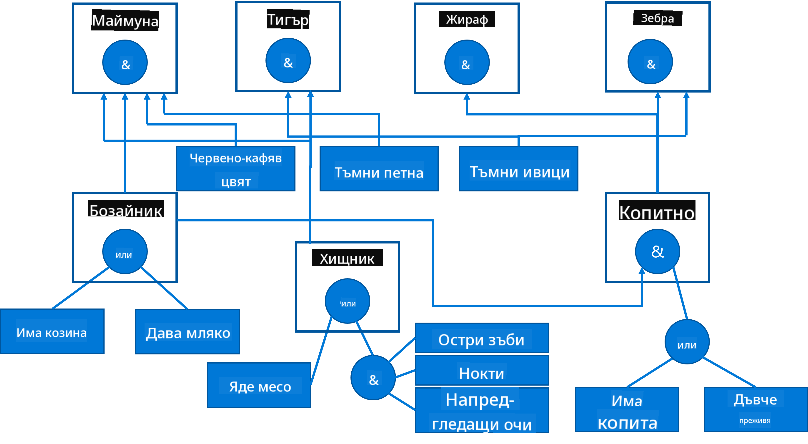

<!--
CO_OP_TRANSLATOR_METADATA:
{
  "original_hash": "7d097f7fda9166ead615e4c34552381b",
  "translation_date": "2025-09-23T14:30:14+00:00",
  "source_file": "lessons/2-Symbolic/README.md",
  "language_code": "bg"
}
-->
# Представяне на знания и експертни системи


> Скица от [Tomomi Imura](https://twitter.com/girlie_mac)

Търсенето на изкуствен интелект се основава на стремежа към знания, за да се разбере света по начин, подобен на човешкия. Но как може да се постигне това?

## [Тест преди лекцията](https://ff-quizzes.netlify.app/en/ai/quiz/3)

В ранните дни на AI популярна беше подходът отгоре-надолу за създаване на интелигентни системи (обсъден в предишния урок). Идеята беше да се извлекат знанията от хората в машинно четим формат и след това да се използват за автоматично решаване на проблеми. Този подход се основаваше на две големи идеи:

* Представяне на знания
* Разсъждение

## Представяне на знания

Една от важните концепции в символния AI са **знанията**. Важно е да се разграничат знанията от *информация* или *данни*. Например, може да се каже, че книгите съдържат знания, защото човек може да ги изучава и да стане експерт. Въпреки това, това, което книгите съдържат, всъщност се нарича *данни*, а чрез четене на книги и интегриране на тези данни в нашия модел на света, ние ги превръщаме в знания.

> ✅ **Знанията** са нещо, което се съдържа в нашия ум и представлява нашето разбиране за света. Те се придобиват чрез активен процес на **учене**, който интегрира получената информация в нашия активен модел на света.

Често не дефинираме строго знанията, но ги свързваме с други свързани концепции, използвайки [пирамидата DIKW](https://en.wikipedia.org/wiki/DIKW_pyramid). Тя съдържа следните концепции:

* **Данни** са нещо, представено на физически носител, като писмен текст или говорени думи. Данните съществуват независимо от човешките същества и могат да се предават между хора.
* **Информация** е начинът, по който интерпретираме данните в нашия ум. Например, когато чуем думата *компютър*, имаме някакво разбиране за това какво е.
* **Знания** са информация, интегрирана в нашия модел на света. Например, след като научим какво е компютър, започваме да имаме идеи за това как работи, колко струва и за какво може да се използва. Тази мрежа от взаимосвързани концепции формира нашите знания.
* **Мъдрост** е още едно ниво на нашето разбиране за света и представлява *мета-знания*, например някакво понятие за това как и кога трябва да се използват знанията.


*Изображение [от Wikipedia](https://commons.wikimedia.org/w/index.php?curid=37705247), By Longlivetheux - Собствена работа, CC BY-SA 4.0*

Следователно, проблемът с **представянето на знания** е да се намери ефективен начин за представяне на знанията вътре в компютър под формата на данни, за да бъдат автоматично използваеми. Това може да се разглежда като спектър:


> Изображение от [Dmitry Soshnikov](http://soshnikov.com)

* Вляво са много прости типове представяне на знания, които могат ефективно да се използват от компютрите. Най-простото е алгоритмичното, когато знанията се представят чрез компютърна програма. Това обаче не е най-добрият начин за представяне на знания, защото не е гъвкав. Знанията в нашия ум често не са алгоритмични.
* Вдясно са представяния като естествен текст. Това е най-мощното, но не може да се използва за автоматично разсъждение.

> ✅ Помислете за момент как представяте знанията в ума си и ги превръщате в бележки. Има ли конкретен формат, който работи добре за вас, за да подпомогне запаметяването?

## Класификация на компютърните представяния на знания

Можем да класифицираме различните методи за представяне на знания в компютър в следните категории:

* **Мрежови представяния** се основават на факта, че имаме мрежа от взаимосвързани концепции в нашия ум. Можем да се опитаме да възпроизведем същите мрежи като граф вътре в компютър - така наречената **семантична мрежа**.

1. **Триплети обект-атрибут-стойност** или **двойки атрибут-стойност**. Тъй като графът може да бъде представен в компютър като списък от възли и ръбове, можем да представим семантична мрежа чрез списък от триплети, съдържащи обекти, атрибути и стойности. Например, изграждаме следните триплети за програмни езици:

Обект | Атрибут | Стойност
-------|---------|---------
Python | е | Нетипизиран език
Python | създаден от | Guido van Rossum
Python | синтаксис на блокове | отстъп
Нетипизиран език | няма | дефиниции на типове

> ✅ Помислете как триплетите могат да се използват за представяне на други видове знания.

2. **Йерархични представяния** подчертават факта, че често създаваме йерархия от обекти в нашия ум. Например, знаем, че канарчето е птица и всички птици имат крила. Също така имаме някаква представа за това какъв цвят обикновено е канарчето и каква е неговата скорост на полет.

   - **Представяне чрез рамки** се основава на представянето на всеки обект или клас обекти като **рамка**, която съдържа **слотове**. Слотовете имат възможни стойности по подразбиране, ограничения на стойностите или съхранени процедури, които могат да бъдат извикани за получаване на стойността на слот. Всички рамки формират йерархия, подобна на йерархията на обекти в езиците за програмиране, базирани на обекти.
   - **Сценарии** са специален вид рамки, които представляват сложни ситуации, които могат да се развият във времето.

**Python**

Слот | Стойност | Стойност по подразбиране | Интервал |
-----|---------|--------------------------|----------|
Име | Python | | |
Е | Нетипизиран език | | |
Кейс на променливи | | CamelCase | |
Дължина на програма | | | 5-5000 реда |
Синтаксис на блокове | Отстъп | | |

3. **Процедурни представяния** се основават на представяне на знания чрез списък от действия, които могат да бъдат изпълнени при настъпване на определено условие.
   - Правилата за производство са if-then изявления, които ни позволяват да правим заключения. Например, лекар може да има правило, което гласи, че **АКО** пациентът има висока температура **ИЛИ** високо ниво на C-реактивен протеин в кръвния тест **ТОГАВА** той има възпаление. След като срещнем едно от условията, можем да направим заключение за възпалението и след това да го използваме в по-нататъшно разсъждение.
   - Алгоритмите могат да се считат за друга форма на процедурно представяне, въпреки че почти никога не се използват директно в системи, базирани на знания.

4. **Логика** първоначално е предложена от Аристотел като начин за представяне на универсални човешки знания.
   - Предикатната логика като математическа теория е твърде богата, за да бъде изчислима, затова обикновено се използва някакво нейно подмножество, като например клаузите на Хорн, използвани в Prolog.
   - Описателната логика е семейство от логически системи, използвани за представяне и разсъждение за йерархии от обекти и разпределени представяния на знания като *семантична мрежа*.

## Експертни системи

Един от ранните успехи на символния AI бяха така наречените **експертни системи** - компютърни системи, които бяха проектирани да действат като експерт в някаква ограничена проблемна област. Те се основаваха на **база знания**, извлечена от един или повече човешки експерти, и съдържаха **инференционен двигател**, който извършваше разсъждения върху нея.

 | 
---------------------------------------------|------------------------------------------------
Опростена структура на човешката нервна система | Архитектура на система, базирана на знания

Експертните системи са изградени подобно на системата за човешко разсъждение, която съдържа **краткосрочна памет** и **дългосрочна памет**. По подобен начин, в системите, базирани на знания, разграничаваме следните компоненти:

* **Памет за проблема**: съдържа знанията за проблема, който се решава в момента, например температурата или кръвното налягане на пациент, дали има възпаление или не и т.н. Тези знания също се наричат **статични знания**, защото съдържат моментна снимка на това, което знаем за проблема - така нареченото *състояние на проблема*.
* **База знания**: представлява дългосрочни знания за проблемната област. Те се извличат ръчно от човешки експерти и не се променят от консултация до консултация. Тъй като позволяват навигация от едно състояние на проблема към друго, те също се наричат **динамични знания**.
* **Инференционен двигател**: организира целия процес на търсене в пространството на състоянията на проблема, задава въпроси на потребителя, когато е необходимо. Той също така е отговорен за намирането на правилните правила, които да се приложат към всяко състояние.

Като пример, нека разгледаме следната експертна система за определяне на животно въз основа на неговите физически характеристики:



> Изображение от [Dmitry Soshnikov](http://soshnikov.com)

Тази диаграма се нарича **AND-OR дърво** и е графично представяне на набор от правила за производство. Рисуването на дърво е полезно в началото на извличането на знания от експерта. За представяне на знанията вътре в компютъра е по-удобно да се използват правила:

```
IF the animal eats meat
OR (animal has sharp teeth
    AND animal has claws
    AND animal has forward-looking eyes
) 
THEN the animal is a carnivore
```

Можете да забележите, че всяко условие от лявата страна на правилото и действието всъщност са триплети обект-атрибут-стойност (OAV). **Работната памет** съдържа набора от OAV триплети, които съответстват на проблема, който се решава в момента. **Двигателят за правила** търси правила, за които условието е изпълнено, и ги прилага, добавяйки нов триплет към работната памет.

> ✅ Напишете свое собствено AND-OR дърво по тема, която ви харесва!

### Напред срещу назад разсъждение

Процесът, описан по-горе, се нарича **напред разсъждение**. Той започва с някакви начални данни за проблема, налични в работната памет, и след това изпълнява следния цикъл на разсъждение:

1. Ако целевият атрибут е наличен в работната памет - спрете и дайте резултата
2. Потърсете всички правила, чието условие е изпълнено в момента - получете **конфликтен набор** от правила.
3. Извършете **разрешаване на конфликти** - изберете едно правило, което ще бъде изпълнено на тази стъпка. Могат да се използват различни стратегии за разрешаване на конфликти:
   - Изберете първото приложимо правило в базата знания
   - Изберете случайно правило
   - Изберете *по-специфично* правило, т.е. това, което отговаря на най-много условия в "лявата страна" (LHS)
4. Приложете избраното правило и добавете ново парче знание към състоянието на проблема
5. Повторете от стъпка 1.

Въпреки това, в някои случаи може да искаме да започнем с празни знания за проблема и да задаваме въпроси, които ще ни помогнат да стигнем до заключението. Например, при медицинска диагностика обикновено не извършваме всички медицински анализи предварително, преди да започнем диагностицирането на пациента. По-скоро искаме да извършваме анализи, когато трябва да се вземе решение.

Този процес може да се моделира чрез **назад разсъждение**. То се ръководи от **целта** - стойността на атрибута, която търсим:

1. Изберете всички правила, които могат да ни дадат стойността на целта (т.е. с целта в RHS ("дясната страна")) - конфликтен набор
1. Ако няма правила за този атрибут или има правило, което казва, че трябва да попитаме потребителя за стойността - попитайте за нея, в противен случай:
1. Използвайте стратегия за разрешаване на конфликти, за да изберете едно правило, което ще използваме като *хипотеза* - ще се опитаме да го докажем
1. Рекурсивно повторете процеса за всички атрибути в LHS на правилото, опитвайки се да ги докажем като цели
1. Ако процесът се провали на някакъв етап - използвайте друго правило на стъпка 3.

> ✅ В кои ситуации напред разсъждението е по-подходящо? А какво да кажем за назад разсъждението?

### Имплементиране на експертни системи

Експертните системи могат да бъдат имплементирани с различни инструменти:

* Програмиране директно в някакъв език за програмиране от високо ниво. Това не е най-добрата идея, защото основното предимство на система, базирана на знания, е че знанията са отделени от разсъждението и потенциално експертът в проблемната област трябва да може да пише правила, без да разбира детайлите на процеса на разсъждение.
* Използване на **обвивка за експертни системи**, т.е. система, специално проектирана да бъде попълнена със знания, използвайки някакъв език за представяне на знания.

## ✍️ Упражнение: Разсъждение за животни

Вижте [Animals.ipynb](https://github.com/microsoft/AI-For-Beginners/blob/main/lessons/2-Symbolic/Animals.ipynb) за пример за имплементиране на експертна система с напред и назад разсъждение.

> **Забележка**: Този пример е доста прост и само дава представа за това как изглежда една експертна система. След като започнете да създавате такава система, ще забележите някакво *интелигентно* поведение от нея едва когато достигнете определен брой правила, около 200+. В даден момент правилата стават твърде сложни, за да се държат всички в ума, и тогава може да започнете да се чудите защо системата взема определени решения. Въпреки това, важна характеристика на системите, базирани на знания, е че винаги можете *да обясните* точно как е взето всяко от решенията.

## Онтологии и семантична мрежа

В края на 20-ти век имаше инициатива за използване на представяне на знания за анотиране на интернет ресурси, така че да бъде възможно да се намерят ресурси,
- Семейство от XML-базирани езици за описание на знания: RDF (Resource Description Framework), RDFS (RDF Schema), OWL (Ontology Web Language).

Основна концепция в Семантичната мрежа е концепцията за **Онтология**. Тя се отнася до явна спецификация на проблемна област, използвайки някаква формална представителна система за знания. Най-простата онтология може да бъде просто йерархия от обекти в дадена проблемна област, но по-сложните онтологии включват правила, които могат да се използват за извеждане на заключения.

В семантичната мрежа всички представяния се базират на триплети. Всеки обект и всяка връзка са уникално идентифицирани чрез URI. Например, ако искаме да заявим факта, че този AI Curriculum е разработен от Дмитрий Сошников на 1 януари 2022 г., ето триплетите, които можем да използваме:


```
http://github.com/microsoft/ai-for-beginners http://www.example.com/terms/creation-date “Jan 13, 2007”
http://github.com/microsoft/ai-for-beginners http://purl.org/dc/elements/1.1/creator http://soshnikov.com
```

> ✅ Тук `http://www.example.com/terms/creation-date` и `http://purl.org/dc/elements/1.1/creator` са добре познати и универсално приети URI за изразяване на концепциите *създател* и *дата на създаване*.

В по-сложен случай, ако искаме да дефинираме списък от създатели, можем да използваме някои структури от данни, дефинирани в RDF.


> Диаграмите по-горе са от [Дмитрий Сошников](http://soshnikov.com)

Напредъкът в изграждането на Семантичната мрежа беше донякъде забавен от успеха на търсачките и техниките за обработка на естествен език, които позволяват извличане на структурирани данни от текст. Въпреки това, в някои области все още има значителни усилия за поддържане на онтологии и бази знания. Няколко проекта, които си струва да се отбележат:

* [WikiData](https://wikidata.org/) е колекция от машинно четими бази знания, свързани с Wikipedia. Повечето от данните са извлечени от *InfoBoxes* на Wikipedia, части от структурирано съдържание в страниците на Wikipedia. Можете да [запитвате](https://query.wikidata.org/) WikiData в SPARQL, специален език за заявки за Семантичната мрежа. Ето примерна заявка, която показва най-популярните цветове на очите сред хората:

```sparql
#defaultView:BubbleChart
SELECT ?eyeColorLabel (COUNT(?human) AS ?count)
WHERE
{
  ?human wdt:P31 wd:Q5.       # human instance-of homo sapiens
  ?human wdt:P1340 ?eyeColor. # human eye-color ?eyeColor
  SERVICE wikibase:label { bd:serviceParam wikibase:language "en". }
}
GROUP BY ?eyeColorLabel
```

* [DBpedia](https://www.dbpedia.org/) е друг проект, подобен на WikiData.

> ✅ Ако искате да експериментирате с изграждането на собствени онтологии или с отварянето на съществуващи, има страхотен визуален редактор за онтологии, наречен [Protégé](https://protege.stanford.edu/). Изтеглете го или го използвайте онлайн.


*Уеб редакторът Protégé, отворен с онтологията на семейство Романов. Снимка от Дмитрий Сошников*

## ✍️ Упражнение: Онтология на семейство

Вижте [FamilyOntology.ipynb](https://github.com/Ezana135/AI-For-Beginners/blob/main/lessons/2-Symbolic/FamilyOntology.ipynb) за пример за използване на техники от Семантичната мрежа за разсъждение върху семейни връзки. Ще вземем родословно дърво, представено в общия формат GEDCOM, и онтология на семейните връзки, за да изградим граф на всички семейни връзки за даден набор от индивиди.

## Microsoft Concept Graph

В повечето случаи онтологиите се създават внимателно на ръка. Въпреки това, също така е възможно да се **извличат** онтологии от неструктурирани данни, например от текстове на естествен език.

Един такъв опит е направен от Microsoft Research и е довел до [Microsoft Concept Graph](https://blogs.microsoft.com/ai/microsoft-researchers-release-graph-that-helps-machines-conceptualize/?WT.mc_id=academic-77998-cacaste).

Това е голяма колекция от обекти, групирани заедно чрез наследствена връзка `is-a`. Тя позволява отговаряне на въпроси като "Какво е Microsoft?" - отговорът може да бъде нещо като "компания с вероятност 0.87 и марка с вероятност 0.75".

Графът е достъпен или като REST API, или като голям текстов файл за изтегляне, който изброява всички двойки обекти.

## ✍️ Упражнение: Граф на концепции

Опитайте [MSConceptGraph.ipynb](https://github.com/microsoft/AI-For-Beginners/blob/main/lessons/2-Symbolic/MSConceptGraph.ipynb) тетрадката, за да видите как можем да използваме Microsoft Concept Graph за групиране на новинарски статии в няколко категории.

## Заключение

Днес AI често се счита за синоним на *Машинно обучение* или *Невронни мрежи*. Въпреки това, човекът също демонстрира явни разсъждения, което е нещо, което в момента не се обработва от невронните мрежи. В реални проекти явните разсъждения все още се използват за изпълнение на задачи, които изискват обяснения или способност за контролирано модифициране на поведението на системата.

## 🚀 Предизвикателство

В тетрадката Family Ontology, свързана с този урок, има възможност за експериментиране с други семейни връзки. Опитайте да откриете нови връзки между хората в родословното дърво.

## [Тест след лекцията](https://ff-quizzes.netlify.app/en/ai/quiz/4)

## Преглед и самостоятелно обучение

Направете проучване в интернет, за да откриете области, в които хората са се опитвали да количествено измерят и кодифицират знания. Разгледайте таксономията на Блум и се върнете назад в историята, за да научите как хората са се опитвали да разберат света около тях. Изследвайте работата на Линей за създаване на таксономия на организмите и наблюдавайте начина, по който Дмитрий Менделеев е създал начин за описание и групиране на химичните елементи. Какви други интересни примери можете да намерите?

**Задача**: [Създайте онтология](assignment.md)

---

