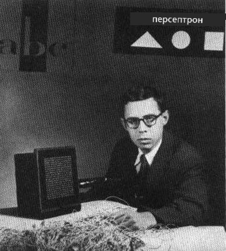

# Въведение в невронните мрежи: Перцептрон

## [Тест преди лекцията](https://ff-quizzes.netlify.app/en/ai/quiz/5)

Един от първите опити за създаване на нещо подобно на съвременна невронна мрежа е направен от Франк Розенблат от Корнелската аеронавтична лаборатория през 1957 г. Това е хардуерна реализация, наречена "Mark-1", предназначена да разпознава примитивни геометрични фигури като триъгълници, квадрати и кръгове.

|      |      |
|--------------|-----------|
| | |

> Изображения [от Wikipedia](https://en.wikipedia.org/wiki/Perceptron)

Входното изображение се представя чрез масив от 20x20 фотоклетки, така че невронната мрежа има 400 входа и един двоичен изход. Простата мрежа съдържа един неврон, наричан още **логическа единица с праг**. Теглата на невронната мрежа действат като потенциометри, които изискват ръчно настройване по време на фазата на обучение.

> ✅ Потенциометърът е устройство, което позволява на потребителя да регулира съпротивлението на електрическа верига.

> The New York Times пише за перцептрона по онова време: *ембрион на електронен компютър, който [Военноморските сили] очакват да може да ходи, говори, вижда, пише, възпроизвежда себе си и да бъде съзнателен за своето съществуване.*

## Модел на перцептрон

Да предположим, че имаме N характеристики в нашия модел, в който случай входният вектор ще бъде с размер N. Перцептронът е модел за **двоична класификация**, т.е. той може да различава два класа входни данни. Ще приемем, че за всеки входен вектор x изходът на нашия перцептрон ще бъде или +1, или -1, в зависимост от класа. Изходът се изчислява по формулата:

y(x) = f(w<sup>T</sup>x)

където f е стъпковата активационна функция

<!-- img src="http://www.sciweavers.org/tex2img.php?eq=f%28x%29%20%3D%20%5Cbegin%7Bcases%7D%0A%20%20%20%20%20%20%20%20%20%2B1%20%26%20x%20%5Cgeq%200%20%5C%5C%0A%20%20%20%20%20%20%20%20%20-1%20%26%20x%20%3C%200%0A%20%20%20%20%20%20%20%5Cend%7Bcases%7D%20%5C%5C%0A&bc=White&fc=Black&im=jpg&fs=12&ff=arev&edit=0" align="center" border="0" alt="f(x) = \begin{cases} +1 & x \geq 0 \\ -1 & x < 0 \end{cases} \\" width="154" height="50" / -->


## Обучение на перцептрона

За да обучим перцептрон, трябва да намерим вектор на теглата w, който класифицира повечето стойности правилно, т.е. води до най-малката **грешка**. Тази грешка E се дефинира чрез **критерия на перцептрона** по следния начин:

E(w) = -&sum;w<sup>T</sup>x<sub>i</sub>t<sub>i</sub>

където:

* сумата се взема за онези точки от обучаващите данни i, които водят до неправилна класификация
* x<sub>i</sub> е входните данни, а t<sub>i</sub> е -1 или +1 съответно за отрицателни и положителни примери.

Този критерий се разглежда като функция на теглата w, и трябва да го минимизираме. Често се използва методът **градиентен спуск**, при който започваме с някакви начални тегла w<sup>(0)</sup>, а след това на всяка стъпка актуализираме теглата според формулата:

w<sup>(t+1)</sup> = w<sup>(t)</sup> - &eta;&nabla;E(w)

Тук &eta; е така наречената **скорост на обучение**, а &nabla;E(w) обозначава **градиента** на E. След като изчислим градиента, получаваме:

w<sup>(t+1)</sup> = w<sup>(t)</sup> + &sum;&eta;x<sub>i</sub>t<sub>i</sub>

Алгоритъмът на Python изглежда така:

```python
def train(positive_examples, negative_examples, num_iterations = 100, eta = 1):

    weights = [0,0,0] # Initialize weights (almost randomly :)
        
    for i in range(num_iterations):
        pos = random.choice(positive_examples)
        neg = random.choice(negative_examples)

        z = np.dot(pos, weights) # compute perceptron output
        if z < 0: # positive example classified as negative
            weights = weights + eta*weights.shape

        z  = np.dot(neg, weights)
        if z >= 0: # negative example classified as positive
            weights = weights - eta*weights.shape

    return weights
```

## Заключение

В този урок научихте за перцептрона, който е модел за двоична класификация, и как да го обучите, използвайки вектор на теглата.

## 🚀 Предизвикателство

Ако искате да опитате да създадете свой собствен перцептрон, опитайте [тази лаборатория в Microsoft Learn](https://docs.microsoft.com/en-us/azure/machine-learning/component-reference/two-class-averaged-perceptron?WT.mc_id=academic-77998-cacaste), която използва [Azure ML designer](https://docs.microsoft.com/en-us/azure/machine-learning/concept-designer?WT.mc_id=academic-77998-cacaste).

## [Тест след лекцията](https://ff-quizzes.netlify.app/en/ai/quiz/6)

## Преглед и самостоятелно обучение

За да видите как можем да използваме перцептрон за решаване на играчки задачи, както и реални проблеми, и за да продължите обучението си - посетете [Perceptron](Perceptron.ipynb) notebook.

Ето и интересна [статия за перцептроните](https://towardsdatascience.com/what-is-a-perceptron-basics-of-neural-networks-c4cfea20c590).

## [Задание](lab/README.md)

В този урок реализирахме перцептрон за задача за двоична класификация и го използвахме за класификация между две ръкописни цифри. В тази лаборатория се изисква да решите проблема с класификацията на цифри изцяло, т.е. да определите коя цифра най-вероятно съответства на дадено изображение.

* [Инструкции](lab/README.md)
* [Notebook](lab/PerceptronMultiClass.ipynb)

---

