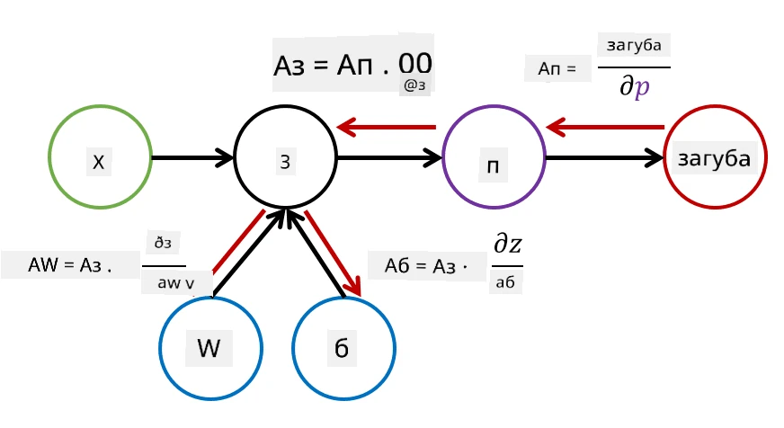

# Въведение в невронните мрежи. Многослойни перцептрони

В предишния раздел научихте за най-простия модел на невронна мрежа - еднослоен перцептрон, линеен модел за двукласова класификация.

В този раздел ще разширим този модел в по-гъвкава рамка, която ни позволява:

* да извършваме **многокласова класификация** в допълнение към двукласовата
* да решаваме **регресионни задачи** в допълнение към класификацията
* да разделяме класове, които не са линейно разделими

Също така ще разработим собствен модулен фреймуърк на Python, който ще ни позволи да изграждаме различни архитектури на невронни мрежи.

## [Тест преди лекцията](https://ff-quizzes.netlify.app/en/ai/quiz/7)

## Формализация на машинното обучение

Нека започнем с формализиране на проблема на машинното обучение. Да предположим, че имаме тренировъчен набор от данни **X** с етикети **Y**, и трябва да изградим модел *f*, който да прави най-точни прогнози. Качеството на прогнозите се измерва чрез **функция на загуба** &lagran;. Често използваните функции на загуба са:

* За регресионни задачи, когато трябва да предвидим число, можем да използваме **абсолютна грешка** &sum;i|f(x(i))-y(i)| или **квадратна грешка** &sum;i(f(x(i))-y(i))2
* За класификация използваме **0-1 загуба** (която по същество е същата като **точността** на модела) или **логистична загуба**.

За еднослоен перцептрон функцията *f* беше дефинирана като линейна функция *f(x)=wx+b* (тук *w* е матрица на теглата, *x* е векторът на входните характеристики, а *b* е векторът на отклонението). За различни архитектури на невронни мрежи тази функция може да приеме по-сложна форма.

> В случай на класификация често е желателно да получим вероятности за съответните класове като изход на мрежата. За да преобразуваме произволни числа в вероятности (например за нормализиране на изхода), често използваме функцията **softmax** &sigma;, и функцията *f* става *f(x)=&sigma;(wx+b)*

В дефиницията на *f* по-горе, *w* и *b* се наричат **параметри** &theta;=⟨*w,b*⟩. Като имаме набора от данни ⟨**X**,**Y**⟩, можем да изчислим общата грешка за целия набор от данни като функция на параметрите &theta;.

> ✅ **Целта на обучението на невронната мрежа е да минимизира грешката чрез промяна на параметрите &theta;**

## Оптимизация чрез градиентен спуск

Съществува добре известен метод за оптимизация на функции, наречен **градиентен спуск**. Идеята е, че можем да изчислим производната (в многомерния случай наречена **градиент**) на функцията на загуба спрямо параметрите и да променяме параметрите така, че грешката да намалява. Това може да се формализира по следния начин:

* Инициализирайте параметрите със случайни стойности w(0), b(0)
* Повтаряйте следната стъпка много пъти:
    - w(i+1) = w(i)-&eta;&part;&lagran;/&part;w
    - b(i+1) = b(i)-&eta;&part;&lagran;/&part;b

По време на обучението оптимизационните стъпки трябва да се изчисляват, като се вземе предвид целият набор от данни (помнете, че загубата се изчислява като сума през всички тренировъчни примери). В реалния живот обаче вземаме малки части от набора от данни, наречени **минипартиди**, и изчисляваме градиентите въз основа на подмножество от данни. Тъй като подмножеството се избира случайно всеки път, този метод се нарича **стохастичен градиентен спуск** (SGD).

## Многослойни перцептрони и обратна пропагация

Еднослойната мрежа, както видяхме по-горе, е способна да класифицира линейно разделими класове. За да изградим по-богат модел, можем да комбинираме няколко слоя на мрежата. Математически това би означавало, че функцията *f* ще има по-сложна форма и ще се изчислява на няколко стъпки:
* z1=w1x+b1
* z2=w2&alpha;(z1)+b2
* f = &sigma;(z2)

Тук &alpha; е **нелинейна активационна функция**, &sigma; е softmax функция, а параметрите са &theta;=<*w1,b1,w2,b2*>.

Алгоритъмът за градиентен спуск остава същият, но изчисляването на градиентите става по-трудно. Съгласно правилото за диференциране на вериги можем да изчислим производните по следния начин:

* &part;&lagran;/&part;w2 = (&part;&lagran;/&part;&sigma;)(&part;&sigma;/&part;z2)(&part;z2/&part;w2)
* &part;&lagran;/&part;w1 = (&part;&lagran;/&part;&sigma;)(&part;&sigma;/&part;z2)(&part;z2/&part;&alpha;)(&part;&alpha;/&part;z1)(&part;z1/&part;w1)

> ✅ Правилото за диференциране на вериги се използва за изчисляване на производните на функцията на загуба спрямо параметрите.

Забележете, че най-лявата част на всички тези изрази е една и съща, и следователно можем ефективно да изчисляваме производните, започвайки от функцията на загуба и преминавайки "назад" през изчислителния граф. Затова методът за обучение на многослоен перцептрон се нарича **обратна пропагация**, или 'backprop'.

> TODO: цитиране на изображението

> ✅ Ще разгледаме обратната пропагация много по-подробно в нашия пример в ноутбука.  

## Заключение

В този урок изградихме собствена библиотека за невронни мрежи и я използвахме за проста двумерна задача за класификация.

## 🚀 Предизвикателство

В придружаващия ноутбук ще реализирате собствен фреймуърк за изграждане и обучение на многослойни перцептрони. Ще можете да видите в детайли как работят съвременните невронни мрежи.

Продължете към ноутбука [OwnFramework](OwnFramework.ipynb) и го разгледайте.

## [Тест след лекцията](https://ff-quizzes.netlify.app/en/ai/quiz/8)

## Преглед и самостоятелно обучение

Обратната пропагация е често използван алгоритъм в AI и ML, който си заслужава да бъде изучен [по-подробно](https://wikipedia.org/wiki/Backpropagation)

## [Задание](lab/README.md)

В тази лабораторна работа трябва да използвате фреймуърка, който създадохте в този урок, за да решите задачата за класификация на ръкописни цифри от MNIST.

* [Инструкции](lab/README.md)
* [Ноутбук](lab/MyFW_MNIST.ipynb)

---

