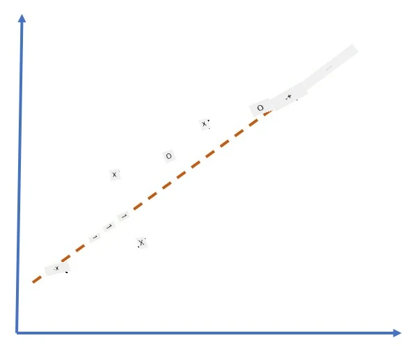
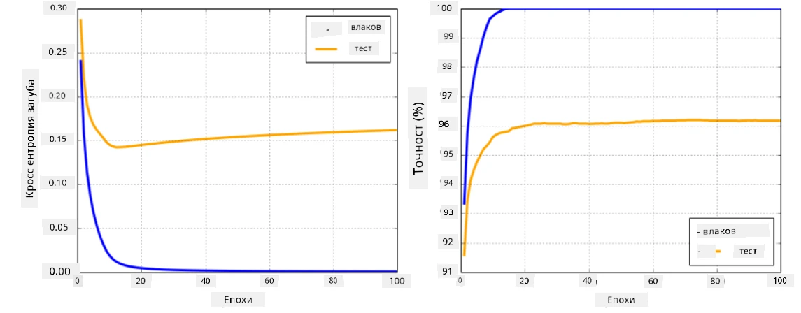

# Фреймворкове за невронни мрежи

Както вече научихме, за да можем ефективно да обучаваме невронни мрежи, трябва да направим две неща:

* Да работим с тензори, например да умножаваме, събираме и изчисляваме функции като сигмоид или softmax
* Да изчисляваме градиенти на всички изрази, за да извършваме оптимизация чрез градиентен спуск

## [Тест преди лекцията](https://ff-quizzes.netlify.app/en/ai/quiz/9)

Докато библиотеката `numpy` може да изпълнява първата част, ни е необходим механизъм за изчисляване на градиенти. В [нашия фреймворк](../04-OwnFramework/OwnFramework.ipynb), който разработихме в предишния раздел, трябваше ръчно да програмираме всички производни функции в метода `backward`, който извършва обратното разпространение. Идеално би било фреймворкът да ни предоставя възможност да изчисляваме градиенти на *всеки израз*, който можем да дефинираме.

Друго важно нещо е да можем да извършваме изчисления на GPU или други специализирани изчислителни устройства, като [TPU](https://en.wikipedia.org/wiki/Tensor_Processing_Unit). Обучението на дълбоки невронни мрежи изисква *много* изчисления, а възможността за паралелизиране на тези изчисления на GPU е от голямо значение.

> ✅ Терминът 'паралелизиране' означава разпределяне на изчисленията върху множество устройства.

В момента двата най-популярни фреймворка за невронни мрежи са: [TensorFlow](http://TensorFlow.org) и [PyTorch](https://pytorch.org/). И двата предоставят ниско ниво API за работа с тензори както на CPU, така и на GPU. Освен ниско ниво API, има и високо ниво API, наречени съответно [Keras](https://keras.io/) и [PyTorch Lightning](https://pytorchlightning.ai/).

Ниско ниво API | [TensorFlow](http://TensorFlow.org) | [PyTorch](https://pytorch.org/)
---------------|-------------------------------------|--------------------------------
Високо ниво API| [Keras](https://keras.io/) | [PyTorch Lightning](https://pytorchlightning.ai/)

**Ниско ниво API** в двата фреймворка ви позволява да изграждате така наречените **изчислителни графи**. Този график определя как да се изчисли изходът (обикновено функцията на загуба) с дадени входни параметри и може да бъде изпратен за изчисление на GPU, ако е наличен. Има функции за диференциране на този изчислителен график и изчисляване на градиенти, които след това могат да се използват за оптимизиране на параметрите на модела.

**Високо ниво API** разглежда невронните мрежи като **последователност от слоеве** и прави изграждането на повечето невронни мрежи много по-лесно. Обучението на модела обикновено изисква подготовка на данните и след това извикване на функцията `fit`, за да се извърши обучението.

API на високо ниво ви позволява да изграждате типични невронни мрежи много бързо, без да се притеснявате за множество детайли. В същото време API на ниско ниво предлага много повече контрол върху процеса на обучение и затова се използва често в изследвания, когато се работи с нови архитектури на невронни мрежи.

Важно е също така да разберете, че можете да използвате и двата API заедно, например можете да разработите собствена архитектура на слой на мрежата с API на ниско ниво и след това да я използвате в по-голяма мрежа, изградена и обучена с API на високо ниво. Или можете да дефинирате мрежа с API на високо ниво като последователност от слоеве и след това да използвате собствен цикъл за обучение на ниско ниво за оптимизация. И двата API използват едни и същи основни концепции и са проектирани да работят добре заедно.

## Обучение

В този курс предлагаме повечето съдържание както за PyTorch, така и за TensorFlow. Можете да изберете предпочитания от вас фреймворк и да преминете само през съответните тетрадки. Ако не сте сигурни кой фреймворк да изберете, прочетете някои дискусии в интернет относно **PyTorch срещу TensorFlow**. Можете също така да разгледате и двата фреймворка, за да получите по-добро разбиране.

Където е възможно, ще използваме API на високо ниво за простота. Въпреки това, вярваме, че е важно да разберем как невронните мрежи работят от основите, затова в началото започваме с работа с API на ниско ниво и тензори. Ако обаче искате да започнете бързо и не искате да отделяте много време за изучаване на тези детайли, можете да пропуснете тези части и да преминете директно към тетрадките с API на високо ниво.

## ✍️ Упражнения: Фреймворкове

Продължете обучението си в следните тетрадки:

Ниско ниво API | [TensorFlow+Keras Notebook](IntroKerasTF.ipynb) | [PyTorch](IntroPyTorch.ipynb)
---------------|-------------------------------------|--------------------------------
Високо ниво API| [Keras](IntroKeras.ipynb) | *PyTorch Lightning*

След като овладеете фреймворковете, нека обобщим понятието за overfitting.

# Overfitting

Overfitting е изключително важно понятие в машинното обучение и е много важно да го разберем правилно!

Разгледайте следния проблем за апроксимация на 5 точки (представени с `x` на графиките по-долу):

 | 
-------------------------|--------------------------
**Линеен модел, 2 параметъра** | **Нелинеен модел, 7 параметъра**
Грешка при обучение = 5.3 | Грешка при обучение = 0
Грешка при валидиране = 5.1 | Грешка при валидиране = 20

* Вляво виждаме добра права линия за апроксимация. Тъй като броят на параметрите е адекватен, моделът правилно разбира разпределението на точките.
* Вдясно моделът е твърде мощен. Тъй като имаме само 5 точки, а моделът има 7 параметъра, той може да се настрои така, че да преминава през всички точки, което прави грешката при обучение 0. Това обаче пречи на модела да разбере правилния модел зад данните, което води до висока грешка при валидиране.

Много е важно да се намери правилният баланс между сложността на модела (броя на параметрите) и броя на тренировъчните примери.

## Защо възниква overfitting

  * Недостатъчно тренировъчни данни
  * Твърде мощен модел
  * Твърде много шум в входните данни

## Как да открием overfitting

Както можете да видите от графиката по-горе, overfitting може да бъде открит чрез много ниска грешка при обучение и висока грешка при валидиране. Обикновено по време на обучение ще видим как грешките при обучение и валидиране започват да намаляват, но в даден момент грешката при валидиране може да спре да намалява и да започне да се увеличава. Това ще бъде знак за overfitting и индикатор, че вероятно трябва да спрем обучението на този етап (или поне да направим моментна снимка на модела).

## Как да предотвратим overfitting

Ако забележите, че възниква overfitting, можете да направите едно от следните:

 * Увеличете количеството тренировъчни данни
 * Намалете сложността на модела
 * Използвайте някаква [техника за регуляризация](../../4-ComputerVision/08-TransferLearning/TrainingTricks.md), като [Dropout](../../4-ComputerVision/08-TransferLearning/TrainingTricks.md#Dropout), която ще разгледаме по-късно.

## Overfitting и компромисът между пристрастие и вариация

Overfitting всъщност е случай на по-общ проблем в статистиката, наречен [компромис между пристрастие и вариация](https://en.wikipedia.org/wiki/Bias%E2%80%93variance_tradeoff). Ако разгледаме възможните източници на грешка в нашия модел, можем да видим два типа грешки:

* **Грешки от пристрастие** са причинени от неспособността на алгоритъма да улови правилно връзката между тренировъчните данни. Това може да се дължи на факта, че моделът ни не е достатъчно мощен (**underfitting**).
* **Грешки от вариация**, които са причинени от модела, който апроксимира шума в входните данни вместо значимата връзка (**overfitting**).

По време на обучение грешките от пристрастие намаляват (тъй като моделът ни се учи да апроксимира данните), а грешките от вариация се увеличават. Важно е да спрем обучението - или ръчно (когато открием overfitting), или автоматично (чрез въвеждане на регуляризация) - за да предотвратим overfitting.

## Заключение

В този урок научихте за разликите между различните API за двата най-популярни AI фреймворка, TensorFlow и PyTorch. Освен това научихте за много важно понятие - overfitting.

## 🚀 Предизвикателство

В придружаващите тетрадки ще намерите 'задачи' в края; преминете през тетрадките и изпълнете задачите.

## [Тест след лекцията](https://ff-quizzes.netlify.app/en/ai/quiz/10)

## Преглед и самостоятелно обучение

Направете проучване по следните теми:

- TensorFlow
- PyTorch
- Overfitting

Задайте си следните въпроси:

- Каква е разликата между TensorFlow и PyTorch?
- Каква е разликата между overfitting и underfitting?

## [Задание](lab/README.md)

В тази лабораторна работа трябва да решите два проблема за класификация, използвайки еднослойни и многослойни напълно свързани мрежи с PyTorch или TensorFlow.

* [Инструкции](lab/README.md)
* [Тетрадка](lab/LabFrameworks.ipynb)

---

