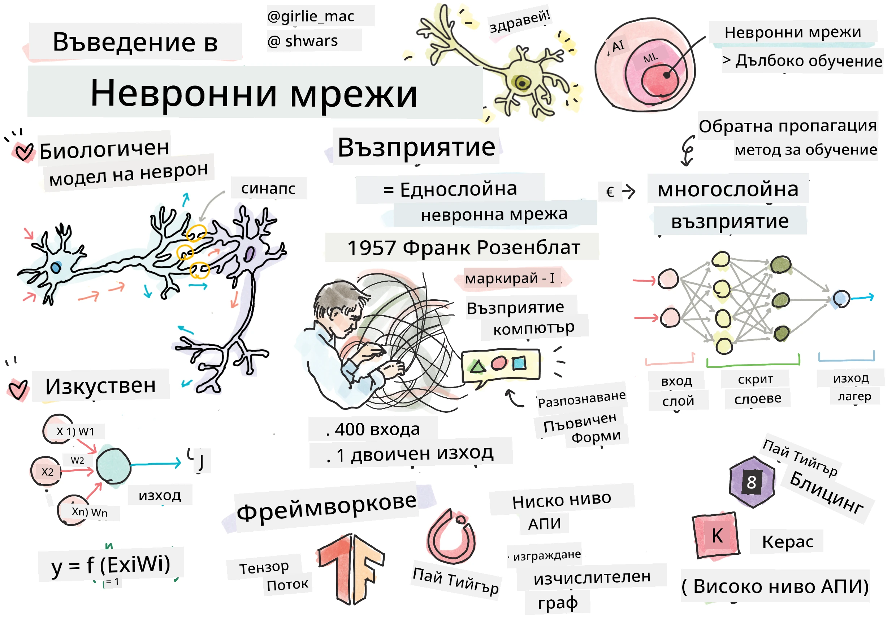
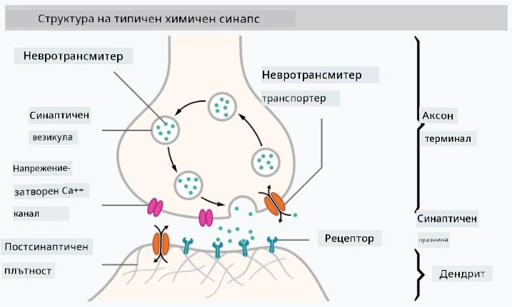

# Въведение в невронните мрежи

Както обсъдихме във въведението, един от начините за постигане на интелигентност е чрез обучение на **компютърен модел** или **изкуствен мозък**. От средата на 20-ти век изследователите опитват различни математически модели, докато в последните години този подход не се оказа изключително успешен. Тези математически модели на мозъка се наричат **невронни мрежи**.

> Понякога невронните мрежи се наричат *Изкуствени невронни мрежи* (Artificial Neural Networks, ANNs), за да се подчертае, че става въпрос за модели, а не за реални мрежи от неврони.

## Машинно обучение

Невронните мрежи са част от по-голяма дисциплина, наречена **Машинно обучение**, чиято цел е да използва данни за обучение на компютърни модели, способни да решават проблеми. Машинното обучение представлява значителна част от Изкуствения интелект, но в тази учебна програма няма да разглеждаме класическо машинно обучение.

> Посетете нашата отделна учебна програма **[Машинно обучение за начинаещи](http://github.com/microsoft/ml-for-beginners)**, за да научите повече за класическото машинно обучение.

В машинното обучение приемаме, че разполагаме с набор от примери **X** и съответстващи изходни стойности **Y**. Примерите често са N-измерни вектори, съставени от **характеристики**, а изходите се наричат **етикети**.

Ще разгледаме двата най-често срещани проблема в машинното обучение:

* **Класификация**, при която трябва да класифицираме входен обект в две или повече категории.
* **Регресия**, при която трябва да предскажем числова стойност за всеки от входните примери.

> Когато представяме входовете и изходите като тензори, входният набор от данни е матрица с размер M&times;N, където M е броят на примерите, а N е броят на характеристиките. Изходните етикети Y са вектор с размер M.

В тази учебна програма ще се фокусираме само върху модели на невронни мрежи.

## Модел на неврон

От биологията знаем, че нашият мозък се състои от нервни клетки (неврони), всяка от които има множество "входове" (дендрити) и един "изход" (аксон). Както дендритите, така и аксоните могат да провеждат електрически сигнали, а връзките между тях — известни като синапси — могат да имат различна степен на проводимост, която се регулира от невротрансмитери.

 | 
----|----
Реален неврон *([Изображение](https://en.wikipedia.org/wiki/Synapse#/media/File:SynapseSchematic_lines.svg) от Wikipedia)* | Изкуствен неврон *(Изображение от автора)*

Следователно, най-простият математически модел на неврон съдържа няколко входа X1, ..., XN и един изход Y, както и серия от тегла W1, ..., WN. Изходът се изчислява като:

където f е някаква нелинейна **активационна функция**.

> Ранните модели на неврон са описани в класическата статия [A logical calculus of the ideas immanent in nervous activity](https://www.cs.cmu.edu/~./epxing/Class/10715/reading/McCulloch.and.Pitts.pdf) от Уорън Маккълок и Уолтър Питс през 1943 г. Доналд Хеб в книгата си "[The Organization of Behavior: A Neuropsychological Theory](https://books.google.com/books?id=VNetYrB8EBoC)" предлага начин, по който тези мрежи могат да бъдат обучавани.

## В тази секция

В тази секция ще научим за:
* [Перцептрон](03-Perceptron/README.md), един от най-ранните модели на невронни мрежи за двукласова класификация
* [Многослойни мрежи](04-OwnFramework/README.md) с придружаващия тетраден файл [как да изградим собствена рамка](04-OwnFramework/OwnFramework.ipynb)
* [Рамки за невронни мрежи](05-Frameworks/README.md), с тези тетрадки: [PyTorch](05-Frameworks/IntroPyTorch.ipynb) и [Keras/Tensorflow](05-Frameworks/IntroKerasTF.ipynb)
* [Преобучение](../../../../lessons/3-NeuralNetworks/05-Frameworks)

---

**Отказ от отговорност**:  
Този документ е преведен с помощта на AI услуга за превод [Co-op Translator](https://github.com/Azure/co-op-translator). Въпреки че се стремим към точност, моля, имайте предвид, че автоматизираните преводи може да съдържат грешки или неточности. Оригиналният документ на неговия роден език трябва да се счита за авторитетен източник. За критична информация се препоръчва професионален човешки превод. Ние не носим отговорност за недоразумения или погрешни интерпретации, произтичащи от използването на този превод.