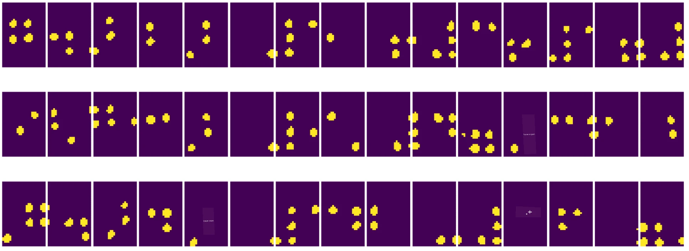
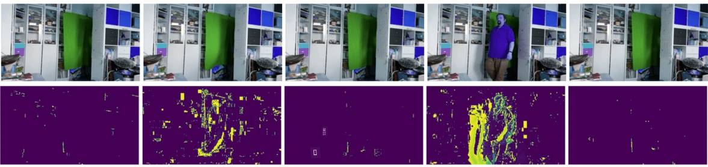

# Въведение в компютърното зрение

[Компютърното зрение](https://wikipedia.org/wiki/Computer_vision) е дисциплина, чиято цел е да позволи на компютрите да придобият високо ниво на разбиране на цифрови изображения. Това е доста широко определение, защото *разбирането* може да означава много различни неща, включително намиране на обект на изображение (**обектно откриване**), разбиране на случващото се (**откриване на събития**), описване на изображение с текст или реконструиране на сцена в 3D. Има и специални задачи, свързани с изображения на хора: оценка на възраст и емоции, откриване и идентификация на лица, както и 3D оценка на поза, наред с други.

## [Тест преди лекцията](https://ff-quizzes.netlify.app/en/ai/quiz/11)

Една от най-простите задачи на компютърното зрение е **класификация на изображения**.

Компютърното зрение често се счита за клон на изкуствения интелект. В наши дни повечето задачи в компютърното зрение се решават с помощта на невронни мрежи. Ще научим повече за специалния тип невронни мрежи, използвани за компютърно зрение, [конволюционни невронни мрежи](../07-ConvNets/README.md), в този раздел.

Въпреки това, преди да подадете изображение към невронна мрежа, в много случаи има смисъл да използвате някои алгоритмични техники за подобряване на изображението.

Съществуват няколко Python библиотеки за обработка на изображения:

* **[imageio](https://imageio.readthedocs.io/en/stable/)** може да се използва за четене/запис на различни формати на изображения. Тя също така поддържа ffmpeg, полезен инструмент за конвертиране на видео кадри в изображения.
* **[Pillow](https://pillow.readthedocs.io/en/stable/index.html)** (известна още като PIL) е малко по-мощна и поддържа манипулации с изображения като морфинг, корекции на палитрата и други.
* **[OpenCV](https://opencv.org/)** е мощна библиотека за обработка на изображения, написана на C++, която се е превърнала в *де факто* стандарт за обработка на изображения. Тя има удобен интерфейс за Python.
* **[dlib](http://dlib.net/)** е библиотека на C++, която реализира много алгоритми за машинно обучение, включително някои от алгоритмите за компютърно зрение. Тя също има интерфейс за Python и може да се използва за предизвикателни задачи като откриване на лица и лицеви маркери.

## OpenCV

[OpenCV](https://opencv.org/) се счита за *де факто* стандарт за обработка на изображения. Тя съдържа много полезни алгоритми, реализирани на C++. Можете да използвате OpenCV и от Python.

Добро място за изучаване на OpenCV е [този курс Learn OpenCV](https://learnopencv.com/getting-started-with-opencv/). В нашата учебна програма целта ни не е да изучаваме OpenCV, а да ви покажем някои примери за това кога може да се използва и как.

### Зареждане на изображения

Изображенията в Python могат удобно да се представят чрез NumPy масиви. Например, черно-бели изображения с размер 320x200 пиксела биха се съхранявали в масив с размери 200x320, а цветни изображения със същите размери биха имали форма 200x320x3 (за 3 цветни канала). За да заредите изображение, можете да използвате следния код:

```python
import cv2
import matplotlib.pyplot as plt

im = cv2.imread('image.jpeg')
plt.imshow(im)
```

Традиционно OpenCV използва BGR (синьо-зелено-червено) кодиране за цветни изображения, докато останалите инструменти на Python използват по-традиционното RGB (червено-зелено-синьо). За да изглежда изображението правилно, трябва да го конвертирате в RGB цветово пространство, като размените размерите в NumPy масива или като извикате функция на OpenCV:

```python
im = cv2.cvtColor(im,cv2.COLOR_BGR2RGB)
```

Същата функция `cvtColor` може да се използва за извършване на други трансформации на цветово пространство, като конвертиране на изображение в черно-бяло или в HSV (оттенък-наситеност-стойност) цветово пространство.

Можете също да използвате OpenCV за зареждане на видео кадър по кадър - пример е даден в упражнението [OpenCV Notebook](OpenCV.ipynb).

### Обработка на изображения

Преди да подадете изображение към невронна мрежа, може да искате да приложите няколко стъпки за предварителна обработка. OpenCV може да прави много неща, включително:

* **Промяна на размера** на изображението с `im = cv2.resize(im, (320,200),interpolation=cv2.INTER_LANCZOS)`
* **Размазване** на изображението с `im = cv2.medianBlur(im,3)` или `im = cv2.GaussianBlur(im, (3,3), 0)`
* Промяна на **яркостта и контраста** на изображението може да се направи чрез манипулации с NumPy масиви, както е описано [в тази бележка в Stackoverflow](https://stackoverflow.com/questions/39308030/how-do-i-increase-the-contrast-of-an-image-in-python-opencv).
* Използване на [прагова обработка](https://docs.opencv.org/4.x/d7/d4d/tutorial_py_thresholding.html) чрез извикване на функциите `cv2.threshold`/`cv2.adaptiveThreshold`, което често е за предпочитане пред регулиране на яркостта или контраста.
* Прилагане на различни [трансформации](https://docs.opencv.org/4.5.5/da/d6e/tutorial_py_geometric_transformations.html) върху изображението:
    - **[Афинни трансформации](https://docs.opencv.org/4.5.5/d4/d61/tutorial_warp_affine.html)** могат да бъдат полезни, ако трябва да комбинирате ротация, промяна на размера и наклон на изображението и знаете изходното и целевото местоположение на три точки в изображението. Афинните трансформации запазват паралелните линии паралелни.
    - **[Перспективни трансформации](https://medium.com/analytics-vidhya/opencv-perspective-transformation-9edffefb2143)** могат да бъдат полезни, когато знаете изходните и целевите позиции на 4 точки в изображението. Например, ако направите снимка на правоъгълен документ с камерата на смартфон под някакъв ъгъл и искате да направите правоъгълно изображение на самия документ.
* Разбиране на движението в изображението чрез **[оптичен поток](https://docs.opencv.org/4.5.5/d4/dee/tutorial_optical_flow.html)**.

## Примери за използване на компютърно зрение

В нашия [OpenCV Notebook](OpenCV.ipynb) даваме някои примери за това кога компютърното зрение може да се използва за изпълнение на специфични задачи:

* **Предварителна обработка на фотография на книга на Брайл**. Фокусираме се върху това как можем да използваме прагова обработка, откриване на характеристики, перспективна трансформация и манипулации с NumPy, за да отделим отделни символи на Брайл за по-нататъшна класификация от невронна мрежа.

 |  | 
----|-----|-----

> Изображение от [OpenCV.ipynb](OpenCV.ipynb)

* **Откриване на движение във видео чрез разлика между кадри**. Ако камерата е фиксирана, тогава кадрите от камерата трябва да са доста подобни един на друг. Тъй като кадрите се представят като масиви, просто като извадите тези масиви за два последователни кадъра, ще получите разликата в пикселите, която трябва да е ниска за статични кадри и да стане по-висока, когато има значително движение в изображението.



> Изображение от [OpenCV.ipynb](OpenCV.ipynb)

* **Откриване на движение чрез оптичен поток**. [Оптичният поток](https://docs.opencv.org/3.4/d4/dee/tutorial_optical_flow.html) ни позволява да разберем как отделни пиксели на видео кадри се движат. Има два типа оптичен поток:

   - **Плътен оптичен поток** изчислява векторно поле, което показва за всеки пиксел къде се движи.
   - **Рядък оптичен поток** се основава на вземане на някои отличителни характеристики в изображението (например ръбове) и изграждане на тяхната траектория от кадър на кадър.


> Изображение от [OpenCV.ipynb](OpenCV.ipynb)

## ✍️ Примерни тетрадки: OpenCV [опитайте OpenCV в действие](OpenCV.ipynb)

Нека направим някои експерименти с OpenCV, като разгледаме [OpenCV Notebook](OpenCV.ipynb).

## Заключение

Понякога сравнително сложни задачи като откриване на движение или откриване на върхове на пръсти могат да бъдат решени изцяло чрез компютърно зрение. Затова е много полезно да знаете основните техники на компютърното зрение и какво могат да правят библиотеки като OpenCV.

## 🚀 Предизвикателство

Гледайте [това видео](https://docs.microsoft.com/shows/ai-show/ai-show--2021-opencv-ai-competition--grand-prize-winners--cortic-tigers--episode-32?WT.mc_id=academic-77998-cacaste) от AI шоуто, за да научите за проекта Cortic Tigers и как те изградиха решение на базата на блокове за демократизиране на задачите на компютърното зрение чрез робот. Направете проучване за други подобни проекти, които помагат на нови учащи да навлязат в областта.

## [Тест след лекцията](https://ff-quizzes.netlify.app/en/ai/quiz/12)

## Преглед и самостоятелно обучение

Прочетете повече за оптичния поток [в този страхотен урок](https://learnopencv.com/optical-flow-in-opencv/).

## [Задание](lab/README.md)

В тази лаборатория ще заснемете видео с прости жестове, а вашата цел е да извлечете движения нагоре/надолу/наляво/надясно, използвайки оптичен поток.


---

