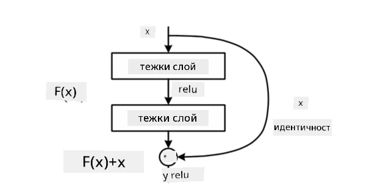
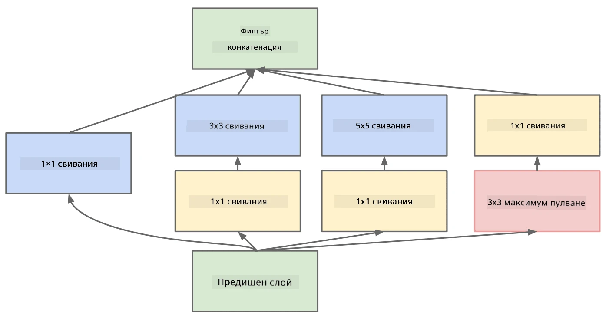

# Добре познати архитектури на CNN

### VGG-16

VGG-16 е мрежа, която постигна 92.7% точност в класификацията на ImageNet топ-5 през 2014 г. Тя има следната структура на слоевете:

Както можете да видите, VGG следва традиционна пирамидална архитектура, която представлява последователност от слоеве за конволюция и пулуване.

> Изображение от [Researchgate](https://www.researchgate.net/figure/Vgg16-model-structure-To-get-the-VGG-NIN-model-we-replace-the-2-nd-4-th-6-th-7-th_fig2_335194493)

### ResNet

ResNet е семейство модели, предложени от Microsoft Research през 2015 г. Основната идея на ResNet е използването на **остатъчни блокове**:

> Изображение от [тази статия](https://arxiv.org/pdf/1512.03385.pdf)

Причината за използването на идентичния проход е слоят да предсказва **разликата** между резултата от предишния слой и изхода на остатъчния блок - оттук идва името *остатъчен*. Тези блокове са много по-лесни за обучение, и може да се конструират мрежи с няколко стотици от тези блокове (най-често срещаните варианти са ResNet-52, ResNet-101 и ResNet-152).

Можете също така да мислите за тази мрежа като способна да регулира сложността си спрямо набора от данни. Първоначално, когато започвате да обучавате мрежата, стойностите на теглата са малки и повечето сигнал преминава през идентичните слоеве. С напредването на обучението и увеличаването на теглата, значимостта на параметрите на мрежата нараства, и мрежата се адаптира, за да осигури необходимата изразителна мощност за правилна класификация на тренировъчните изображения.

### Google Inception

Архитектурата Google Inception извежда тази идея на следващо ниво, като изгражда всеки слой на мрежата като комбинация от няколко различни пътища:

> Изображение от [Researchgate](https://www.researchgate.net/figure/Inception-module-with-dimension-reductions-left-and-schema-for-Inception-ResNet-v1_fig2_355547454)

Тук трябва да подчертаем ролята на конволюциите 1x1, защото на пръв поглед те не изглеждат логични. Защо бихме искали да обработваме изображението с филтър 1x1? Въпреки това, трябва да помним, че конволюционните филтри работят и с няколко дълбочинни канала (първоначално - RGB цветове, в последващите слоеве - канали за различни филтри), а конволюцията 1x1 се използва за смесване на тези входни канали чрез различни обучаеми тегла. Тя може също да се разглежда като намаляване на размерите (пулуване) по дълбочинния канал.

Ето [добър блог пост](https://medium.com/analytics-vidhya/talented-mr-1x1-comprehensive-look-at-1x1-convolution-in-deep-learning-f6b355825578) по темата и [оригиналната статия](https://arxiv.org/pdf/1312.4400.pdf).

### MobileNet

MobileNet е семейство модели с намален размер, подходящи за мобилни устройства. Използвайте ги, ако разполагате с ограничени ресурси и можете да пожертвате малко точност. Основната идея зад тях е така наречената **дълбочинно разделима конволюция**, която позволява представянето на конволюционните филтри чрез композиция от пространствени конволюции и конволюция 1x1 по дълбочинните канали. Това значително намалява броя на параметрите, правейки мрежата по-малка по размер и по-лесна за обучение с по-малко данни.

Ето [добър блог пост за MobileNet](https://medium.com/analytics-vidhya/image-classification-with-mobilenet-cc6fbb2cd470).

## Заключение

В този урок научихте основната концепция зад невронните мрежи за компютърно зрение - конволюционните мрежи. Реалните архитектури, които захранват класификацията на изображения, откриването на обекти и дори генерирането на изображения, са базирани на CNN, просто с повече слоеве и някои допълнителни трикове за обучение.

## 🚀 Предизвикателство

В придружаващите тетрадки има бележки в края за това как да постигнете по-голяма точност. Направете някои експерименти, за да видите дали можете да постигнете по-висока точност.

## [Тест след лекцията](https://ff-quizzes.netlify.app/en/ai/quiz/14)

## Преглед и самостоятелно обучение

Докато CNN най-често се използват за задачи в компютърното зрение, те са като цяло добри за извличане на фиксирани модели. Например, ако работим със звуци, може също да искаме да използваме CNN, за да търсим специфични модели в аудио сигнала - в този случай филтрите ще бъдат едноизмерни (и тази CNN ще се нарича 1D-CNN). Също така понякога се използва 3D-CNN за извличане на характеристики в многомерно пространство, като например определени събития, които се случват във видео - CNN може да улови определени модели на промяна на характеристиките във времето. Направете преглед и самостоятелно обучение за други задачи, които могат да се изпълняват с CNN.

## [Задача](lab/README.md)

В тази лабораторна работа трябва да класифицирате различни породи котки и кучета. Тези изображения са по-сложни от набора данни MNIST, с по-високи размери и повече от 10 класа.

---

