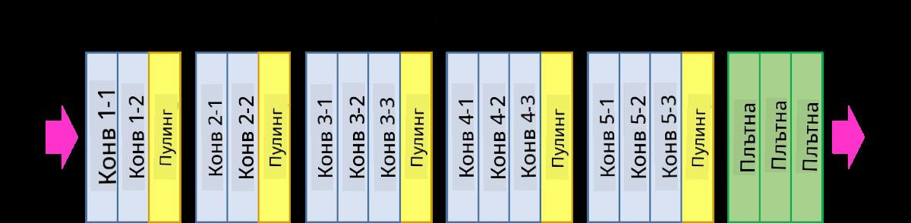

<!--
CO_OP_TRANSLATOR_METADATA:
{
  "original_hash": "2f7b97b375358cb51a1e098df306bf73",
  "translation_date": "2025-08-25T22:55:56+00:00",
  "source_file": "lessons/4-ComputerVision/07-ConvNets/CNN_Architectures.md",
  "language_code": "bg"
}
-->
# Добре познати архитектури на CNN

### VGG-16

VGG-16 е мрежа, която постигна 92.7% точност в класификацията на ImageNet top-5 през 2014 година. Тя има следната структура на слоевете:

Както можете да видите, VGG следва традиционна пирамидална архитектура, която представлява последователност от слоеве за свиване и пулуване.

> Изображение от [Researchgate](https://www.researchgate.net/figure/Vgg16-model-structure-To-get-the-VGG-NIN-model-we-replace-the-2-nd-4-th-6-th-7-th_fig2_335194493)

### ResNet

ResNet е семейство от модели, предложени от Microsoft Research през 2015 година. Основната идея на ResNet е използването на **остатъчни блокове**:

> Изображение от [тази статия](https://arxiv.org/pdf/1512.03385.pdf)

Причината за използването на идентични проходи е слоят да предсказва **разликата** между резултата от предишния слой и изхода на остатъчния блок - оттук идва името *остатъчен*. Тези блокове са много по-лесни за обучение, и може да се конструират мрежи със стотици такива блокове (най-често срещаните варианти са ResNet-52, ResNet-101 и ResNet-152).

Можете също да мислите за тази мрежа като способна да регулира сложността си спрямо набора от данни. В началото, когато започвате да обучавате мрежата, стойностите на теглата са малки и повечето сигнал преминава през идентичните слоеве. С напредването на обучението и увеличаването на теглата, значимостта на параметрите на мрежата нараства, и мрежата се адаптира, за да осигури необходимата изразителна мощност за правилна класификация на тренировъчните изображения.

### Google Inception

Архитектурата Google Inception прави тази идея още една стъпка напред, като изгражда всеки слой на мрежата като комбинация от няколко различни пътища:

> Изображение от [Researchgate](https://www.researchgate.net/figure/Inception-module-with-dimension-reductions-left-and-schema-for-Inception-ResNet-v1_fig2_355547454)

Тук трябва да подчертаем ролята на 1x1 свиванията, защото на пръв поглед те не изглеждат логични. Защо бихме искали да обработваме изображението с 1x1 филтър? Въпреки това, трябва да помним, че свиващите филтри работят и с няколко дълбочинни канала (първоначално - RGB цветове, в последващите слоеве - канали за различни филтри), а 1x1 свиването се използва за смесване на тези входни канали чрез различни обучаеми тегла. То може да се разглежда и като намаляване на размерите (пулуване) по дълбочинния канал.

Ето [добър блог пост](https://medium.com/analytics-vidhya/talented-mr-1x1-comprehensive-look-at-1x1-convolution-in-deep-learning-f6b355825578) по темата и [оригиналната статия](https://arxiv.org/pdf/1312.4400.pdf).

### MobileNet

MobileNet е семейство от модели с намален размер, подходящи за мобилни устройства. Използвайте ги, ако разполагате с ограничени ресурси и можете да жертвате малко точност. Основната идея зад тях е така нареченото **дълбочинно разделимо свиване**, което позволява представянето на свиващите филтри чрез композиция от пространствени свивания и 1x1 свивания по дълбочинните канали. Това значително намалява броя на параметрите, правейки мрежата по-малка по размер и по-лесна за обучение с по-малко данни.

Ето [добър блог пост за MobileNet](https://medium.com/analytics-vidhya/image-classification-with-mobilenet-cc6fbb2cd470).

## Заключение

В този модул научихте основната концепция зад невронните мрежи за компютърно зрение - свиващите мрежи. Реалните архитектури, които захранват класификацията на изображения, откриването на обекти и дори генерирането на изображения, са базирани на CNN, просто с повече слоеве и някои допълнителни трикове за обучение.

## 🚀 Предизвикателство

В придружаващите тетрадки има бележки в края за това как да постигнете по-голяма точност. Направете някои експерименти, за да видите дали можете да постигнете по-висока точност.

## [Тест след лекцията](https://red-field-0a6ddfd03.1.azurestaticapps.net/quiz/207)

## Преглед и самостоятелно обучение

Докато CNN най-често се използват за задачи в компютърното зрение, те са като цяло добри за извличане на фиксирани модели. Например, ако работим със звуци, може също да искаме да използваме CNN, за да търсим специфични модели в аудио сигнала - в този случай филтрите биха били едноизмерни (и тази CNN би се нарекла 1D-CNN). Също така понякога се използва 3D-CNN за извличане на характеристики в многомерно пространство, като например определени събития, случващи се във видео - CNN може да улови определени модели на промяна на характеристиките във времето. Направете преглед и самостоятелно обучение за други задачи, които могат да се изпълняват с CNN.

## [Задача](lab/README.md)

В тази лабораторна работа трябва да класифицирате различни породи котки и кучета. Тези изображения са по-сложни от набора данни MNIST, с по-високи размери и повече от 10 класа.

**Отказ от отговорност**:  
Този документ е преведен с помощта на AI услуга за превод [Co-op Translator](https://github.com/Azure/co-op-translator). Въпреки че се стремим към точност, моля, имайте предвид, че автоматизираните преводи може да съдържат грешки или неточности. Оригиналният документ на неговия роден език трябва да се счита за авторитетен източник. За критична информация се препоръчва професионален човешки превод. Не носим отговорност за недоразумения или погрешни интерпретации, произтичащи от използването на този превод.