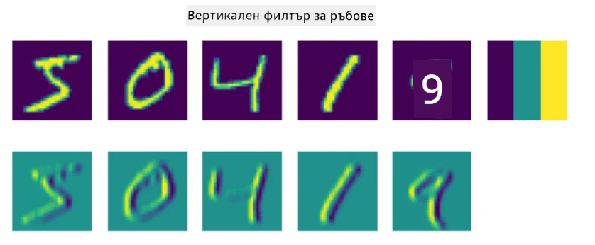
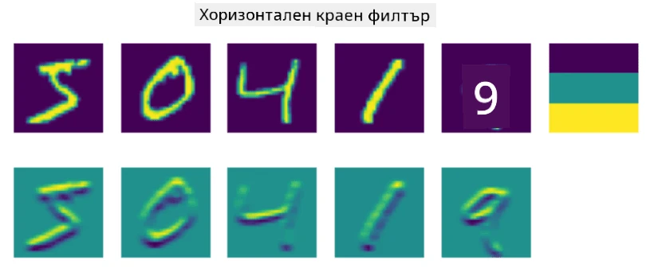
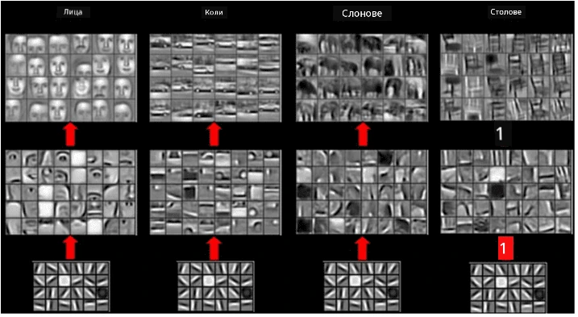
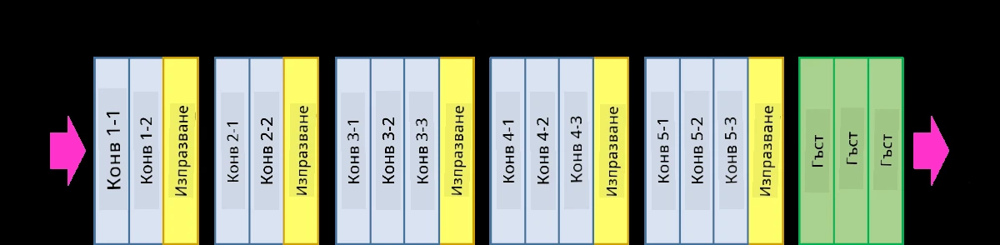
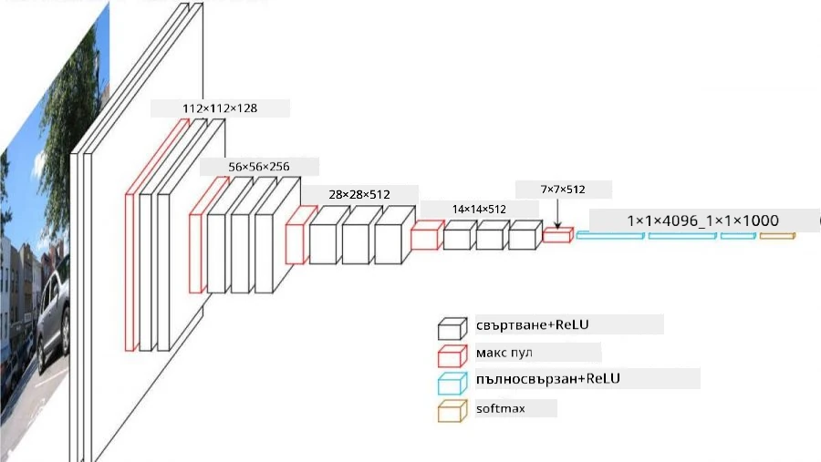

# Конволюционни невронни мрежи

Вече видяхме, че невронните мрежи са доста добри в обработката на изображения, и дори еднослойният перцептрон може да разпознава ръкописни цифри от набора данни MNIST с приемлива точност. Въпреки това, наборът данни MNIST е доста специален, тъй като всички цифри са центрирани в изображението, което прави задачата по-лесна.

## [Тест преди лекцията](https://ff-quizzes.netlify.app/en/ai/quiz/13)

В реалния живот искаме да можем да разпознаваме обекти на снимка, независимо от тяхното точно местоположение в изображението. Компютърното зрение се различава от общата класификация, защото когато се опитваме да намерим определен обект в изображението, ние сканираме изображението, търсейки специфични **шаблони** и техните комбинации. Например, когато търсим котка, първо може да търсим хоризонтални линии, които могат да формират мустаци, а след това определена комбинация от мустаци може да ни подскаже, че това всъщност е снимка на котка. Относителното положение и наличието на определени шаблони са важни, а не тяхното точно местоположение в изображението.

За да извлечем шаблони, ще използваме понятието за **конволюционни филтри**. Както знаете, едно изображение се представя чрез 2D-матрица или 3D-тензор с цветова дълбочина. Прилагането на филтър означава, че вземаме сравнително малка матрица, наречена **ядро на филтъра**, и за всеки пиксел в оригиналното изображение изчисляваме претегленото средно с неговите съседни точки. Можем да си представим това като малък прозорец, който се плъзга по цялото изображение и осреднява всички пиксели според теглата в матрицата на ядрото на филтъра.

 | 
----|----

> Изображение от Дмитрий Сошников

Например, ако приложим 3x3 филтри за вертикални и хоризонтални ръбове към цифрите от MNIST, можем да подчертаем (например високи стойности) местата, където има вертикални и хоризонтални ръбове в оригиналното изображение. Така тези два филтъра могат да се използват за "търсене" на ръбове. По същия начин можем да проектираме различни филтри, за да търсим други нискоуровневи шаблони:

> Изображение на [Leung-Malik Filter Bank](https://www.robots.ox.ac.uk/~vgg/research/texclass/filters.html)

Въпреки това, докато можем ръчно да проектираме филтри за извличане на определени шаблони, можем също така да проектираме мрежата така, че тя автоматично да научава шаблоните. Това е една от основните идеи зад CNN.

## Основни идеи зад CNN

Работата на CNN се основава на следните важни идеи:

* Конволюционните филтри могат да извличат шаблони
* Можем да проектираме мрежата така, че филтрите да се обучават автоматично
* Можем да използваме същия подход, за да намираме шаблони в характеристики на високо ниво, а не само в оригиналното изображение. Така извличането на характеристики в CNN работи на йерархия от характеристики, започвайки от нискоуровневи комбинации от пиксели до по-високо ниво комбинации от части на изображението.

> Изображение от [статия на Hislop-Lynch](https://www.semanticscholar.org/paper/Computer-vision-based-pedestrian-trajectory-Hislop-Lynch/26e6f74853fc9bbb7487b06dc2cf095d36c9021d), базирано на [тяхното изследване](https://dl.acm.org/doi/abs/10.1145/1553374.1553453)

## ✍️ Упражнения: Конволюционни невронни мрежи

Нека продължим да изследваме как работят конволюционните невронни мрежи и как можем да постигнем обучаеми филтри, като работим с подходящите тетрадки:

* [Конволюционни невронни мрежи - PyTorch](ConvNetsPyTorch.ipynb)
* [Конволюционни невронни мрежи - TensorFlow](ConvNetsTF.ipynb)

## Пирамидална архитектура

Повечето CNN, използвани за обработка на изображения, следват така наречената пирамидална архитектура. Първият конволюционен слой, приложен към оригиналните изображения, обикновено има сравнително малък брой филтри (8-16), които съответстват на различни комбинации от пиксели, като хоризонтални/вертикални линии или щрихи. На следващото ниво намаляваме пространственото измерение на мрежата и увеличаваме броя на филтрите, което съответства на повече възможни комбинации от прости характеристики. С всеки слой, докато се придвижваме към крайния класификатор, пространствените измерения на изображението намаляват, а броят на филтрите нараства.

Като пример, нека разгледаме архитектурата на VGG-16, мрежа, която постигна 92.7% точност в класификацията на ImageNet (топ 5) през 2014 г.:

> Изображение от [Researchgate](https://www.researchgate.net/figure/Vgg16-model-structure-To-get-the-VGG-NIN-model-we-replace-the-2-nd-4-th-6-th-7-th_fig2_335194493)

## Най-известни архитектури на CNN

[Продължете обучението си за най-известните архитектури на CNN](CNN_Architectures.md)

---

