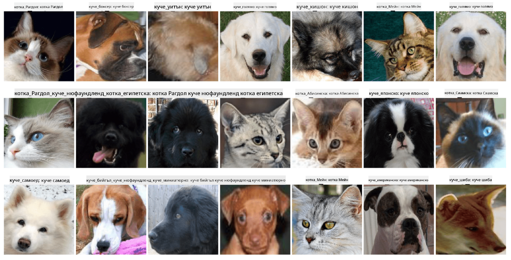

<!--
CO_OP_TRANSLATOR_METADATA:
{
  "original_hash": "f3d2cee9cb3c52160419e560c57a690e",
  "translation_date": "2025-08-25T22:58:28+00:00",
  "source_file": "lessons/4-ComputerVision/07-ConvNets/lab/README.md",
  "language_code": "bg"
}
-->
# Класификация на лицата на домашни любимци

Лабораторно упражнение от [AI for Beginners Curriculum](https://github.com/microsoft/ai-for-beginners).

## Задача

Представете си, че трябва да разработите приложение за детска градина за домашни любимци, което да каталогизира всички животни. Една от страхотните функции на такова приложение би била автоматичното разпознаване на породата от снимка. Това може успешно да се постигне с помощта на невронни мрежи.

Трябва да обучите конволюционна невронна мрежа, за да класифицирате различни породи котки и кучета, използвайки набора от данни **Pet Faces**.

## Наборът от данни

Ще използваме набора от данни **Pet Faces**, който е извлечен от набора от данни за домашни любимци [Oxford-IIIT](https://www.robots.ox.ac.uk/~vgg/data/pets/). Той съдържа 35 различни породи кучета и котки.



За да изтеглите набора от данни, използвайте този кодов фрагмент:

```python
!wget https://thor.robots.ox.ac.uk/~vgg/data/pets/images.tar.gz
!tar xfz images.tar.gz
!rm images.tar.gz
```

## Начален Notebook

Започнете лабораторното упражнение, като отворите [PetFaces.ipynb](../../../../../../lessons/4-ComputerVision/07-ConvNets/lab/PetFaces.ipynb)

## Изводи

Решихте сравнително сложен проблем за класификация на изображения от нулата! Имаше доста класове, но все пак успяхте да постигнете разумна точност! Също така има смисъл да измервате top-k точност, защото е лесно да се объркат някои от класовете, които дори за хората не са ясно различими.

**Отказ от отговорност**:  
Този документ е преведен с помощта на AI услуга за превод [Co-op Translator](https://github.com/Azure/co-op-translator). Въпреки че се стремим към точност, моля, имайте предвид, че автоматизираните преводи може да съдържат грешки или неточности. Оригиналният документ на неговия роден език трябва да се счита за авторитетен източник. За критична информация се препоръчва професионален човешки превод. Ние не носим отговорност за недоразумения или погрешни интерпретации, произтичащи от използването на този превод.