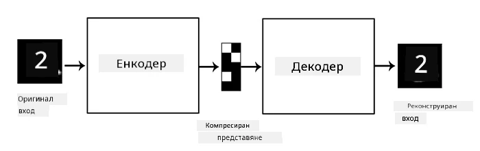
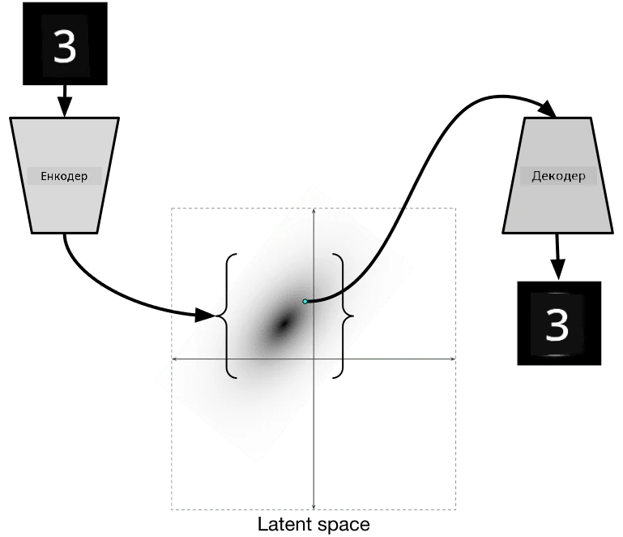

# Автоенкодери

При обучението на CNNs един от проблемите е, че се нуждаем от много етикетирани данни. В случая на класификация на изображения, трябва да разделим изображенията в различни класове, което изисква ръчен труд.

## [Тест преди лекцията](https://ff-quizzes.netlify.app/en/ai/quiz/17)

Въпреки това, може да искаме да използваме сурови (неетикетирани) данни за обучение на CNN екстрактори на характеристики, което се нарича **самонаблюдавано обучение**. Вместо етикети, ще използваме тренировъчните изображения както като вход, така и като изход на мрежата. Основната идея на **автоенкодера** е, че ще имаме **енкодер мрежа**, която преобразува входното изображение в някакво **латентно пространство** (обикновено това е просто вектор с по-малък размер), след което **декодер мрежа**, чиято цел е да реконструира оригиналното изображение.

> ✅ [Автоенкодер](https://wikipedia.org/wiki/Autoencoder) е "вид изкуствена невронна мрежа, използвана за изучаване на ефективни кодировки на неетикетирани данни."

Тъй като обучаваме автоенкодера да улавя максимално много информация от оригиналното изображение за точна реконструкция, мрежата се опитва да намери най-доброто **вграждане** на входните изображения, за да улови тяхното значение.

> Изображение от [Keras блог](https://blog.keras.io/building-autoencoders-in-keras.html)

## Сценарии за използване на автоенкодери

Докато реконструкцията на оригинални изображения може да не изглежда полезна сама по себе си, има няколко сценария, в които автоенкодерите са особено полезни:

* **Намаляване на размерността на изображения за визуализация** или **обучение на вграждания на изображения**. Обикновено автоенкодерите дават по-добри резултати от PCA, защото вземат предвид пространствената природа на изображенията и йерархичните характеристики.
* **Премахване на шум**, т.е. премахване на шума от изображението. Тъй като шумът съдържа много ненужна информация, автоенкодерът не може да го побере в сравнително малкото латентно пространство и така улавя само важната част от изображението. При обучението на премахващи шума мрежи започваме с оригинални изображения и използваме изображения с изкуствено добавен шум като вход за автоенкодера.
* **Суперрезолюция**, увеличаване на резолюцията на изображения. Започваме с изображения с висока резолюция и използваме изображението с по-ниска резолюция като вход за автоенкодера.
* **Генеративни модели**. След като обучим автоенкодера, частта с декодера може да се използва за създаване на нови обекти, започвайки от случайни латентни вектори.

## Вариационни автоенкодери (VAE)

Традиционните автоенкодери намаляват размерността на входните данни, като откриват важните характеристики на входните изображения. Въпреки това, латентните вектори често нямат много смисъл. С други думи, ако вземем набора от данни MNIST като пример, разбирането кои цифри съответстват на различни латентни вектори не е лесна задача, защото близките латентни вектори не е задължително да съответстват на едни и същи цифри.

От друга страна, за да обучим *генеративни* модели, е по-добре да имаме някакво разбиране за латентното пространство. Тази идея ни води до **вариационен автоенкодер** (VAE).

VAE е автоенкодер, който се учи да предсказва *статистическо разпределение* на латентните параметри, така нареченото **латентно разпределение**. Например, може да искаме латентните вектори да бъдат разпределени нормално с някаква средна стойност zmean и стандартно отклонение zsigma (и двете - средната стойност и стандартното отклонение - са вектори с някаква размерност d). Енкодерът във VAE се учи да предсказва тези параметри, а декодерът взема случаен вектор от това разпределение, за да реконструира обекта.

Накратко:

 * От входния вектор предсказваме `z_mean` и `z_log_sigma` (вместо да предсказваме самото стандартно отклонение, предсказваме неговия логаритъм)
 * Вземаме проба `sample` от разпределението N(zmean,exp(zlog\_sigma))
 * Декодерът се опитва да декодира оригиналното изображение, използвайки `sample` като входен вектор

 

> Изображение от [този блог пост](https://ijdykeman.github.io/ml/2016/12/21/cvae.html) от Исак Дайкман

Вариационните автоенкодери използват сложна функция за загуба, която се състои от две части:

* **Загуба от реконструкция** е функцията за загуба, която показва колко близко е реконструираното изображение до целта (може да бъде Mean Squared Error или MSE). Това е същата функция за загуба като при нормалните автоенкодери.
* **KL загуба**, която гарантира, че разпределението на латентните променливи остава близко до нормалното разпределение. Тя се основава на понятието за [дивергенция на Кълбак-Лайблер](https://www.countbayesie.com/blog/2017/5/9/kullback-leibler-divergence-explained) - метрика за оценка на сходството между две статистически разпределения.

Едно важно предимство на VAE е, че те ни позволяват да генерираме нови изображения сравнително лесно, защото знаем от кое разпределение да вземем проби за латентните вектори. Например, ако обучим VAE с 2D латентен вектор върху MNIST, можем след това да променяме компонентите на латентния вектор, за да получим различни цифри:

> Изображение от [Дмитрий Сошников](http://soshnikov.com)

Наблюдавайте как изображенията се преливат едно в друго, когато започнем да вземаме латентни вектори от различни части на пространството на латентните параметри. Можем също да визуализираме това пространство в 2D:

 

> Изображение от [Дмитрий Сошников](http://soshnikov.com)

## ✍️ Упражнения: Автоенкодери

Научете повече за автоенкодерите в тези съответни тетрадки:

* [Автоенкодери в TensorFlow](AutoencodersTF.ipynb)
* [Автоенкодери в PyTorch](AutoEncodersPyTorch.ipynb)

## Свойства на автоенкодерите

* **Специфични за данни** - те работят добре само с типа изображения, върху които са били обучени. Например, ако обучим мрежа за суперрезолюция върху цветя, тя няма да работи добре върху портрети. Това е така, защото мрежата може да създаде изображение с по-висока резолюция, като вземе фините детайли от характеристиките, научени от тренировъчния набор от данни.
* **С загуба** - реконструираното изображение не е същото като оригиналното изображение. Природата на загубата се определя от *функцията за загуба*, използвана по време на обучението.
* Работи с **неетикетирани данни**

## [Тест след лекцията](https://ff-quizzes.netlify.app/en/ai/quiz/18)

## Заключение

В този урок научихте за различните видове автоенкодери, достъпни за AI учените. Научихте как да ги изграждате и как да ги използвате за реконструкция на изображения. Също така научихте за VAE и как да го използвате за генериране на нови изображения.

## 🚀 Предизвикателство

В този урок научихте за използването на автоенкодери за изображения. Но те могат да се използват и за музика! Разгледайте проекта Magenta [MusicVAE](https://magenta.tensorflow.org/music-vae), който използва автоенкодери за изучаване на реконструкция на музика. Направете някои [експерименти](https://colab.research.google.com/github/magenta/magenta-demos/blob/master/colab-notebooks/Multitrack_MusicVAE.ipynb) с тази библиотека, за да видите какво можете да създадете.

## [Тест след лекцията](https://ff-quizzes.netlify.app/en/ai/quiz/16)

## Преглед и самостоятелно обучение

За справка, прочетете повече за автоенкодерите в тези ресурси:

* [Изграждане на автоенкодери в Keras](https://blog.keras.io/building-autoencoders-in-keras.html)
* [Блог пост в NeuroHive](https://neurohive.io/ru/osnovy-data-science/variacionnyj-avtojenkoder-vae/)
* [Обяснение на вариационните автоенкодери](https://kvfrans.com/variational-autoencoders-explained/)
* [Условни вариационни автоенкодери](https://ijdykeman.github.io/ml/2016/12/21/cvae.html)

## Задача

В края на [тази тетрадка с TensorFlow](AutoencodersTF.ipynb) ще намерите "задача" - използвайте я като ваше домашно задание.

---

