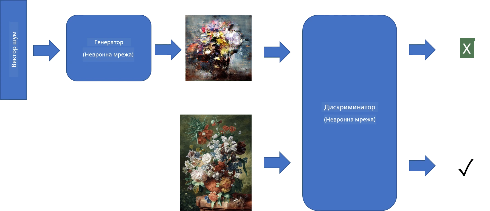
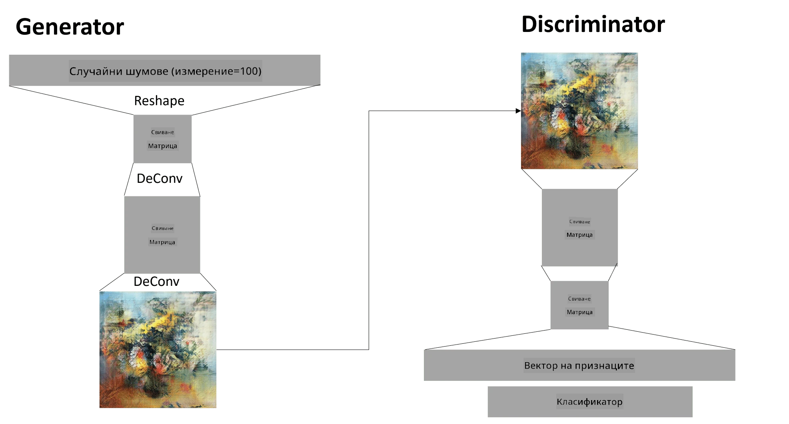

# Генеративни състезателни мрежи

В предишния раздел научихме за **генеративните модели**: модели, които могат да генерират нови изображения, подобни на тези в тренировъчния набор от данни. VAE беше добър пример за генеративен модел.

## [Тест преди лекцията](https://ff-quizzes.netlify.app/en/ai/quiz/19)

Въпреки това, ако се опитаме да генерираме нещо наистина значимо, като картина с разумна резолюция, използвайки VAE, ще видим, че обучението не се конвергира добре. За този случай трябва да научим за друга архитектура, специално насочена към генеративни модели - **Генеративни състезателни мрежи**, или GANs.

Основната идея на GAN е да има две невронни мрежи, които се обучават една срещу друга:

> Изображение от [Dmitry Soshnikov](http://soshnikov.com)

> ✅ Малко речник:
> * **Генератор** е мрежа, която взема произволен вектор и произвежда изображение като резултат
> * **Дискриминатор** е мрежа, която взема изображение и трябва да определи дали е истинско изображение (от тренировъчния набор от данни) или е генерирано от генератора. По същество това е класификатор на изображения.

### Дискриминатор

Архитектурата на дискриминатора не се различава от обикновена мрежа за класификация на изображения. В най-простия случай може да бъде напълно свързан класификатор, но най-вероятно ще бъде [конволюционна мрежа](../07-ConvNets/README.md).

> ✅ GAN, базиран на конволюционни мрежи, се нарича [DCGAN](https://arxiv.org/pdf/1511.06434.pdf)

Конволюционният дискриминатор се състои от следните слоеве: няколко конволюции+пулинги (с намаляващ пространствен размер) и един или повече напълно свързани слоя за получаване на "вектор на характеристиките", финален бинарен класификатор.

> ✅ "Пулинг" в този контекст е техника, която намалява размера на изображението. "Пулинг слоевете намаляват размерите на данните, като комбинират изходите на клъстери от неврони в един слой в един неврон в следващия слой." - [източник](https://wikipedia.org/wiki/Convolutional_neural_network#Pooling_layers)

### Генератор

Генераторът е малко по-сложен. Можете да го разглеждате като обърнат дискриминатор. Започвайки от латентен вектор (вместо вектор на характеристиките), той има напълно свързан слой, който го преобразува в необходимия размер/форма, последван от деконволюции+увеличаване на мащаба. Това е подобно на *декодиращата* част на [автокодировач](../09-Autoencoders/README.md).

> ✅ Тъй като конволюционният слой се реализира като линеен филтър, който преминава през изображението, деконволюцията е по същество подобна на конволюцията и може да бъде реализирана с помощта на същата логика на слоя.

> Изображение от [Dmitry Soshnikov](http://soshnikov.com)

### Обучение на GAN

GANs се наричат **състезателни**, защото има постоянна конкуренция между генератора и дискриминатора. По време на тази конкуренция и генераторът, и дискриминаторът се подобряват, като по този начин мрежата се учи да произвежда все по-добри изображения.

Обучението се извършва в два етапа:

* **Обучение на дискриминатора**. Тази задача е доста проста: генерираме партида изображения чрез генератора, като ги маркираме с 0, което означава фалшиво изображение, и вземаме партида изображения от входния набор от данни (с етикет 1, истинско изображение). Получаваме някаква *загуба на дискриминатора* и извършваме обратното разпространение.
* **Обучение на генератора**. Това е малко по-сложно, защото не знаем очаквания изход за генератора директно. Взимаме цялата GAN мрежа, състояща се от генератор, последван от дискриминатор, подаваме й някои случайни вектори и очакваме резултатът да бъде 1 (съответстващ на истински изображения). След това замразяваме параметрите на дискриминатора (не искаме той да бъде обучаван на този етап) и извършваме обратното разпространение.

По време на този процес загубите на генератора и дискриминатора не намаляват значително. В идеалния случай те трябва да осцилират, което съответства на подобряване на производителността и на двете мрежи.

## ✍️ Упражнения: GANs

* [Тетрадка за GAN в TensorFlow/Keras](GANTF.ipynb)
* [Тетрадка за GAN в PyTorch](GANPyTorch.ipynb)

### Проблеми при обучението на GAN

GANs са известни с това, че са особено трудни за обучение. Ето някои проблеми:

* **Колапс на режима**. С този термин имаме предвид, че генераторът се научава да произвежда едно успешно изображение, което заблуждава дискриминатора, вместо разнообразие от различни изображения.
* **Чувствителност към хиперпараметри**. Често можете да видите, че GAN изобщо не се конвергира, а след това внезапно намаляване на скоростта на обучение води до конвергенция.
* Поддържане на **баланс** между генератора и дискриминатора. В много случаи загубата на дискриминатора може да спадне до нула сравнително бързо, което води до невъзможност на генератора да продължи обучението. За да преодолеем това, можем да опитаме да зададем различни скорости на обучение за генератора и дискриминатора или да пропуснем обучението на дискриминатора, ако загубата вече е твърде ниска.
* Обучение за **висока резолюция**. Отразявайки същия проблем като при автокодировачите, този проблем се предизвиква, защото реконструирането на твърде много слоеве от конволюционната мрежа води до артефакти. Този проблем обикновено се решава с така нареченото **прогресивно нарастване**, когато първо няколко слоя се обучават върху изображения с ниска резолюция, а след това слоевете се "отблокират" или добавят. Друго решение би било добавянето на допълнителни връзки между слоевете и обучението на няколко резолюции едновременно - вижте тази [статия за Multi-Scale Gradient GANs](https://arxiv.org/abs/1903.06048) за подробности.

## Прехвърляне на стил

GANs са чудесен начин за генериране на художествени изображения. Друга интересна техника е така нареченото **прехвърляне на стил**, което взема едно **съдържателно изображение** и го прерисува в различен стил, прилагайки филтри от **стилово изображение**.

Как работи това:

* Започваме с произволно шумово изображение (или със съдържателно изображение, но за по-лесно разбиране е по-добре да започнем с произволен шум)
* Нашата цел е да създадем такова изображение, което да бъде близко както до съдържателното изображение, така и до стиловото изображение. Това се определя от две функции за загуба:
   - **Загуба на съдържание** се изчислява въз основа на характеристиките, извлечени от CNN на някои слоеве от текущото изображение и съдържателното изображение
   - **Загуба на стил** се изчислява между текущото изображение и стиловото изображение по хитър начин, използвайки матрици на Грам (повече подробности в [примерната тетрадка](StyleTransfer.ipynb))
* За да направим изображението по-гладко и да премахнем шума, въвеждаме и **Загуба на вариация**, която изчислява средното разстояние между съседни пиксели
* Основният оптимизационен цикъл коригира текущото изображение, използвайки градиентен спуск (или някакъв друг оптимизационен алгоритъм), за да минимизира общата загуба, която е претеглена сума от всички три загуби.

## ✍️ Пример: [Прехвърляне на стил](StyleTransfer.ipynb)

## [Тест след лекцията](https://ff-quizzes.netlify.app/en/ai/quiz/20)

## Заключение

В този урок научихте за GANs и как да ги обучавате. Също така научихте за специалните предизвикателства, пред които този тип невронни мрежи може да се изправи, и някои стратегии за преодоляването им.

## 🚀 Предизвикателство

Прегледайте [тетрадката за прехвърляне на стил](StyleTransfer.ipynb), използвайки свои собствени изображения.

## Преглед и самостоятелно обучение

За справка, прочетете повече за GANs в тези ресурси:

* Marco Pasini, [10 урока, които научих, обучавайки GANs за една година](https://towardsdatascience.com/10-lessons-i-learned-training-generative-adversarial-networks-gans-for-a-year-c9071159628)
* [StyleGAN](https://en.wikipedia.org/wiki/StyleGAN), *де факто* архитектура на GAN, която да разгледате
* [Създаване на генеративно изкуство с помощта на GANs в Azure ML](https://soshnikov.com/scienceart/creating-generative-art-using-gan-on-azureml/)

## Задание

Прегледайте една от двете тетрадки, свързани с този урок, и обучете GAN върху свои собствени изображения. Какво можете да създадете?

---

