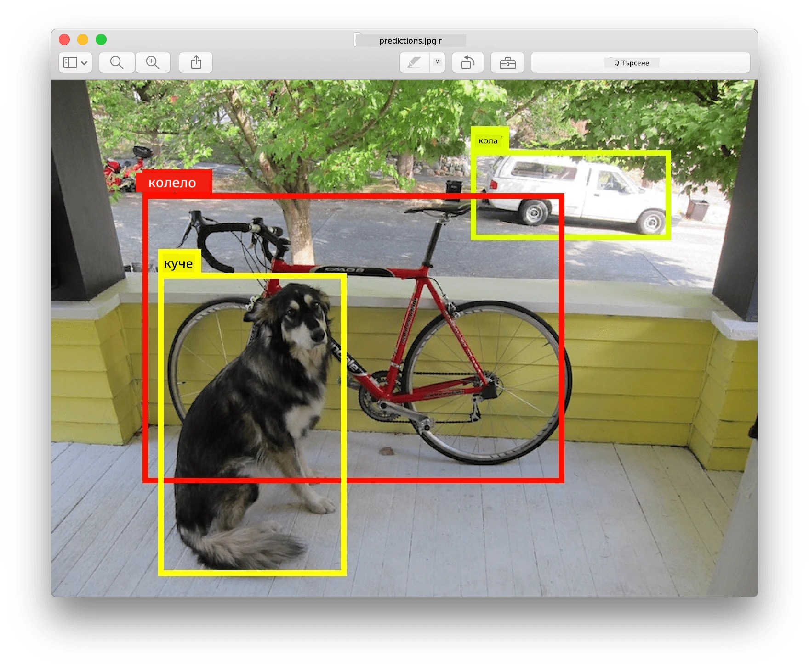
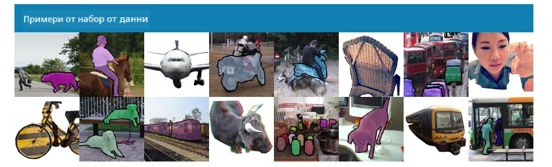
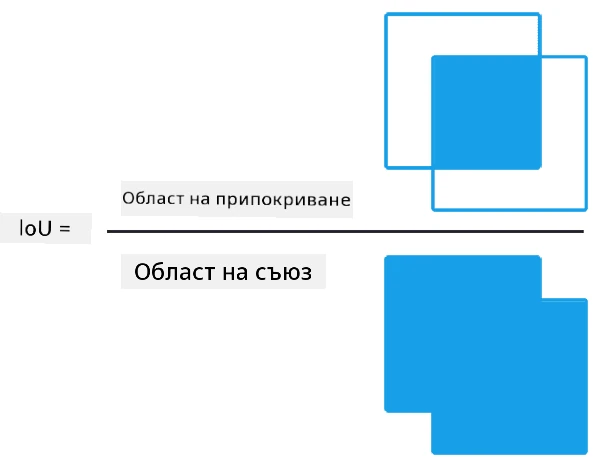
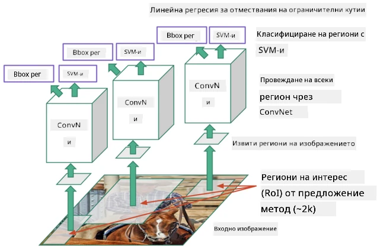
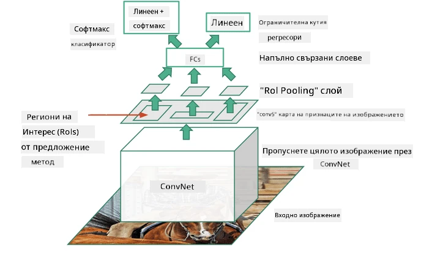
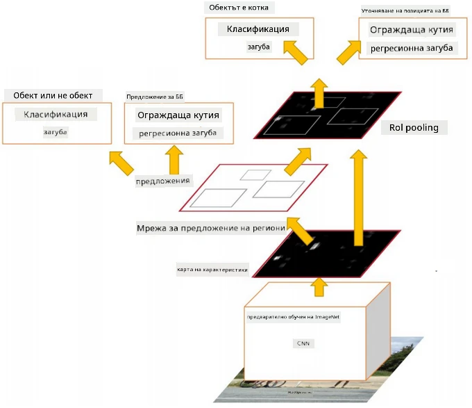
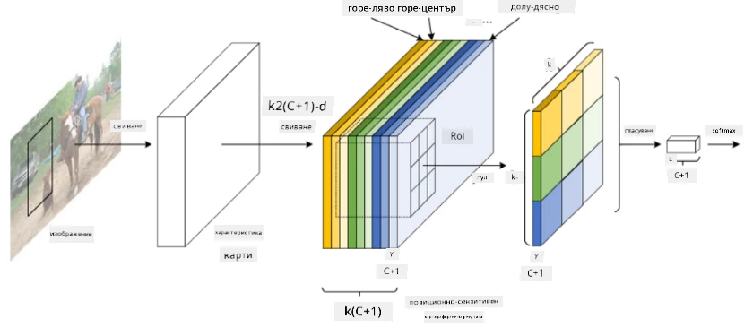
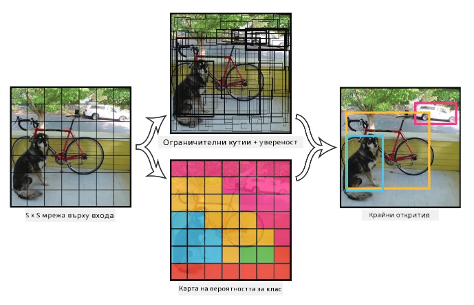

# Разпознаване на обекти

Моделите за класификация на изображения, с които сме работили досега, приемат изображение и произвеждат категоричен резултат, като например класа "число" в проблема MNIST. Въпреки това, в много случаи не искаме просто да знаем, че дадена снимка изобразява обекти - искаме да можем да определим тяхното точно местоположение. Именно това е целта на **разпознаването на обекти**.

## [Тест преди лекцията](https://ff-quizzes.netlify.app/en/ai/quiz/21)

> Изображение от [уебсайта на YOLO v2](https://pjreddie.com/darknet/yolov2/)

## Наивен подход към разпознаване на обекти

Ако искахме да намерим котка на снимка, един много наивен подход към разпознаването на обекти би бил следният:

1. Разделяме снимката на множество малки части.
2. Извършваме класификация на изображения върху всяка част.
3. Тези части, които водят до достатъчно висока активация, могат да се считат за съдържащи търсения обект.

> *Изображение от [тетрадката с упражнения](ObjectDetection-TF.ipynb)*

Този подход обаче е далеч от идеален, защото позволява на алгоритъма да локализира рамката на обекта много неточно. За по-прецизно местоположение трябва да използваме някакъв вид **регресия**, за да предвидим координатите на рамките - и за това ни трябват специфични набори от данни.

## Регресия за разпознаване на обекти

[Тази публикация в блог](https://towardsdatascience.com/object-detection-with-neural-networks-a4e2c46b4491) предлага чудесно въведение в разпознаването на форми.

## Набори от данни за разпознаване на обекти

Може да срещнете следните набори от данни за тази задача:

* [PASCAL VOC](http://host.robots.ox.ac.uk/pascal/VOC/) - 20 класа
* [COCO](http://cocodataset.org/#home) - Общи обекти в контекст. 80 класа, рамки и маски за сегментация

## Метрики за разпознаване на обекти

### Пресечна площ спрямо обединение (Intersection over Union)

Докато за класификация на изображения е лесно да се измери колко добре се представя алгоритъмът, за разпознаване на обекти трябва да измерим както коректността на класа, така и прецизността на местоположението на предвидената рамка. За последното използваме така наречената **Пресечна площ спрямо обединение** (IoU), която измерва колко добре се припокриват две рамки (или две произволни области).

> *Фигура 2 от [този отличен блог пост за IoU](https://pyimagesearch.com/2016/11/07/intersection-over-union-iou-for-object-detection/)*

Идеята е проста - разделяме площта на пресечната област между две фигури на площта на тяхното обединение. За две идентични области IoU ще бъде 1, докато за напълно несвързани области ще бъде 0. В противен случай ще варира от 0 до 1. Обикновено разглеждаме само тези рамки, за които IoU е над определена стойност.

### Средна прецизност (Average Precision)

Да предположим, че искаме да измерим колко добре се разпознава даден клас обекти $C$. За да го измерим, използваме метриката **Средна прецизност**, която се изчислява по следния начин:

1. Разглеждаме кривата Прецизност-Съответствие, която показва точността в зависимост от стойността на прага за разпознаване (от 0 до 1).
2. В зависимост от прага ще получим повече или по-малко разпознати обекти в изображението и различни стойности на прецизност и съответствие.
3. Кривата ще изглежда така:

> *Изображение от [NeuroWorkshop](http://github.com/shwars/NeuroWorkshop)*

Средната прецизност за даден клас $C$ е площта под тази крива. По-точно, оста на съответствието обикновено се разделя на 10 части, а прецизността се усреднява върху всички тези точки:

$$
AP = {1\over11}\sum_{i=0}^{10}\mbox{Precision}(\mbox{Recall}={i\over10})
$$

### AP и IoU

Разглеждаме само тези разпознавания, за които IoU е над определена стойност. Например, в набора от данни PASCAL VOC обикновено се приема $\mbox{IoU Threshold} = 0.5$, докато в COCO AP се измерва за различни стойности на $\mbox{IoU Threshold}$.

> *Изображение от [NeuroWorkshop](http://github.com/shwars/NeuroWorkshop)*

### Средна средна прецизност - mAP

Основната метрика за разпознаване на обекти се нарича **Средна средна прецизност**, или **mAP**. Това е стойността на Средната прецизност, усреднена за всички класове обекти, а понякога и за $\mbox{IoU Threshold}$. По-подробно процесът на изчисляване на **mAP** е описан
[в този блог пост](https://medium.com/@timothycarlen/understanding-the-map-evaluation-metric-for-object-detection-a07fe6962cf3)), както и [тук с примери за код](https://gist.github.com/tarlen5/008809c3decf19313de216b9208f3734).

## Различни подходи за разпознаване на обекти

Съществуват два основни класа алгоритми за разпознаване на обекти:

* **Мрежи за предложения на региони** (R-CNN, Fast R-CNN, Faster R-CNN). Основната идея е да се генерират **Региони от интерес** (ROI) и да се изпълни CNN върху тях, търсейки максимална активация. Това е малко подобно на наивния подход, с изключение на това, че ROI се генерират по по-умел начин. Един от основните недостатъци на тези методи е, че са бавни, защото изискват множество преминавания на CNN класификатора върху изображението.
* **Еднократни** (YOLO, SSD, RetinaNet) методи. В тези архитектури мрежата е проектирана да предсказва както класовете, така и ROI в едно преминаване.

### R-CNN: CNN, базирана на региони

[R-CNN](http://islab.ulsan.ac.kr/files/announcement/513/rcnn_pami.pdf) използва [Selective Search](http://www.huppelen.nl/publications/selectiveSearchDraft.pdf), за да генерира йерархична структура от региони ROI, които след това се обработват чрез CNN екстрактори на характеристики и SVM-класификатори, за да се определи класът на обекта, и линейна регресия за определяне на координатите на *рамката*. [Официална статия](https://arxiv.org/pdf/1506.01497v1.pdf)

> *Изображение от van de Sande et al. ICCV’11*

> *Изображения от [този блог](https://towardsdatascience.com/r-cnn-fast-r-cnn-faster-r-cnn-yolo-object-detection-algorithms-36d53571365e)

### F-RCNN - Бърза R-CNN

Този подход е подобен на R-CNN, но регионите се определят след прилагане на слоевете за конволюция.

> Изображение от [официалната статия](https://www.cv-foundation.org/openaccess/content_iccv_2015/papers/Girshick_Fast_R-CNN_ICCV_2015_paper.pdf), [arXiv](https://arxiv.org/pdf/1504.08083.pdf), 2015

### Faster R-CNN

Основната идея на този подход е да се използва невронна мрежа за предсказване на ROI - така наречената *Мрежа за предложения на региони*. [Статия](https://arxiv.org/pdf/1506.01497.pdf), 2016

> Изображение от [официалната статия](https://arxiv.org/pdf/1506.01497.pdf)

### R-FCN: Напълно конволюционна мрежа, базирана на региони

Този алгоритъм е дори по-бърз от Faster R-CNN. Основната идея е следната:

1. Извличаме характеристики с помощта на ResNet-101.
2. Характеристиките се обработват от **Position-Sensitive Score Map**. Всеки обект от $C$ класове се разделя на $k\times k$ региони, и обучаваме мрежата да предсказва части от обекти.
3. За всяка част от $k\times k$ региони всички мрежи гласуват за класовете на обектите, и класът с максимален брой гласове се избира.

> Изображение от [официалната статия](https://arxiv.org/abs/1605.06409)

### YOLO - You Only Look Once

YOLO е алгоритъм за разпознаване в реално време с едно преминаване. Основната идея е следната:

 * Изображението се разделя на $S\times S$ региони.
 * За всеки регион **CNN** предсказва $n$ възможни обекти, координати на *рамката* и *увереност*=*вероятност* * IoU.

 

> Изображение от [официалната статия](https://arxiv.org/abs/1506.02640)

### Други алгоритми

* RetinaNet: [официална статия](https://arxiv.org/abs/1708.02002)
   - [PyTorch имплементация в Torchvision](https://pytorch.org/vision/stable/_modules/torchvision/models/detection/retinanet.html)
   - [Keras имплементация](https://github.com/fizyr/keras-retinanet)
   - [Разпознаване на обекти с RetinaNet](https://keras.io/examples/vision/retinanet/) в примери на Keras
* SSD (Single Shot Detector): [официална статия](https://arxiv.org/abs/1512.02325)

## ✍️ Упражнения: Разпознаване на обекти

Продължете обучението си в следната тетрадка:

[ObjectDetection.ipynb](ObjectDetection.ipynb)

## Заключение

В този урок направихте бърз преглед на различните начини за разпознаване на обекти!

## 🚀 Предизвикателство

Прочетете тези статии и тетрадки за YOLO и опитайте сами:

* [Добър блог пост](https://www.analyticsvidhya.com/blog/2018/12/practical-guide-object-detection-yolo-framewor-python/) описващ YOLO
 * [Официален сайт](https://pjreddie.com/darknet/yolo/)
 * Yolo: [Keras имплементация](https://github.com/experiencor/keras-yolo2), [тетрадка стъпка по стъпка](https://github.com/experiencor/basic-yolo-keras/blob/master/Yolo%20Step-by-Step.ipynb)
 * Yolo v2: [Keras имплементация](https://github.com/experiencor/keras-yolo2), [тетрадка стъпка по стъпка](https://github.com/experiencor/keras-yolo2/blob/master/Yolo%20Step-by-Step.ipynb)

## [Тест след лекцията](https://ff-quizzes.netlify.app/en/ai/quiz/22)

## Преглед и самостоятелно обучение

* [Разпознаване на обекти](https://tjmachinelearning.com/lectures/1718/obj/) от Нихил Сардана
* [Добро сравнение на алгоритми за разпознаване на обекти](https://lilianweng.github.io/lil-log/2018/12/27/object-detection-part-4.html)
* [Преглед на алгоритми за дълбоко обучение за разпознаване на обекти](https://medium.com/comet-app/review-of-deep-learning-algorithms-for-object-detection-c1f3d437b852)
* [Въведение стъпка по стъпка в основните алгоритми за разпознаване на обекти](https://www.analyticsvidhya.com/blog/2018/10/a-step-by-step-introduction-to-the-basic-object-detection-algorithms-part-1/)
* [Имплементация на Faster R-CNN в Python за разпознаване на обекти](https://www.analyticsvidhya.com/blog/2018/11/implementation-faster-r-cnn-python-object-detection/)

## [Задание: Разпознаване на обекти](lab/README.md)

---

