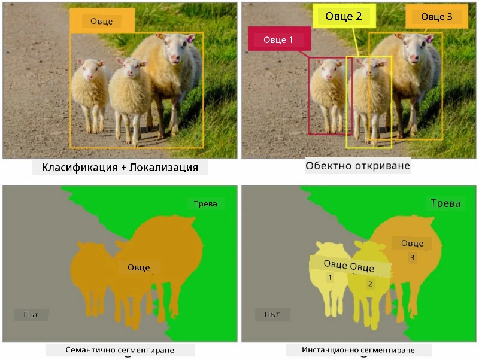
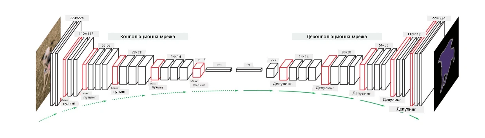
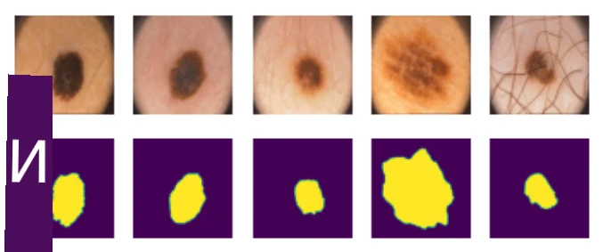

# Сегментация

По-рано научихме за Обектно откриване, което ни позволява да локализираме обекти в изображението чрез предсказване на техните *ограничителни кутии*. Въпреки това, за някои задачи не са достатъчни само ограничителните кутии, а е необходима по-прецизна локализация на обектите. Тази задача се нарича **сегментация**.

## [Тест преди лекцията](https://ff-quizzes.netlify.app/en/ai/quiz/23)

Сегментацията може да се разглежда като **класификация на пиксели**, при която за **всеки** пиксел от изображението трябва да предскажем неговия клас (*фонът* е един от класовете). Съществуват два основни алгоритъма за сегментация:

* **Семантична сегментация** само определя класа на пиксела, без да прави разлика между различни обекти от същия клас.
* **Сегментация на обекти** разделя класовете на отделни екземпляри.

При сегментация на обекти тези овце са различни обекти, но при семантична сегментация всички овце са представени като един клас.

> Изображение от [този блог пост](https://nirmalamurali.medium.com/image-classification-vs-semantic-segmentation-vs-instance-segmentation-625c33a08d50)

Съществуват различни невронни архитектури за сегментация, но всички те имат една и съща структура. В известен смисъл, тя е подобна на автоенкодера, за който научихте по-рано, но вместо да деконструираме оригиналното изображение, целта ни е да деконструираме **маска**. Следователно, мрежата за сегментация има следните части:

* **Енкодер** извлича характеристики от входното изображение.
* **Декодер** преобразува тези характеристики в **маска изображение**, със същия размер и брой канали, съответстващи на броя на класовете.

> Изображение от [тази публикация](https://arxiv.org/pdf/2001.05566.pdf)

Особено важно е да споменем функцията за загуба, която се използва за сегментация. При използване на класически автоенкодери трябва да измерим сходството между две изображения и можем да използваме средноквадратична грешка (MSE) за това. При сегментация всеки пиксел в целевото маска изображение представлява номер на клас (едно-горещо кодиран по третото измерение), така че трябва да използваме функции за загуба, специфични за класификация - кръстосана ентропия, осреднена за всички пиксели. Ако маската е бинарна - се използва **бинарна кръстосана ентропия** (BCE).

> ✅ Едно-горещо кодиране е начин за кодиране на етикет на клас в вектор с дължина, равна на броя на класовете. Вижте [тази статия](https://datagy.io/sklearn-one-hot-encode/) за тази техника.

## Сегментация за медицински изображения

В този урок ще видим сегментацията в действие, като обучим мрежа да разпознава човешки невуси (известни още като бенки) върху медицински изображения. Ще използваме <a href="https://www.fc.up.pt/addi/ph2%20database.html">PH2 Database</a> от дермоскопски изображения като източник на изображения. Този набор от данни съдържа 200 изображения от три класа: типичен невус, атипичен невус и меланом. Всички изображения също съдържат съответстваща **маска**, която очертава невуса.

> ✅ Тази техника е особено подходяща за този тип медицински изображения, но какви други реални приложения можете да си представите?

> Изображение от PH2 Database

Ще обучим модел да сегментира всеки невус от неговия фон.

## ✍️ Упражнения: Семантична сегментация

Отворете долупосочените тетрадки, за да научите повече за различни архитектури за семантична сегментация, да практикувате работа с тях и да ги видите в действие.

* [Semantic Segmentation Pytorch](SemanticSegmentationPytorch.ipynb)
* [Semantic Segmentation TensorFlow](SemanticSegmentationTF.ipynb)

## [Тест след лекцията](https://ff-quizzes.netlify.app/en/ai/quiz/24)

## Заключение

Сегментацията е много мощна техника за класификация на изображения, преминавайки отвъд ограничителните кутии към класификация на ниво пиксел. Това е техника, използвана в медицински изображения, наред с други приложения.

## 🚀 Предизвикателство

Сегментацията на тяло е само една от често срещаните задачи, които можем да изпълняваме с изображения на хора. Други важни задачи включват **откриване на скелет** и **откриване на поза**. Опитайте библиотеката [OpenPose](https://github.com/CMU-Perceptual-Computing-Lab/openpose), за да видите как откриването на поза може да бъде използвано.

## Преглед и самостоятелно обучение

Тази [статия в Wikipedia](https://wikipedia.org/wiki/Image_segmentation) предлага добър преглед на различните приложения на тази техника. Научете повече самостоятелно за поддомените на сегментация на обекти и паноптична сегментация в тази област на изследване.

## [Задание](lab/README.md)

В тази лаборатория опитайте **сегментация на човешко тяло** с помощта на [Segmentation Full Body MADS Dataset](https://www.kaggle.com/datasets/tapakah68/segmentation-full-body-mads-dataset) от Kaggle.

---

