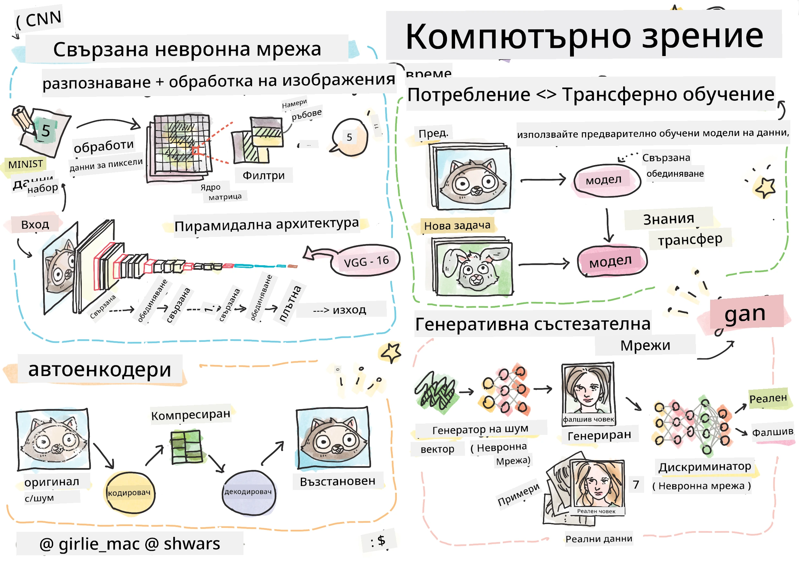

# Компютърно зрение

В тази секция ще научим за:

* [Въведение в компютърното зрение и OpenCV](06-IntroCV/README.md)
* [Конволюционни невронни мрежи](07-ConvNets/README.md)
* [Предварително обучени мрежи и трансферно обучение](08-TransferLearning/README.md) 
* [Автокодери](09-Autoencoders/README.md)
* [Генеративни състезателни мрежи](10-GANs/README.md)
* [Откриване на обекти](11-ObjectDetection/README.md)
* [Семантично сегментиране](12-Segmentation/README.md)

**Отказ от отговорност**:  
Този документ е преведен с помощта на AI услуга за превод [Co-op Translator](https://github.com/Azure/co-op-translator). Въпреки че се стремим към точност, моля, имайте предвид, че автоматизираните преводи може да съдържат грешки или неточности. Оригиналният документ на неговия роден език трябва да се счита за авторитетен източник. За критична информация се препоръчва професионален човешки превод. Не носим отговорност за недоразумения или погрешни интерпретации, произтичащи от използването на този превод.