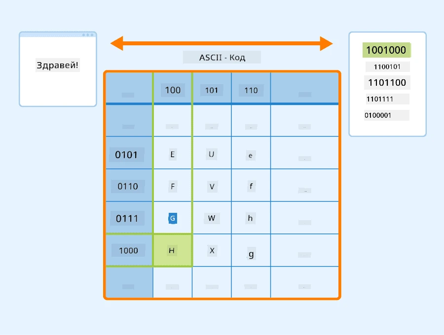
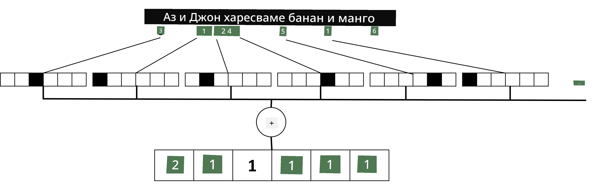

# Представяне на текст като тензори

## [Тест преди лекцията](https://ff-quizzes.netlify.app/en/ai/quiz/25)

## Класификация на текст

През първата част на този раздел ще се фокусираме върху задачата за **класификация на текст**. Ще използваме набора от данни [AG News](https://www.kaggle.com/amananandrai/ag-news-classification-dataset), който съдържа новинарски статии като следната:

* Категория: Наука/Технологии  
* Заглавие: Ky. Company Wins Grant to Study Peptides (AP)  
* Текст: AP - Компания, основана от изследовател по химия в Университета на Луисвил, спечели грант за разработване...

Нашата цел ще бъде да класифицираме новинарската статия в една от категориите въз основа на текста.

## Представяне на текст

Ако искаме да решаваме задачи за обработка на естествен език (NLP) с невронни мрежи, трябва да намерим начин да представим текста като тензори. Компютрите вече представят текстовите символи като числа, които се свързват с шрифтове на екрана ви, използвайки кодировки като ASCII или UTF-8.

> [Източник на изображението](https://www.seobility.net/en/wiki/ASCII)

Като хора, ние разбираме какво **представлява** всяка буква и как всички символи се съчетават, за да образуват думите в едно изречение. Въпреки това, компютрите сами по себе си нямат такова разбиране, а невронната мрежа трябва да научи значението по време на обучението.

Затова можем да използваме различни подходи за представяне на текст:

* **Представяне на ниво символи**, когато представяме текста, като третираме всеки символ като число. Ако имаме *C* различни символи в нашия текстов корпус, думата *Hello* ще бъде представена като тензор с размер 5x*C*. Всеки символ ще съответства на колона в тензора, използвайки one-hot кодиране.  
* **Представяне на ниво думи**, при което създаваме **речник** на всички думи в текста и след това представяме думите чрез one-hot кодиране. Този подход е донякъде по-добър, защото всяка буква сама по себе си няма голямо значение, и така чрез използване на по-високи семантични концепции - думи - опростяваме задачата за невронната мрежа. Въпреки това, поради големия размер на речника, трябва да се справим с високодименсионни разредени тензори.

Независимо от представянето, първо трябва да преобразуваме текста в последователност от **токени**, като един токен може да бъде символ, дума или дори част от дума. След това преобразуваме токена в число, обикновено използвайки **речник**, и това число може да бъде подадено в невронна мрежа чрез one-hot кодиране.

## N-грамове

В естествения език точният смисъл на думите може да бъде определен само в контекст. Например, значенията на *невронна мрежа* и *рибарска мрежа* са напълно различни. Един от начините да вземем това предвид е да изградим модела си върху двойки думи, като разглеждаме двойките думи като отделни токени в речника. По този начин изречението *Обичам да ходя на риболов* ще бъде представено чрез следната последователност от токени: *Обичам да*, *да ходя*, *ходя на*, *на риболов*. Проблемът с този подход е, че размерът на речника нараства значително, а комбинации като *на риболов* и *на пазар* се представят чрез различни токени, които не споделят никаква семантична прилика, въпреки че съдържат същия глагол.

В някои случаи можем да разгледаме използването на триграми - комбинации от три думи - също. Затова този подход често се нарича **n-грамове**. Също така има смисъл да използваме n-грамове с представяне на ниво символи, при което n-грамовете приблизително съответстват на различни срички.

## Bag-of-Words и TF/IDF

Когато решаваме задачи като класификация на текст, трябва да можем да представим текста чрез един фиксиран вектор, който ще използваме като вход за крайния плътен класификатор. Един от най-простите начини да направим това е да комбинираме всички индивидуални представяния на думи, например чрез тяхното събиране. Ако съберем one-hot кодировките на всяка дума, ще получим вектор на честотите, показващ колко пъти всяка дума се появява в текста. Такова представяне на текста се нарича **чанта с думи** (BoW).

> Изображение от автора

BoW по същество представя кои думи се появяват в текста и в какви количества, което може да бъде добър показател за съдържанието на текста. Например, новинарска статия за политика вероятно ще съдържа думи като *президент* и *държава*, докато научна публикация би имала нещо като *колайдер*, *откритие* и т.н. Така честотите на думите могат в много случаи да бъдат добър индикатор за съдържанието на текста.

Проблемът с BoW е, че определени често срещани думи, като *и*, *е* и т.н., се появяват в повечето текстове и имат най-високи честоти, като засенчват думите, които наистина са важни. Можем да намалим значимостта на тези думи, като вземем предвид честотата, с която думите се появяват в цялата колекция от документи. Това е основната идея зад подхода TF/IDF, който е разгледан по-подробно в приложените към този урок тетрадки.

Въпреки това, нито един от тези подходи не може напълно да вземе предвид **семантиката** на текста. За това са ни необходими по-мощни модели на невронни мрежи, които ще обсъдим по-късно в този раздел.

## ✍️ Упражнения: Представяне на текст

Продължете обучението си в следните тетрадки:

* [Представяне на текст с PyTorch](TextRepresentationPyTorch.ipynb)  
* [Представяне на текст с TensorFlow](TextRepresentationTF.ipynb)  

## Заключение

Досега изучихме техники, които могат да добавят тегло на честотата към различни думи. Те обаче не могат да представят значението или реда. Както известният лингвист Дж. Р. Фърт каза през 1935 г., "Пълното значение на една дума винаги е контекстуално, и никакво изследване на значението извън контекста не може да бъде взето на сериозно." По-късно в курса ще научим как да улавяме контекстуална информация от текста чрез моделиране на езика.

## 🚀 Предизвикателство

Опитайте други упражнения, използвайки чанта с думи и различни модели на данни. Може да се вдъхновите от това [състезание в Kaggle](https://www.kaggle.com/competitions/word2vec-nlp-tutorial/overview/part-1-for-beginners-bag-of-words).

## [Тест след лекцията](https://ff-quizzes.netlify.app/en/ai/quiz/26)

## Преглед и самостоятелно обучение

Практикувайте уменията си с техники за текстови вграждания и чанта с думи на [Microsoft Learn](https://docs.microsoft.com/learn/modules/intro-natural-language-processing-pytorch/?WT.mc_id=academic-77998-cacaste)

## [Задание: Тетрадки](assignment.md)

---

