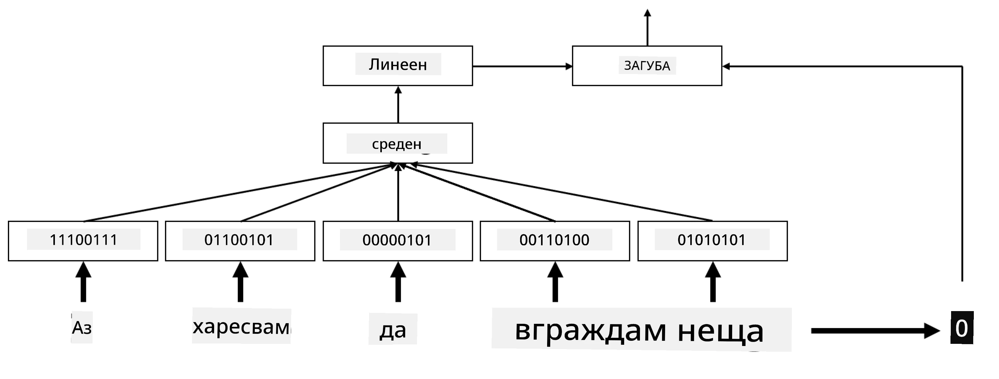
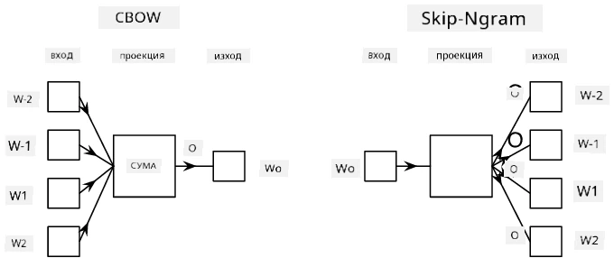

# Вграждания

## [Тест преди лекцията](https://ff-quizzes.netlify.app/en/ai/quiz/27)

Когато обучавахме класификатори, базирани на BoW или TF/IDF, работехме с високодименсионални вектори на чанта от думи с дължина `vocab_size`, като изрично преобразувахме от нискодименсионални позиционни вектори в разредени едноразрядни представяния. Това едноразрядно представяне обаче не е ефективно по отношение на паметта. Освен това, всяка дума се третира независимо от останалите, т.е. едноразрядно кодираните вектори не изразяват никаква семантична прилика между думите.

Идеята на **вгражданията** е да представят думите чрез нискодименсионални плътни вектори, които по някакъв начин отразяват семантичното значение на думата. По-късно ще обсъдим как да изградим смислени вграждания на думи, но засега нека просто мислим за тях като начин за намаляване на размерността на векторите на думите.

Така че, слоят за вграждане ще приема дума като вход и ще произвежда изходен вектор със зададен размер `embedding_size`. В известен смисъл, той е много подобен на слой `Linear`, но вместо да приема едноразряден вектор, ще може да приема номер на дума като вход, което ни позволява да избегнем създаването на големи едноразрядни вектори.

Използвайки слой за вграждане като първи слой в нашата мрежа за класификация, можем да преминем от модел на чанта от думи към модел на **чанта от вграждания**, където първо преобразуваме всяка дума в текста в съответното вграждане и след това изчисляваме някаква агрегираща функция върху всички тези вграждания, като `sum`, `average` или `max`.

> Изображение от автора

## ✍️ Упражнения: Вграждания

Продължете обучението си в следните тетрадки:
* [Вграждания с PyTorch](EmbeddingsPyTorch.ipynb)
* [Вграждания с TensorFlow](EmbeddingsTF.ipynb)

## Семантични вграждания: Word2Vec

Докато слоят за вграждане се научава да картографира думите към векторно представяне, това представяне не е задължително да има много семантично значение. Би било добре да се научи векторно представяне, при което подобни думи или синоними съответстват на вектори, които са близо един до друг според някакво векторно разстояние (например Евклидово разстояние).

За да постигнем това, трябва предварително да обучим модела за вграждане върху голяма колекция от текст по специфичен начин. Един от начините за обучение на семантични вграждания се нарича [Word2Vec](https://en.wikipedia.org/wiki/Word2vec). Той се основава на две основни архитектури, които се използват за създаване на разпределено представяне на думи:

 - **Непрекъсната чанта от думи** (CBoW) — при тази архитектура обучаваме модела да предсказва дума от заобикалящия контекст. Даден n-грам $(W_{-2},W_{-1},W_0,W_1,W_2)$, целта на модела е да предскаже $W_0$ от $(W_{-2},W_{-1},W_1,W_2)$.
 - **Непрекъснат скип-грам** е противоположен на CBoW. Моделът използва заобикалящия прозорец от контекстни думи, за да предскаже текущата дума.

CBoW е по-бърз, докато скип-грам е по-бавен, но се справя по-добре с представянето на редки думи.

> Изображение от [тази статия](https://arxiv.org/pdf/1301.3781.pdf)

Предварително обучените вграждания на Word2Vec (както и други подобни модели, като GloVe) могат също да се използват вместо слой за вграждане в невронни мрежи. Въпреки това, трябва да се справим с речниците, защото речникът, използван за предварително обучение на Word2Vec/GloVe, вероятно се различава от речника в нашия текстов корпус. Разгледайте горните тетрадки, за да видите как този проблем може да бъде решен.

## Контекстуални вграждания

Едно ключово ограничение на традиционните предварително обучени вграждания като Word2Vec е проблемът с разпознаването на значенията на думите в контекст. Докато предварително обучените вграждания могат да уловят част от значението на думите в контекст, всяко възможно значение на дума се кодира в едно и също вграждане. Това може да създаде проблеми в последващите модели, тъй като много думи, като например думата "play", имат различни значения в зависимост от контекста, в който се използват.

Например, думата "play" в тези две различни изречения има доста различно значение:

- Отидох на **постановка** в театъра.
- Джон иска да **играе** с приятелите си.

Предварително обучените вграждания, споменати по-горе, представят и двете значения на думата "play" в едно и също вграждане. За да преодолеем това ограничение, трябва да изградим вграждания, базирани на **езиков модел**, който е обучен върху голям корпус от текст и *знае* как думите могат да се комбинират в различни контексти. Обсъждането на контекстуални вграждания е извън обхвата на този урок, но ще се върнем към тях, когато говорим за езикови модели по-късно в курса.

## Заключение

В този урок открихте как да изграждате и използвате слоеве за вграждане в TensorFlow и PyTorch, за да отразяват по-добре семантичните значения на думите.

## 🚀 Предизвикателство

Word2Vec е използван за някои интересни приложения, включително генериране на текстове на песни и поезия. Разгледайте [тази статия](https://www.politetype.com/blog/word2vec-color-poems), която описва как авторът е използвал Word2Vec за генериране на поезия. Гледайте [това видео от Дан Шифман](https://www.youtube.com/watch?v=LSS_bos_TPI&ab_channel=TheCodingTrain), за да откриете различно обяснение на тази техника. След това опитайте да приложите тези техники върху собствен текстов корпус, може би взет от Kaggle.

## [Тест след лекцията](https://ff-quizzes.netlify.app/en/ai/quiz/28)

## Преглед и самостоятелно обучение

Прочетете тази статия за Word2Vec: [Efficient Estimation of Word Representations in Vector Space](https://arxiv.org/pdf/1301.3781.pdf)

## [Задание: Тетрадки](assignment.md)

---

