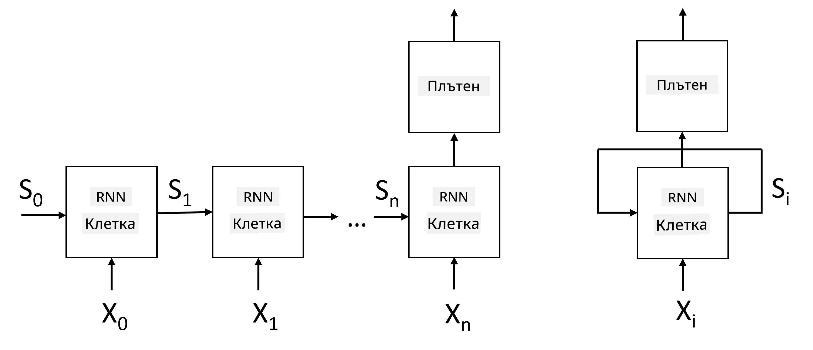
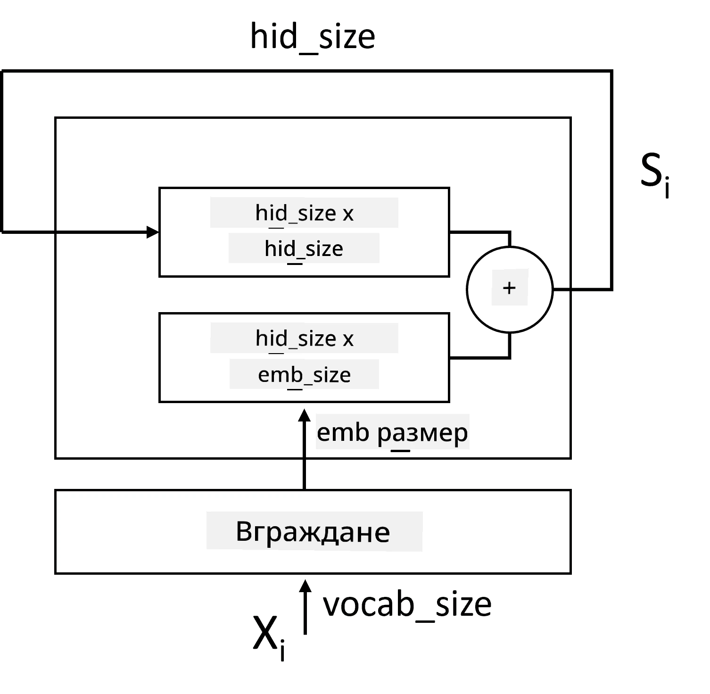
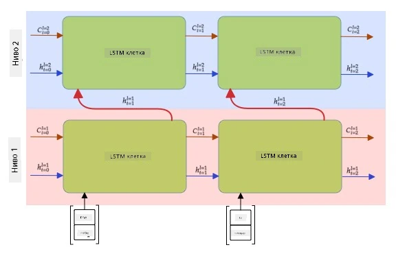

# Рекурентни невронни мрежи

## [Тест преди лекцията](https://ff-quizzes.netlify.app/en/ai/quiz/31)

В предишните секции използвахме богати семантични представяния на текст и прост линеен класификатор върху вгражданията. Тази архитектура улавя обобщеното значение на думите в изречение, но не взема предвид **реда** на думите, защото операцията по агрегиране върху вгражданията премахва тази информация от оригиналния текст. Тъй като тези модели не могат да моделират реда на думите, те не са способни да решават по-сложни или двусмислени задачи като генериране на текст или отговаряне на въпроси.

За да уловим значението на текстовата последователност, трябва да използваме друга архитектура на невронна мрежа, наречена **рекурентна невронна мрежа** или RNN. В RNN подаваме изречението през мрежата символ по символ, а мрежата произвежда някакво **състояние**, което след това подаваме отново на мрежата заедно със следващия символ.

> Изображение от автора

При дадена входна последователност от токени X0,...,Xn, RNN създава последователност от блокове на невронната мрежа и обучава тази последователност от край до край чрез обратното разпространение. Всеки блок на мрежата приема двойка (Xi,Si) като вход и произвежда Si+1 като резултат. Финалното състояние Sn или (изход Yn) се подава на линеен класификатор, за да се произведе резултатът. Всички блокове на мрежата споделят едни и същи тегла и се обучават от край до край чрез един пас на обратното разпространение.

Тъй като векторите на състоянието S0,...,Sn се предават през мрежата, тя може да научи последователните зависимости между думите. Например, когато думата *не* се появи някъде в последователността, мрежата може да научи да отрича определени елементи в състоянието, което води до отрицание.

> ✅ Тъй като теглата на всички блокове на RNN на изображението по-горе са споделени, същото изображение може да бъде представено като един блок (вдясно) с рекурентен обратен цикъл, който предава изходното състояние на мрежата обратно към входа.

## Анатомия на RNN клетка

Нека разгледаме как е организирана една проста RNN клетка. Тя приема предишното състояние Si-1 и текущия символ Xi като входове и трябва да произведе изходното състояние Si (а понякога се интересуваме и от друг изход Yi, както е в случая с генеративните мрежи).

Простата RNN клетка има две матрици на теглата вътре: едната трансформира входния символ (да я наречем W), а другата трансформира входното състояние (H). В този случай изходът на мрежата се изчислява като &sigma;(W&times;Xi+H&times;Si-1+b), където &sigma; е функцията на активация, а b е допълнителен bias.

> Изображение от автора

В много случаи входните токени преминават през слой за вграждане, преди да влязат в RNN, за да се намали размерността. В този случай, ако размерът на входните вектори е *emb_size*, а векторът на състоянието е *hid_size* - размерът на W е *emb_size*&times;*hid_size*, а размерът на H е *hid_size*&times;*hid_size*.

## Дългосрочна краткосрочна памет (LSTM)

Един от основните проблеми на класическите RNN е така нареченият проблем с **изчезващите градиенти**. Тъй като RNN се обучават от край до край в един пас на обратното разпространение, те имат трудности да предават грешката към първите слоеве на мрежата и следователно не могат да научат връзките между отдалечени токени. Един от начините за избягване на този проблем е въвеждането на **експлицитно управление на състоянието** чрез използване на така наречените **врати**. Има две добре познати архитектури от този тип: **Дългосрочна краткосрочна памет** (LSTM) и **Gated Relay Unit** (GRU).

> Източник на изображението TBD

LSTM мрежата е организирана по начин, подобен на RNN, но има две състояния, които се предават от слой на слой: действителното състояние C и скритият вектор H. Във всяка единица скритият вектор Hi се конкатенира с входа Xi, и те контролират какво се случва със състоянието C чрез **врати**. Всяка врата е невронна мрежа със сигмоидна активация (изход в диапазона [0,1]), която може да се разглежда като битова маска, когато се умножи със състоянието. Съществуват следните врати (отляво надясно на изображението по-горе):

* **Вратата за забравяне** приема скрит вектор и определя кои компоненти на вектора C трябва да забравим и кои да предадем.
* **Входната врата** взема информация от входа и скритите вектори и я вмъква в състоянието.
* **Изходната врата** трансформира състоянието чрез линеен слой с *tanh* активация, след което избира някои от неговите компоненти, използвайки скрития вектор Hi, за да произведе ново състояние Ci+1.

Компонентите на състоянието C могат да се разглеждат като флагове, които могат да се включват и изключват. Например, когато срещнем име *Алис* в последователността, можем да предположим, че то се отнася за женски персонаж и да вдигнем флаг в състоянието, че имаме женски съществително в изречението. Когато по-нататък срещнем фразата *и Том*, ще вдигнем флаг, че имаме множествено число. Така чрез манипулиране на състоянието можем да следим граматичните свойства на частите на изречението.

> ✅ Отличен ресурс за разбиране на вътрешната работа на LSTM е тази страхотна статия [Understanding LSTM Networks](https://colah.github.io/posts/2015-08-Understanding-LSTMs/) от Кристофър Олах.

## Двунаправлени и многослойни RNN

Разгледахме рекурентни мрежи, които работят в една посока, от началото на последователността до края. Това изглежда естествено, защото наподобява начина, по който четем и слушаме реч. Въпреки това, тъй като в много практически случаи имаме произволен достъп до входната последователност, може да има смисъл да се извършва рекурентно изчисление и в двете посоки. Такива мрежи се наричат **двунаправлени** RNN. При работа с двунаправлена мрежа ще ни трябват два скрити вектора на състоянието, по един за всяка посока.

Рекурентната мрежа, независимо дали е еднопосочна или двунаправлена, улавя определени модели в рамките на последователността и може да ги съхранява в състоянието или да ги предава като изход. Както при конволюционните мрежи, можем да изградим друг рекурентен слой върху първия, за да уловим модели на по-високо ниво и да изградим от модели на ниско ниво, извлечени от първия слой. Това ни води до понятието за **многослойна RNN**, която се състои от две или повече рекурентни мрежи, където изходът на предишния слой се подава на следващия слой като вход.

*Изображение от [този чудесен пост](https://towardsdatascience.com/from-a-lstm-cell-to-a-multilayer-lstm-network-with-pytorch-2899eb5696f3) от Фернандо Лопес*

## ✍️ Упражнения: Вграждания

Продължете обучението си в следните тетрадки:

* [RNNs с PyTorch](RNNPyTorch.ipynb)
* [RNNs с TensorFlow](RNNTF.ipynb)

## Заключение

В този модул видяхме, че RNN могат да се използват за класификация на последователности, но всъщност те могат да се справят с много повече задачи, като генериране на текст, машинен превод и други. Ще разгледаме тези задачи в следващия модул.

## 🚀 Предизвикателство

Прочетете литература за LSTM и разгледайте техните приложения:

- [Grid Long Short-Term Memory](https://arxiv.org/pdf/1507.01526v1.pdf)
- [Show, Attend and Tell: Neural Image Caption
Generation with Visual Attention](https://arxiv.org/pdf/1502.03044v2.pdf)

## [Тест след лекцията](https://ff-quizzes.netlify.app/en/ai/quiz/32)

## Преглед и самостоятелно обучение

- [Understanding LSTM Networks](https://colah.github.io/posts/2015-08-Understanding-LSTMs/) от Кристофър Олах.

## [Задание: Тетрадки](assignment.md)

---

