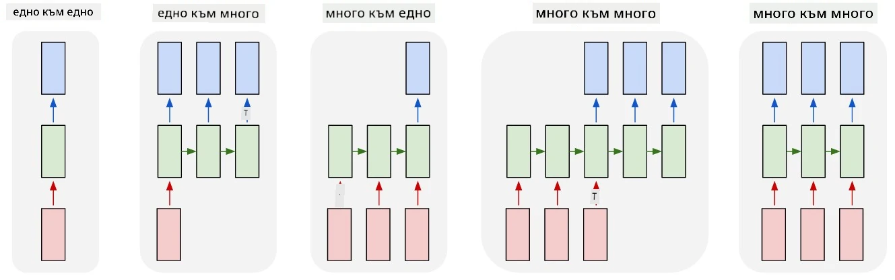
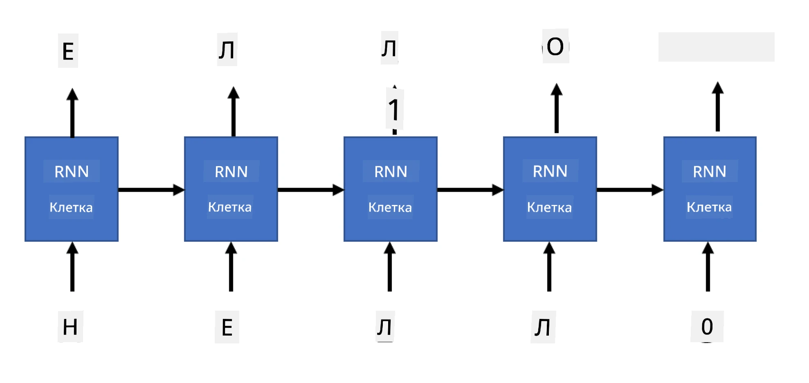

# Генеративни мрежи

## [Тест преди лекцията](https://ff-quizzes.netlify.app/en/ai/quiz/33)

Рекурентните невронни мрежи (RNNs) и техните варианти с гейт клетки, като клетки за дългосрочна памет (LSTMs) и гейт рекурентни единици (GRUs), предоставят механизъм за моделиране на език, тъй като могат да научат реда на думите и да предсказват следващата дума в последователност. Това ни позволява да използваме RNNs за **генеративни задачи**, като обикновено генериране на текст, машинен превод и дори създаване на описания на изображения.

> ✅ Помислете за всички случаи, когато сте се възползвали от генеративни задачи, като например завършване на текст, докато пишете. Направете проучване за любимите си приложения, за да видите дали използват RNNs.

В архитектурата на RNN, която обсъдихме в предишния модул, всяка RNN единица произвежда следващото скрито състояние като изход. Въпреки това, можем да добавим още един изход към всяка рекурентна единица, което би ни позволило да изведем **последователност** (която е равна по дължина на оригиналната последователност). Освен това, можем да използваме RNN единици, които не приемат вход на всяка стъпка, а просто вземат начален вектор на състоянието и след това произвеждат последователност от изходи.

Това позволява различни невронни архитектури, които са показани на изображението по-долу:



> Изображение от блог пост [Unreasonable Effectiveness of Recurrent Neural Networks](http://karpathy.github.io/2015/05/21/rnn-effectiveness/) от [Андрей Карпати](http://karpathy.github.io/)

* **Едно-към-едно** е традиционна невронна мрежа с един вход и един изход.
* **Едно-към-много** е генеративна архитектура, която приема една входна стойност и генерира последователност от изходни стойности. Например, ако искаме да обучим мрежа за **описание на изображения**, която да създава текстово описание на снимка, можем да използваме снимка като вход, да я прекараме през CNN, за да получим скритото й състояние, и след това рекурентна верига да генерира описание дума по дума.
* **Много-към-едно** съответства на архитектурите на RNN, които описахме в предишния модул, като класификация на текст.
* **Много-към-много**, или **последователност-към-последователност**, съответства на задачи като **машинен превод**, където първата RNN събира цялата информация от входната последователност в скритото състояние, а друга RNN верига разгръща това състояние в изходна последователност.

В този модул ще се фокусираме върху прости генеративни модели, които ни помагат да генерираме текст. За простота ще използваме токенизация на ниво символи.

Ще обучим тази RNN да генерира текст стъпка по стъпка. На всяка стъпка ще вземем последователност от символи с дължина `nchars` и ще помолим мрежата да генерира следващия изходен символ за всеки входен символ:



При генериране на текст (по време на инференция) започваме с някакъв **подсказка**, която се предава през RNN клетките, за да генерира междинното си състояние, и след това от това състояние започва генерирането. Генерираме един символ наведнъж и предаваме състоянието и генерирания символ на друга RNN клетка, за да генерира следващия, докато генерираме достатъчно символи.


> Изображение от автора

## ✍️ Упражнения: Генеративни мрежи

Продължете обучението си в следните тетрадки:

* [Генеративни мрежи с PyTorch](GenerativePyTorch.ipynb)
* [Генеративни мрежи с TensorFlow](GenerativeTF.ipynb)

## Меко генериране на текст и температура

Изходът на всяка RNN клетка е вероятностно разпределение на символите. Ако винаги вземаме символа с най-висока вероятност като следващ символ в генерирания текст, текстът често може да стане "цикличен", като се повтарят едни и същи последователности от символи отново и отново, както в този пример:

```
today of the second the company and a second the company ...
```

Въпреки това, ако погледнем вероятностното разпределение за следващия символ, може да се окаже, че разликата между няколко най-високи вероятности не е голяма, например един символ може да има вероятност 0.2, а друг - 0.19 и т.н. Например, когато търсим следващия символ в последователността '*play*', следващият символ може еднакво добре да бъде или интервал, или **e** (както в думата *player*).

Това ни води до заключението, че не винаги е "справедливо" да изберем символа с по-висока вероятност, защото изборът на втория най-висок все още може да доведе до смислен текст. По-разумно е да **извадим проба** от символите от вероятностното разпределение, дадено от изхода на мрежата. Можем също да използваме параметър, **температура**, който ще изглади вероятностното разпределение, ако искаме да добавим повече случайност, или да го направим по-стръмно, ако искаме да се придържаме повече към символите с най-висока вероятност.

Разгледайте как това меко генериране на текст е реализирано в тетрадките, свързани по-горе.

## Заключение

Докато генерирането на текст може да бъде полезно само по себе си, основните предимства идват от способността да се генерира текст с помощта на RNNs от някакъв начален вектор на характеристиките. Например, генерирането на текст се използва като част от машинния превод (последователност-към-последователност, в този случай векторът на състоянието от *кодера* се използва за генериране или *декодиране* на преведеното съобщение) или за генериране на текстово описание на изображение (в този случай векторът на характеристиките идва от CNN екстрактор).

## 🚀 Предизвикателство

Вземете някои уроци в Microsoft Learn по тази тема:

* Генериране на текст с [PyTorch](https://docs.microsoft.com/learn/modules/intro-natural-language-processing-pytorch/6-generative-networks/?WT.mc_id=academic-77998-cacaste)/[TensorFlow](https://docs.microsoft.com/learn/modules/intro-natural-language-processing-tensorflow/5-generative-networks/?WT.mc_id=academic-77998-cacaste)

## [Тест след лекцията](https://ff-quizzes.netlify.app/en/ai/quiz/34)

## Преглед и самостоятелно обучение

Ето някои статии за разширяване на знанията ви:

* Различни подходи за генериране на текст с Марковска верига, LSTM и GPT-2: [блог пост](https://towardsdatascience.com/text-generation-gpt-2-lstm-markov-chain-9ea371820e1e)
* Пример за генериране на текст в [документацията на Keras](https://keras.io/examples/generative/lstm_character_level_text_generation/)

## [Задание](lab/README.md)

Видяхме как да генерираме текст символ по символ. В лабораторията ще изследвате генериране на текст на ниво думи.

---

