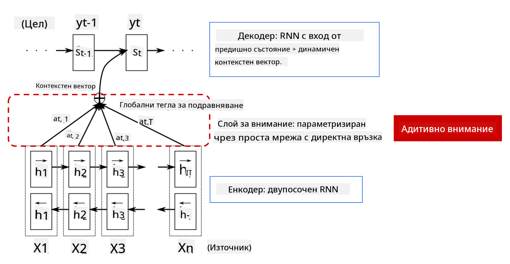
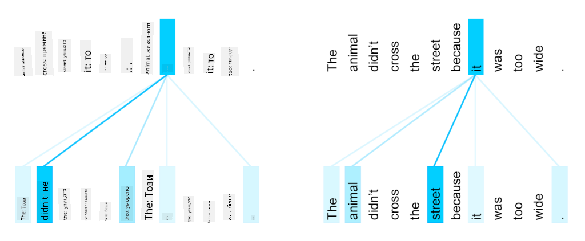

<!--
CO_OP_TRANSLATOR_METADATA:
{
  "original_hash": "7e617f0b8de85a43957a853aba09bfeb",
  "translation_date": "2025-08-25T22:01:50+00:00",
  "source_file": "lessons/5-NLP/18-Transformers/README.md",
  "language_code": "bg"
}
-->
# Механизми за внимание и трансформери

## [Тест преди лекцията](https://red-field-0a6ddfd03.1.azurestaticapps.net/quiz/118)

Един от най-важните проблеми в областта на обработката на естествен език (NLP) е **машинният превод**, основна задача, която стои в основата на инструменти като Google Translate. В този раздел ще се фокусираме върху машинния превод или, по-общо казано, върху всяка задача за *преобразуване на последователности* (която също се нарича **трансдукция на изречения**).

С RNNs, преобразуването на последователности се реализира чрез две рекурентни мрежи, където една мрежа, **кодировачът**, компресира входната последователност в скрито състояние, а друга мрежа, **декодировачът**, разгръща това скрито състояние в преведен резултат. Има няколко проблема с този подход:

* Крайното състояние на кодировачната мрежа трудно запомня началото на изречението, което води до ниско качество на модела за дълги изречения.
* Всички думи в последователността имат еднакво влияние върху резултата. В действителност обаче, специфични думи във входната последователност често имат по-голямо влияние върху изходните последователности от други.

**Механизмите за внимание** предоставят начин за претегляне на контекстуалното влияние на всеки входен вектор върху всяка изходна прогноза на RNN. Това се реализира чрез създаване на преки връзки между междинните състояния на входния RNN и изходния RNN. По този начин, когато генерираме изходен символ yt, ще вземем предвид всички скрити състояния на входа hi, с различни коефициенти на тегло αt,i.

> Моделът кодировач-декодировач с механизъм за добавено внимание в [Bahdanau et al., 2015](https://arxiv.org/pdf/1409.0473.pdf), цитиран от [този блог пост](https://lilianweng.github.io/lil-log/2018/06/24/attention-attention.html)

Матрицата за внимание {αi,j} представлява степента, до която определени входни думи играят роля в генерирането на дадена дума в изходната последователност. По-долу е даден пример за такава матрица:

> Фигура от [Bahdanau et al., 2015](https://arxiv.org/pdf/1409.0473.pdf) (Фиг.3)

Механизмите за внимание са отговорни за голяма част от текущото или почти текущото състояние на изкуството в NLP. Добавянето на внимание обаче значително увеличава броя на параметрите на модела, което води до проблеми със скалирането при RNNs. Основно ограничение при скалирането на RNNs е, че рекурентната природа на моделите прави трудно групирането и паралелизирането на обучението. В RNN всеки елемент от последователността трябва да бъде обработен в последователен ред, което означава, че не може лесно да бъде паралелизиран.

> Фигура от [Google's Blog](https://research.googleblog.com/2016/09/a-neural-network-for-machine.html)

Приемането на механизми за внимание, комбинирано с това ограничение, доведе до създаването на съвременните трансформер модели, които познаваме и използваме днес, като BERT и Open-GPT3.

## Трансформер модели

Една от основните идеи зад трансформерите е да се избегне последователната природа на RNNs и да се създаде модел, който може да бъде паралелизиран по време на обучението. Това се постига чрез реализиране на две идеи:

* позиционно кодиране
* използване на механизъм за самовнимание за улавяне на модели вместо RNNs (или CNNs) (затова статията, която представя трансформерите, се нарича *[Attention is all you need](https://arxiv.org/abs/1706.03762)*)

### Позиционно кодиране/вграждане

Идеята за позиционно кодиране е следната. 
1. При използване на RNNs, относителната позиция на токените се представя чрез броя на стъпките и следователно не е необходимо да бъде изрично представена. 
2. Въпреки това, когато преминем към внимание, трябва да знаем относителните позиции на токените в рамките на последователността. 
3. За да получим позиционно кодиране, допълваме нашата последователност от токени с последователност от позиции на токените в последователността (т.е. последователност от числа 0,1, ...).
4. След това смесваме позицията на токена с вектор за вграждане на токена. За да трансформираме позицията (цяло число) във вектор, можем да използваме различни подходи:

* Обучаемо вграждане, подобно на вграждането на токени. Това е подходът, който разглеждаме тук. Прилагаме слоеве за вграждане както върху токените, така и върху техните позиции, което води до вектори за вграждане със същите размери, които след това събираме.
* Функция за фиксирано позиционно кодиране, както е предложено в оригиналната статия.

> Изображение от автора

Резултатът, който получаваме с позиционното вграждане, включва както оригиналния токен, така и неговата позиция в рамките на последователността.

### Многоглаво самовнимание

След това трябва да уловим някои модели в рамките на нашата последователност. За да направят това, трансформерите използват механизъм за **самовнимание**, който по същество е внимание, приложено към една и съща последователност като вход и изход. Прилагането на самовнимание ни позволява да вземем предвид **контекста** в рамките на изречението и да видим кои думи са взаимосвързани. Например, това ни позволява да видим кои думи се отнасят до кореференции, като *it*, и също така да вземем контекста предвид:

> Изображение от [Google Blog](https://research.googleblog.com/2017/08/transformer-novel-neural-network.html)

В трансформерите използваме **многоглаво внимание**, за да дадем на мрежата възможността да улавя различни типове зависимости, напр. дългосрочни срещу краткосрочни отношения между думи, кореференции срещу нещо друго и т.н.

[TensorFlow Notebook](../../../../../lessons/5-NLP/18-Transformers/TransformersTF.ipynb) съдържа повече подробности за реализацията на слоевете на трансформера.

### Внимание кодировач-декодировач

В трансформерите вниманието се използва на две места:

* За улавяне на модели в рамките на входния текст чрез самовнимание.
* За извършване на превод на последователности - това е слоят за внимание между кодировача и декодировача.

Вниманието кодировач-декодировач е много подобно на механизма за внимание, използван в RNNs, както е описано в началото на този раздел. Тази анимирана диаграма обяснява ролята на вниманието кодировач-декодировач.

Тъй като всяка входна позиция се картографира независимо към всяка изходна позиция, трансформерите могат да се паралелизират по-добре от RNNs, което позволява много по-големи и изразителни езикови модели. Всяка глава за внимание може да се използва за изучаване на различни отношения между думи, което подобрява задачите за обработка на естествен език.

## BERT

**BERT** (Bidirectional Encoder Representations from Transformers) е много голяма многослойна трансформер мрежа с 12 слоя за *BERT-base* и 24 за *BERT-large*. Моделът първо се предварително обучава върху голям корпус от текстови данни (WikiPedia + книги) чрез неуправляемо обучение (предсказване на маскирани думи в изречение). По време на предварителното обучение моделът усвоява значителни нива на разбиране на езика, които след това могат да бъдат използвани с други набори от данни чрез фина настройка. Този процес се нарича **трансферно обучение**.

> Изображение [източник](http://jalammar.github.io/illustrated-bert/)

## ✍️ Упражнения: Трансформери

Продължете обучението си в следните ноутбуци:

* [Трансформери в PyTorch](../../../../../lessons/5-NLP/18-Transformers/TransformersPyTorch.ipynb)
* [Трансформери в TensorFlow](../../../../../lessons/5-NLP/18-Transformers/TransformersTF.ipynb)

## Заключение

В този урок научихте за трансформерите и механизмите за внимание, всички основни инструменти в NLP. Съществуват много вариации на архитектурите на трансформерите, включително BERT, DistilBERT, BigBird, OpenGPT3 и други, които могат да бъдат фино настроени. Пакетът [HuggingFace](https://github.com/huggingface/) предоставя репозитория за обучение на много от тези архитектури както с PyTorch, така и с TensorFlow.

## 🚀 Предизвикателство

## [Тест след лекцията](https://red-field-0a6ddfd03.1.azurestaticapps.net/quiz/218)

## Преглед и самостоятелно обучение

* [Блог пост](https://mchromiak.github.io/articles/2017/Sep/12/Transformer-Attention-is-all-you-need/), обясняващ класическата статия [Attention is all you need](https://arxiv.org/abs/1706.03762) за трансформерите.
* [Серия от блог постове](https://towardsdatascience.com/transformers-explained-visually-part-1-overview-of-functionality-95a6dd460452) за трансформерите, обясняващи архитектурата в детайли.

## [Задание](assignment.md)

**Отказ от отговорност**:  
Този документ е преведен с помощта на AI услуга за превод [Co-op Translator](https://github.com/Azure/co-op-translator). Въпреки че се стремим към точност, моля, имайте предвид, че автоматизираните преводи може да съдържат грешки или неточности. Оригиналният документ на неговия роден език трябва да се счита за авторитетен източник. За критична информация се препоръчва професионален човешки превод. Ние не носим отговорност за каквито и да било недоразумения или погрешни интерпретации, произтичащи от използването на този превод.