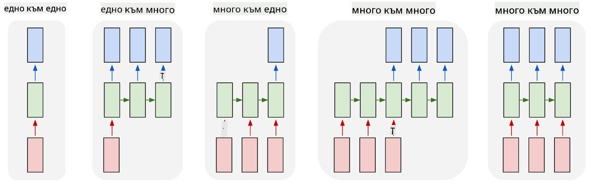

<!--
CO_OP_TRANSLATOR_METADATA:
{
  "original_hash": "bd10f434e444bce61b7f97eeb1ff6a55",
  "translation_date": "2025-08-25T22:11:31+00:00",
  "source_file": "lessons/5-NLP/19-NER/README.md",
  "language_code": "bg"
}
-->
# Разпознаване на именувани обекти

Досега основно се фокусирахме върху една задача в обработката на естествен език (NLP) - класификация. Въпреки това, съществуват и други задачи в NLP, които могат да бъдат изпълнени с помощта на невронни мрежи. Една от тези задачи е **[Разпознаване на именувани обекти](https://wikipedia.org/wiki/Named-entity_recognition)** (NER), която се занимава с разпознаването на специфични обекти в текста, като например места, имена на хора, времеви интервали, химични формули и други.

## [Тест преди лекцията](https://ff-quizzes.netlify.app/en/ai/quiz/37)

## Пример за използване на NER

Да предположим, че искате да разработите чатбот за обработка на естествен език, подобен на Amazon Alexa или Google Assistant. Интелигентните чатботове работят, като *разбират* какво иска потребителят чрез класификация на текста в подаденото изречение. Резултатът от тази класификация е така нареченото **намерение** (intent), което определя какво трябва да направи чатботът.

> Изображение от автора

Въпреки това, потребителят може да предостави някои параметри като част от фразата. Например, когато пита за времето, той може да уточни местоположение или дата. Ботът трябва да може да разбере тези обекти и да попълни съответните параметри, преди да изпълни действието. Именно тук влиза в действие NER.

> ✅ Друг пример би бил [анализ на научни медицински статии](https://soshnikov.com/science/analyzing-medical-papers-with-azure-and-text-analytics-for-health/). Едно от основните неща, които трябва да търсим, са специфични медицински термини, като болести и медицински вещества. Докато малък брой болести могат вероятно да бъдат извлечени чрез търсене на поднизове, по-сложни обекти, като химични съединения и имена на лекарства, изискват по-сложен подход.

## NER като класификация на токени

Моделите за NER по същество са **модели за класификация на токени**, защото за всеки от входните токени трябва да решим дали принадлежи на обект или не, и ако да - към кой клас обекти.

Разгледайте следното заглавие на статия:

**Регургитация на трикуспидалната клапа** и **литиев карбонат** **токсичност** при новородено.

Обектите тук са:

* Регургитация на трикуспидалната клапа е болест (`DIS`)
* Литиев карбонат е химично вещество (`CHEM`)
* Токсичност също е болест (`DIS`)

Забележете, че един обект може да обхваща няколко токена. И, както в този случай, трябва да разграничим два последователни обекта. Затова е обичайно да се използват два класа за всеки обект - един, който указва първия токен на обекта (често се използва префиксът `B-`, за **начало**), и друг - за продължението на обекта (`I-`, за **вътрешен токен**). Използваме също `O` като клас за представяне на всички **други** токени. Такова маркиране на токени се нарича [BIO маркиране](https://en.wikipedia.org/wiki/Inside%E2%80%93outside%E2%80%93beginning_(tagging)) (или IOB). Когато е маркирано, заглавието ни ще изглежда така:

Токен | Таг
------|-----
Tricuspid | B-DIS
valve | I-DIS
regurgitation | I-DIS
and | O
lithium | B-CHEM
carbonate | I-CHEM
toxicity | B-DIS
in | O
a | O
newborn | O
infant | O
. | O

Тъй като трябва да изградим едно към едно съответствие между токените и класовете, можем да обучим най-дясната **много към много** невронна мрежа от тази картина:

> *Изображение от [тази публикация в блог](http://karpathy.github.io/2015/05/21/rnn-effectiveness/) от [Андрей Карпати](http://karpathy.github.io/). Моделите за класификация на токени за NER съответстват на най-дясната архитектура на мрежата в това изображение.*

## Обучение на NER модели

Тъй като моделът за NER по същество е модел за класификация на токени, можем да използваме RNN, с които вече сме запознати, за тази задача. В този случай всеки блок на рекурентната мрежа ще връща ID на токена. Следният примерен ноутбук показва как да обучите LSTM за класификация на токени.

## ✍️ Примерни ноутбуци: NER

Продължете обучението си със следния ноутбук:

* [NER с TensorFlow](../../../../../lessons/5-NLP/19-NER/NER-TF.ipynb)

## Заключение

Моделът за NER е **модел за класификация на токени**, което означава, че може да се използва за изпълнение на класификация на токени. Това е много често срещана задача в NLP, която помага за разпознаване на специфични обекти в текста, включително места, имена, дати и други.

## 🚀 Предизвикателство

Завършете задачата, свързана по-долу, за да обучите модел за разпознаване на именувани обекти за медицински термини, след което го изпробвайте върху различен набор от данни.

## [Тест след лекцията](https://ff-quizzes.netlify.app/en/ai/quiz/38)

## Преглед и самостоятелно обучение

Прочетете блога [Неразумната ефективност на рекурентните невронни мрежи](http://karpathy.github.io/2015/05/21/rnn-effectiveness/) и следвайте секцията за допълнително четене в тази статия, за да задълбочите знанията си.

## [Задача](lab/README.md)

В задачата за този урок ще трябва да обучите модел за разпознаване на медицински обекти. Можете да започнете с обучение на LSTM модел, както е описано в този урок, и да продължите с използването на трансформерния модел BERT. Прочетете [инструкциите](lab/README.md), за да получите всички подробности.

**Отказ от отговорност**:  
Този документ е преведен с помощта на AI услуга за превод [Co-op Translator](https://github.com/Azure/co-op-translator). Въпреки че се стремим към точност, моля, имайте предвид, че автоматизираните преводи може да съдържат грешки или неточности. Оригиналният документ на неговия роден език трябва да се счита за авторитетен източник. За критична информация се препоръчва професионален човешки превод. Ние не носим отговорност за недоразумения или погрешни интерпретации, произтичащи от използването на този превод.