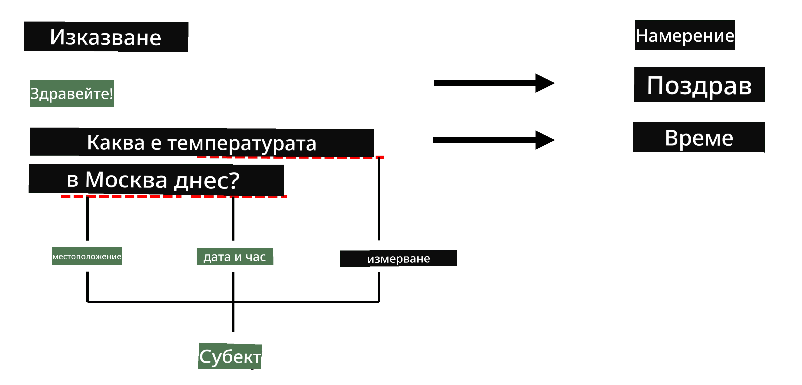

# Разпознаване на именувани обекти

Досега основно се концентрирахме върху една задача в обработката на естествен език (NLP) - класификация. Въпреки това, съществуват и други задачи в NLP, които могат да бъдат изпълнени с помощта на невронни мрежи. Една от тези задачи е **[Разпознаване на именувани обекти](https://wikipedia.org/wiki/Named-entity_recognition)** (NER), която се занимава с разпознаване на специфични обекти в текста, като места, имена на хора, времеви интервали, химични формули и други.

## [Тест преди лекцията](https://ff-quizzes.netlify.app/en/ai/quiz/37)

## Пример за използване на NER

Да предположим, че искате да разработите чат бот с естествен език, подобен на Amazon Alexa или Google Assistant. Интелигентните чат ботове работят, като *разбират* какво иска потребителят чрез класификация на текста в подаденото изречение. Резултатът от тази класификация е така нареченото **намерение**, което определя какво трябва да направи чат ботът.

> Изображение от автора

Въпреки това, потребителят може да предостави някои параметри като част от фразата. Например, когато пита за времето, той може да уточни местоположение или дата. Ботът трябва да може да разбере тези обекти и да попълни съответните параметри, преди да изпълни действието. Именно тук се включва NER.

> ✅ Друг пример би бил [анализ на научни медицински статии](https://soshnikov.com/science/analyzing-medical-papers-with-azure-and-text-analytics-for-health/). Едно от основните неща, които трябва да търсим, са специфични медицински термини, като болести и медицински вещества. Докато малък брой болести вероятно могат да бъдат извлечени чрез търсене на подстринг, по-сложни обекти, като химични съединения и имена на лекарства, изискват по-сложен подход.

## NER като класификация на токени

Моделите за NER по същество са **модели за класификация на токени**, защото за всеки от входните токени трябва да решим дали принадлежи на обект или не, и ако принадлежи - към кой клас обект.

Разгледайте следното заглавие на статия:

**Регургитация на трикуспидалната клапа** и **литиев карбонат** **токсичност** при новородено.

Обектите тук са:

* Регургитация на трикуспидалната клапа е заболяване (`DIS`)
* Литиев карбонат е химично вещество (`CHEM`)
* Токсичност също е заболяване (`DIS`)

Забележете, че един обект може да обхваща няколко токена. И, както в този случай, трябва да разграничим два последователни обекта. Затова е обичайно да се използват два класа за всеки обект - един, който указва първия токен на обекта (често се използва префиксът `B-` за **начало**), и друг - продължението на обекта (`I-`, за **вътрешен токен). Използваме също `O` като клас за представяне на всички **други** токени. Такова маркиране на токени се нарича [BIO маркиране](https://en.wikipedia.org/wiki/Inside%E2%80%93outside%E2%80%93beginning_(tagging)) (или IOB). Когато е маркирано, заглавието ни ще изглежда така:

Токен | Маркировка
------|-----
Tricuspid | B-DIS
valve | I-DIS
regurgitation | I-DIS
and | O
lithium | B-CHEM
carbonate | I-CHEM
toxicity | B-DIS
in | O
a | O
newborn | O
infant | O
. | O

Тъй като трябва да изградим едно към едно съответствие между токените и класовете, можем да обучим **много към много** невронен мрежов модел от тази картина:

> *Изображение от [този блог пост](http://karpathy.github.io/2015/05/21/rnn-effectiveness/) от [Андрей Карпати](http://karpathy.github.io/). Моделите за класификация на токени за NER съответстват на най-дясната архитектура на мрежата на тази картина.*

## Обучение на модели за NER

Тъй като моделът за NER по същество е модел за класификация на токени, можем да използваме RNN, с които вече сме запознати, за тази задача. В този случай всеки блок от рекурентната мрежа ще връща ID на токена. Следният примерен ноутбук показва как да обучим LSTM за класификация на токени.

## ✍️ Примерни ноутбуци: NER

Продължете обучението си със следния ноутбук:

* [NER с TensorFlow](NER-TF.ipynb)

## Заключение

Моделът за NER е **модел за класификация на токени**, което означава, че може да се използва за изпълнение на класификация на токени. Това е много често срещана задача в NLP, която помага за разпознаване на специфични обекти в текста, включително места, имена, дати и други.

## 🚀 Предизвикателство

Завършете задачата, свързана по-долу, за да обучите модел за разпознаване на именувани обекти за медицински термини, след което го изпробвайте върху различен набор от данни.

## [Тест след лекцията](https://ff-quizzes.netlify.app/en/ai/quiz/38)

## Преглед и самостоятелно обучение

Прочетете блога [The Unreasonable Effectiveness of Recurrent Neural Networks](http://karpathy.github.io/2015/05/21/rnn-effectiveness/) и следвайте секцията за допълнително четене в тази статия, за да задълбочите знанията си.

## [Задание](lab/README.md)

В задачата за този урок ще трябва да обучите модел за разпознаване на медицински обекти. Можете да започнете с обучение на LSTM модел, както е описано в този урок, и да продължите с използването на BERT трансформър модел. Прочетете [инструкциите](lab/README.md), за да получите всички подробности.

---

