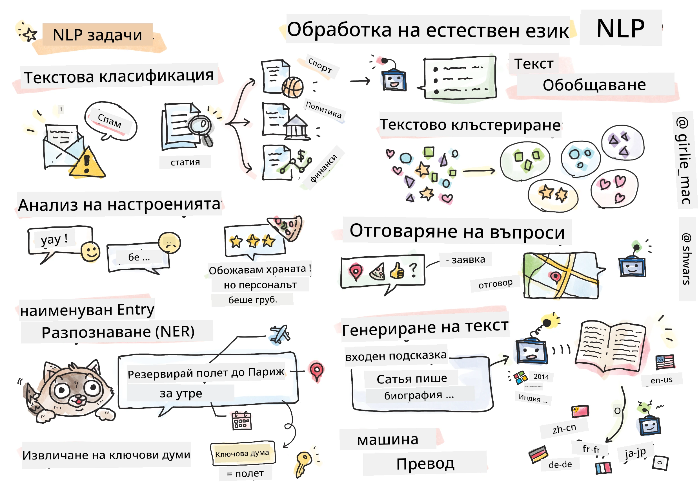

# Обработка на естествен език



В тази секция ще се фокусираме върху използването на невронни мрежи за решаване на задачи, свързани с **обработката на естествен език (NLP)**. Съществуват много NLP проблеми, които искаме компютрите да могат да решават:

* **Класификация на текст** е типичен проблем на класификация, свързан с текстови последователности. Примери включват класифициране на имейли като спам или не-спам, или категоризиране на статии като спорт, бизнес, политика и т.н. Също така, при разработването на чатботове често трябва да разберем какво иска да каже потребителят – в този случай се занимаваме с **класификация на намерения**. Често при класификацията на намерения трябва да се справяме с много категории.
* **Анализ на настроения** е типичен регресионен проблем, при който трябва да придадем число (настроение), съответстващо на това колко положително/отрицателно е значението на дадено изречение. По-напреднала версия на анализа на настроения е **анализ на настроения по аспекти** (ABSA), при който придаваме настроение не на цялото изречение, а на различни негови части (аспекти), напр. *В този ресторант харесах кухнята, но атмосферата беше ужасна*.
* **Разпознаване на именувани обекти** (NER) се отнася до проблема с извличането на определени обекти от текст. Например, може да се наложи да разберем, че в израза *Трябва да летя до Париж утре* думата *утре* се отнася до ДАТА, а *Париж* е ЛОКАЦИЯ.  
* **Извличане на ключови думи** е подобно на NER, но трябва автоматично да извличаме думи, важни за значението на изречението, без предварително обучение за конкретни типове обекти.
* **Клъстеризация на текст** може да бъде полезна, когато искаме да групираме заедно подобни изречения, например, сходни заявки в разговори за техническа поддръжка.
* **Отговаряне на въпроси** се отнася до способността на модела да отговаря на конкретен въпрос. Моделът получава текстов пасаж и въпрос като входни данни и трябва да предостави място в текста, където се съдържа отговорът на въпроса (или понякога да генерира текстовия отговор).
* **Генериране на текст** е способността на модела да създава нов текст. Това може да се разглежда като задача за класификация, която предсказва следващата буква/дума въз основа на някакъв *текстов подтик*. Напреднали модели за генериране на текст, като GPT-3, могат да решават и други NLP задачи, като класификация, използвайки техника, наречена [програмиране с подтици](https://towardsdatascience.com/software-3-0-how-prompting-will-change-the-rules-of-the-game-a982fbfe1e0) или [инженеринг на подтици](https://medium.com/swlh/openai-gpt-3-and-prompt-engineering-dcdc2c5fcd29).
* **Обобщаване на текст** е техника, при която искаме компютърът да "прочете" дълъг текст и да го обобщи в няколко изречения.
* **Машинен превод** може да се разглежда като комбинация от разбиране на текст на един език и генериране на текст на друг.

Първоначално повечето задачи в NLP се решаваха с традиционни методи като граматики. Например, в машинния превод се използваха парсери за преобразуване на първоначалното изречение в синтактично дърво, след което се извличаха по-високо ниво семантични структури, за да се представи значението на изречението, и въз основа на това значение и граматиката на целевия език се генерираше резултатът. В днешно време много NLP задачи се решават по-ефективно с помощта на невронни мрежи.

> Много класически методи за NLP са имплементирани в Python библиотеката [Natural Language Processing Toolkit (NLTK)](https://www.nltk.org). Съществува страхотна [книга за NLTK](https://www.nltk.org/book/), достъпна онлайн, която обхваща как различни NLP задачи могат да бъдат решени с помощта на NLTK.

В нашия курс основно ще се фокусираме върху използването на невронни мрежи за NLP и ще използваме NLTK, когато е необходимо.

Вече научихме как да използваме невронни мрежи за работа с таблични данни и изображения. Основната разлика между тези типове данни и текста е, че текстът е последователност с променлива дължина, докато размерът на входните данни при изображенията е известен предварително. Докато конволюционните мрежи могат да извличат модели от входните данни, моделите в текста са по-сложни. Например, можем да имаме отрицание, което е отделено от подлога с произволен брой думи (напр. *Не харесвам портокали* срещу *Не харесвам онези големи цветни вкусни портокали*), и това все пак трябва да се интерпретира като един модел. Следователно, за да обработваме език, трябва да въведем нови типове невронни мрежи, като *рекурентни мрежи* и *трансформъри*.

## Инсталиране на библиотеки

Ако използвате локална Python инсталация за този курс, може да се наложи да инсталирате всички необходими библиотеки за NLP с помощта на следните команди:

**За PyTorch**
```bash
pip install -r requirements-torch.txt
```
**За TensorFlow**
```bash
pip install -r requirements-tf.txt
```

> Можете да изпробвате NLP с TensorFlow на [Microsoft Learn](https://docs.microsoft.com/learn/modules/intro-natural-language-processing-tensorflow/?WT.mc_id=academic-77998-cacaste)

## Предупреждение за GPU

В тази секция, в някои от примерите, ще тренираме доста големи модели.
* **Използвайте компютър с GPU**: Препоръчително е да стартирате вашите тетрадки на компютър с GPU, за да намалите времето за изчакване при работа с големи модели.
* **Ограничения на GPU паметта**: Работата с GPU може да доведе до ситуации, в които изчерпвате GPU паметта, особено при трениране на големи модели.
* **Консумация на GPU памет**: Количеството GPU памет, използвано по време на трениране, зависи от различни фактори, включително размера на минипартидата.
* **Намалете размера на минипартидата**: Ако срещнете проблеми с GPU паметта, обмислете намаляване на размера на минипартидата във вашия код като потенциално решение.
* **Освобождаване на GPU памет в TensorFlow**: По-старите версии на TensorFlow може да не освобождават GPU паметта правилно при трениране на няколко модела в една Python сесия. За ефективно управление на GPU паметта можете да конфигурирате TensorFlow да заделя GPU памет само при нужда.
* **Включване на код**: За да настроите TensorFlow да увеличава GPU паметта само при необходимост, включете следния код във вашите тетрадки:

```python
physical_devices = tf.config.list_physical_devices('GPU') 
if len(physical_devices)>0:
    tf.config.experimental.set_memory_growth(physical_devices[0], True) 
```

Ако се интересувате от изучаване на NLP от класическа ML перспектива, посетете [този набор от уроци](https://github.com/microsoft/ML-For-Beginners/tree/main/6-NLP)

## В тази секция
В тази секция ще научим за:

* [Представяне на текст като тензори](13-TextRep/README.md)
* [Вграждания на думи](14-Emdeddings/README.md)
* [Моделиране на език](15-LanguageModeling/README.md)
* [Рекурентни невронни мрежи](16-RNN/README.md)
* [Генеративни мрежи](17-GenerativeNetworks/README.md)
* [Трансформъри](18-Transformers/README.md)

**Отказ от отговорност**:  
Този документ е преведен с помощта на AI услуга за превод [Co-op Translator](https://github.com/Azure/co-op-translator). Въпреки че се стремим към точност, моля, имайте предвид, че автоматизираните преводи може да съдържат грешки или неточности. Оригиналният документ на неговия роден език трябва да се счита за авторитетен източник. За критична информация се препоръчва професионален човешки превод. Не носим отговорност за недоразумения или погрешни интерпретации, произтичащи от използването на този превод.