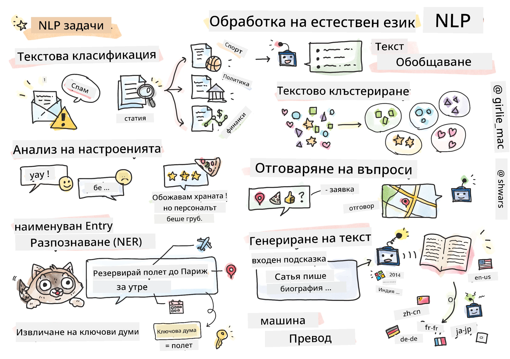

# Обработка на естествен език



В този раздел ще се фокусираме върху използването на невронни мрежи за справяне със задачи, свързани с **Обработката на естествен език (NLP)**. Съществуват много NLP проблеми, които искаме компютрите да могат да решават:

* **Класификация на текст** е типичен проблем на класификация, отнасящ се до текстови последователности. Примери включват класифициране на имейл съобщения като спам или не-спам, или категоризиране на статии като спорт, бизнес, политика и др. Също така, при разработване на чатботове често трябва да разбираме какво е искал да каже потребителят – в този случай става дума за **класификация на намеренията**. Често при класификация на намерения се справяме с много категории.
* **Анализ на настроения** е типичен проблем на регресия, при който трябва да приписваме число (настроение), съответстващо на това колко положително/отрицателно е значението на изречението. По-напреднала версия на анализа на настроения е **анализ на настроенията по аспекти** (ABSA), при който приписваме настроението не на цялото изречение, а на различни части от него (аспекти), например *В този ресторант ми хареса кухнята, но атмосферата беше ужасна*.
* **Разпознаване на именувани обекти** (NER) се отнася до задачата за извличане на определени обекти от текста. Например, може да трябва да разберем, че в израза *Трябва да летя за Париж утре* думата *утре* се отнася за ДАТА, а *Париж* е ЛОКАЦИЯ.  
* **Извличане на ключови думи** е подобно на NER, но трябва да извличаме автоматично важни за значението на изречението думи, без предварително обучение за конкретни типове обекти.
* **Клъстериране на текст** може да бъде полезно, когато искаме да групираме подобни изречения, например сходни запитвания в разговори със техническа поддръжка.
* **Отговаряне на въпроси** се отнася до способността на модел да отговаря на конкретен въпрос. Моделът получава текстов откъс и въпрос като входни данни и трябва да предостави мястото в текста, където се съдържа отговорът на въпроса (или понякога да генерира текст на отговора).
* **Генериране на текст** е способността на модел да генерира нов текст. Това може да се разглежда като задача на класификация, която предсказва следващата буква/дума въз основа на някакъв *текстов подтик*. Напреднали модели за генериране на текст, като GPT-3, могат да решават и други NLP задачи, като класификация, използвайки техника, наречена [prompt programming](https://towardsdatascience.com/software-3-0-how-prompting-will-change-the-rules-of-the-game-a982fbfe1e0) или [prompt engineering](https://medium.com/swlh/openai-gpt-3-and-prompt-engineering-dcdc2c5fcd29)
* **Обобщаване на текст** е техника, при която искаме компютърът да „прочете“ дълго текстово съдържание и да го обобщи в няколко изречения.
* **Машинен превод** може да се разглежда като комбинация от разбиране на текст на един език и генериране на текст на друг език.

Първоначално повечето NLP задачи се решаваха с помощта на традиционни методи, като граматики. Например при машинен превод се използваха парсъри за преобразуване на първичното изречение в синтактично дърво, след това се извличаха по-високо ниво семантични структури за представяне на значението на изречението, и на базата на това значение и граматиката на целевия език се генерираше резултатът. Днес много NLP задачи се решават по-ефективно с помощта на невронни мрежи.

> Много класически NLP методи са реализирани в библиотеката за Python [Natural Language Processing Toolkit (NLTK)](https://www.nltk.org). Има страхотна онлайн книга [NLTK Book](https://www.nltk.org/book/), която покрива как различни NLP задачи могат да се решат с помощта на NLTK.

В нашия курс най-вече ще се фокусираме върху използване на невронни мрежи за NLP и ще използваме NLTK, когато е необходимо.

Вече сме научили за използването на невронни мрежи за работа с таблични данни и с изображения. Основната разлика между тези типове данни и текста е, че текстът е последователност с променлива дължина, докато размерът на входа при изображенията е известен предварително. Докато конволюционните мрежи могат да извличат образци от входните данни, образците в текста са по-сложни. Например, може да имаме отрицание, което е отделено от подлога и да е разделено от много думи (например *Не обичам портокали* спрямо *Не обичам тези големи цветни вкусни портокали*), но това все още трябва да се интерпретира като един образец. Затова, за да обработваме езика, трябва да въведем нови типове невронни мрежи, като *рекурентни мрежи* и *трансформъри*.

## Инсталиране на библиотеки

Ако използвате локална Python инсталация за изпълнение на този курс, може да се наложи да инсталирате всички необходими библиотеки за NLP с помощта на следните команди:

**За PyTorch**
```bash
pip install -r requirements-pytorch.txt
```
**За TensorFlow**
```bash
pip install -r requirements-tf.txt
```

> Можете да пробвате NLP с TensorFlow в [Microsoft Learn](https://docs.microsoft.com/learn/modules/intro-natural-language-processing-tensorflow/?WT.mc_id=academic-77998-cacaste)

## Предупреждение за GPU

В този раздел, в някои от примерите ще тренираме доста големи модели.
* **Използвайте компютър с поддръжка на GPU**: Препоръчително е да изпълнявате вашите тетрадки на компютър с GPU, за да намалите времето за изчакване при работа с големи модели.
* **Ограничения на паметта на GPU**: Изпълнението на GPU може да доведе до ситуации, в които изчерпвате паметта на GPU, особено при тренировката на големи модели.
* **Консумация на памет в GPU**: Количеството памет на GPU, използвана по време на трениране, зависи от различни фактори, включително размера на минипакета.
* **Минимизирайте размера на минипакета**: Ако срещнете проблеми с паметта на GPU, обмислете намаляване на размера на минипакета във вашия код като възможно решение.
* **Освобождаване на паметта на GPU в TensorFlow**: По-старите версии на TensorFlow може да не освобождават правилно паметта на GPU при трениране на множество модели в един Python kernel. За да управлявате ефективно използването на паметта на GPU, можете да конфигурирате TensorFlow да заделя памет на GPU само при нужда.
* **Включване на код**: За да настроите TensorFlow да разширява заделянето на памет на GPU само когато е необходимо, включете следния код във вашите тетрадки:

```python
physical_devices = tf.config.list_physical_devices('GPU') 
if len(physical_devices)>0:
    tf.config.experimental.set_memory_growth(physical_devices[0], True) 
```

Ако се интересувате да научите за NLP от класическа перспектива в машинното обучение, посетете [този комплект уроци](https://github.com/microsoft/ML-For-Beginners/tree/main/6-NLP)

## В този раздел
В този раздел ще научим за:

* [Представяне на текст като тензори](13-TextRep/README.md)
* [Векторни представяния на думи (Word Embeddings)](14-Embeddings/README.md)
* [Моделиране на езика](15-LanguageModeling/README.md)
* [Рекурентни невронни мрежи](16-RNN/README.md)
* [Генеративни мрежи](17-GenerativeNetworks/README.md)
* [Трансформъри](18-Transformers/README.md)

---

<!-- CO-OP TRANSLATOR DISCLAIMER START -->
**Отказ от отговорност**:
Този документ е преведен с помощта на AI преводачески услуга [Co-op Translator](https://github.com/Azure/co-op-translator). Въпреки че се стремим към точност, моля имайте предвид, че автоматизираните преводи могат да съдържат грешки или неточности. Оригиналният документ на неговия роден език трябва да се счита за авторитетен източник. За критична информация се препоръчва професионален човешки превод. Ние не носим отговорност за каквито и да е недоразумения или неправилни тълкувания, произтичащи от използването на този превод.
<!-- CO-OP TRANSLATOR DISCLAIMER END -->