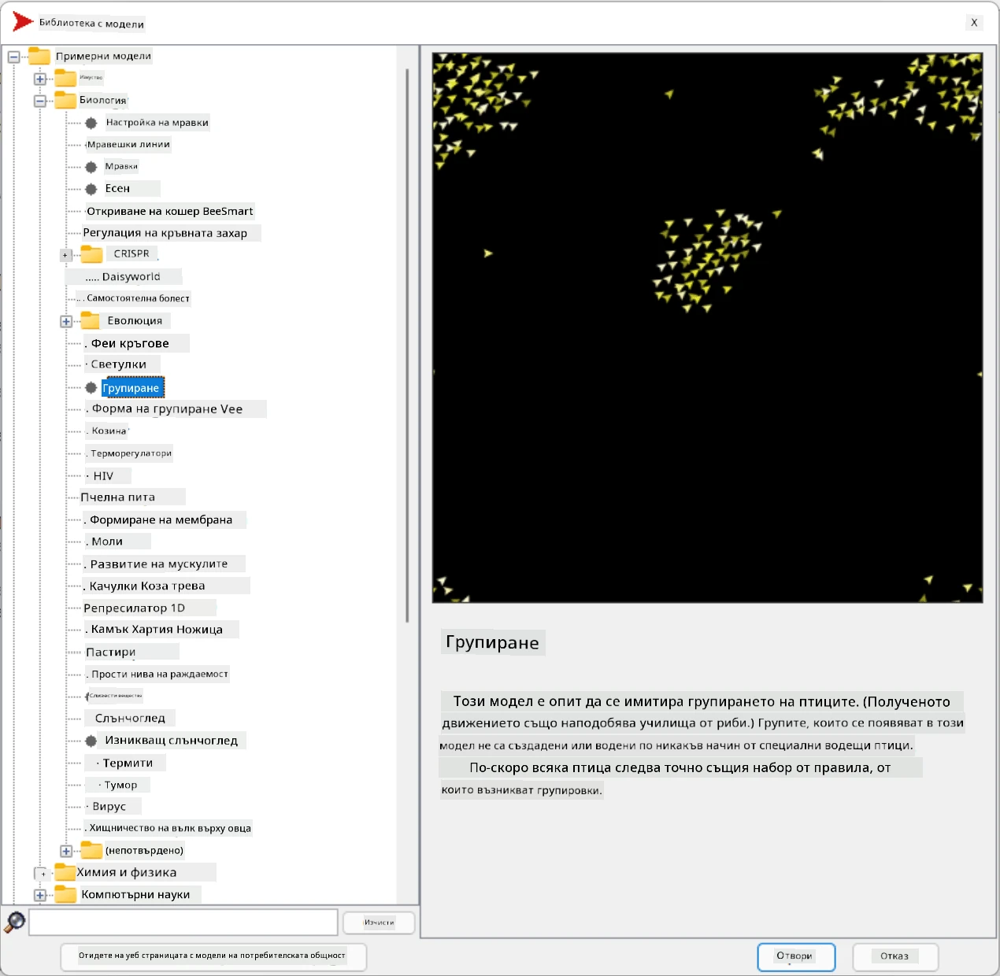
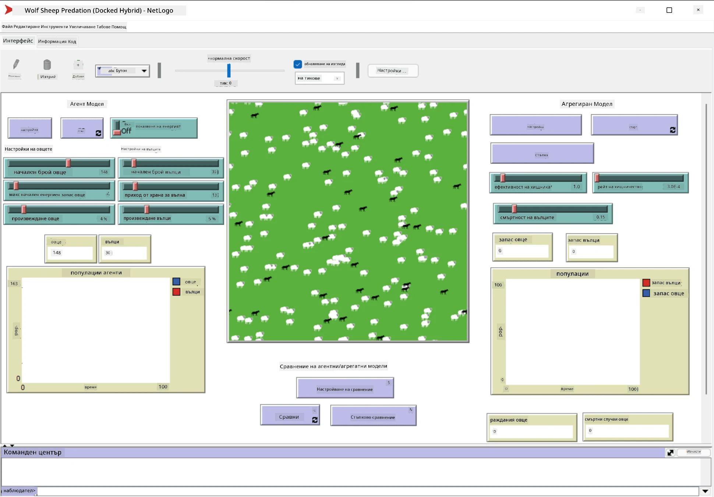

# Мултиагентни системи

Един от възможните начини за постигане на интелигентност е така нареченият **емергентен** (или **синергетичен**) подход, който се основава на факта, че комбинираното поведение на много относително прости агенти може да доведе до по-сложно (или интелигентно) поведение на системата като цяло. Теоретично това се базира на принципите на [Колективна интелигентност](https://en.wikipedia.org/wiki/Collective_intelligence), [Емергентизъм](https://en.wikipedia.org/wiki/Global_brain) и [Еволюционна кибернетика](https://en.wikipedia.org/wiki/Global_brain), които твърдят, че системи на по-високо ниво придобиват някаква добавена стойност, когато са правилно комбинирани от системи на по-ниско ниво (така нареченият *принцип на преход към метасистема*).

## [Тест преди лекцията](https://ff-quizzes.netlify.app/en/ai/quiz/45)

Направлението **Мултиагентни системи** се появява в областта на изкуствения интелект през 90-те години като отговор на растежа на интернет и разпределените системи. Един от класическите учебници по изкуствен интелект, [Artificial Intelligence: A Modern Approach](https://en.wikipedia.org/wiki/Artificial_Intelligence:_A_Modern_Approach), разглежда класическия AI от гледна точка на мултиагентните системи.

Централно за мултиагентния подход е понятието **агент** – субект, който съществува в някаква **среда**, която може да възприема и върху която може да действа. Това е много широко определение и може да има много различни типове и класификации на агентите:

* Според способността им да разсъждават:
   - **Реактивни** агенти обикновено имат прост тип поведение "заявка-отговор".
   - **Делиберативни** агенти използват някакъв вид логическо разсъждение и/или способности за планиране.
* Според мястото, където агентът изпълнява своя код:
   - **Статични** агенти работят на определен мрежов възел.
   - **Мобилни** агенти могат да преместват своя код между мрежови възли.
* Според поведението им:
   - **Пасивни агенти** нямат конкретни цели. Такива агенти могат да реагират на външни стимули, но няма да инициират действия сами.
   - **Активни агенти** имат цели, които преследват.
   - **Когнитивни агенти** включват сложни процеси на планиране и разсъждение.

Мултиагентните системи днес се използват в редица приложения:

* В игрите много персонажи, които не са играчи, използват някакъв вид AI и могат да се считат за интелигентни агенти.
* В производството на видео, рендирането на сложни 3D сцени, които включват тълпи, обикновено се извършва чрез мултиагентна симулация.
* В моделирането на системи мултиагентният подход се използва за симулиране на поведението на сложен модел. Например, мултиагентният подход успешно се използва за прогнозиране на разпространението на COVID-19 в световен мащаб. Подобен подход може да се използва за моделиране на трафика в града и за анализ на реакциите към промени в правилата за движение.
* В сложни автоматизирани системи всяко устройство може да действа като независим агент, което прави цялата система по-малко монолитна и по-устойчива.

Няма да отделяме много време за задълбочено изучаване на мултиагентните системи, но ще разгледаме един пример за **мултиагентно моделиране**.

## NetLogo

[NetLogo](https://ccl.northwestern.edu/netlogo/) е среда за мултиагентно моделиране, базирана на модифицирана версия на програмния език [Logo](https://en.wikipedia.org/wiki/Logo_(programming_language)). Този език е разработен за обучение на деца в концепции за програмиране и позволява управление на агент, наречен **костенурка**, който може да се движи и да оставя следа. Това позволява създаването на сложни геометрични фигури, което е много визуален начин за разбиране на поведението на агент.

В NetLogo можем да създадем много костенурки с командата `create-turtles`. След това можем да командваме всички костенурки да извършат някакви действия (в примера по-долу - да се придвижат напред с 10 точки):

```
create-turtles 10
ask turtles [
  forward 10
]
```

Разбира се, не е интересно, когато всички костенурки правят едно и също нещо, затова можем да `ask` групи костенурки, например тези, които са в близост до определена точка. Можем също да създаваме костенурки от различни *породи* с командата `breed [cats cat]`. Тук `cat` е името на породата, и трябва да се посочат както единствено, така и множествено число, защото различни команди използват различни форми за яснота.

> ✅ Няма да се задълбочаваме в изучаването на езика NetLogo – можете да посетите отличния ресурс [Beginner's Interactive NetLogo Dictionary](https://ccl.northwestern.edu/netlogo/bind/), ако се интересувате от повече информация.

Можете [да изтеглите](https://ccl.northwestern.edu/netlogo/download.shtml) и инсталирате NetLogo, за да го изпробвате.

### Библиотека с модели

Едно от страхотните неща в NetLogo е, че съдържа библиотека с работещи модели, които можете да опитате. Отидете на **File &rightarrow; Models Library**, и ще намерите много категории модели, от които да избирате.



> Екранна снимка на библиотеката с модели от Дмитрий Сошников

Можете да отворите един от моделите, например **Biology &rightarrow; Flocking**.

### Основни принципи

След като отворите модела, ще бъдете отведени до основния екран на NetLogo. Ето примерен модел, който описва популацията на вълци и овце, при наличието на ограничени ресурси (трева).



> Екранна снимка от Дмитрий Сошников

На този екран можете да видите:

* Секцията **Interface**, която съдържа:
  - Основното поле, където живеят всички агенти
  - Различни контроли: бутони, плъзгачи и др.
  - Графики, които можете да използвате за показване на параметрите на симулацията
* Раздела **Code**, който съдържа редактора, където можете да пишете програма на NetLogo

В повечето случаи интерфейсът ще има бутон **Setup**, който инициализира състоянието на симулацията, и бутон **Go**, който стартира изпълнението. Те се обработват от съответните обработващи функции в кода, които изглеждат така:

```
to go [
...
]
```

Светът на NetLogo се състои от следните обекти:

* **Агенти** (костенурки), които могат да се движат по полето и да извършват действия. Можете да командвате агентите с помощта на синтаксиса `ask turtles [...]`, а кодът в скобите се изпълнява от всички агенти в *режим костенурка*.
* **Пачове** са квадратни области на полето, върху които живеят агентите. Можете да се обръщате към всички агенти на един и същ пач или да променяте цветовете и някои други свойства на пачовете. Можете също да `ask patches` да извършат действия.
* **Наблюдател** е уникален агент, който контролира света. Всички обработващи функции на бутоните се изпълняват в *режим наблюдател*.

> ✅ Красотата на мултиагентната среда е, че кодът, който се изпълнява в режим костенурка или в режим пач, се изпълнява едновременно от всички агенти паралелно. Така, като напишете малко код и програмирате поведението на отделен агент, можете да създадете сложно поведение на симулационната система като цяло.

### Flocking

Като пример за мултиагентно поведение, нека разгледаме **[Flocking](https://en.wikipedia.org/wiki/Flocking_(behavior))**. Flocking е сложен модел, който много прилича на начина, по който летят ята птици. Наблюдавайки ги, може да си помислите, че следват някакъв колективен алгоритъм или че притежават форма на *колективна интелигентност*. Въпреки това, това сложно поведение възниква, когато всеки отделен агент (в този случай *птица*) наблюдава само някои други агенти на кратко разстояние от себе си и следва три прости правила:

* **Подравняване** – насочва се към средната посока на движение на съседните агенти.
* **Кохезия** – опитва се да се насочи към средната позиция на съседите (*дългосрочно привличане*).
* **Разделяне** – когато се приближи твърде много до други птици, опитва се да се отдалечи (*краткосрочно отблъскване*).

Можете да стартирате примера за flocking и да наблюдавате поведението. Можете също да регулирате параметри, като *степен на разделяне* или *обхват на виждане*, който определя колко далеч може да вижда всяка птица. Забележете, че ако намалите обхвата на виждане до 0, всички птици стават слепи и flocking спира. Ако намалите разделянето до 0, всички птици се събират в права линия.

> ✅ Превключете към раздела **Code** и вижте къде трите правила на flocking (подравняване, кохезия и разделяне) са реализирани в кода. Забележете как се обръщаме само към агентите, които са в полезрението.

### Други модели за разглеждане

Има още няколко интересни модела, с които можете да експериментирате:

* **Art &rightarrow; Fireworks** показва как фойерверк може да се разглежда като колективно поведение на отделни струи огън.
* **Social Science &rightarrow; Traffic Basic** и **Social Science &rightarrow; Traffic Grid** показват модела на градския трафик в 1D и 2D мрежа със или без светофари. Всяка кола в симулацията следва следните правила:
   - Ако пространството пред нея е празно – ускорява (до определена максимална скорост).
   - Ако вижда препятствие отпред – спира (и можете да регулирате колко далеч може да вижда шофьорът).
* **Social Science &rightarrow; Party** показва как хората се групират по време на коктейлно парти. Можете да намерите комбинацията от параметри, която води до най-бързо увеличаване на щастието на групата.

Както можете да видите от тези примери, мултиагентните симулации могат да бъдат доста полезен начин за разбиране на поведението на сложна система, състояща се от индивиди, които следват еднаква или подобна логика. Те могат също да се използват за управление на виртуални агенти, като [NPCs](https://en.wikipedia.org/wiki/NPC) в компютърни игри или агенти в 3D анимирани светове.

## Делиберативни агенти

Описаните по-горе агенти са много прости, реагиращи на промени в средата чрез някакъв вид алгоритъм. Такива агенти са **реактивни агенти**. Въпреки това, понякога агентите могат да разсъждават и планират своите действия, в който случай те се наричат **делиберативни**.

Типичен пример би бил личен агент, който получава инструкция от човек да резервира ваканционен тур. Да предположим, че има много агенти, които живеят в интернет и могат да му помогнат. Той трябва да се свърже с други агенти, за да види кои полети са налични, какви са цените на хотелите за различни дати и да се опита да договори най-добрата цена. Когато планът за ваканцията е завършен и потвърден от собственика, той може да пристъпи към резервацията.

За да направят това, агентите трябва да **комуникират**. За успешна комуникация те се нуждаят от:

* Някои **стандартни езици за обмен на знания**, като [Knowledge Interchange Format](https://en.wikipedia.org/wiki/Knowledge_Interchange_Format) (KIF) и [Knowledge Query and Manipulation Language](https://en.wikipedia.org/wiki/Knowledge_Query_and_Manipulation_Language) (KQML). Тези езици са проектирани въз основа на [теорията на речевите актове](https://en.wikipedia.org/wiki/Speech_act).
* Тези езици трябва също да включват някои **протоколи за преговори**, базирани на различни **типове аукциони**.
* **Обща онтология**, която да използват, така че да се позовават на едни и същи концепции, знаейки тяхната семантика.
* Начин за **откриване** на това, което различните агенти могат да правят, също базиран на някакъв вид онтология.

Делиберативните агенти са много по-сложни от реактивните, защото не само реагират на промени в средата, но трябва и да могат да *инициират* действия. Една от предложените архитектури за делиберативни агенти е така нареченият агент с Вяра-Желание-Намерение (BDI):

* **Вяра** формира набор от знания за средата на агента. Тя може да бъде структурирана като база от знания или набор от правила, които агентът може да приложи към конкретна ситуация в средата.
* **Желания** определят какво агентът иска да направи, т.е. неговите цели. Например, целта на личния асистент агент по-горе е да резервира тур, а целта на хотелския агент е да максимизира печалбата.
* **Намерения** са конкретни действия, които агентът планира да извърши, за да постигне своите цели. Действията обикновено променят средата и предизвикват комуникация с други агенти.

Има някои платформи, достъпни за изграждане на мултиагентни системи, като [JADE](https://jade.tilab.com/). [Тази статия](https://arxiv.org/ftp/arxiv/papers/2007/2007.08961.pdf) съдържа преглед на мултиагентните платформи, заедно с кратка история на мултиагентните системи и различните им сценарии на употреба.

## Заключение

Мултиагентните системи могат да приемат много различни форми и да се използват в множество приложения. 
Те обикновено се фокусират върху по-простото поведение на отделния агент и постигат по-сложно поведение на цялостната система благодарение на **синергетичния ефект**.

## 🚀 Предизвикателство

Приложете този урок в реалния свят и опитайте да концептуализирате мултиагентна система, която може да реши даден проблем. Какво, например, би трябвало да прави мултиагентна система, за да оптимизира маршрута на училищен автобус? Как би могла да работи в пекарна?

## [Тест след лекцията](https://ff-quizzes.netlify.app/en/ai/quiz/46)

## Преглед и самостоятелно обучение

Прегледайте използването на този тип системи в индустрията. Изберете област, като например производство или индустрията на видеоигрите, и открийте как мултиагентните системи могат да се използват за решаване на уникални проблеми.

## [Задание за NetLogo](assignment.md)

---

