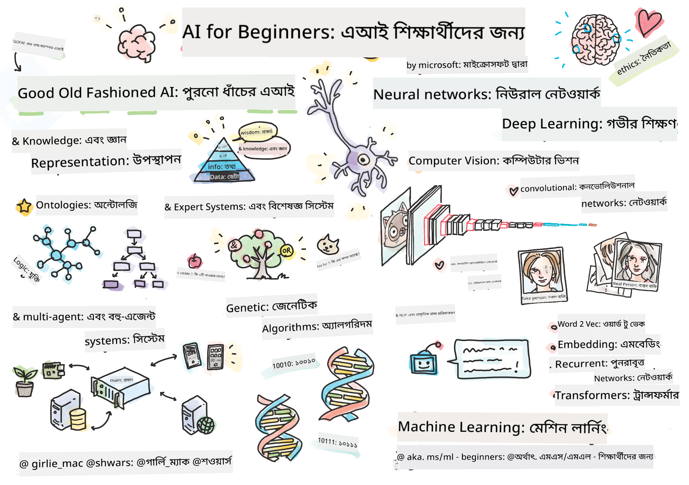

<!--
CO_OP_TRANSLATOR_METADATA:
{
  "original_hash": "c8f6fd940f684ae35bdb7646af1e9aa7",
  "translation_date": "2025-11-18T17:17:32+00:00",
  "source_file": "README.md",
  "language_code": "bn"
}
-->
  
  
  
  
  

  
  
  
  
  

  

# শিক্ষার্থীদের জন্য কৃত্রিম বুদ্ধিমত্তা - একটি পাঠ্যক্রম  

||  
|:---:|  
| শিক্ষার্থীদের জন্য AI - _স্কেচনোট [@girlie_mac](https://twitter.com/girlie_mac)_ |  

**কৃত্রিম বুদ্ধিমত্তা** (AI)-এর জগৎ অন্বেষণ করুন আমাদের ১২-সপ্তাহের, ২৪-টি পাঠের পাঠ্যক্রমের মাধ্যমে! এতে রয়েছে ব্যবহারিক পাঠ, কুইজ এবং ল্যাব। এই পাঠ্যক্রমটি শিক্ষার্থীদের জন্য সহজ এবং TensorFlow ও PyTorch-এর মতো টুলস এবং AI-এর নৈতিকতা নিয়ে আলোচনা করে।  

### 🌐 বহু-ভাষার সমর্থন  

#### GitHub Action-এর মাধ্যমে সমর্থিত (স্বয়ংক্রিয় এবং সর্বদা আপডেটেড)  

<!-- CO-OP TRANSLATOR LANGUAGES TABLE START -->  
[Arabic](../ar/README.md) | [Bengali](./README.md) | [Bulgarian](../bg/README.md) | [Burmese (Myanmar)](../my/README.md) | [Chinese (Simplified)](../zh/README.md) | [Chinese (Traditional, Hong Kong)](../hk/README.md) | [Chinese (Traditional, Macau)](../mo/README.md) | [Chinese (Traditional, Taiwan)](../tw/README.md) | [Croatian](../hr/README.md) | [Czech](../cs/README.md) | [Danish](../da/README.md) | [Dutch](../nl/README.md) | [Estonian](../et/README.md) | [Finnish](../fi/README.md) | [French](../fr/README.md) | [German](../de/README.md) | [Greek](../el/README.md) | [Hebrew](../he/README.md) | [Hindi](../hi/README.md) | [Hungarian](../hu/README.md) | [Indonesian](../id/README.md) | [Italian](../it/README.md) | [Japanese](../ja/README.md) | [Korean](../ko/README.md) | [Lithuanian](../lt/README.md) | [Malay](../ms/README.md) | [Marathi](../mr/README.md) | [Nepali](../ne/README.md) | [Nigerian Pidgin](../pcm/README.md) | [Norwegian](../no/README.md) | [Persian (Farsi)](../fa/README.md) | [Polish](../pl/README.md) | [Portuguese (Brazil)](../br/README.md) | [Portuguese (Portugal)](../pt/README.md) | [Punjabi (Gurmukhi)](../pa/README.md) | [Romanian](../ro/README.md) | [Russian](../ru/README.md) | [Serbian (Cyrillic)](../sr/README.md) | [Slovak](../sk/README.md) | [Slovenian](../sl/README.md) | [Spanish](../es/README.md) | [Swahili](../sw/README.md) | [Swedish](../sv/README.md) | [Tagalog (Filipino)](../tl/README.md) | [Tamil](../ta/README.md) | [Thai](../th/README.md) | [Turkish](../tr/README.md) | [Ukrainian](../uk/README.md) | [Urdu](../ur/README.md) | [Vietnamese](../vi/README.md)  
<!-- CO-OP TRANSLATOR LANGUAGES TABLE END -->  

**যদি আপনি অতিরিক্ত অনুবাদ ভাষা যোগ করতে চান, তাহলে [এখানে](https://github.com/Azure/co-op-translator/blob/main/getting_started/supported-languages.md) তালিকাভুক্ত ভাষাগুলি সমর্থিত।**  

## সম্প্রদায়ে যোগ দিন  
  

## আপনি কী শিখবেন  

**[কোর্সের মানচিত্র](http://soshnikov.com/courses/ai-for-beginners/mindmap.html)**  

এই পাঠ্যক্রমে আপনি শিখবেন:  

* কৃত্রিম বুদ্ধিমত্তার বিভিন্ন পদ্ধতি, যার মধ্যে রয়েছে "পুরনো ভালো" প্রতীকী পদ্ধতি **জ্ঞান উপস্থাপন** এবং যুক্তি ([GOFAI](https://en.wikipedia.org/wiki/Symbolic_artificial_intelligence))।  
* **নিউরাল নেটওয়ার্ক** এবং **ডিপ লার্নিং**, যা আধুনিক AI-এর মূল। আমরা এই গুরুত্বপূর্ণ বিষয়গুলির ধারণাগুলি দুটি জনপ্রিয় ফ্রেমওয়ার্ক - [TensorFlow](http://Tensorflow.org) এবং [PyTorch](http://pytorch.org)-এ কোড ব্যবহার করে ব্যাখ্যা করব।  
* **নিউরাল আর্কিটেকচার** চিত্র এবং টেক্সট নিয়ে কাজ করার জন্য। আমরা সাম্প্রতিক মডেলগুলি কভার করব তবে সর্বাধুনিক প্রযুক্তি কিছুটা কম থাকতে পারে।  
* কম জনপ্রিয় AI পদ্ধতি, যেমন **জেনেটিক অ্যালগরিদম** এবং **মাল্টি-এজেন্ট সিস্টেম**।  

এই পাঠ্যক্রমে আমরা যা কভার করব না:  

> [এই কোর্সের সমস্ত অতিরিক্ত সম্পদ Microsoft Learn সংগ্রহে খুঁজুন](https://learn.microsoft.com/en-us/collections/7w28iy2xrqzdj0?WT.mc_id=academic-77998-bethanycheum)  

* **ব্যবসায়ে AI ব্যবহারের ব্যবসায়িক কেস**। [ব্যবসায়িক ব্যবহারকারীদের জন্য AI-এর পরিচিতি](https://docs.microsoft.com/learn/paths/introduction-ai-for-business-users/?WT.mc_id=academic-77998-bethanycheum) Microsoft Learn-এ শেখার পথ বা [AI Business School](https://www.microsoft.com/ai/ai-business-school/?WT.mc_id=academic-77998-bethanycheum), যা [INSEAD](https://www.insead.edu/)-এর সহযোগিতায় তৈরি।  
* **ক্লাসিক মেশিন লার্নিং**, যা আমাদের [শিক্ষার্থীদের জন্য মেশিন লার্নিং পাঠ্যক্রমে](http://github.com/Microsoft/ML-for-Beginners) ভালোভাবে বর্ণনা করা হয়েছে।  
* **কগনিটিভ সার্ভিস ব্যবহার করে তৈরি করা ব্যবহারিক AI অ্যাপ্লিকেশন**। এর জন্য, আমরা Microsoft Learn-এর মডিউলগুলি শুরু করার সুপারিশ করি [ভিশন](https://docs.microsoft.com/learn/paths/create-computer-vision-solutions-azure-cognitive-services/?WT.mc_id=academic-77998-bethanycheum), [ন্যাচারাল ল্যাঙ্গুয়েজ প্রসেসিং](https://docs.microsoft.com/learn/paths/explore-natural-language-processing/?WT.mc_id=academic-77998-bethanycheum), **[Generative AI with Azure OpenAI Service](https://learn.microsoft.com/en-us/training/paths/develop-ai-solutions-azure-openai/?WT.mc_id=academic-77998-bethanycheum)** এবং অন্যান্য।  
* নির্দিষ্ট ML **ক্লাউড ফ্রেমওয়ার্ক**, যেমন [Azure Machine Learning](https://azure.microsoft.com/services/machine-learning/?WT.mc_id=academic-77998-bethanycheum), [Microsoft Fabric](https://learn.microsoft.com/en-us/training/paths/get-started-fabric/?WT.mc_id=academic-77998-bethanycheum), বা [Azure Databricks](https://docs.microsoft.com/learn/paths/data-engineer-azure-databricks?WT.mc_id=academic-77998-bethanycheum)। [Azure Machine Learning](https://docs.microsoft.com/learn/paths/build-ai-solutions-with-azure-ml-service/?WT.mc_id=academic-77998-bethanycheum) এবং [Azure Databricks](https://docs.microsoft.com/learn/paths/build-operate-machine-learning-solutions-azure-databricks/?WT.mc_id=academic-77998-bethanycheum)-এর শেখার পথ ব্যবহার করার কথা বিবেচনা করুন।  
* **কনভারসেশনাল AI** এবং **চ্যাট বট**। এর জন্য একটি আলাদা [কনভারসেশনাল AI সমাধান তৈরি করুন](https://docs.microsoft.com/learn/paths/create-conversational-ai-solutions/?WT.mc_id=academic-77998-bethanycheum) শেখার পথ রয়েছে এবং আপনি আরও বিস্তারিত জানার জন্য [এই ব্লগ পোস্টটি](https://soshnikov.com/azure/hello-bot-conversational-ai-on-microsoft-platform/) দেখতে পারেন।  
* **ডিপ লার্নিং-এর গভীর গণিত**। এর জন্য, আমরা Ian Goodfellow, Yoshua Bengio এবং Aaron Courville-এর [Deep Learning](https://www.amazon.com/Deep-Learning-Adaptive-Computation-Machine/dp/0262035618) সুপারিশ করি, যা অনলাইনে [https://www.deeplearningbook.org/](https://www.deeplearningbook.org/) এও উপলব্ধ।  

_ক্লাউডে AI_-এর বিষয়গুলির একটি সহজ পরিচিতির জন্য আপনি [Azure-এ কৃত্রিম বুদ্ধিমত্তা দিয়ে শুরু করুন](https://docs.microsoft.com/learn/paths/get-started-with-artificial-intelligence-on-azure/?WT.mc_id=academic-77998-bethanycheum) শেখার পথ নিতে পারেন।  

# বিষয়বস্তু  

|     |                                                                 পাঠের লিঙ্ক                                                                  |                                           PyTorch/Keras/TensorFlow                                          | ল্যাব                                                            |  
| :-: | :------------------------------------------------------------------------------------------------------------------------------------------: | :---------------------------------------------------------------------------------------------: | ------------------------------------------------------------------------------ |  
| 0  |                                 [কোর্স সেটআপ](./lessons/0-course-setup/setup.md)                                 |                      [আপনার ডেভেলপমেন্ট এনভায়রনমেন্ট সেটআপ করুন](./lessons/0-course-setup/how-to-run.md)                       |   |  
| I  |               [**AI-এর পরিচিতি**](./lessons/1-Intro/README.md)      | | |  
| 01  |       [AI-এর পরিচিতি এবং ইতিহাস](./lessons/1-Intro/README.md)       |           -                            | -  |  
| II |              **প্রতীকী AI**              |  
| 02  |       [জ্ঞান উপস্থাপন এবং বিশেষজ্ঞ সিস্টেম](./lessons/2-Symbolic/README.md)       |            [বিশেষজ্ঞ সিস্টেম](./lessons/2-Symbolic/Animals.ipynb) /  [অন্টোলজি](./lessons/2-Symbolic/FamilyOntology.ipynb) /[কনসেপ্ট গ্রাফ](./lessons/2-Symbolic/MSConceptGraph.ipynb)                             |  |  
| III |                        [**নিউরাল নেটওয়ার্কের পরিচিতি**](./lessons/3-NeuralNetworks/README.md) |||  
| 03  |                [পারসেপট্রন](./lessons/3-NeuralNetworks/03-Perceptron/README.md)                 |                       [নোটবুক](./lessons/3-NeuralNetworks/03-Perceptron/Perceptron.ipynb)                      | [ল্যাব](./lessons/3-NeuralNetworks/03-Perceptron/lab/README.md) |  
| 04  |                   [মাল্টি-লেয়ার পারসেপট্রন এবং নিজের ফ্রেমওয়ার্ক তৈরি করা](./lessons/3-NeuralNetworks/04-OwnFramework/README.md)                   |        [নোটবুক](./lessons/3-NeuralNetworks/04-OwnFramework/OwnFramework.ipynb)        | [ল্যাব](./lessons/3-NeuralNetworks/04-OwnFramework/lab/README.md) |
| 05  |            [ফ্রেমওয়ার্ক পরিচিতি (PyTorch/TensorFlow) এবং ওভারফিটিং](./lessons/3-NeuralNetworks/05-Frameworks/README.md)             |           [PyTorch](./lessons/3-NeuralNetworks/05-Frameworks/IntroPyTorch.ipynb) / [Keras](./lessons/3-NeuralNetworks/05-Frameworks/IntroKeras.ipynb) / [TensorFlow](./lessons/3-NeuralNetworks/05-Frameworks/IntroKerasTF.ipynb)             | [ল্যাব](./lessons/3-NeuralNetworks/05-Frameworks/lab/README.md) |
| IV  |            [**কম্পিউটার ভিশন**](./lessons/4-ComputerVision/README.md)             | [PyTorch](https://docs.microsoft.com/learn/modules/intro-computer-vision-pytorch/?WT.mc_id=academic-77998-cacaste) / [TensorFlow](https://docs.microsoft.com/learn/modules/intro-computer-vision-TensorFlow/?WT.mc_id=academic-77998-cacaste)| [Microsoft Azure-এ কম্পিউটার ভিশন অন্বেষণ করুন](https://learn.microsoft.com/en-us/collections/7w28iy2xrqzdj0?WT.mc_id=academic-77998-bethanycheum) |
| 06  |            [কম্পিউটার ভিশন পরিচিতি। OpenCV](./lessons/4-ComputerVision/06-IntroCV/README.md)             |           [নোটবুক](./lessons/4-ComputerVision/06-IntroCV/OpenCV.ipynb)         | [ল্যাব](./lessons/4-ComputerVision/06-IntroCV/lab/README.md) |
| 07  |            [কনভলিউশনাল নিউরাল নেটওয়ার্ক](./lessons/4-ComputerVision/07-ConvNets/README.md) &  [CNN আর্কিটেকচার](./lessons/4-ComputerVision/07-ConvNets/CNN_Architectures.md)             |           [PyTorch](./lessons/4-ComputerVision/07-ConvNets/ConvNetsPyTorch.ipynb) /[TensorFlow](./lessons/4-ComputerVision/07-ConvNets/ConvNetsTF.ipynb)             | [ল্যাব](./lessons/4-ComputerVision/07-ConvNets/lab/README.md) |
| 08  |            [প্রি-ট্রেইনড নেটওয়ার্ক এবং ট্রান্সফার লার্নিং](./lessons/4-ComputerVision/08-TransferLearning/README.md) এবং [ট্রেনিং ট্রিকস](./lessons/4-ComputerVision/08-TransferLearning/TrainingTricks.md)             |           [PyTorch](./lessons/4-ComputerVision/08-TransferLearning/TransferLearningPyTorch.ipynb) / [TensorFlow](./lessons/3-NeuralNetworks/05-Frameworks/IntroKerasTF.ipynb)             | [ল্যাব](./lessons/4-ComputerVision/08-TransferLearning/lab/README.md) |
| 09  |            [অটোএনকোডার এবং VAEs](./lessons/4-ComputerVision/09-Autoencoders/README.md)             |           [PyTorch](./lessons/4-ComputerVision/09-Autoencoders/AutoEncodersPyTorch.ipynb) / [TensorFlow](./lessons/4-ComputerVision/09-Autoencoders/AutoencodersTF.ipynb)             |  |
| 10  |            [জেনারেটিভ অ্যাডভার্সারিয়াল নেটওয়ার্ক এবং আর্টিস্টিক স্টাইল ট্রান্সফার](./lessons/4-ComputerVision/10-GANs/README.md)             |           [PyTorch](./lessons/4-ComputerVision/10-GANs/GANPyTorch.ipynb) / [TensorFlow](./lessons/4-ComputerVision/10-GANs/GANTF.ipynb)             |  |
| 11  |            [অবজেক্ট ডিটেকশন](./lessons/4-ComputerVision/11-ObjectDetection/README.md)             |         [TensorFlow](./lessons/4-ComputerVision/11-ObjectDetection/ObjectDetection.ipynb)             | [ল্যাব](./lessons/4-ComputerVision/11-ObjectDetection/lab/README.md) |
| 12  |            [সেমান্টিক সেগমেন্টেশন। U-Net](./lessons/4-ComputerVision/12-Segmentation/README.md)             |           [PyTorch](./lessons/4-ComputerVision/12-Segmentation/SemanticSegmentationPytorch.ipynb) / [TensorFlow](./lessons/4-ComputerVision/12-Segmentation/SemanticSegmentationTF.ipynb)             |  |
| V  |            [**ন্যাচারাল ল্যাঙ্গুয়েজ প্রসেসিং**](./lessons/5-NLP/README.md)             | [PyTorch](https://docs.microsoft.com/learn/modules/intro-natural-language-processing-pytorch/?WT.mc_id=academic-77998-cacaste) /[TensorFlow](https://docs.microsoft.com/learn/modules/intro-natural-language-processing-TensorFlow/?WT.mc_id=academic-77998-cacaste) | [Microsoft Azure-এ ন্যাচারাল ল্যাঙ্গুয়েজ প্রসেসিং অন্বেষণ করুন](https://learn.microsoft.com/en-us/collections/7w28iy2xrqzdj0?WT.mc_id=academic-77998-bethanycheum)|
| 13  |            [টেক্সট রিপ্রেজেন্টেশন। Bow/TF-IDF](./lessons/5-NLP/13-TextRep/README.md)             |           [PyTorch](https://github.com/microsoft/AI-For-Beginners/blob/main/lessons/5-NLP/13-TextRep/TextRepresentationPyTorch.ipynb) / [TensorFlow](https://github.com/microsoft/AI-For-Beginners/blob/main/lessons/5-NLP/13-TextRep/TextRepresentationTF.ipynb)             | |
| 14  |            [সেমান্টিক ওয়ার্ড এমবেডিং। Word2Vec এবং GloVe](./lessons/5-NLP/14-Embeddings/README.md)             |           [PyTorch](https://github.com/microsoft/AI-For-Beginners/blob/main/lessons/5-NLP/14-Embeddings/EmbeddingsPyTorch.ipynb) / [TensorFlow](https://github.com/microsoft/AI-For-Beginners/blob/main/lessons/5-NLP/14-Embeddings/EmbeddingsTF.ipynb)             |  |
| 15  |            [ল্যাঙ্গুয়েজ মডেলিং। নিজের এমবেডিং ট্রেনিং করা](./lessons/5-NLP/15-LanguageModeling/README.md)             |           [PyTorch](https://github.com/microsoft/AI-For-Beginners/blob/main/lessons/5-NLP/15-LanguageModeling/CBoW-PyTorch.ipynb) / [TensorFlow](https://github.com/microsoft/AI-For-Beginners/blob/main/lessons/5-NLP/15-LanguageModeling/CBoW-TF.ipynb)             | [ল্যাব](./lessons/5-NLP/15-LanguageModeling/lab/README.md) |
| 16  |            [রিকারেন্ট নিউরাল নেটওয়ার্ক](./lessons/5-NLP/16-RNN/README.md)             |           [PyTorch](https://github.com/microsoft/AI-For-Beginners/blob/main/lessons/5-NLP/16-RNN/RNNPyTorch.ipynb) / [TensorFlow](https://github.com/microsoft/AI-For-Beginners/blob/main/lessons/5-NLP/16-RNN/RNNTF.ipynb)             |  |
| 17  |            [জেনারেটিভ রিকারেন্ট নেটওয়ার্ক](./lessons/5-NLP/17-GenerativeNetworks/README.md)             |           [PyTorch](https://github.com/microsoft/AI-For-Beginners/blob/main/lessons/5-NLP/17-GenerativeNetworks/GenerativePyTorch.ipynb) / [TensorFlow](https://github.com/microsoft/AI-For-Beginners/blob/main/lessons/5-NLP/17-GenerativeNetworks/GenerativeTF.ipynb)             | [ল্যাব](./lessons/5-NLP/17-GenerativeNetworks/lab/README.md) |
| 18  |            [ট্রান্সফর্মার। BERT.](./lessons/5-NLP/18-Transformers/README.md)             |           [PyTorch](https://github.com/microsoft/AI-For-Beginners/blob/main/lessons/5-NLP/18-Transformers/TransformersPyTorch.ipynb) /[TensorFlow](https://github.com/microsoft/AI-For-Beginners/blob/main/lessons/5-NLP/18-Transformers/TransformersTF.ipynb)             |  |
| 19  |            [নেমড এন্টিটি রিকগনিশন](./lessons/5-NLP/19-NER/README.md)             |           [TensorFlow](https://microsoft.github.io/AI-For-Beginners/lessons/5-NLP/19-NER/NER-TF.ipynb)             | [ল্যাব](./lessons/5-NLP/19-NER/lab/README.md) |
| 20  |            [বড় ল্যাঙ্গুয়েজ মডেল, প্রম্পট প্রোগ্রামিং এবং ফিউ-শট টাস্ক](./lessons/5-NLP/20-LangModels/README.md)             |           [PyTorch](https://microsoft.github.io/AI-For-Beginners/lessons/5-NLP/20-LangModels/GPT-PyTorch.ipynb) | |
| VI |            **অন্যান্য AI কৌশল** || |
| 21  |            [জেনেটিক অ্যালগরিদম](./lessons/6-Other/21-GeneticAlgorithms/README.md)             |           [নোটবুক](./lessons/6-Other/21-GeneticAlgorithms/Genetic.ipynb) | |
| 22  |            [ডিপ রিইনফোর্সমেন্ট লার্নিং](./lessons/6-Other/22-DeepRL/README.md)             |           [PyTorch](./lessons/6-Other/22-DeepRL/CartPole-RL-PyTorch.ipynb) /[TensorFlow](./lessons/6-Other/22-DeepRL/CartPole-RL-TF.ipynb)             | [ল্যাব](./lessons/6-Other/22-DeepRL/lab/README.md) |
| 23  |            [মাল্টি-এজেন্ট সিস্টেম](./lessons/6-Other/23-MultiagentSystems/README.md)             |  | |
| VII |            **AI নৈতিকতা** | | |
| 24  |            [AI নৈতিকতা এবং দায়িত্বশীল AI](./lessons/7-Ethics/README.md)             |           [Microsoft Learn: দায়িত্বশীল AI নীতিমালা](https://docs.microsoft.com/learn/paths/responsible-ai-business-principles/?WT.mc_id=academic-77998-cacaste) | |
| IX  |            **অতিরিক্ত বিষয়** | | |
| 25  |            [মাল্টি-মোডাল নেটওয়ার্ক, CLIP এবং VQGAN](./lessons/X-Extras/X1-MultiModal/README.md)             |           [নোটবুক](./lessons/X-Extras/X1-MultiModal/Clip.ipynb)    | |

## প্রতিটি পাঠে অন্তর্ভুক্ত

* প্রি-রিডিং উপকরণ
* কার্যকরী Jupyter নোটবুক, যা প্রায়ই নির্দিষ্ট ফ্রেমওয়ার্ক (**PyTorch** বা **TensorFlow**) এর জন্য তৈরি। কার্যকরী নোটবুকে প্রচুর তাত্ত্বিক উপকরণও থাকে, তাই বিষয়টি বুঝতে হলে আপনাকে অন্তত একটি সংস্করণ (PyTorch বা TensorFlow) পড়তে হবে।
* **ল্যাব** কিছু বিষয়ে উপলব্ধ, যা আপনাকে শিখানো উপকরণ একটি নির্দিষ্ট সমস্যায় প্রয়োগ করার সুযোগ দেয়।
* কিছু অংশে [**MS Learn**](https://learn.microsoft.com/en-us/collections/7w28iy2xrqzdj0?WT.mc_id=academic-77998-bethanycheum) মডিউলের লিঙ্ক থাকে যা সম্পর্কিত বিষয়গুলি কভার করে।

## শুরু করা

### 🎯 AI-এ নতুন? এখানে শুরু করুন!

যদি আপনি AI-এ সম্পূর্ণ নতুন হন এবং দ্রুত, হাতে-কলমে উদাহরণ চান, আমাদের [**শুরুর জন্য সহজ উদাহরণ**](./examples/README.md) দেখুন! এতে অন্তর্ভুক্ত:

- 🌟 **হ্যালো AI ওয়ার্ল্ড** - আপনার প্রথম AI প্রোগ্রাম (প্যাটার্ন রিকগনিশন)
- 🧠 **সাধারণ নিউরাল নেটওয়ার্ক** - শূন্য থেকে একটি নিউরাল নেটওয়ার্ক তৈরি করুন  
- 🖼️ **ইমেজ ক্লাসিফায়ার** - বিস্তারিত মন্তব্য সহ ছবি শ্রেণীবদ্ধ করুন
- 💬 **টেক্সট সেন্টিমেন্ট** - পজিটিভ/নেগেটিভ টেক্সট বিশ্লেষণ করুন

এই উদাহরণগুলি আপনাকে AI ধারণা বুঝতে সাহায্য করার জন্য ডিজাইন করা হয়েছে, পূর্ণ পাঠক্রমে প্রবেশ করার আগে।

### 📚 পূর্ণ পাঠক্রম সেটআপ
- আমরা একটি [সেটআপ লেসন](./lessons/0-course-setup/setup.md) তৈরি করেছি যা আপনাকে ডেভেলপমেন্ট এনভায়রনমেন্ট সেটআপ করতে সাহায্য করবে। - শিক্ষকদের জন্য, আমরা একটি [কারিকুলাম সেটআপ লেসন](./lessons/0-course-setup/for-teachers.md) তৈরি করেছি!

- কিভাবে [VSCode বা Codepace-এ কোড চালাবেন](./lessons/0-course-setup/how-to-run.md)

এই ধাপগুলো অনুসরণ করুন:

রিপোজিটরি ফর্ক করুন: এই পৃষ্ঠার উপরের ডান কোণে "Fork" বোতামে ক্লিক করুন।

রিপোজিটরি ক্লোন করুন: `git clone https://github.com/microsoft/AI-For-Beginners.git`

এই রিপোতে তারকা (🌟) দিতে ভুলবেন না, যাতে পরে সহজে খুঁজে পান।

## অন্যান্য শিক্ষার্থীদের সাথে পরিচিত হন

আমাদের [অফিশিয়াল AI Discord সার্ভার](https://aka.ms/genai-discord?WT.mc_id=academic-105485-bethanycheum)-এ যোগ দিন, যেখানে আপনি এই কোর্সে অংশগ্রহণকারী অন্যান্য শিক্ষার্থীদের সাথে পরিচিত হতে এবং নেটওয়ার্ক করতে পারবেন এবং সহায়তা পাবেন।

যদি আপনি প্রোডাক্ট ফিডব্যাক দিতে চান বা বিল্ডিংয়ের সময় কোনো প্রশ্ন থাকে, আমাদের [Azure AI Foundry Developer Forum](https://aka.ms/foundry/forum)-এ যান।

## কুইজ

> **কুইজ সম্পর্কে একটি নোট**: সব কুইজ `Quiz-app` ফোল্ডারে etc\quiz-app-এ রয়েছে, অথবা [অনলাইনে এখানে](https://ff-quizzes.netlify.app/)। এগুলো লেসনের মধ্যে লিঙ্ক করা আছে। কুইজ অ্যাপটি লোকালি চালানো বা Azure-এ ডিপ্লয় করা যেতে পারে; `quiz-app` ফোল্ডারের নির্দেশনা অনুসরণ করুন। এগুলো ধীরে ধীরে লোকালাইজ করা হচ্ছে।

## সাহায্য প্রয়োজন

আপনার কোনো পরামর্শ আছে বা বানান বা কোডের কোনো ভুল খুঁজে পেয়েছেন? একটি ইস্যু রেইজ করুন বা একটি পুল রিকোয়েস্ট তৈরি করুন।

## বিশেষ ধন্যবাদ

* **✍️ প্রধান লেখক:** [Dmitry Soshnikov](http://soshnikov.com), পিএইচডি
* **🔥 সম্পাদক:** [Jen Looper](https://twitter.com/jenlooper), পিএইচডি
* **🎨 স্কেচনোট ইলাস্ট্রেটর:** [Tomomi Imura](https://twitter.com/girlie_mac)
* **✅ কুইজ নির্মাতা:** [Lateefah Bello](https://github.com/CinnamonXI), [MLSA](https://studentambassadors.microsoft.com/)
* **🙏 মূল অবদানকারী:** [Evgenii Pishchik](https://github.com/Pe4enIks)

## অন্যান্য কারিকুলাম

আমাদের টিম অন্যান্য কারিকুলামও তৈরি করে! দেখুন:

### Azure / Edge / MCP / এজেন্টস

---

### জেনারেটিভ AI সিরিজ

[-9333EA?style=for-the-badge&labelColor=E5E7EB&color=9333EA)](https://github.com/microsoft/Generative-AI-for-beginners-dotnet?WT.mc_id=academic-105485-koreyst)
[-C084FC?style=for-the-badge&labelColor=E5E7EB&color=C084FC)](https://github.com/microsoft/generative-ai-for-beginners-java?WT.mc_id=academic-105485-koreyst)
[-E879F9?style=for-the-badge&labelColor=E5E7EB&color=E879F9)](https://github.com/microsoft/generative-ai-with-javascript?WT.mc_id=academic-105485-koreyst)

---

### মূল শিক্ষা

---

### কোপাইলট সিরিজ

## সাহায্য পাওয়ার উপায়

যদি আপনি আটকে যান বা AI অ্যাপ তৈরি নিয়ে কোনো প্রশ্ন থাকে, সহপাঠী শিক্ষার্থী এবং অভিজ্ঞ ডেভেলপারদের সাথে আলোচনা করতে পারেন MCP নিয়ে। এটি একটি সহায়ক কমিউনিটি যেখানে প্রশ্ন স্বাগত এবং জ্ঞান মুক্তভাবে ভাগ করা হয়।

যদি প্রোডাক্ট ফিডব্যাক দিতে চান বা বিল্ডিংয়ের সময় কোনো ত্রুটি পান, এখানে যান:

---

<!-- CO-OP TRANSLATOR DISCLAIMER START -->
**অস্বীকৃতি**:  
এই নথিটি AI অনুবাদ পরিষেবা [Co-op Translator](https://github.com/Azure/co-op-translator) ব্যবহার করে অনুবাদ করা হয়েছে। আমরা যথাসাধ্য সঠিক অনুবাদের চেষ্টা করি, তবে দয়া করে মনে রাখবেন যে স্বয়ংক্রিয় অনুবাদে ত্রুটি বা অসঙ্গতি থাকতে পারে। নথিটির মূল ভাষায় থাকা সংস্করণটিকে প্রামাণিক উৎস হিসেবে বিবেচনা করা উচিত। গুরুত্বপূর্ণ তথ্যের জন্য, পেশাদার মানব অনুবাদ সুপারিশ করা হয়। এই অনুবাদ ব্যবহারের ফলে সৃষ্ট কোনো ভুল বোঝাবুঝি বা ভুল ব্যাখ্যার জন্য আমরা দায়ী নই।
<!-- CO-OP TRANSLATOR DISCLAIMER END -->