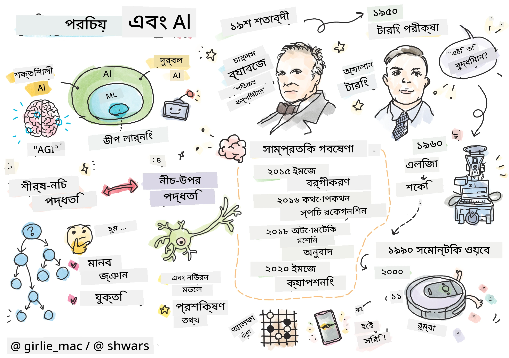
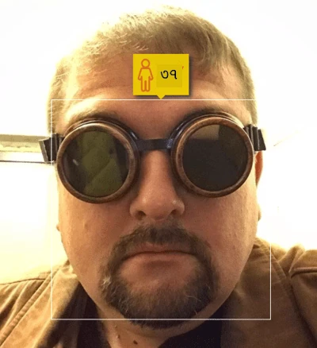
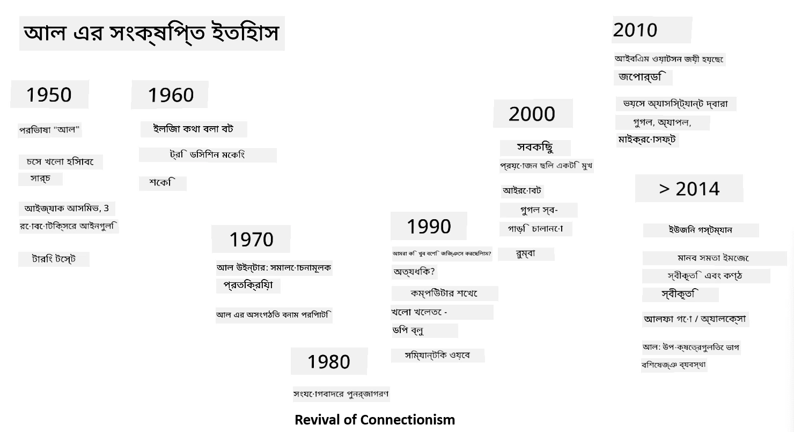

# AI পরিচিতি

> স্কেচনোট: [Tomomi Imura](https://twitter.com/girlie_mac)

## [পূর্ব-লেকচার কুইজ](https://ff-quizzes.netlify.app/en/ai/quiz/1)

**কৃত্রিম বুদ্ধিমত্তা** একটি উত্তেজনাপূর্ণ বৈজ্ঞানিক শাখা যা গবেষণা করে কীভাবে কম্পিউটারকে বুদ্ধিমান আচরণ প্রদর্শন করানো যায়, যেমন মানুষের দক্ষতার কাজগুলো করা।

মূলত, কম্পিউটার আবিষ্কার করেছিলেন [Charles Babbage](https://en.wikipedia.org/wiki/Charles_Babbage) সংখ্যা নিয়ে কাজ করার জন্য, একটি সুস্পষ্ট প্রক্রিয়া অনুসরণ করে - একটি অ্যালগরিদম। আধুনিক কম্পিউটার, যদিও ১৯শ শতাব্দীতে প্রস্তাবিত মূল মডেলের তুলনায় অনেক বেশি উন্নত, তবুও নিয়ন্ত্রিত গণনার একই ধারণা অনুসরণ করে। তাই, যদি আমরা জানি লক্ষ্য অর্জনের জন্য প্রয়োজনীয় সঠিক ধাপগুলোর ক্রম, তাহলে কম্পিউটারকে কিছু করতে প্রোগ্রাম করা সম্ভব।

> ছবি: [Vickie Soshnikova](http://twitter.com/vickievalerie)

> ✅ একজন ব্যক্তির ছবি দেখে তার বয়স নির্ধারণ করা এমন একটি কাজ যা স্পষ্টভাবে প্রোগ্রাম করা সম্ভব নয়, কারণ আমরা জানি না কীভাবে আমাদের মাথায় একটি সংখ্যা আসে যখন আমরা এটি করি।

---

তবে এমন কিছু কাজ আছে যা আমরা স্পষ্টভাবে কীভাবে সমাধান করতে হয় তা জানি না। একজন ব্যক্তির ছবি দেখে তার বয়স নির্ধারণ করার বিষয়টি বিবেচনা করুন। আমরা এটি করতে শিখি, কারণ আমরা বিভিন্ন বয়সের মানুষের অনেক উদাহরণ দেখেছি, কিন্তু আমরা স্পষ্টভাবে ব্যাখ্যা করতে পারি না কীভাবে এটি করি, বা কম্পিউটারকে এটি করতে প্রোগ্রাম করতে পারি না। এ ধরনের কাজগুলোই **কৃত্রিম বুদ্ধিমত্তা** (সংক্ষেপে AI) এর আগ্রহের বিষয়।

✅ এমন কিছু কাজের কথা ভাবুন যা আপনি কম্পিউটারে স্থানান্তর করতে পারেন এবং AI থেকে উপকৃত হতে পারেন। অর্থনীতি, চিকিৎসা এবং শিল্পের ক্ষেত্রগুলো বিবেচনা করুন - আজ AI কীভাবে এই ক্ষেত্রগুলোকে উপকৃত করছে?

## দুর্বল AI বনাম শক্তিশালী AI

দুর্বল AI | শক্তিশালী AI
---------------------------------------|-------------------------------------
দুর্বল AI এমন AI সিস্টেমকে বোঝায় যা একটি নির্দিষ্ট কাজ বা সংকীর্ণ কাজের সেটের জন্য ডিজাইন এবং প্রশিক্ষিত।|শক্তিশালী AI, বা কৃত্রিম সাধারণ বুদ্ধিমত্তা (AGI), এমন AI সিস্টেমকে বোঝায় যা মানুষের মতো বুদ্ধিমত্তা এবং বোঝাপড়া রাখে।
এই AI সিস্টেমগুলো সাধারণত বুদ্ধিমান নয়; তারা পূর্বনির্ধারিত কাজে দক্ষ, কিন্তু প্রকৃত বোঝাপড়া বা সচেতনতা নেই।|এই AI সিস্টেমগুলো যেকোনো বুদ্ধিবৃত্তিক কাজ করতে পারে যা একজন মানুষ করতে পারে, বিভিন্ন ক্ষেত্রে মানিয়ে নিতে পারে এবং সচেতনতা বা আত্ম-সচেতনতা রাখে।
দুর্বল AI এর উদাহরণ হলো ভার্চুয়াল অ্যাসিস্ট্যান্ট যেমন Siri বা Alexa, স্ট্রিমিং সার্ভিসের সুপারিশ অ্যালগরিদম এবং নির্দিষ্ট গ্রাহক সেবার জন্য ডিজাইন করা চ্যাটবট।|শক্তিশালী AI অর্জন AI গবেষণার দীর্ঘমেয়াদি লক্ষ্য এবং এর জন্য এমন AI সিস্টেমের উন্নয়ন প্রয়োজন যা যুক্তি করতে পারে, শিখতে পারে, বুঝতে পারে এবং বিভিন্ন কাজ ও প্রেক্ষাপটে মানিয়ে নিতে পারে।
দুর্বল AI অত্যন্ত বিশেষায়িত এবং এর সংকীর্ণ ক্ষেত্রের বাইরে মানবসদৃশ জ্ঞানী ক্ষমতা বা সাধারণ সমস্যা সমাধানের ক্ষমতা নেই।|শক্তিশালী AI বর্তমানে একটি তাত্ত্বিক ধারণা, এবং কোনো AI সিস্টেম এই সাধারণ বুদ্ধিমত্তার স্তরে পৌঁছায়নি।

আরও তথ্যের জন্য **[Artificial General Intelligence](https://en.wikipedia.org/wiki/Artificial_general_intelligence)** (AGI) দেখুন।

## বুদ্ধিমত্তার সংজ্ঞা এবং টুরিং টেস্ট

**[বুদ্ধিমত্তা](https://en.wikipedia.org/wiki/Intelligence)** শব্দটি নিয়ে কাজ করার সময় একটি সমস্যা হলো এই শব্দটির কোনো স্পষ্ট সংজ্ঞা নেই। কেউ যুক্তি করতে পারে যে বুদ্ধিমত্তা **অমূর্ত চিন্তা** বা **আত্ম-সচেতনতার** সাথে সংযুক্ত, কিন্তু আমরা এটি সঠিকভাবে সংজ্ঞায়িত করতে পারি না।

> [ছবি](https://unsplash.com/photos/75715CVEJhI): [Amber Kipp](https://unsplash.com/@sadmax) Unsplash থেকে

*বুদ্ধিমত্তা* শব্দটির অস্পষ্টতা দেখতে, একটি প্রশ্নের উত্তর দেওয়ার চেষ্টা করুন: "একটি বিড়াল কি বুদ্ধিমান?" বিভিন্ন মানুষ এই প্রশ্নে ভিন্ন উত্তর দিতে পারে, কারণ এই দাবিটি সত্য বা মিথ্যা প্রমাণ করার জন্য কোনো সর্বজনগ্রাহ্য পরীক্ষা নেই। এবং যদি আপনি মনে করেন যে আছে - আপনার বিড়ালকে একটি IQ পরীক্ষায় চালানোর চেষ্টা করুন...

✅ এক মিনিটের জন্য ভাবুন আপনি কীভাবে বুদ্ধিমত্তা সংজ্ঞায়িত করবেন। একটি কাক যে একটি গোলকধাঁধা সমাধান করে খাবার পায়, সে কি বুদ্ধিমান? একটি শিশু কি বুদ্ধিমান?

---

AGI নিয়ে কথা বলার সময় আমাদের এমন একটি উপায় প্রয়োজন যা বলে দিতে পারে আমরা সত্যিকারের বুদ্ধিমান সিস্টেম তৈরি করেছি কিনা। [Alan Turing](https://en.wikipedia.org/wiki/Alan_Turing) একটি উপায় প্রস্তাব করেছিলেন, যাকে **[টুরিং টেস্ট](https://en.wikipedia.org/wiki/Turing_test)** বলা হয়, যা বুদ্ধিমত্তার সংজ্ঞা হিসেবেও কাজ করে। এই পরীক্ষা একটি প্রদত্ত সিস্টেমকে একটি স্বাভাবিক বুদ্ধিমান কিছু - একজন বাস্তব মানুষ - এর সাথে তুলনা করে, এবং যেহেতু কোনো স্বয়ংক্রিয় তুলনা একটি কম্পিউটার প্রোগ্রাম দ্বারা বাইপাস করা যেতে পারে, আমরা একজন মানব প্রশ্নকর্তাকে ব্যবহার করি। তাই, যদি একজন মানুষ একটি বাস্তব ব্যক্তি এবং একটি কম্পিউটার সিস্টেমের মধ্যে পাঠ্য-ভিত্তিক সংলাপে পার্থক্য করতে অক্ষম হয় - তাহলে সিস্টেমটিকে বুদ্ধিমান বলে বিবেচনা করা হয়।

> [Eugene Goostman](https://en.wikipedia.org/wiki/Eugene_Goostman) নামক একটি চ্যাটবট, যা সেন্ট পিটার্সবার্গে তৈরি করা হয়েছিল, ২০১৪ সালে টুরিং টেস্টে উত্তীর্ণ হওয়ার কাছাকাছি পৌঁছেছিল একটি চতুর ব্যক্তিত্ব কৌশল ব্যবহার করে। এটি শুরুতেই ঘোষণা করেছিল যে এটি একটি ১৩ বছর বয়সী ইউক্রেনীয় ছেলে, যা জ্ঞানের অভাব এবং কিছু অসঙ্গতির ব্যাখ্যা দেবে। বটটি ৫ মিনিটের সংলাপের পর ৩০% বিচারককে বিশ্বাস করাতে সক্ষম হয়েছিল যে এটি একজন মানুষ, একটি মেট্রিক যা টুরিং বিশ্বাস করেছিলেন একটি মেশিন ২০০০ সালের মধ্যে উত্তীর্ণ হতে পারবে। তবে, এটি বোঝা উচিত যে এটি নির্দেশ করে না যে আমরা একটি বুদ্ধিমান সিস্টেম তৈরি করেছি, বা একটি কম্পিউটার সিস্টেম মানব প্রশ্নকর্তাকে বোকা বানিয়েছে - সিস্টেমটি মানুষকে বোকা বানায়নি, বরং বট নির্মাতারা তা করেছেন!

✅ আপনি কি কখনো কোনো চ্যাটবট দ্বারা বোকা বানানো হয়েছে, মনে করে যে আপনি একজন মানুষের সাথে কথা বলছেন? এটি কীভাবে আপনাকে বিশ্বাস করিয়েছে?

## AI এর বিভিন্ন পদ্ধতি

যদি আমরা চাই কম্পিউটার মানুষের মতো আচরণ করুক, তাহলে আমাদের কোনোভাবে কম্পিউটারের ভেতরে আমাদের চিন্তার ধরন মডেল করতে হবে। সুতরাং, আমাদের বুঝতে চেষ্টা করতে হবে কী একজন মানুষকে বুদ্ধিমান করে তোলে।

> একটি মেশিনে বুদ্ধিমত্তা প্রোগ্রাম করতে সক্ষম হতে হলে, আমাদের নিজের সিদ্ধান্ত নেওয়ার প্রক্রিয়াগুলো কীভাবে কাজ করে তা বুঝতে হবে। যদি আপনি একটু আত্ম-পর্যালোচনা করেন, আপনি বুঝতে পারবেন যে কিছু প্রক্রিয়া অবচেতনভাবে ঘটে – যেমন আমরা বিড়াল এবং কুকুরের মধ্যে পার্থক্য করতে পারি চিন্তা না করেই - যখন অন্যগুলো যুক্তি জড়িত।

এই সমস্যার দুটি সম্ভাব্য পদ্ধতি আছে:

টপ-ডাউন পদ্ধতি (প্রতীকী যুক্তি) | বটম-আপ পদ্ধতি (নিউরাল নেটওয়ার্ক)
---------------------------------------|-------------------------------------
টপ-ডাউন পদ্ধতি একটি সমস্যার সমাধানে একজন ব্যক্তির যুক্তি করার পদ্ধতিকে মডেল করে। এটি একজন মানুষের কাছ থেকে **জ্ঞান** বের করে, এবং এটি কম্পিউটার-পাঠযোগ্য আকারে উপস্থাপন করে। আমাদের কম্পিউটারের ভেতরে **যুক্তি** মডেল করার একটি উপায়ও তৈরি করতে হবে। | বটম-আপ পদ্ধতি একটি মানুষের মস্তিষ্কের গঠনকে মডেল করে, যা **নিউরন** নামে একটি বিশাল সংখ্যক সরল ইউনিট নিয়ে গঠিত। প্রতিটি নিউরন তার ইনপুটগুলোর একটি ওজনযুক্ত গড়ের মতো কাজ করে, এবং আমরা **প্রশিক্ষণ ডেটা** প্রদান করে নিউরনের একটি নেটওয়ার্ককে সমস্যার সমাধানে প্রশিক্ষণ দিতে পারি।

এছাড়াও বুদ্ধিমত্তার জন্য কিছু অন্যান্য সম্ভাব্য পদ্ধতি আছে:

* একটি **উদ্ভূত**, **সিনারজেটিক** বা **মাল্টি-এজেন্ট পদ্ধতি** একটি বৃহৎ সংখ্যক সরল এজেন্টের মিথস্ক্রিয়ার মাধ্যমে জটিল বুদ্ধিমান আচরণ অর্জন করা সম্ভব বলে ভিত্তি করে। [ইভোলিউশনারি সাইবারনেটিক্স](https://en.wikipedia.org/wiki/Global_brain#Evolutionary_cybernetics) অনুযায়ী, বুদ্ধিমত্তা *উদ্ভূত* হতে পারে আরও সরল, প্রতিক্রিয়াশীল আচরণ থেকে *মেটাসিস্টেম ট্রানজিশন* প্রক্রিয়ায়।

* একটি **ইভোলিউশনারি পদ্ধতি**, বা **জেনেটিক অ্যালগরিদম** একটি অপ্টিমাইজেশন প্রক্রিয়া যা বিবর্তনের নীতির উপর ভিত্তি করে।

আমরা এই পদ্ধতিগুলো পরে কোর্সে বিবেচনা করব, কিন্তু এখন আমরা দুটি প্রধান দিকের উপর মনোযোগ দেব: টপ-ডাউন এবং বটম-আপ।

### টপ-ডাউন পদ্ধতি

একটি **টপ-ডাউন পদ্ধতি**তে, আমরা আমাদের যুক্তি করার পদ্ধতিকে মডেল করার চেষ্টা করি। কারণ আমরা যুক্তি করার সময় আমাদের চিন্তাগুলো অনুসরণ করতে পারি, আমরা এই প্রক্রিয়াকে আনুষ্ঠানিকভাবে তৈরি করে কম্পিউটারের ভেতরে প্রোগ্রাম করার চেষ্টা করতে পারি। এটিকে **প্রতীকী যুক্তি** বলা হয়।

মানুষের মাথায় কিছু নিয়ম থাকে যা তাদের সিদ্ধান্ত গ্রহণের প্রক্রিয়াকে পরিচালিত করে। উদাহরণস্বরূপ, যখন একজন ডাক্তার একজন রোগীর রোগ নির্ণয় করছেন, তিনি বা তিনি বুঝতে পারেন যে একজন ব্যক্তির জ্বর আছে, এবং তাই শরীরের ভেতরে কিছু প্রদাহ হতে পারে। একটি নির্দিষ্ট সমস্যার উপর একটি বৃহৎ সেটের নিয়ম প্রয়োগ করে একজন ডাক্তার চূড়ান্ত রোগ নির্ণয়ে পৌঁছাতে পারেন।

এই পদ্ধতি **জ্ঞান উপস্থাপন** এবং **যুক্তি** এর উপর ব্যাপকভাবে নির্ভর করে। একজন মানব বিশেষজ্ঞ থেকে জ্ঞান বের করা সবচেয়ে কঠিন অংশ হতে পারে, কারণ অনেক ক্ষেত্রে একজন ডাক্তার ঠিক জানেন না কেন তিনি বা তিনি একটি নির্দিষ্ট রোগ নির্ণয়ে পৌঁছাচ্ছেন। কখনো কখনো সমাধানটি তার বা তার মাথায় স্পষ্ট চিন্তা ছাড়াই উঠে আসে। কিছু কাজ, যেমন একটি ছবির মাধ্যমে একজন ব্যক্তির বয়স নির্ধারণ করা, একেবারেই জ্ঞান পরিচালনায় কমিয়ে আনা সম্ভব নয়।

### বটম-আপ পদ্ধতি

অন্যদিকে, আমরা আমাদের মস্তিষ্কের সবচেয়ে সরল উপাদান – একটি নিউরন – মডেল করার চেষ্টা করতে পারি। আমরা কম্পিউটারের ভেতরে একটি **কৃত্রিম নিউরাল নেটওয়ার্ক** তৈরি করতে পারি, এবং তারপর এটি সমস্যার সমাধানে শেখানোর চেষ্টা করতে পারি উদাহরণ দিয়ে। এই প্রক্রিয়া অনেকটা একজন নবজাতক শিশুর তার চারপাশ সম্পর্কে পর্যবেক্ষণ করে শেখার মতো।

✅ একটু গবেষণা করুন শিশুরা কীভাবে শেখে। একটি শিশুর মস্তিষ্কের মৌলিক উপাদানগুলো কী?

> | ML সম্পর্কে কী?         |      |
> |--------------|-----------|
> | কৃত্রিম বুদ্ধিমত্তার অংশ যা কম্পিউটারকে কিছু ডেটার ভিত্তিতে একটি সমস্যা সমাধানে শেখানোর উপর ভিত্তি করে তাকে **মেশিন লার্নিং** বলা হয়। আমরা এই কোর্সে ক্লাসিক্যাল মেশিন লার্নিং বিবেচনা করব না - আমরা আপনাকে একটি পৃথক [Machine Learning for Beginners](http://aka.ms/ml-beginners) কারিকুলামে রেফার করছি। |       |

## AI এর সংক্ষিপ্ত ইতিহাস

কৃত্রিম বুদ্ধিমত্তা একটি ক্ষেত্র হিসেবে শুরু হয়েছিল বিংশ শতাব্দীর মাঝামাঝি। প্রথমদিকে, প্রতীকী যুক্তি একটি প্রভাবশালী পদ্ধতি ছিল, এবং এটি কিছু গুরুত্বপূর্ণ সাফল্য অর্জন করেছিল, যেমন বিশেষজ্ঞ সিস্টেম – কম্পিউটার প্রোগ্রাম যা কিছু সীমিত সমস্যার ক্ষেত্রে একজন বিশেষজ্ঞের মতো কাজ করতে সক্ষম ছিল। তবে, শীঘ্রই এটি স্পষ্ট হয়ে যায় যে এই পদ্ধতি ভালোভাবে স্কেল করে না। একজন বিশেষজ্ঞ থেকে জ্ঞান বের করা, কম্পিউটারে উপস্থাপন করা, এবং সেই জ্ঞানভাণ্ডারকে সঠিক রাখা একটি অত্যন্ত জটিল কাজ এবং অনেক ক্ষেত্রে ব্যবহারিকভাবে খুব ব্যয়বহুল। এটি ১৯৭০-এর দশকে তথাকথিত [AI Winter](https://en.wikipedia.org/wiki/AI_winter) এর দিকে নিয়ে যায়।

> ছবি: [Dmitry Soshnikov](http://soshnikov.com)

সময়ের সাথে সাথে, কম্পিউটিং রিসোর্স সস্তা হয়ে গেছে, এবং আরও ডেটা উপলব্ধ হয়েছে, তাই নিউরাল নেটওয়ার্ক পদ্ধতিগুলো অনেক ক্ষেত্রে মানুষের সাথে প্রতিযোগিতায় দুর্দান্ত পারফর্মেন্স প্রদর্শন করতে শুরু করেছে, যেমন কম্পিউটার ভিশন বা বক্তৃতা বোঝা। গত দশকে, কৃত্রিম বুদ্ধিমত্তা শব্দটি বেশিরভাগ ক্ষেত্রে নিউরাল নেটওয়ার্কের সমার্থক হিসেবে ব্যবহৃত হয়েছে, কারণ আমরা যে AI সাফল্যগুলো শুনি তার বেশিরভাগই এর উপর ভিত্তি করে।

আমরা দেখতে পারি কীভাবে পদ্ধতিগুলো পরিবর্তিত হয়েছে, উদাহরণস্বরূপ, একটি দাবা খেলার কম্পিউটার প্রোগ্রাম তৈরি করতে:

* প্রাথমিক দাবা প্রোগ্রামগুলো অনুসন্ধানের উপর ভিত্তি করে ছিল – একটি প্রোগ্রাম একটি প্রদত্ত সংখ্যক পরবর্তী চালের জন্য প্রতিপক্ষের সম্ভাব্য চালগুলো অনুমান করার চেষ্টা করত, এবং কয়েকটি চালের মধ্যে অর্জনযোগ্য সর্বোত্তম অবস্থানের ভিত্তিতে একটি সর্বোত্তম চাল নির্বাচন করত। এটি তথাকথিত [alpha-beta pruning](https://en.wikipedia.org/wiki/Alpha%E2%80%93beta_pruning) অনুসন্ধান অ্যালগরিদমের উন্নয়নে নিয়ে যায়।
* অনুসন্ধান কৌশলগুলো খেলার শেষের দিকে ভালো কাজ করে, যেখানে অনুসন্ধান ক্ষেত্রটি সীমিত সংখ্যক সম্ভাব্য চাল দ্বারা সীমাবদ্ধ। তবে, খেলার শুরুতে, অনুসন্ধান ক্ষেত্রটি বিশাল, এবং অ্যালগরিদমটি মানব খেলোয়াড়দের মধ্যে বিদ্যমান ম্যাচ থেকে শেখার মাধ্যমে উন্নত করা যেতে পারে। পরবর্তী পরীক্ষাগুলো তথাকথিত [case-based reasoning](https://en.wikipedia.org/wiki/Case-based_reasoning) ব্যবহার করেছিল, যেখানে প্রোগ্রামটি জ্ঞানভাণ্ডারে বর্তমান অবস্থানের সাথে খুব মিল থাকা কেসগুলো খুঁজছিল।
* আধুনিক প্রোগ্রামগুলো, যা মানব খেলোয়াড়দের হারায়, নিউরাল নেটওয়ার্ক এবং [reinforcement learning](https://en.wikipedia.org/wiki/Reinforcement_learning) এর উপর ভিত্তি করে, যেখানে প্রোগ্রামগুলো শুধুমাত্র নিজেদের বিরুদ্ধে দীর্ঘ সময় ধরে খেলে এবং নিজেদের ভুল থেকে শেখার মাধ্যমে খেলতে শেখে – অনেকটা মানুষের দাবা শেখার মতো। তবে, একটি কম্পিউটার প্রোগ্রাম অনেক বেশি গেম খেলতে পারে অনেক কম সময়ে, এবং তাই অনেক দ্রুত শিখতে পারে।

✅ AI দ্বারা খেলা অন্য গেমগুলো নিয়ে একটু গবেষণা করুন।

একইভাবে, আমরা দেখতে পারি কীভাবে “কথা বলা প্রোগ্রাম” (যা টুরিং টেস্টে উত্তীর্ণ হতে পারে) তৈরির পদ্ধতি পরিবর্তিত হয়েছে:

* এই ধরনের প্রাথমিক প্রোগ্রামগুলো যেমন [Eliza](https://en.wikipedia.org/wiki/ELIZA), খুব সরল ব্যাকরণগত নিয়ম এবং ইনপুট বাক্যকে একটি প্রশ্নে পুনর্গঠন করার উপর ভিত্তি করে ছিল।
* আধুনিক অ্যাসিস্ট্যান্টগুলো, যেমন Cortana, Siri বা Google Assistant, সবই হাইব্রিড সিস্টেম যা বক্তৃতাকে পাঠ্যে রূপান্তর করতে এবং আমাদের উদ্দেশ্য চিনতে নিউরাল নেটওয়ার্ক ব্যবহার করে, এবং তারপর কিছু যুক্তি বা স্পষ্ট অ্যালগরিদম ব্যবহার করে প্রয়োজনীয় কাজ সম্পাদন করে।
* ভবিষ্যতে, আমরা আশা করতে পারি একটি সম্পূর্ণ নিউরাল-ভিত্তিক মডেল সংলাপ নিজেই পরিচালনা করবে। সাম্প্রতিক GPT এবং [Turing-NLG](https://www.microsoft.com/research/blog/turing-nlg-a-17-billion-parameter-language-model-by-microsoft) নিউরাল নেটওয়ার্কের পরিবার এই
> ছবি: Dmitry Soshnikov, [ছবি](https://unsplash.com/photos/r8LmVbUKgns) তোলা [Marina Abrosimova](https://unsplash.com/@abrosimova_marina_foto), Unsplash

## সাম্প্রতিক AI গবেষণা

নিউরাল নেটওয়ার্ক গবেষণার বিশাল সম্প্রসারণ শুরু হয়েছিল ২০১০ সালের দিকে, যখন বড় বড় পাবলিক ডেটাসেটগুলো সহজলভ্য হতে শুরু করে। একটি বিশাল চিত্র সংগ্রহ, [ImageNet](https://en.wikipedia.org/wiki/ImageNet), যেখানে প্রায় ১৪ মিলিয়ন এনোটেটেড ছবি রয়েছে, এটি [ImageNet Large Scale Visual Recognition Challenge](https://image-net.org/challenges/LSVRC/) এর জন্ম দেয়।

> ছবি: [Dmitry Soshnikov](http://soshnikov.com)

২০১২ সালে, [Convolutional Neural Networks](../4-ComputerVision/07-ConvNets/README.md) প্রথমবারের মতো চিত্র শ্রেণীবিন্যাসে ব্যবহৃত হয়, যা শ্রেণীবিন্যাস ত্রুটির হার উল্লেখযোগ্যভাবে কমিয়ে দেয় (প্রায় ৩০% থেকে ১৬.৪% পর্যন্ত)। ২০১৫ সালে, Microsoft Research এর ResNet আর্কিটেকচার [মানব-স্তরের সঠিকতা অর্জন করে](https://doi.org/10.1109/ICCV.2015.123)।

এর পর থেকে, নিউরাল নেটওয়ার্ক বিভিন্ন কাজে অত্যন্ত সফল আচরণ প্রদর্শন করেছে:

---

বছর | মানব-সমতুল্য অর্জিত
-----|--------
২০১৫ | [চিত্র শ্রেণীবিন্যাস](https://doi.org/10.1109/ICCV.2015.123)
২০১৬ | [কথোপকথনমূলক বক্তৃতা স্বীকৃতি](https://arxiv.org/abs/1610.05256)
২০১৮ | [স্বয়ংক্রিয় মেশিন অনুবাদ](https://arxiv.org/abs/1803.05567) (চীনা থেকে ইংরেজি)
২০২০ | [চিত্র ক্যাপশনিং](https://arxiv.org/abs/2009.13682)

গত কয়েক বছরে আমরা বড় ভাষার মডেলগুলোর বিশাল সাফল্য দেখেছি, যেমন BERT এবং GPT-3। এটি মূলত সম্ভব হয়েছে কারণ প্রচুর সাধারণ টেক্সট ডেটা সহজলভ্য, যা আমাদের মডেলগুলোকে টেক্সটের গঠন এবং অর্থ বুঝতে প্রশিক্ষণ দিতে সাহায্য করে। এই মডেলগুলোকে সাধারণ টেক্সট সংগ্রহে প্রি-ট্রেন করা হয় এবং তারপর নির্দিষ্ট কাজের জন্য বিশেষায়িত করা হয়। আমরা এই কোর্সে পরে [Natural Language Processing](../5-NLP/README.md) সম্পর্কে আরও শিখব।

## 🚀 চ্যালেঞ্জ

ইন্টারনেটে ঘুরে দেখুন এবং আপনার মতে AI সবচেয়ে কার্যকরভাবে কোথায় ব্যবহৃত হচ্ছে তা নির্ধারণ করুন। এটি কি কোনো ম্যাপিং অ্যাপে, বা কোনো স্পিচ-টু-টেক্সট সার্ভিসে, অথবা কোনো ভিডিও গেমে? গবেষণা করুন কীভাবে এই সিস্টেমটি তৈরি করা হয়েছে।

## [পোস্ট-লেকচার কুইজ](https://ff-quizzes.netlify.app/en/ai/quiz/2)

## পর্যালোচনা ও স্ব-অধ্যয়ন

AI এবং ML এর ইতিহাস পর্যালোচনা করুন [এই পাঠটি](https://github.com/microsoft/ML-For-Beginners/tree/main/1-Introduction/2-history-of-ML) পড়ে। এই পাঠের শীর্ষে থাকা স্কেচনোট থেকে বা এই পাঠ থেকে একটি উপাদান নিন এবং এর সাংস্কৃতিক প্রেক্ষাপট সম্পর্কে আরও গভীরভাবে গবেষণা করুন যা এর বিকাশকে প্রভাবিত করেছে।

**অ্যাসাইনমেন্ট**: [গেম জ্যাম](assignment.md)

---

<!-- CO-OP TRANSLATOR DISCLAIMER START -->
**অস্বীকৃতি**:  
এই নথিটি AI অনুবাদ পরিষেবা [Co-op Translator](https://github.com/Azure/co-op-translator) ব্যবহার করে অনুবাদ করা হয়েছে। আমরা যথাসাধ্য সঠিকতা নিশ্চিত করার চেষ্টা করি, তবে অনুগ্রহ করে মনে রাখবেন যে স্বয়ংক্রিয় অনুবাদে ত্রুটি বা অসঙ্গতি থাকতে পারে। মূল ভাষায় থাকা নথিটিকে প্রামাণিক উৎস হিসেবে বিবেচনা করা উচিত। গুরুত্বপূর্ণ তথ্যের জন্য, পেশাদার মানব অনুবাদ সুপারিশ করা হয়। এই অনুবাদ ব্যবহারের ফলে কোনো ভুল বোঝাবুঝি বা ভুল ব্যাখ্যা হলে আমরা দায়বদ্ধ থাকব না।
<!-- CO-OP TRANSLATOR DISCLAIMER END -->