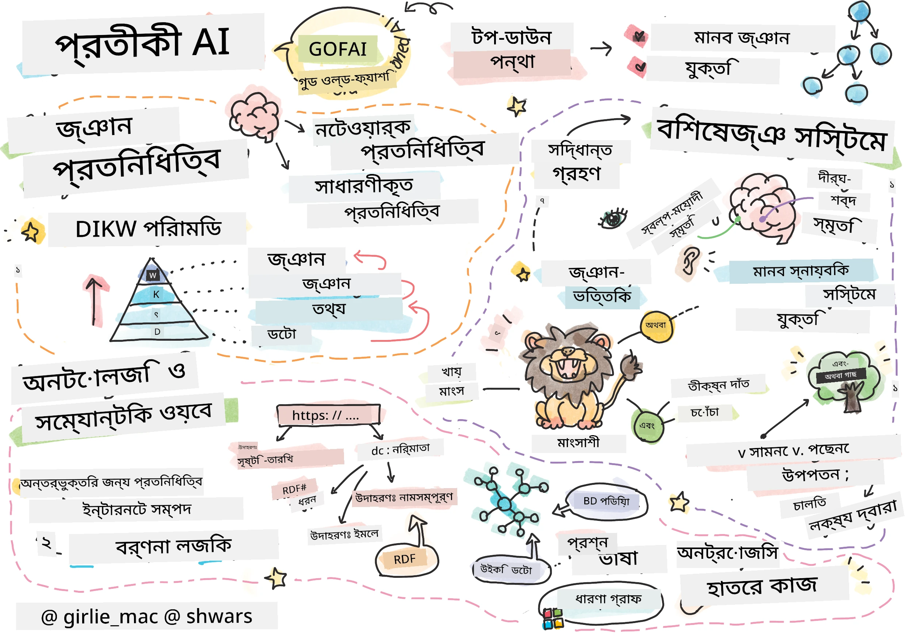
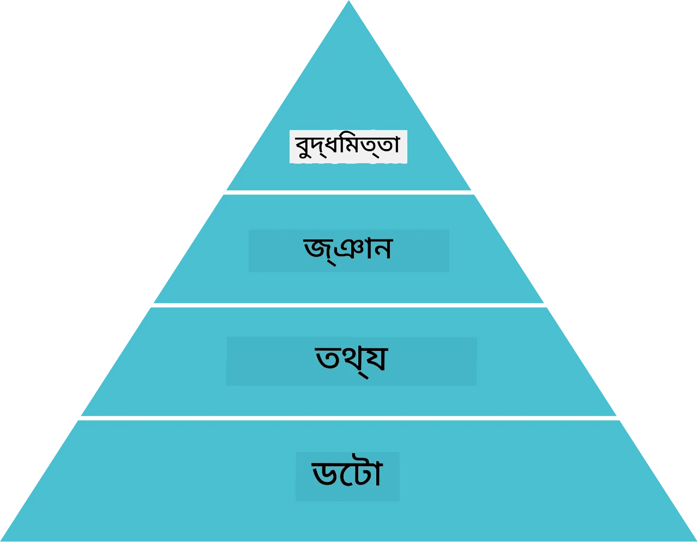
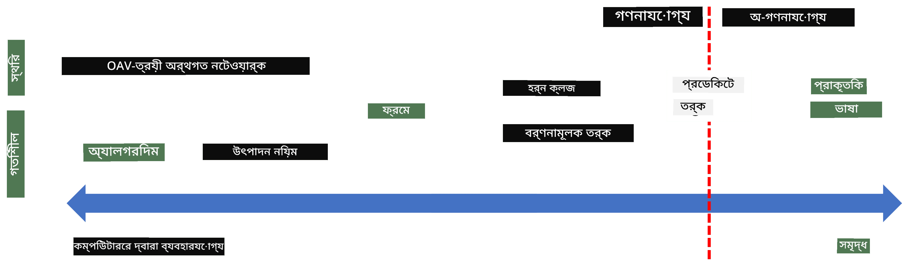
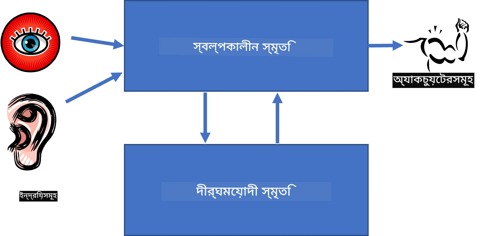
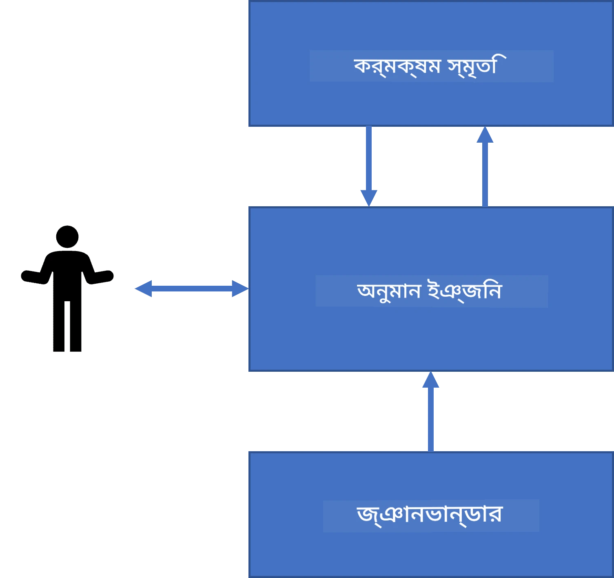
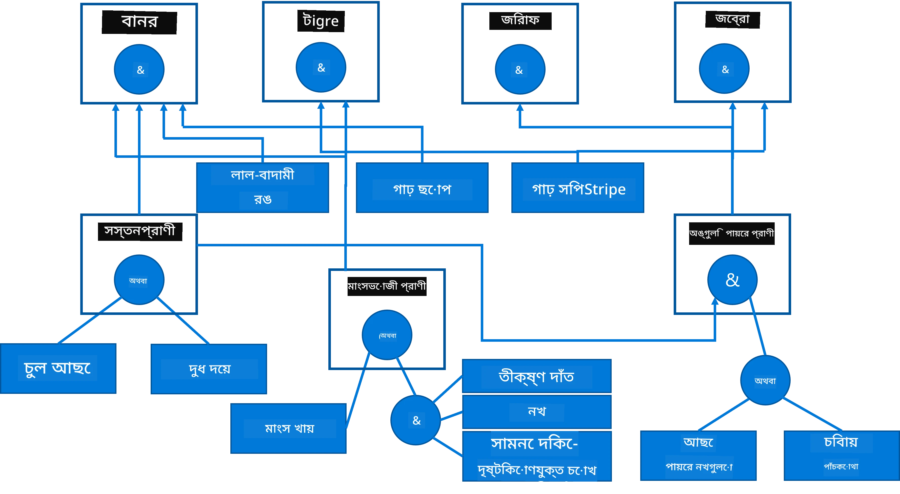
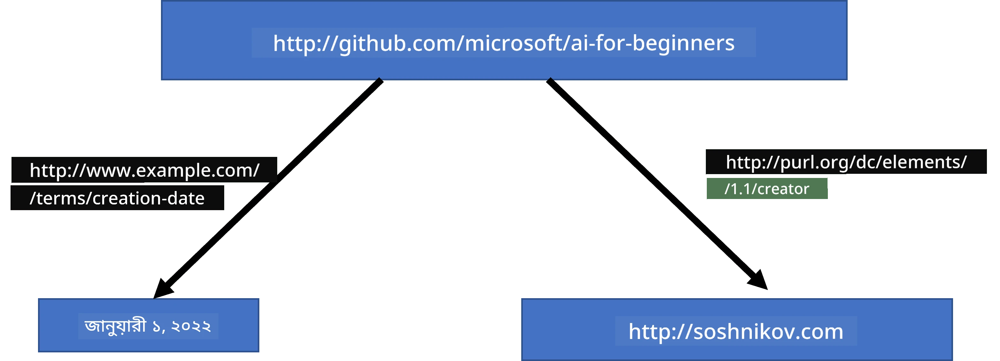
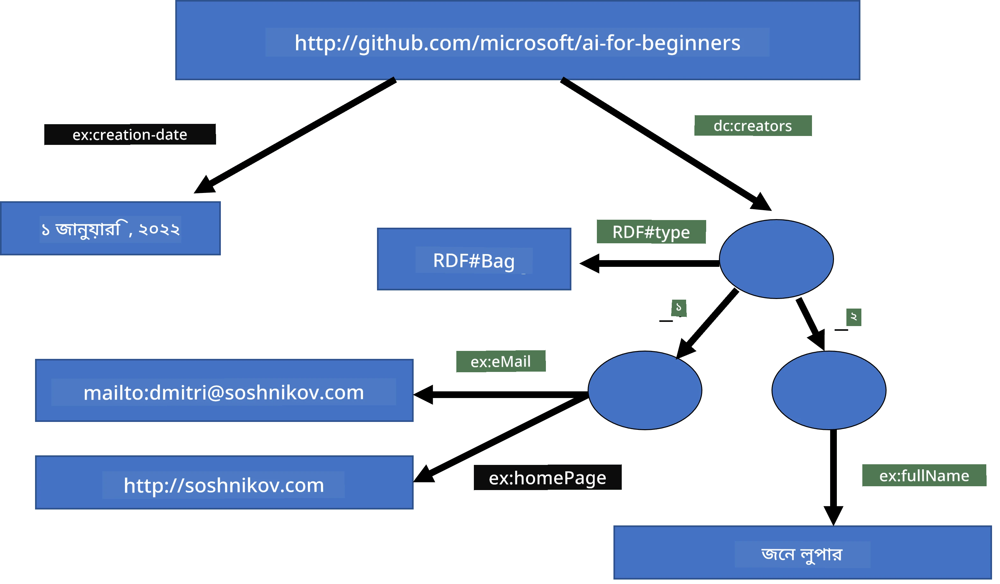

# জ্ঞান উপস্থাপন এবং বিশেষজ্ঞ সিস্টেম



> স্কেচনোট [Tomomi Imura](https://twitter.com/girlie_mac) দ্বারা

কৃত্রিম বুদ্ধিমত্তার জন্য যাত্রা জ্ঞানের অনুসন্ধানের উপর ভিত্তি করে, যেভাবে মানুষ বোঝে সেভাবে পৃথিবীকে অর্থ দেওয়ার জন্য। কিন্তু এটা কীভাবে করা যেতে পারে?

## [পূর্ব-অভিযান কুইজ](https://ff-quizzes.netlify.app/en/ai/quiz/3)

AI এর প্রাথমিক দিনে, বুদ্ধিমান সিস্টেম তৈরি করার জন্য শীর্ষ-থেকে-নিচের পদ্ধতি (পূর্ববর্তী পাঠে আলোচনা করা হয়েছে) জনপ্রিয় ছিল। ধারণাটি ছিল মানুষের কাছ থেকে জ্ঞান সংগ্রহ করে যেকোনো যন্ত্র-পাঠযোগ্য রূপে রূপান্তর করা, এবং তারপর এটি স্বয়ংক্রিয়ভাবে সমস্যা সমাধানে ব্যবহার করা। এই পদ্ধতিটি দুইটি বড় ধারণার উপর ভিত্তি করেছিল:

* জ্ঞান উপস্থাপন
* যুক্তি

## জ্ঞান উপস্থাপন

সঙ্কেতমূলক AI এর একটি গুরুত্বপূর্ণ ধারণা হল **জ্ঞান**। এটি *তথ্য* বা *ডেটা* থেকে পৃথক করা গুরুত্বপূর্ণ। উদাহরণস্বরূপ, কেউ বলতে পারেন যে বইতে জ্ঞান থাকে, কারণ বই পড়ে একজন বিশেষজ্ঞ হওয়া যায়। তবে, আসলে বইয়ে যা থাকে তাকে *ডেটা* বলা হয়, আর বই পড়ে এই ডেটা আমাদের বিশ্ব মডেলে একত্রিত করে আমরা ডেটাকে জ্ঞান রূপে রুপান্তর করি।

> ✅ **জ্ঞান** এমন কিছু যা আমাদের মস্তিষ্কে ধারণ, এবং যা আমাদের পৃথিবীর বোঝাপড়াকে প্রতিনিধিত্ব করে। এটি একটি সক্রিয় **শিক্ষণের** মাধ্যমে প্রাপ্ত হয়, যা আমরা প্রাপ্ত তথ্যের টুকরোকে আমাদের সক্রিয় বিশ্ব মডেলে যুক্ত করে।

সাধারণত আমরা জ্ঞানকে কঠোরভাবে সংজ্ঞায়িত করি না, কিন্তু এটি অন্যান্য সম্পর্কিত ধারণার সাথে সংযুক্ত করি [DIKW পিরামিড](https://en.wikipedia.org/wiki/DIKW_pyramid) ব্যবহার করে। এটি নিম্নলিখিত ধারণাগুলি অন্তর্ভুক্ত করে:

* **ডেটা** হল এমন কিছু যা শারীরিক মাধ্যমে উপস্থাপিত হয়, যেমন লিখিত লেখা বা মৌখিক শব্দ। ডেটা মানুষের থেকে স্বতন্ত্রভাবে উপস্থিত থাকে এবং মানুষের মধ্যে স্থানান্তরযোগ্য।
* **তথ্য** হল কিভাবে আমরা মস্তিষ্কে ডেটা ব্যাখ্যা করি। উদাহরণস্বরূপ, যখন আমরা *কম্পিউটার* শব্দ শুনি, আমাদের কিছু ধারণা থাকে এটি কী।
* **জ্ঞান** হল তথ্য যা আমাদের বিশ্ব মডেলে সংহত করা হয়েছে। উদাহরণস্বরূপ, একবার আমরা জানতে পারি কম্পিউটার কী, আমরা কম্পিউটার কীভাবে কাজ করে, এর মূল্য কত, এবং কী জন্য ব্যবহার করা যায় ইত্যাদি সম্পর্কে কিছু ধারণা পেতে শুরু করি। এই আন্তঃসংযুক্ত ধারণাগুলির নেটওয়ার্ক আমাদের জ্ঞান রূপায়িত করে।
* **জ্ঞানত্ত্ব** হল আমাদের পৃথিবীর বোঝাপড়ার আরও একটি স্তর, এবং এটি *মেটা-জ্ঞান* উপস্থাপন করে, যেমন কখন এবং কীভাবে জ্ঞান ব্যবহার করা উচিত তার কিছু ধারণা।



*ছবি [উইকিপিডিয়া থেকে](https://commons.wikimedia.org/w/index.php?curid=37705247), Longlivetheux - নিজস্ব কাজ, CC BY-SA 4.0*

সুতরাং, **জ্ঞান উপস্থাপন** সমস্যাটি হল কম্পিউটারের মধ্যে ডেটার রূপে জ্ঞান এমন একটি কার্যকর উপায় খুঁজে বের করা, যাতে এটি স্বয়ংক্রিয়ভাবে ব্যবহারযোগ্য হয়। এটি একটি স্পেকট্রাম হিসেবে দেখা যেতে পারে:



> ছবি [Dmitry Soshnikov](http://soshnikov.com) দ্বারা

* বামে, খুবই সহজ ধরনের জ্ঞান উপস্থাপন রয়েছে যা কম্পিউটার দ্বারা কার্যকরভাবে ব্যবহার করা যায়। সবচেয়ে সহজটি হল অ্যালগরিদমিক, যেখানে জ্ঞান একটি কম্পিউটার প্রোগ্রামের মাধ্যমে উপস্থাপিত হয়। এটি সবচেয়ে ভাল উপায় নয় কারণ এটি নমনীয় নয়। আমাদের মস্তিষ্কের ভিতরের জ্ঞান প্রায়ই অ্যালগরিদমিক নয়।
* ডানদিকে, এমন কিছু উপস্থাপন রয়েছে যেমন প্রাকৃতিক লেখা। এটি সবচেয়ে শক্তিশালী, তবে স্বয়ংক্রিয় যুক্তির জন্য ব্যবহার করা যায় না।

> ✅ এক মিনিট ভাবুন কিভাবে আপনি আপনার মাথায় জ্ঞান উপস্থাপন করেন এবং তা নোট হিসেবে রূপান্তরিত করেন। এমন কোন একটি নির্দিষ্ট ফরম্যাট কি আপনার জন্য retention এ সাহায্য করে?

## কম্পিউটার জ্ঞান উপস্থাপন শ্রেণীবদ্ধকরণ

আমরা বিভিন্ন কম্পিউটার জ্ঞান উপস্থাপনের পদ্ধতিগুলি নিম্নলিখিত শ্রেণীগুলিতে ভাগ করতে পারি:

* **নেটওয়ার্ক উপস্থাপনগুলি** ভিত্তিভূত যা আমাদের মাথার ভিতরে আন্তঃসম্পর্কিত ধারণার একটি নেটওয়ার্ক রয়েছে। আমরা একই নেটওয়ার্ককে কম্পিউটারের মধ্যে গ্রাফ হিসেবে অনুলিপি করার চেষ্টা করতে পারি — একে বলা হয় **সেমান্টিক নেটওয়ার্ক**।

1. **অবজেক্ট-অ্যাট্রিবিউট-ভ্যালু ট্রিপলেট** অথবা **অ্যাট্রিবিউট-ভ্যালু পেয়ার**। যেহেতু একটি গ্রাফ কম্পিউটারের মধ্যে একটি তালিকা হিসাবে উপস্থাপন করা যায়, nods এবং edges নিয়ে, আমরা সেমান্টিক নেটওয়ার্ককে ট্রিপলেটের তালিকা দ্বারা উপস্থাপন করতে পারি, যা অবজেক্ট, অ্যাট্রিবিউট এবং ভ্যালু রয়েছে। উদাহরণস্বরূপ, আমরা প্রোগ্রামিং ভাষা সম্পর্কে নিম্নলিখিত ট্রিপলেটগুলি তৈরি করি:

অবজেক্ট | অ্যাট্রিবিউট | মান
-------|-----------|------
Python | হল | Untyped-Language
Python | আবিষ্কার করেছিলেন | Guido van Rossum
Python | ব্লক-সিনট্যাক্স | ইনডেন্টেশন
Untyped-Language | নেই | টাইপ ডেফিনিশন

> ✅ ভাবুন কীভাবে ট্রিপলেট ব্যবহার করে অন্য ধরনের জ্ঞান উপস্থাপন করা যেতে পারে।

2. **বয়সনিরক বা শ্রেণিবিন্যাসমূলক উপস্থাপন** জোর দেয় যে আমরা প্রায়ই আমাদের মাথায় অবজেক্টের একটি শ্রেণিবিন্যাস তৈরি করি। উদাহরণস্বরূপ, আমরা জানি যে কানারি একটি পাখি, এবং সব পাখির ডানা থাকে। আমাদের কিছু ধারণা থাকে কানারি সাধারণত কী রঙের, এবং তাদের উড়ন্ত গতি কত।

   - **ফ্রেম উপস্থাপন** প্রতিটি অবজেক্ট বা অবজেক্ট শ্রেণীকে একটি **ফ্রেম** হিসেবে উপস্থাপন করে যা **স্লট** ধারণ করে। স্লটের সম্ভাব্য ডিফল্ট মান, মানের সীমাবদ্ধতা, বা সংরক্ষিত পদ্ধতি থাকতে পারে যেগুলি কল করে স্লটের মান পাওয়া যায়। সব ফ্রেম একত্রিত হয়ে অবজেক্ট-অরিয়েন্টেড প্রোগ্রামিং ভাষার অবজেক্ট শ্রেণিবিন্যাসের মতো একটি শ্রেণিবিন্যাস তৈরি করে।
   - **পটভূমি** হলো বিশেষ ধরনের ফ্রেম যা সময়ের সাথে বিকাশমান জটিল পরিস্থিতি উপস্থাপন করে।

**Python**

স্লট | মান | ডিফল্ট মান | ইন্টারভ্যাল |
-----|-------|---------------|------------|
নাম | Python | | |
মূল | Untyped-Language | | |
ভারিয়েবল কেস | | CamelCase | |
প্রোগ্রাম দৈর্ঘ্য | | | ৫-৫০০০ লাইন |
ব্লক সিনট্যাক্স | অন্তর | | |

3. **প্রক্ৰিয়াগত উপস্থাপন** হল এমন উপস্থাপন যা জ্ঞানকে কর্ম-তালিকার মাধ্যমে উপস্থাপন করে যা নির্দিষ্ট শর্ত পূরণ হলে চালানো যায়।
   - উৎপাদন নিয়মগুলি যা if-then বিবৃতি, এগুলো আমাদের সিদ্ধান্তে পৌঁছাতে সাহায্য করে। উদাহরণস্বরূপ, কোনো চিকিৎসকের এমন একটি নিয়ম থাকতে পারে যা বলে **যদি** কোনো রোগীর উচ্চ জ্বর থাকে **অথবা** রক্ত পরীক্ষায় C-reactive প্রোটিনের উচ্চ মাত্রা থাকে **তাহলে** তার প্রদাহ রয়েছে। শর্তগুলোর মধ্যে যখনই কোনটি পূরণ হয়, আমরা প্রদাহ সম্পর্কে সিদ্ধান্ত নিতে পারি, এবং পরে যুক্তি প্রয়োগে এটি ব্যবহার করি।
   - অ্যালগরিদমকে আরেক ধরনের প্রক্ৰিয়াগত উপস্থাপন হিসাবে বিবেচনা করা যেতে পারে, যদিও এগুলি প্রায়শই জ্ঞান-ভিত্তিক সিস্টেমে সরাসরি ব্যবহার করা হয় না।

4. **যুক্তি** মূলত অ্যারিস্টটল দ্বারা মানবতাত্ত্বিক সর্বজনীন জ্ঞান উপস্থাপনের উপায় হিসাবে প্রস্তাবিত হয়েছিল।
   - প্রেডিকেট লজিক একটি গাণিতিক তত্ত্ব হিসাবে খুবই জটিল এবং গণনাযোগ্য নয়, তাই এর একটি সীমিত অংশই সাধারণত ব্যবহৃত হয়, যেমন Prolog এ ব্যবহৃত Horn ক্লজ।
   - বর্ণনামূলক যুক্তি (Descriptive Logic) হল যুক্তির সিস্টেমের একটি পরিবার যা অবজেক্টের শ্রেণিবিন্যাস ও বিতরণকৃত জ্ঞান উপস্থাপন এবং যুক্তি করার জন্য ব্যবহৃত হয়, যেমন *সেমান্টিক ওয়েব*।

## বিশেষজ্ঞ সিস্টেম

সঙ্কেতমূলক AI এর প্রথম সাফল্যগুলির মধ্যে ছিল তথাকথিত **বিশেষজ্ঞ সিস্টেম** — কম্পিউটার সিস্টেম যা নির্দিষ্ট সমস্যার ক্ষেত্রে বিশেষজ্ঞ হিসাবে কাজ করার জন্য ডিজাইন করা হয়েছিল। এদের ভিত্তি ছিল এক বা একাধিক মানব বিশেষজ্ঞের কাছ থেকে সংগৃহীত একটি **জ্ঞান ভিত্তি**, এবং এদের মধ্যে ছিল একটি **যুক্তি ইঞ্জিন** যা তার ওপর কিছু যুক্তি প্রয়োগ করত।

 | 
---------------------------------------------|------------------------------------------------
মানব স্নায়ুতন্ত্রের সরলীকৃত কাঠামো | জ্ঞান-ভিত্তিক সিস্টেমের স্থাপত্য

বিশেষজ্ঞ সিস্টেমগুলি মানুষের যুক্তি ব্যবস্থার মতো গঠিত, যার মধ্যে থাকে **স্বল্প-মেয়াদী স্মৃতি** এবং **দীর্ঘ-মেয়াদী স্মৃতি**। অনুরূপভাবে, জ্ঞান-ভিত্তিক সিস্টেমে নিম্নলিখিত উপাদানগুলি চিহ্নিত করি:

* **সমস্যা স্মৃতি**: বর্তমানে সমাধানাধীন সমস্যার বিষয়ে জ্ঞান ধারণ করে, যেমন রোগীর তাপমাত্রা বা রক্তচাপ, প্রদাহ আছে কিনা ইত্যাদি। এই জ্ঞানকে **স্থিতিশীল জ্ঞান**ও বলা হয়, কারণ এটি সমস্যার বর্তমান অবস্থা বা *সমস্যা অবস্থা* এর একটি স্ন্যাপশট ধারণ করে।
* **জ্ঞানভিত্তি**: দীর্ঘমেয়াদী জ্ঞান যা একটি সমস্যা ক্ষেত্র সম্পর্কে। এটি মানব বিশেষজ্ঞদের কাছ থেকে ম্যানুয়ালি সংগৃহীত, এবং পরামর্শের সময় পরিবর্তিত হয় না। যেহেতু এটি আমাদের এক সমস্যা অবস্থা থেকে অন্যস্থানে যেতে দেয়, তাই এটিকে **গতিশীল জ্ঞান**ও বলা হয়।
* **যুক্তি ইঞ্জিন**: সমস্যার অবস্থা স্থান অনুসন্ধানের সম্পূর্ণ প্রক্রিয়া পরিচালনা করে, প্রয়োজনে ব্যবহারকারীর কাছে প্রশ্ন করে। এটি প্রতিটি অবস্থায় প্রযোজ্য সঠিক নিয়ম খুঁজে বের করার দায়িত্বেও থাকে।

উদাহরণস্বরূপ, চলুন নিচের শারীরিক বৈশিষ্ট্যের ভিত্তিতে একটি প্রাণী নির্ণয়কারী বিশেষজ্ঞ সিস্টেমটি দেখি:



> ছবি [Dmitry Soshnikov](http://soshnikov.com) দ্বারা

এই ডায়াগ্রামটিকে **এন্ড-অর গাছ** বলা হয়, এবং এটি উৎপাদন নিয়মগুলির একটি গ্রাফিকাল উপস্থাপন। বিশেষজ্ঞ থেকে জ্ঞান আহরণের শুরুতে একটি গাছ আঁকা উপকারী। কম্পিউটারের ভিতরে জ্ঞান উপস্থাপনের জন্য নিয়ম ব্যবহার করাই বেশি সুবিধাজনক:

```
IF the animal eats meat
OR (animal has sharp teeth
    AND animal has claws
    AND animal has forward-looking eyes
) 
THEN the animal is a carnivore
```

আপনি লক্ষ্য করবেন যে নিয়মের বাম-পাশের প্রতিটি শর্ত এবং কাজ মূলত অবজেক্ট-অ্যাট্রিবিউট-ভ্যালু (OAV) ট্রিপলেট। **কর্মরত স্মৃতি** হচ্ছে এমন OAV ট্রিপলেটের সেট যা বর্তমানে সমাধানাধীন সমস্যার সাথে সম্পর্কিত। একটি **নিয়ম ইঞ্জিন** এমন নিয়ম খুঁজে যা শর্ত পূরণ করে এবং তাদের প্রয়োগ করে, কর্মরত স্মৃতিতে আরও একটি ট্রিপলেট যুক্ত করে।

> ✅ আপনার পছন্দের বিষয়ে নিজস্ব AND-OR গাছ লেখুন!

### ফরওয়ার্ড বনাম ব্যাকওয়ার্ড ইনফারেন্স

উপরের প্রক্রিয়াটি **ফরওয়ার্ড ইনফারেন্স** নামে পরিচিত। এটি কর্মরত স্মৃতিতে উপলব্ধ সমস্যার কিছু প্রাথমিক তথ্য দিয়ে শুরু করে, এবং নিম্নলিখিত যুক্তি চক্র চলায়:

1. যদি লক্ষ্য অ্যাট্রিবিউট কর্মরত স্মৃতিতে থাকে — থেমে যান এবং ফলাফল দিন
2. সব নিয়ম খুঁজুন যার শর্ত পূরণ হয়েছে — **কনফ্লিক্ট সেট** সংগ্রহ করুন
3. **কনফ্লিক্ট রেজোলিউশন** সম্পাদন করুন — এমন একটি নিয়ম নির্বাচন করুন যা এই ধাপে কার্যকর হবে। বিভিন্ন কৌশল থাকতে পারে:
   - প্রথম প্রযোজ্য নিয়ম নির্বাচন
   - এলোমেলো নিয়ম নির্বাচন
   - *বিশেষত* শর্ত পূরণকারী নিয়ম নির্বাচন, অর্থাৎ LHS এ সবচেয়ে বেশিবার শর্ত পূরণ করা নিয়ম
4. নির্বাচিত নিয়ম প্রয়োগ করুন এবং সমস্যা অবস্থাতে নতুন জ্ঞান যুক্ত করুন
5. ধাপ ১ থেকে পুনরাবৃত্তি করুন।

কিন্তু কখনো কখনো আমরা সমস্যার সম্পর্কে শূন্য জ্ঞান থেকেই শুরু করতে চাই, এবং প্রশ্ন করে সিদ্ধান্তে পৌঁছাতে চাই। উদাহরণস্বরূপ, চিকিৎসা নির্ণয়ে আমরা সাধারণত রোগীর সব মেডিকেল বিশ্লেষণ আগেই করি না, বরং সিদ্ধান্ত নেওয়ার সময় প্রয়োজন অনুসারে করি।

এই প্রক্রিয়াটি **ব্যাকওয়ার্ড ইনফারেন্স** ব্যবহার করে মডেল করা যায়। এটি **লক্ষ্য** দ্বারা পরিচালিত — অ্যাট্রিবিউট মান যেটা আমরা খুঁজছি:

1. সব নিয়ম নির্বাচন করুন যা লক্ষ্যের মান দিতে পারে (অর্থাৎ, RHS এ লক্ষ্য থাকে) — কনফ্লিক্ট সেট
2. যদি এই অ্যাট্রিবিউটের জন্য কোন নিয়ম না থাকে, বা এমন নিয়ম থাকে যা বলে ব্যবহারকারীর কাছ থেকে মান জিজ্ঞাসা করতে হবে — তাহলে জিজ্ঞাসা করুন, নাহলে:
3. কনফ্লিক্ট রেজোলিউশন কৌশল ব্যবহার করে একটি নিয়ম নির্বাচন করুন যা আমরা *হাইপোথিসিস* হিসাবে প্রমাণের চেষ্টা করব
4. নিয়মের LHS এ থাকা সব অ্যাট্রিবিউটের জন্য একই প্রক্রিয়া পুনরাবৃত্তি করুন, সেগুলো লক্ষ্য হিসাবে প্রমাণের চেষ্টা করুন
5. যদি যেকোন সময় প্রক্রিয়া ব্যর্থ হয় - ধাপ ৩ এ অন্য নিয়ম ব্যবহার করুন

> ✅ কোন পরিস্থিতিতে ফরওয়ার্ড ইনফারেন্স বেশি উপযুক্ত? ব্যাকওয়ার্ড ইনফারেন্সের ক্ষেত্রে কী হয়?

### বিশেষজ্ঞ সিস্টেম বাস্তবায়ন

বিভিন্ন সরঞ্জাম ব্যবহার করে বিশেষজ্ঞ সিস্টেম তৈরি করা যায়:

* কোনো উচ্চ-স্তরের প্রোগ্রামিং ভাষায় সরাসরি প্রোগ্রাম করে। এটি সবচেয়ে ভাল ধারণা নয়, কারণ জ্ঞান-ভিত্তিক সিস্টেমের প্রধান সুবিধাটি হচ্ছে জ্ঞান এবং যুক্তির প্রক্রিয়া আলাদা, এবং সম্ভাব্য সমস্যার বিশেষজ্ঞদের নিয়ম লেখার জন্য যুক্তির বিস্তারিত বুঝতে হবে না।
* **বিশেষজ্ঞ সিস্টেম শেল** ব্যবহার করে, অর্থাৎ এমন একটি সিস্টেম যা বিশেষজ্ঞ জ্ঞানসংগ্রহ ভাষা ব্যবহার করে জ্ঞান দ্বারা পূরণ করা হয়।

## ✍️ অনুশীলন: প্রাণী নিয়ম নির্ণয়

[Animals.ipynb](https://github.com/microsoft/AI-For-Beginners/blob/main/lessons/2-Symbolic/Animals.ipynb) এ ফরওয়ার্ড এবং ব্যাকওয়ার্ড ইনফারেন্স বিশেষজ্ঞ সিস্টেম বাস্তবায়নের উদাহরণ দেখুন।

> **দ্রষ্টব্য**: এই উদাহরণটি বেশ সহজ, এবং কেবল বিশেষজ্ঞ সিস্টেমের ধারণা দেয়। যখন আপনি এমন একটি সিস্টেম তৈরি শুরু করবেন, আপনি সাধারণত ২০০+ নিয়ম পৌঁছানোর পর থেকেই এর *বুদ্ধিদীপ্ত* আচরণ লক্ষ্য করবেন। এক পর্যায়ে নিয়মগুলো এত জটিল হয়ে যায় যে সবগুলো মনে রাখা কঠিন হয়ে পড়ে, তখন আপনি ভাবতে পারেন কেন সিস্টেম কিছু সিদ্ধান্ত নিচ্ছে। তবে, জ্ঞান-ভিত্তিক সিস্টেমের গুরুত্বপূর্ণ বৈশিষ্ট্য হলো আপনি সবসময় *সঠিকভাবে ব্যাখ্যা* করতে পারেন যে কোনো সিদ্ধান্ত কীভাবে গৃহীত হয়েছে।

## অন্টোলজি এবং সেমান্টিক ওয়েব

২০শ শতাব্দীর শেষদিকের একটি উদ্যোগ ছিল জ্ঞান উপস্থাপন ব্যবহার করে ইন্টারনেট রিসোর্সে অ্যানোটেশন করা, যাতে বিশেষ জিজ্ঞাসার জন্য রিসোর্স খুঁজে পাওয়া সম্ভব হয়। এই উদ্যোগকে বলা হয় **সেমান্টিক ওয়েব**, এবং এর ভিত্তি কিছু ধারণার উপর ছিল:

- একটি বিশেষ জ্ঞান উপস্থাপন যা **[বর্ণনামূলক যুক্তি](https://en.wikipedia.org/wiki/Description_logic)** (DL) উপর নির্ভর করে। এটি ফ্রেম জ্ঞান উপস্থাপনের অনুরূপ কারণ এটি অবজেক্টের শ্রেণিবিন্যাস তৈরি করে এবং বৈশিষ্ট্যসহ উপস্থাপন করে, কিন্তু এর ফরমাল যুক্তির অর্থবোধকতা এবং ইনফারেন্স থাকে। DL এর একটি বিস্তৃত পরিবার রয়েছে যা প্রসারণক্ষমতা এবং ইনফারেন্সের অ্যালগরিদমিক জটিলতার মধ্যে সমতা রাখে।
- বিতরণকৃত জ্ঞান উপস্থাপন, যেখানে সব ধারণা একটি বিশ্বব্যাপী URI শনাক্তকারী দ্বারা উপস্থাপিত হয়, যা ইন্টারনেট জুড়ে জ্ঞান শ্রেণিবিন্যাস তৈরি সম্ভব করে।
- জ্ঞানের বর্ণনার জন্য XML-ভিত্তিক ভাষাগুলোর একটি পরিবার: RDF (Resource Description Framework), RDFS (RDF Schema), OWL (Ontology Web Language)।

সেমান্তিক ওয়েবে একটি মূল ধারণা হল **অন্টোলজি** ধারণা। এটি একটি সমস্যার ক্ষেত্রের স্পষ্ট উল্লেখ যা কিছু আনুষ্ঠানিক জ্ঞান উপস্থাপনার মাধ্যমে করা হয়। সবচেয়ে সহজ অন্টোলজি হতে পারে কেবল সমস্যার ক্ষেত্রের বস্তুর একটি শ্রেণিবিন্যাস, কিন্তু আরও জটিল অন্টোলজিগুলো এমন নিয়মগুলো অন্তর্ভুক্ত করবে যা অনুমান করার জন্য ব্যবহার করা যায়।

সেমান্তিক ওয়েবে, সমস্ত উপস্থাপনাগুলো ট্রিপলেটের ওপর ভিত্তি করে। প্রতিটি বস্তু এবং প্রতিটি সম্পর্ক ইউনিকভাবে URI দ্বারা শনাক্ত করা হয়। উদাহরণস্বরূপ, যদি আমরা বলার চেষ্টা করি যে এই AI কারিকুলামটি Dmitry Soshnikov দ্বারা 1লা জানুয়ারি, 2022 তারিখে তৈরি হয়েছে - নিচের ট্রিপলেটগুলো আমরা ব্যবহার করতে পারি:



```
http://github.com/microsoft/ai-for-beginners http://www.example.com/terms/creation-date “Jan 1, 2022”
http://github.com/microsoft/ai-for-beginners http://purl.org/dc/elements/1.1/creator http://soshnikov.com
```

> ✅ এখানে `http://www.example.com/terms/creation-date` এবং `http://purl.org/dc/elements/1.1/creator` হল কিছু পরিচিত এবং সর্বজনীনভাবে গৃহীত URI যা *স্রষ্টা* এবং *তৈরির তারিখ* ধারণাগুলো প্রকাশ করতে ব্যবহৃত হয়।

একটু জটিল ক্ষেত্রে, যদি আমরা স্রষ্টাদের একটি তালিকা সংজ্ঞায়িত করতে চাই, আমরা RDF-তে সংজ্ঞায়িত কিছু ডেটা স্ট্রাকচার ব্যবহার করতে পারি।



> উপরের চিত্রগুলি [Dmitry Soshnikov](http://soshnikov.com) এর

সেমান্তিক ওয়েব তৈরি করার প্রক্রিয়া কিছুটা ধীরগতিতে হয়েছে সার্চ ইঞ্জিন এবং প্রাকৃতিক ভাষা প্রক্রিয়াকরণ কৌশলগুলোর সাফল্যের কারণে, যা টেক্সট থেকে কাঠামোগত ডেটা বের করতে সক্ষম। তবে কিছু ক্ষেত্রেই অন্টোলজি এবং জ্ঞানভান্ডার রক্ষা করার জন্য উল্লেখযোগ্য প্রচেষ্টা চলছে। কিছু উল্লেখযোগ্য প্রকল্প:

* [WikiData](https://wikidata.org/) হল উইকিপিডিয়ার সাথে সম্পর্কিত যান্ত্রিক পাঠযোগ্য জ্ঞানভান্ডারের একটি সংগ্রহ। অধিকাংশ ডেটা উইকিপিডিয়ার *ইনফোবক্স* থেকে আহরণ করা হয়, যা উইকিপিডিয়া পৃষ্ঠাগুলোর মধ্যে কাঠামোগত বিষয়বস্তুর অংশ। আপনি [SPARQL](https://query.wikidata.org/) ব্যবহার করে উইকিডেটাতে প্রশ্ন করতে পারেন, এটি সেমান্তিক ওয়েবের জন্য একটি বিশেষ প্রশ্নভাষা। নিচে একটি উদাহরণ প্রশ্ন যা মানুষের মধ্যে সবচেয়ে জনপ্রিয় চোখের রঙ দেখায়:

```sparql
#defaultView:BubbleChart
SELECT ?eyeColorLabel (COUNT(?human) AS ?count)
WHERE
{
  ?human wdt:P31 wd:Q5.       # human instance-of homo sapiens
  ?human wdt:P1340 ?eyeColor. # human eye-color ?eyeColor
  SERVICE wikibase:label { bd:serviceParam wikibase:language "en". }
}
GROUP BY ?eyeColorLabel
```

* [DBpedia](https://www.dbpedia.org/) আরেকটি উদ্যোগ যা WikiData এর মত।

> ✅ আপনি যদি আপনার নিজস্ব অন্টোলজি তৈরির সঙ্গে পরীক্ষামূলক কাজ করতে চান, অথবা বিদ্যমান অন্টোলজি খুলতে চান, তাহলে একটি চমৎকার ভিজ্যুয়াল অন্টোলজি এডিটর রয়েছে যার নাম [Protégé](https://protege.stanford.edu/)। এটি ডাউনলোড করুন, অথবা অনলাইনে ব্যবহার করুন।


*Web Protégé এডিটর ওপেন করেছে Romanov Family অন্টোলজি। স্ক্রিনশট: Dmitry Soshnikov*

## ✍️ ব্যায়াম: একটি পরিবার অন্টোলজি

সেমান্তিক ওয়েব কৌশল ব্যবহার করে পরিবারিক সম্পর্ক নিরূপণ করার একটি উদাহরণ দেখতে পারেন [FamilyOntology.ipynb](https://github.com/Ezana135/AI-For-Beginners/blob/main/lessons/2-Symbolic/FamilyOntology.ipynb) এ। আমরা GEDCOM সাধারণ ফরম্যাটে প্রদর্শিত একটি পরিবার বৃক্ষ এবং একটি পরিবারিক সম্পর্ক সহ অন্টোলজি গ্রহণ করে দেওয়া কিছু ব্যক্তির জন্য সব পরিবারিক সম্পর্কের গ্রাফ তৈরি করব।

## Microsoft Concept Graph

অধিকাংশ ক্ষেত্রে, অন্টোলজিগুলো সাবধানে হাতে তৈরি করা হয়। তবে, এটি সম্ভব যান্ত্রিকভাবে অবিন্যস্ত ডেটা থেকে অন্টোলজি **খনন** করা, উদাহরণস্বরূপ প্রাকৃতিক ভাষার টেক্সট থেকে।

মাইক্রোসফট রিসার্চ এর একটি প্রচেষ্টা ছিল যার ফলাফল হলো [Microsoft Concept Graph](https://blogs.microsoft.com/ai/microsoft-researchers-release-graph-that-helps-machines-conceptualize/?WT.mc_id=academic-77998-cacaste)।

এটি একটি বৃহৎ সংগ্রহ যা `is-a` উত্তরাধিকার সম্পর্ক ব্যবহার করে একত্রিত প্রতিষ্ঠানের গ্রুপ। এটি এমন প্রশ্নের উত্তর দিতে সক্ষম যেমন "মাইক্রোসফট কী?" - উত্তরে আসবে "একটি কোম্পানি 0.87 সম্ভাবনা সহ, এবং একটি ব্র্যান্ড 0.75 সম্ভাবনা সহ"।

এই গ্রাফটি REST API হিসাবে অথবা একটি বড় ডাউনলোডযোগ্য টেক্সট ফাইল হিসাবে পাওয়া যায় যা সমস্ত সত্তার জোড়া তালিকাভুক্ত করে।

## ✍️ ব্যায়াম: একটি কনসেপ্ট গ্রাফ

[MSConceptGraph.ipynb](https://github.com/microsoft/AI-For-Beginners/blob/main/lessons/2-Symbolic/MSConceptGraph.ipynb) নোটবুক ব্যবহার করে দেখুন কিভাবে মাইক্রোসফট কনসেপ্ট গ্রাফ ব্যবহার করে সংবাদ নিবন্ধগুলো কয়েকটি বিভাগে ভাগ করা যায়।

## উপসংহার

বর্তমানে, AI কে প্রায়ই *মেশিন লার্নিং* বা *নিউরাল নেটওয়ার্ক* এর সমার্থক বলা হয়। তবে, একজন মানুষ স্পষ্ট যুক্তি প্রদর্শন করে, যা বর্তমানে নিউরাল নেটওয়ার্ক ডিল করছে না। বাস্তব প্রকল্পে, স্পষ্ট যুক্তি এখনও ব্যবহৃত হয় এমন কাজ করার জন্য যা ব্যাখ্যার প্রয়োজন বা সিস্টেমের আচরণ নিয়ন্ত্রিতভাবে পরিবর্তন করতে সক্ষম।

## 🚀 চ্যালেঞ্জ

এ লেসনের সাথে সংশ্লিষ্ট Family Ontology নোটবুকে অন্যান্য পরিবারিক সম্পর্ক দিয়ে পরীক্ষা করার সুযোগ রয়েছে। পরিবারের গাছের মধ্যে নতুন সম্পর্ক আবিষ্কার করার চেষ্টা করুন।

## [পোস্ট-লেকচার কুইজ](https://ff-quizzes.netlify.app/en/ai/quiz/4)

## পর্যালোচনা ও স্ব-অধ্যয়ন

ইন্টারনেটে কিছু গবেষণা করুন এমন ক্ষেত্রগুলো জানার জন্য যেখানে মানুষ জ্ঞান পরিমাপ ও সংহত করার চেষ্টা করেছে। ব্লুমের ট্যাক্সোনোমি দেখুন, এবং ইতিহাসে ফিরে যান জানতে কিভাবে মানুষ তাদের বিশ্বকে বোধগম্য করার চেষ্টা করেছে। লিনিয়াসের কাজ অনুসন্ধান করুন জীবজগতের একটি শ্রেণিবিন্যাস তৈরির জন্য, এবং দেখুন কিভাবে Dmitri Mendeleev রাসায়নিক উপাদানগুলো বর্ণনা ও শ্রেণীবদ্ধ করার একটি পথ রচনা করেছেন। আর কি কি আকর্ষণীয় উদাহরণ আপনি খুঁজে পেতে পারেন?

**অ্যাসাইনমেন্ট**: [একটি অন্টোলজি তৈরি করুন](assignment.md)

---

<!-- CO-OP TRANSLATOR DISCLAIMER START -->
**দ্বিধাহীনতা**:  
এই দস্তাবেজটি AI অনুবাদ সেবা [Co-op Translator](https://github.com/Azure/co-op-translator) ব্যবহার করে অনূদিত হয়েছে। যদিও আমরা সঠিকতার চেষ্টা করি, অনুগ্রহ করে জানুন যে স্বয়ংক্রিয় অনুবাদে ত্রুটি বা অসঙ্গতি থাকতে পারে। মূল দস্তাবেজের নিজস্ব ভাষার সংস্করণই প্রামাণিক উৎস হিসেবে বিবেচনা করা আবশ্যক। গুরুত্বপূর্ণ তথ্যের জন্য পেশাদার মানব অনুবাদের পরামর্শ দেওয়া হয়। এই অনুবাদের ব্যবহারে সৃষ্ট কোনো ভুলবোঝাবুঝি বা ভুল ব্যাখ্যার জন্য আমরা দায়বদ্ধ নই।
<!-- CO-OP TRANSLATOR DISCLAIMER END -->