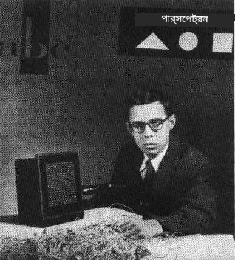
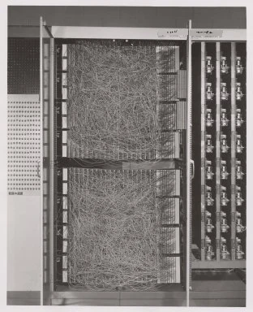

# নিউরাল নেটওয়ার্কের পরিচিতি: পারসেপট্রন

## [পূর্ব-লেকচার কুইজ](https://ff-quizzes.netlify.app/en/ai/quiz/5)

আধুনিক নিউরাল নেটওয়ার্কের মতো কিছু তৈরি করার প্রথম প্রচেষ্টা করেছিলেন ফ্রাঙ্ক রোজেনব্ল্যাট, কর্নেল এরোনটিক্যাল ল্যাবরেটরি থেকে, ১৯৫৭ সালে। এটি একটি হার্ডওয়্যার বাস্তবায়ন ছিল, যার নাম ছিল "মার্ক-১", যা ত্রিভুজ, বর্গক্ষেত্র এবং বৃত্তের মতো প্রাথমিক জ্যামিতিক আকার চিহ্নিত করার জন্য ডিজাইন করা হয়েছিল।

|      |      |
|--------------|-----------|
| | |

> ছবি [উইকিপিডিয়া থেকে](https://en.wikipedia.org/wiki/Perceptron)

একটি ইনপুট ইমেজ ২০x২০ ফটোসেল অ্যারে দ্বারা উপস্থাপিত হয়েছিল, তাই নিউরাল নেটওয়ার্কের ৪০০টি ইনপুট এবং একটি বাইনারি আউটপুট ছিল। একটি সাধারণ নেটওয়ার্কে একটি নিউরন ছিল, যাকে **থ্রেশহোল্ড লজিক ইউনিট**ও বলা হয়। নিউরাল নেটওয়ার্কের ওজন পটেনশিওমিটারের মতো কাজ করত, যা প্রশিক্ষণের সময় ম্যানুয়ালি সামঞ্জস্য করতে হতো।

> ✅ একটি পটেনশিওমিটার এমন একটি ডিভাইস যা ব্যবহারকারীকে একটি সার্কিটের রেজিস্ট্যান্স সামঞ্জস্য করতে দেয়।

> নিউ ইয়র্ক টাইমস সেই সময় পারসেপট্রন সম্পর্কে লিখেছিল: *একটি ইলেকট্রনিক কম্পিউটারের ভ্রূণ যা [নেভি] আশা করে হাঁটতে, কথা বলতে, দেখতে, লিখতে, নিজেকে পুনরুৎপাদন করতে এবং তার অস্তিত্ব সম্পর্কে সচেতন হতে সক্ষম হবে।*

## পারসেপট্রন মডেল

ধরা যাক আমাদের মডেলে Nটি বৈশিষ্ট্য রয়েছে, সেক্ষেত্রে ইনপুট ভেক্টরটি হবে N আকারের একটি ভেক্টর। একটি পারসেপট্রন একটি **বাইনারি ক্লাসিফিকেশন** মডেল, অর্থাৎ এটি ইনপুট ডেটার দুটি শ্রেণি আলাদা করতে পারে। আমরা ধরে নেব যে প্রতিটি ইনপুট ভেক্টর x-এর জন্য আমাদের পারসেপট্রনের আউটপুট হয় +1 অথবা -1 হবে, শ্রেণির উপর নির্ভর করে। আউটপুটটি নিম্নলিখিত সূত্র ব্যবহার করে গণনা করা হবে:

y(x) = f(w<sup>T</sup>x)

যেখানে f একটি স্টেপ অ্যাক্টিভেশন ফাংশন

<!-- img src="http://www.sciweavers.org/tex2img.php?eq=f%28x%29%20%3D%20%5Cbegin%7Bcases%7D%0A%20%20%20%20%20%20%20%20%20%2B1%20%26%20x%20%5Cgeq%200%20%5C%5C%0A%20%20%20%20%20%20%20%20%20-1%20%26%20x%20%3C%200%0A%20%20%20%20%20%20%20%5Cend%7Bcases%7D%20%5C%5C%0A&bc=White&fc=Black&im=jpg&fs=12&ff=arev&edit=0" align="center" border="0" alt="f(x) = \begin{cases} +1 & x \geq 0 \\ -1 & x < 0 \end{cases} \\" width="154" height="50" / -->


## পারসেপট্রন প্রশিক্ষণ

পারসেপট্রন প্রশিক্ষণ করতে আমাদের এমন একটি ওজন ভেক্টর w খুঁজে বের করতে হবে যা বেশিরভাগ মান সঠিকভাবে শ্রেণিবদ্ধ করে, অর্থাৎ সবচেয়ে কম **ত্রুটি** তৈরি করে। এই ত্রুটি E **পারসেপট্রন ক্রাইটেরিয়া** দ্বারা নিম্নলিখিতভাবে সংজ্ঞায়িত করা হয়:

E(w) = -&sum;w<sup>T</sup>x<sub>i</sub>t<sub>i</sub>

যেখানে:

* যোগফলটি সেই প্রশিক্ষণ ডেটা পয়েন্টগুলির উপর নেওয়া হয় যা ভুল শ্রেণিবিন্যাসের ফলাফল দেয়
* x<sub>i</sub> হল ইনপুট ডেটা, এবং t<sub>i</sub> হল যথাক্রমে নেতিবাচক এবং ইতিবাচক উদাহরণের জন্য -1 বা +1।

এই ক্রাইটেরিয়াকে ওজন w-এর একটি ফাংশন হিসেবে বিবেচনা করা হয়, এবং আমাদের এটি কমাতে হবে। প্রায়ই, **গ্রেডিয়েন্ট ডিসেন্ট** নামে একটি পদ্ধতি ব্যবহার করা হয়, যেখানে আমরা কিছু প্রাথমিক ওজন w<sup>(0)</sup> দিয়ে শুরু করি এবং তারপর প্রতিটি ধাপে নিম্নলিখিত সূত্র অনুযায়ী ওজন আপডেট করি:

w<sup>(t+1)</sup> = w<sup>(t)</sup> - &eta;&nabla;E(w)

এখানে &eta; হল তথাকথিত **লার্নিং রেট**, এবং &nabla;E(w) হল E-এর **গ্রেডিয়েন্ট**। গ্রেডিয়েন্ট গণনা করার পরে, আমরা পাই:

w<sup>(t+1)</sup> = w<sup>(t)</sup> + &sum;&eta;x<sub>i</sub>t<sub>i</sub>

পাইথনে অ্যালগরিদমটি দেখতে এমন হবে:

```python
def train(positive_examples, negative_examples, num_iterations = 100, eta = 1):

    weights = [0,0,0] # Initialize weights (almost randomly :)
        
    for i in range(num_iterations):
        pos = random.choice(positive_examples)
        neg = random.choice(negative_examples)

        z = np.dot(pos, weights) # compute perceptron output
        if z < 0: # positive example classified as negative
            weights = weights + eta*weights.shape

        z  = np.dot(neg, weights)
        if z >= 0: # negative example classified as positive
            weights = weights - eta*weights.shape

    return weights
```


## উপসংহার

এই পাঠে, আপনি পারসেপট্রন সম্পর্কে শিখেছেন, যা একটি বাইনারি ক্লাসিফিকেশন মডেল, এবং কীভাবে এটি একটি ওজন ভেক্টর ব্যবহার করে প্রশিক্ষণ দিতে হয়।

## 🚀 চ্যালেঞ্জ

আপনি যদি নিজের পারসেপট্রন তৈরি করতে চান, তাহলে [Microsoft Learn-এর এই ল্যাবটি](https://docs.microsoft.com/en-us/azure/machine-learning/component-reference/two-class-averaged-perceptron?WT.mc_id=academic-77998-cacaste) চেষ্টা করুন, যা [Azure ML designer](https://docs.microsoft.com/en-us/azure/machine-learning/concept-designer?WT.mc_id=academic-77998-cacaste) ব্যবহার করে।

## [পোস্ট-লেকচার কুইজ](https://ff-quizzes.netlify.app/en/ai/quiz/6)

## পর্যালোচনা ও স্ব-অধ্যয়ন

পারসেপট্রন ব্যবহার করে কীভাবে একটি ছোট সমস্যা এবং বাস্তব জীবনের সমস্যা সমাধান করা যায় তা দেখতে এবং শেখা চালিয়ে যেতে - [পারসেপট্রন](Perceptron.ipynb) নোটবুকে যান।

এখানে পারসেপট্রন সম্পর্কে একটি আকর্ষণীয় [প্রবন্ধ](https://towardsdatascience.com/what-is-a-perceptron-basics-of-neural-networks-c4cfea20c590) রয়েছে।

## [অ্যাসাইনমেন্ট](lab/README.md)

এই পাঠে, আমরা একটি বাইনারি ক্লাসিফিকেশন টাস্কের জন্য একটি পারসেপট্রন বাস্তবায়ন করেছি এবং এটি ব্যবহার করে দুটি হাতে লেখা সংখ্যার মধ্যে পার্থক্য করেছি। এই ল্যাবে, আপনাকে সম্পূর্ণ সংখ্যার শ্রেণিবিন্যাস সমস্যাটি সমাধান করতে বলা হয়েছে, অর্থাৎ কোন সংখ্যা একটি প্রদত্ত ছবির সাথে সবচেয়ে বেশি মিল রয়েছে তা নির্ধারণ করতে হবে।

* [নির্দেশাবলী](lab/README.md)
* [নোটবুক](lab/PerceptronMultiClass.ipynb)

---

