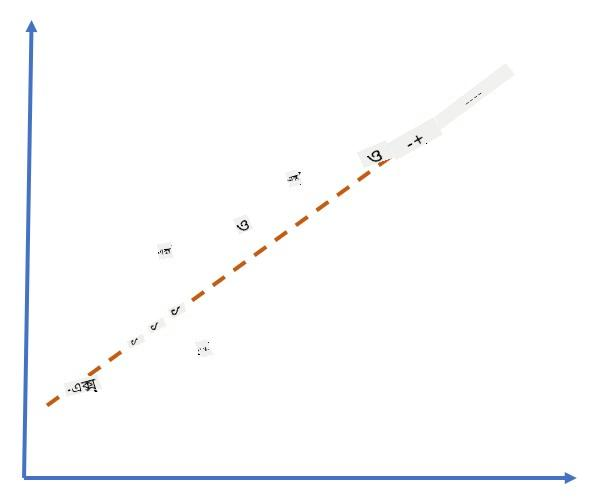
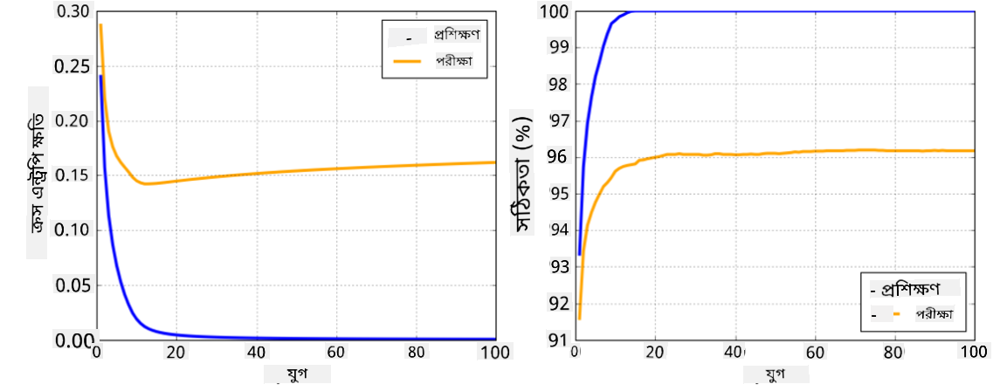

<!--
CO_OP_TRANSLATOR_METADATA:
{
  "original_hash": "2b544f20b796402507fb05a0df893323",
  "translation_date": "2025-08-26T10:31:41+00:00",
  "source_file": "lessons/3-NeuralNetworks/05-Frameworks/README.md",
  "language_code": "bn"
}
-->
# নিউরাল নেটওয়ার্ক ফ্রেমওয়ার্ক

আমরা ইতিমধ্যেই শিখেছি যে, নিউরাল নেটওয়ার্কগুলোকে দক্ষতার সাথে প্রশিক্ষণ দিতে হলে আমাদের দুটি কাজ করতে হয়:

* টেনসরের উপর কাজ করা, যেমন গুণ, যোগ এবং কিছু ফাংশন (যেমন সিগময়েড বা সফটম্যাক্স) গণনা করা
* সমস্ত এক্সপ্রেশনের গ্রেডিয়েন্ট গণনা করা, যাতে গ্রেডিয়েন্ট ডিজসেন্ট অপ্টিমাইজেশন করা যায়

## [পূর্ব-লেকচার কুইজ](https://red-field-0a6ddfd03.1.azurestaticapps.net/quiz/105)

যদিও `numpy` লাইব্রেরি প্রথম কাজটি করতে পারে, আমাদের গ্রেডিয়েন্ট গণনার জন্য একটি প্রক্রিয়া প্রয়োজন। [আমাদের ফ্রেমওয়ার্কে](../../../../../lessons/3-NeuralNetworks/04-OwnFramework/OwnFramework.ipynb), যা আমরা আগের সেকশনে তৈরি করেছি, সেখানে `backward` মেথডের মধ্যে সমস্ত ডেরিভেটিভ ফাংশন ম্যানুয়ালি প্রোগ্রাম করতে হয়েছিল, যা ব্যাকপ্রোপাগেশন করে। আদর্শভাবে, একটি ফ্রেমওয়ার্ক আমাদের *যেকোনো এক্সপ্রেশন* এর গ্রেডিয়েন্ট গণনার সুযোগ দেবে যা আমরা সংজ্ঞায়িত করতে পারি।

আরেকটি গুরুত্বপূর্ণ বিষয় হলো GPU বা অন্য কোনো বিশেষায়িত কম্পিউট ইউনিট (যেমন [TPU](https://en.wikipedia.org/wiki/Tensor_Processing_Unit))-এ গণনা সম্পাদন করার ক্ষমতা থাকা। ডিপ নিউরাল নেটওয়ার্ক প্রশিক্ষণে *অনেক* গণনা প্রয়োজন হয়, এবং GPU-তে এই গণনাগুলো প্যারালালাইজ করা অত্যন্ত গুরুত্বপূর্ণ।

> ✅ 'প্যারালালাইজ' শব্দটি বোঝায় যে গণনাগুলোকে একাধিক ডিভাইসে বিতরণ করা।

বর্তমানে, সবচেয়ে জনপ্রিয় দুটি নিউরাল ফ্রেমওয়ার্ক হলো: [TensorFlow](http://TensorFlow.org) এবং [PyTorch](https://pytorch.org/)। উভয়ই CPU এবং GPU-তে টেনসরের সাথে কাজ করার জন্য একটি লো-লেভেল API প্রদান করে। লো-লেভেল API-এর উপরে, একটি হাই-লেভেল API রয়েছে, যথাক্রমে [Keras](https://keras.io/) এবং [PyTorch Lightning](https://pytorchlightning.ai/) নামে পরিচিত।

Low-Level API | [TensorFlow](http://TensorFlow.org) | [PyTorch](https://pytorch.org/)
--------------|-------------------------------------|--------------------------------
High-level API| [Keras](https://keras.io/) | [PyTorch Lightning](https://pytorchlightning.ai/)

**লো-লেভেল API** উভয় ফ্রেমওয়ার্কেই তথাকথিত **কম্পিউটেশনাল গ্রাফ** তৈরি করার সুযোগ দেয়। এই গ্রাফটি সংজ্ঞায়িত করে যে কিভাবে প্রদত্ত ইনপুট প্যারামিটার দিয়ে আউটপুট (সাধারণত লস ফাংশন) গণনা করতে হবে, এবং এটি GPU-তে গণনার জন্য পাঠানো যেতে পারে, যদি এটি উপলব্ধ থাকে। এই কম্পিউটেশনাল গ্রাফটি ডিফারেনশিয়েট করার এবং গ্রেডিয়েন্ট গণনার ফাংশন রয়েছে, যা মডেলের প্যারামিটার অপ্টিমাইজেশনের জন্য ব্যবহার করা যেতে পারে।

**হাই-লেভেল API** মূলত নিউরাল নেটওয়ার্কগুলোকে **লেয়ারের একটি সিকোয়েন্স** হিসেবে বিবেচনা করে এবং বেশিরভাগ নিউরাল নেটওয়ার্ক তৈরি করা অনেক সহজ করে তোলে। মডেল প্রশিক্ষণ সাধারণত ডেটা প্রস্তুত করা এবং তারপর একটি `fit` ফাংশন কল করার মাধ্যমে সম্পন্ন হয়।

হাই-লেভেল API আপনাকে খুব দ্রুত সাধারণ নিউরাল নেটওয়ার্ক তৈরি করতে দেয়, অনেক বিস্তারিত বিষয়ে চিন্তা না করেই। একই সময়ে, লো-লেভেল API প্রশিক্ষণ প্রক্রিয়ার উপর অনেক বেশি নিয়ন্ত্রণ প্রদান করে, এবং তাই এটি গবেষণায় ব্যাপকভাবে ব্যবহৃত হয়, যখন আপনি নতুন নিউরাল নেটওয়ার্ক আর্কিটেকচারের সাথে কাজ করছেন।

এটি বোঝা গুরুত্বপূর্ণ যে আপনি উভয় API একসাথে ব্যবহার করতে পারেন, যেমন: আপনি লো-লেভেল API ব্যবহার করে আপনার নিজস্ব নেটওয়ার্ক লেয়ার আর্কিটেকচার তৈরি করতে পারেন এবং তারপর এটি একটি বড় নেটওয়ার্কের মধ্যে ব্যবহার করতে পারেন যা হাই-লেভেল API দিয়ে তৈরি এবং প্রশিক্ষিত। অথবা আপনি হাই-লেভেল API ব্যবহার করে লেয়ারের একটি সিকোয়েন্স হিসেবে একটি নেটওয়ার্ক সংজ্ঞায়িত করতে পারেন এবং তারপর আপনার নিজস্ব লো-লেভেল প্রশিক্ষণ লুপ ব্যবহার করে অপ্টিমাইজেশন সম্পাদন করতে পারেন। উভয় API একই মৌলিক ধারণাগুলো ব্যবহার করে এবং একসাথে ভালোভাবে কাজ করার জন্য ডিজাইন করা হয়েছে।

## শেখা

এই কোর্সে, আমরা PyTorch এবং TensorFlow উভয়ের জন্যই বেশিরভাগ বিষয়বস্তু প্রদান করি। আপনি আপনার পছন্দের ফ্রেমওয়ার্ক বেছে নিতে পারেন এবং শুধুমাত্র সংশ্লিষ্ট নোটবুকগুলো অনুসরণ করতে পারেন। যদি আপনি নিশ্চিত না হন কোন ফ্রেমওয়ার্কটি বেছে নেবেন, তাহলে **PyTorch বনাম TensorFlow** নিয়ে ইন্টারনেটে কিছু আলোচনা পড়ুন। আপনি উভয় ফ্রেমওয়ার্ক দেখেও একটি ভালো ধারণা পেতে পারেন।

যেখানে সম্ভব, আমরা সরলতার জন্য হাই-লেভেল API ব্যবহার করব। তবে, আমরা বিশ্বাস করি যে নিউরাল নেটওয়ার্কগুলো কীভাবে কাজ করে তা মাটি থেকে বুঝতে পারা গুরুত্বপূর্ণ, তাই শুরুতে আমরা লো-লেভেল API এবং টেনসরের সাথে কাজ করে শুরু করব। তবে, যদি আপনি দ্রুত শুরু করতে চান এবং এই বিস্তারিত বিষয়গুলো শেখার জন্য বেশি সময় ব্যয় করতে না চান, তাহলে আপনি সেগুলো এড়িয়ে সরাসরি হাই-লেভেল API নোটবুকে যেতে পারেন।

## ✍️ অনুশীলন: ফ্রেমওয়ার্ক

নিম্নলিখিত নোটবুকগুলোতে আপনার শেখা চালিয়ে যান:

Low-Level API | [TensorFlow+Keras Notebook](../../../../../lessons/3-NeuralNetworks/05-Frameworks/IntroKerasTF.ipynb) | [PyTorch](../../../../../lessons/3-NeuralNetworks/05-Frameworks/IntroPyTorch.ipynb)
--------------|-------------------------------------|--------------------------------
High-level API| [Keras](../../../../../lessons/3-NeuralNetworks/05-Frameworks/IntroKeras.ipynb) | *PyTorch Lightning*

ফ্রেমওয়ার্কগুলো আয়ত্ত করার পরে, ওভারফিটিং ধারণাটি পুনরায় দেখুন।

# ওভারফিটিং

ওভারফিটিং মেশিন লার্নিংয়ের একটি অত্যন্ত গুরুত্বপূর্ণ ধারণা, এবং এটি সঠিকভাবে বোঝা অত্যন্ত গুরুত্বপূর্ণ!

নিচের ৫টি বিন্দু (গ্রাফে `x` দ্বারা চিহ্নিত) আনুমানিক করার সমস্যাটি বিবেচনা করুন:

 | 
-------------------------|--------------------------
**লিনিয়ার মডেল, ২টি প্যারামিটার** | **নন-লিনিয়ার মডেল, ৭টি প্যারামিটার**
প্রশিক্ষণ ত্রুটি = ৫.৩ | প্রশিক্ষণ ত্রুটি = ০
ভ্যালিডেশন ত্রুটি = ৫.১ | ভ্যালিডেশন ত্রুটি = ২০

* বামদিকে, আমরা একটি ভালো সরল রেখা আনুমানিক দেখতে পাই। কারণ প্যারামিটারের সংখ্যা যথাযথ, মডেলটি বিন্দু বিতরণের প্যাটার্নটি সঠিকভাবে বুঝতে পারে।
* ডানদিকে, মডেলটি অত্যন্ত শক্তিশালী। কারণ আমাদের কাছে মাত্র ৫টি বিন্দু রয়েছে এবং মডেলের ৭টি প্যারামিটার রয়েছে, এটি এমনভাবে সামঞ্জস্য করতে পারে যাতে সমস্ত বিন্দুর মধ্য দিয়ে যায়, প্রশিক্ষণ ত্রুটিকে ০ করে তোলে। তবে, এটি ডেটার পেছনের সঠিক প্যাটার্নটি বুঝতে বাধা দেয়, ফলে ভ্যালিডেশন ত্রুটি খুব বেশি হয়।

মডেলের সমৃদ্ধি (প্যারামিটারের সংখ্যা) এবং প্রশিক্ষণ নমুনার সংখ্যার মধ্যে সঠিক ভারসাম্য বজায় রাখা অত্যন্ত গুরুত্বপূর্ণ।

## কেন ওভারফিটিং ঘটে

  * প্রশিক্ষণ ডেটার অভাব
  * অত্যন্ত শক্তিশালী মডেল
  * ইনপুট ডেটায় অত্যধিক শব্দ

## কিভাবে ওভারফিটিং সনাক্ত করবেন

উপরের গ্রাফ থেকে আপনি দেখতে পাচ্ছেন, ওভারফিটিং খুব কম প্রশিক্ষণ ত্রুটি এবং খুব বেশি ভ্যালিডেশন ত্রুটির মাধ্যমে সনাক্ত করা যায়। সাধারণত প্রশিক্ষণের সময় আমরা দেখতে পাবো প্রশিক্ষণ এবং ভ্যালিডেশন ত্রুটি উভয়ই কমতে শুরু করে, এবং তারপর কোনো এক সময় ভ্যালিডেশন ত্রুটি কমা বন্ধ করে এবং বাড়তে শুরু করে। এটি ওভারফিটিংয়ের একটি চিহ্ন হবে এবং ইঙ্গিত দেবে যে আমাদের সম্ভবত এই সময়ে প্রশিক্ষণ বন্ধ করা উচিত (অথবা অন্তত মডেলের একটি স্ন্যাপশট নেওয়া উচিত)।

## কিভাবে ওভারফিটিং প্রতিরোধ করবেন

যদি আপনি দেখতে পান যে ওভারফিটিং ঘটছে, তাহলে আপনি নিম্নলিখিত কাজগুলো করতে পারেন:

 * প্রশিক্ষণ ডেটার পরিমাণ বৃদ্ধি করুন
 * মডেলের জটিলতা হ্রাস করুন
 * কিছু [নিয়মিতকরণ কৌশল](../../4-ComputerVision/08-TransferLearning/TrainingTricks.md) ব্যবহার করুন, যেমন [ড্রপআউট](../../4-ComputerVision/08-TransferLearning/TrainingTricks.md#Dropout), যা আমরা পরে বিবেচনা করব।

## ওভারফিটিং এবং বায়াস-ভ্যারিয়েন্স ট্রেডঅফ

ওভারফিটিং আসলে পরিসংখ্যানের একটি আরও সাধারণ সমস্যার একটি উদাহরণ, যাকে [বায়াস-ভ্যারিয়েন্স ট্রেডঅফ](https://en.wikipedia.org/wiki/Bias%E2%80%93variance_tradeoff) বলা হয়। যদি আমরা আমাদের মডেলের ত্রুটির সম্ভাব্য উৎসগুলো বিবেচনা করি, তাহলে আমরা দুটি ধরণের ত্রুটি দেখতে পাই:

* **বায়াস ত্রুটি** আমাদের অ্যালগরিদম প্রশিক্ষণ ডেটার সম্পর্কটি সঠিকভাবে ধরতে না পারার কারণে ঘটে। এটি হতে পারে যদি আমাদের মডেল যথেষ্ট শক্তিশালী না হয় (**আন্ডারফিটিং**)।
* **ভ্যারিয়েন্স ত্রুটি**, যা ইনপুট ডেটার শব্দকে অর্থপূর্ণ সম্পর্কের পরিবর্তে আনুমানিক করার কারণে ঘটে (**ওভারফিটিং**)।

প্রশিক্ষণের সময়, বায়াস ত্রুটি হ্রাস পায় (কারণ আমাদের মডেল ডেটা আনুমানিক করতে শেখে), এবং ভ্যারিয়েন্স ত্রুটি বৃদ্ধি পায়। ওভারফিটিং প্রতিরোধ করতে প্রশিক্ষণ বন্ধ করা গুরুত্বপূর্ণ - হয় ম্যানুয়ালি (যখন আমরা ওভারফিটিং সনাক্ত করি) বা স্বয়ংক্রিয়ভাবে (নিয়মিতকরণ প্রবর্তনের মাধ্যমে)।

## উপসংহার

এই পাঠে, আপনি দুটি সবচেয়ে জনপ্রিয় AI ফ্রেমওয়ার্ক, TensorFlow এবং PyTorch-এর বিভিন্ন API-এর মধ্যে পার্থক্য সম্পর্কে শিখেছেন। এছাড়াও, আপনি একটি অত্যন্ত গুরুত্বপূর্ণ বিষয়, ওভারফিটিং সম্পর্কে শিখেছেন।

## 🚀 চ্যালেঞ্জ

সংলগ্ন নোটবুকগুলোতে, আপনি 'টাস্ক' পাবেন; নোটবুকগুলো অনুসরণ করুন এবং টাস্কগুলো সম্পূর্ণ করুন।

## [পোস্ট-লেকচার কুইজ](https://red-field-0a6ddfd03.1.azurestaticapps.net/quiz/205)

## পর্যালোচনা ও স্ব-অধ্যয়ন

নিম্নলিখিত বিষয়গুলো নিয়ে কিছু গবেষণা করুন:

- TensorFlow
- PyTorch
- ওভারফিটিং

নিজেকে নিম্নলিখিত প্রশ্নগুলো জিজ্ঞাসা করুন:

- TensorFlow এবং PyTorch-এর মধ্যে পার্থক্য কী?
- ওভারফিটিং এবং আন্ডারফিটিং-এর মধ্যে পার্থক্য কী?

## [অ্যাসাইনমেন্ট](lab/README.md)

এই ল্যাবে, আপনাকে PyTorch বা TensorFlow ব্যবহার করে একক এবং বহু-স্তরযুক্ত সম্পূর্ণ সংযুক্ত নেটওয়ার্ক ব্যবহার করে দুটি শ্রেণীবিভাজন সমস্যা সমাধান করতে বলা হয়েছে।

* [নির্দেশাবলী](lab/README.md)
* [নোটবুক](../../../../../lessons/3-NeuralNetworks/05-Frameworks/lab/LabFrameworks.ipynb)

**অস্বীকৃতি**:  
এই নথিটি AI অনুবাদ পরিষেবা [Co-op Translator](https://github.com/Azure/co-op-translator) ব্যবহার করে অনুবাদ করা হয়েছে। আমরা যথাসাধ্য সঠিকতা নিশ্চিত করার চেষ্টা করি, তবে অনুগ্রহ করে মনে রাখবেন যে স্বয়ংক্রিয় অনুবাদে ত্রুটি বা অসঙ্গতি থাকতে পারে। মূল ভাষায় থাকা নথিটিকে প্রামাণিক উৎস হিসেবে বিবেচনা করা উচিত। গুরুত্বপূর্ণ তথ্যের জন্য, পেশাদার মানব অনুবাদ সুপারিশ করা হয়। এই অনুবাদ ব্যবহারের ফলে কোনো ভুল বোঝাবুঝি বা ভুল ব্যাখ্যা হলে আমরা দায়বদ্ধ থাকব না।