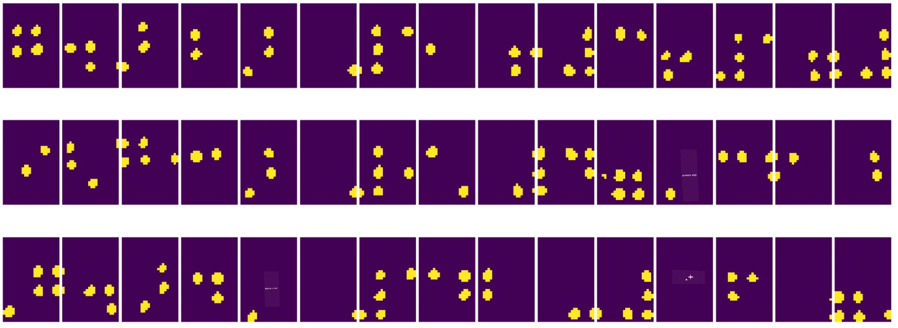
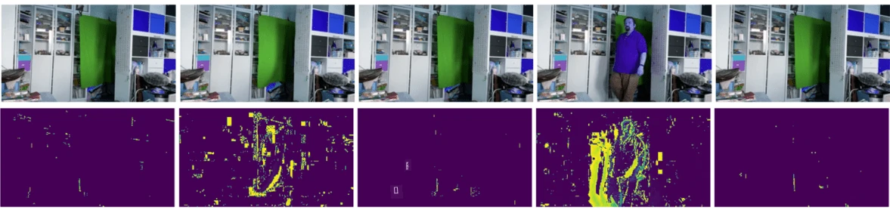

# কম্পিউটার ভিশনের পরিচিতি

[কম্পিউটার ভিশন](https://wikipedia.org/wiki/Computer_vision) একটি শাখা যার লক্ষ্য হলো কম্পিউটারকে ডিজিটাল ছবির উচ্চ-স্তরের বোঝাপড়া অর্জন করতে সক্ষম করা। এটি একটি বিস্তৃত সংজ্ঞা, কারণ *বোঝাপড়া* অনেক কিছুই বোঝাতে পারে, যেমন ছবিতে কোনো বস্তু খুঁজে বের করা (**বস্তু সনাক্তকরণ**), কী ঘটছে তা বোঝা (**ইভেন্ট সনাক্তকরণ**), ছবিকে টেক্সটে বর্ণনা করা, অথবা ৩ডি দৃশ্য পুনর্গঠন করা। মানুষের ছবি সম্পর্কিত বিশেষ কিছু কাজও রয়েছে: বয়স এবং আবেগ অনুমান, মুখ সনাক্তকরণ এবং পরিচয় নির্ধারণ, এবং ৩ডি পোজ অনুমান, ইত্যাদি।

## [পূর্ব-লেকচার কুইজ](https://ff-quizzes.netlify.app/en/ai/quiz/11)

কম্পিউটার ভিশনের অন্যতম সহজ কাজ হলো **ইমেজ ক্লাসিফিকেশন**।

কম্পিউটার ভিশন প্রায়ই এআই-এর একটি শাখা হিসেবে বিবেচিত হয়। বর্তমানে, বেশিরভাগ কম্পিউটার ভিশনের কাজ নিউরাল নেটওয়ার্ক ব্যবহার করে সমাধান করা হয়। আমরা এই অধ্যায়ে কম্পিউটার ভিশনের জন্য ব্যবহৃত বিশেষ ধরনের নিউরাল নেটওয়ার্ক, [কনভোলিউশনাল নিউরাল নেটওয়ার্ক](../07-ConvNets/README.md), সম্পর্কে আরও শিখব।

তবে, ছবিকে নিউরাল নেটওয়ার্কে পাঠানোর আগে, অনেক ক্ষেত্রে ছবিকে উন্নত করার জন্য কিছু অ্যালগরিদমিক কৌশল ব্যবহার করা যুক্তিযুক্ত।

ইমেজ প্রসেসিংয়ের জন্য বেশ কয়েকটি পাইথন লাইব্রেরি উপলব্ধ রয়েছে:

* **[imageio](https://imageio.readthedocs.io/en/stable/)** বিভিন্ন ইমেজ ফরম্যাট পড়া/লেখার জন্য ব্যবহার করা যেতে পারে। এটি ffmpeg সমর্থন করে, যা ভিডিও ফ্রেমকে ছবিতে রূপান্তর করার একটি দরকারী টুল।
* **[Pillow](https://pillow.readthedocs.io/en/stable/index.html)** (PIL নামেও পরিচিত) আরও শক্তিশালী এবং কিছু ইমেজ ম্যানিপুলেশন যেমন মর্ফিং, প্যালেট সামঞ্জস্য ইত্যাদি সমর্থন করে।
* **[OpenCV](https://opencv.org/)** একটি শক্তিশালী ইমেজ প্রসেসিং লাইব্রেরি যা C++-এ লেখা হয়েছে এবং এটি ইমেজ প্রসেসিংয়ের *ডি ফ্যাক্টো* স্ট্যান্ডার্ড হয়ে উঠেছে। এর একটি সুবিধাজনক পাইথন ইন্টারফেস রয়েছে।
* **[dlib](http://dlib.net/)** একটি C++ লাইব্রেরি যা অনেক মেশিন লার্নিং অ্যালগরিদম বাস্তবায়ন করে, যার মধ্যে কিছু কম্পিউটার ভিশন অ্যালগরিদমও রয়েছে। এর একটি পাইথন ইন্টারফেস রয়েছে এবং এটি মুখ এবং মুখের ল্যান্ডমার্ক সনাক্তকরণের মতো চ্যালেঞ্জিং কাজের জন্য ব্যবহার করা যেতে পারে।

## OpenCV

[OpenCV](https://opencv.org/) ইমেজ প্রসেসিংয়ের জন্য *ডি ফ্যাক্টো* স্ট্যান্ডার্ড হিসেবে বিবেচিত হয়। এতে অনেক দরকারী অ্যালগরিদম রয়েছে, যা C++-এ বাস্তবায়িত। OpenCV-কে পাইথন থেকেও কল করা যায়।

OpenCV শেখার একটি ভালো জায়গা হলো [এই Learn OpenCV কোর্স](https://learnopencv.com/getting-started-with-opencv/)। আমাদের পাঠ্যক্রমে, আমাদের লক্ষ্য OpenCV শেখা নয়, বরং কিছু উদাহরণ দেখানো যেখানে এটি ব্যবহার করা যেতে পারে এবং কীভাবে।

### ইমেজ লোড করা

পাইথনে ইমেজকে সহজেই NumPy অ্যারে হিসেবে উপস্থাপন করা যায়। উদাহরণস্বরূপ, ৩২০x২০০ পিক্সেলের গ্রেস্কেল ইমেজ একটি ২০০x৩২০ অ্যারে হিসেবে সংরক্ষিত হবে, এবং একই মাত্রার রঙিন ইমেজের আকৃতি হবে ২০০x৩২০x৩ (৩টি রঙ চ্যানেলের জন্য)। একটি ইমেজ লোড করতে, আপনি নিম্নলিখিত কোড ব্যবহার করতে পারেন:

```python
import cv2
import matplotlib.pyplot as plt

im = cv2.imread('image.jpeg')
plt.imshow(im)
```

ঐতিহ্যগতভাবে, OpenCV রঙিন ইমেজের জন্য BGR (নীল-সবুজ-লাল) এনকোডিং ব্যবহার করে, যেখানে পাইথনের অন্যান্য টুলগুলি আরও প্রচলিত RGB (লাল-সবুজ-নীল) ব্যবহার করে। ইমেজটি সঠিকভাবে দেখতে হলে, আপনাকে এটি RGB রঙ স্পেসে রূপান্তর করতে হবে, হয় NumPy অ্যারেতে ডাইমেনশন পরিবর্তন করে, অথবা OpenCV ফাংশন কল করে:

```python
im = cv2.cvtColor(im,cv2.COLOR_BGR2RGB)
```

একই `cvtColor` ফাংশনটি অন্যান্য রঙ স্পেস রূপান্তর করতে ব্যবহার করা যেতে পারে, যেমন একটি ইমেজকে গ্রেস্কেলে বা HSV (Hue-Saturation-Value) রঙ স্পেসে রূপান্তর করা।

OpenCV ব্যবহার করে ভিডিও ফ্রেম-বাই-ফ্রেম লোড করাও সম্ভব - একটি উদাহরণ [OpenCV Notebook](OpenCV.ipynb)-এ দেওয়া হয়েছে।

### ইমেজ প্রসেসিং

একটি ইমেজকে নিউরাল নেটওয়ার্কে পাঠানোর আগে, আপনি কয়েকটি প্রি-প্রসেসিং ধাপ প্রয়োগ করতে চাইতে পারেন। OpenCV অনেক কিছু করতে পারে, যার মধ্যে রয়েছে:

* **ইমেজ রিসাইজিং** `im = cv2.resize(im, (320,200),interpolation=cv2.INTER_LANCZOS)` ব্যবহার করে
* **ইমেজ ব্লারিং** `im = cv2.medianBlur(im,3)` বা `im = cv2.GaussianBlur(im, (3,3), 0)` ব্যবহার করে
* ইমেজের **উজ্জ্বলতা এবং কনট্রাস্ট** পরিবর্তন করা NumPy অ্যারে ম্যানিপুলেশন দ্বারা করা যেতে পারে, যেমন [এই Stackoverflow নোটে](https://stackoverflow.com/questions/39308030/how-do-i-increase-the-contrast-of-an-image-in-python-opencv) বর্ণিত হয়েছে।
* [থ্রেশহোল্ডিং](https://docs.opencv.org/4.x/d7/d4d/tutorial_py_thresholding.html) ব্যবহার করে `cv2.threshold`/`cv2.adaptiveThreshold` ফাংশন কল করা, যা প্রায়ই উজ্জ্বলতা বা কনট্রাস্ট সামঞ্জস্য করার চেয়ে বেশি পছন্দনীয়।
* ইমেজে বিভিন্ন [রূপান্তর](https://docs.opencv.org/4.5.5/da/d6e/tutorial_py_geometric_transformations.html) প্রয়োগ করা:
    - **[অ্যাফাইন রূপান্তর](https://docs.opencv.org/4.5.5/d4/d61/tutorial_warp_affine.html)** যদি আপনাকে ইমেজে ঘূর্ণন, রিসাইজিং এবং স্কিউিং একত্রিত করতে হয় এবং আপনি ইমেজে তিনটি পয়েন্টের উৎস এবং গন্তব্য অবস্থান জানেন। অ্যাফাইন রূপান্তর সমান্তরাল রেখাগুলিকে সমান্তরাল রাখে।
    - **[পার্সপেক্টিভ রূপান্তর](https://medium.com/analytics-vidhya/opencv-perspective-transformation-9edffefb2143)** যদি আপনি ইমেজে চারটি পয়েন্টের উৎস এবং গন্তব্য অবস্থান জানেন। উদাহরণস্বরূপ, যদি আপনি একটি স্মার্টফোন ক্যামেরা দিয়ে কিছু কোণ থেকে একটি আয়তাকার ডকুমেন্টের ছবি তোলেন এবং আপনি ডকুমেন্টটির একটি আয়তাকার ইমেজ তৈরি করতে চান।
* ইমেজের ভিতরে গতিবিধি বোঝা **[অপটিক্যাল ফ্লো](https://docs.opencv.org/4.5.5/d4/dee/tutorial_optical_flow.html)** ব্যবহার করে।

## কম্পিউটার ভিশনের ব্যবহার উদাহরণ

আমাদের [OpenCV Notebook](OpenCV.ipynb)-এ, আমরা কিছু উদাহরণ দিয়েছি যেখানে কম্পিউটার ভিশন নির্দিষ্ট কাজ সম্পাদন করতে ব্যবহার করা যেতে পারে:

* **ব্রেইল বইয়ের একটি ছবির প্রি-প্রসেসিং**। আমরা দেখিয়েছি কীভাবে থ্রেশহোল্ডিং, ফিচার ডিটেকশন, পার্সপেক্টিভ ট্রান্সফরমেশন এবং NumPy ম্যানিপুলেশন ব্যবহার করে ব্রেইল প্রতীকগুলোকে আলাদা করা যায়, যা পরে নিউরাল নেটওয়ার্ক দ্বারা শ্রেণীবদ্ধ করা হবে।

 |  | 
----|-----|-----

> ছবি [OpenCV.ipynb](OpenCV.ipynb) থেকে

* **ভিডিওতে ফ্রেম ডিফারেন্স ব্যবহার করে গতিবিধি সনাক্তকরণ**। যদি ক্যামেরা স্থির থাকে, তাহলে ক্যামেরা ফিডের ফ্রেমগুলো একে অপরের সাথে বেশ মিল থাকবে। যেহেতু ফ্রেমগুলো অ্যারে হিসেবে উপস্থাপিত হয়, দুটি পরবর্তী ফ্রেমের জন্য সেই অ্যারেগুলোকে বিয়োগ করলেই আমরা পিক্সেল পার্থক্য পাব, যা স্থির ফ্রেমের জন্য কম হবে এবং ছবিতে উল্লেখযোগ্য গতিবিধি থাকলে বেশি হবে।



> ছবি [OpenCV.ipynb](OpenCV.ipynb) থেকে

* **অপটিক্যাল ফ্লো ব্যবহার করে গতিবিধি সনাক্তকরণ**। [অপটিক্যাল ফ্লো](https://docs.opencv.org/3.4/d4/dee/tutorial_optical_flow.html) আমাদের বুঝতে সাহায্য করে কীভাবে ভিডিও ফ্রেমের পৃথক পিক্সেলগুলো স্থানান্তরিত হয়। অপটিক্যাল ফ্লোর দুটি ধরন রয়েছে:

   - **ডেন্স অপটিক্যাল ফ্লো** প্রতিটি পিক্সেলের জন্য একটি ভেক্টর ক্ষেত্র গণনা করে যা দেখায় এটি কোথায় স্থানান্তরিত হচ্ছে।
   - **স্পার্স অপটিক্যাল ফ্লো** ছবিতে কিছু বৈশিষ্ট্যপূর্ণ বৈশিষ্ট্য (যেমন: প্রান্ত) গ্রহণ করে এবং ফ্রেম থেকে ফ্রেমে তাদের গতিপথ তৈরি করে।


> ছবি [OpenCV.ipynb](OpenCV.ipynb) থেকে

## ✍️ উদাহরণ নোটবুক: OpenCV [OpenCV in Action চেষ্টা করুন](OpenCV.ipynb)

চলুন OpenCV Notebook [OpenCV.ipynb](OpenCV.ipynb) অন্বেষণ করে OpenCV নিয়ে কিছু পরীক্ষা করি।

## উপসংহার

কখনও কখনও, গতিবিধি সনাক্তকরণ বা আঙুলের ডগা সনাক্তকরণের মতো তুলনামূলকভাবে জটিল কাজ শুধুমাত্র কম্পিউটার ভিশন ব্যবহার করে সমাধান করা যেতে পারে। তাই, কম্পিউটার ভিশনের মৌলিক কৌশল এবং OpenCV-এর মতো লাইব্রেরি কী করতে পারে তা জানা খুবই সহায়ক।

## 🚀 চ্যালেঞ্জ

AI শো থেকে [এই ভিডিওটি](https://docs.microsoft.com/shows/ai-show/ai-show--2021-opencv-ai-competition--grand-prize-winners--cortic-tigers--episode-32?WT.mc_id=academic-77998-cacaste) দেখুন Cortic Tigers প্রকল্প সম্পর্কে জানতে এবং কীভাবে তারা একটি রোবটের মাধ্যমে কম্পিউটার ভিশন কাজগুলোকে গণতান্ত্রিক করার জন্য একটি ব্লক-ভিত্তিক সমাধান তৈরি করেছে। এই ধরনের অন্যান্য প্রকল্প সম্পর্কে গবেষণা করুন যা নতুন শিক্ষার্থীদের এই ক্ষেত্রে অন্তর্ভুক্ত করতে সাহায্য করে।

## [পোস্ট-লেকচার কুইজ](https://ff-quizzes.netlify.app/en/ai/quiz/12)

## পর্যালোচনা ও স্ব-অধ্যয়ন

অপটিক্যাল ফ্লো সম্পর্কে আরও পড়ুন [এই চমৎকার টিউটোরিয়ালে](https://learnopencv.com/optical-flow-in-opencv/)।

## [অ্যাসাইনমেন্ট](lab/README.md)

এই ল্যাবে, আপনি সহজ অঙ্গভঙ্গি সহ একটি ভিডিও নেবেন এবং আপনার লক্ষ্য হবে অপটিক্যাল ফ্লো ব্যবহার করে উপরে/নিচে/বামে/ডানে গতিবিধি বের করা।


---

