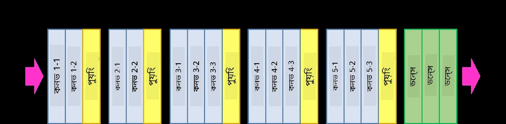
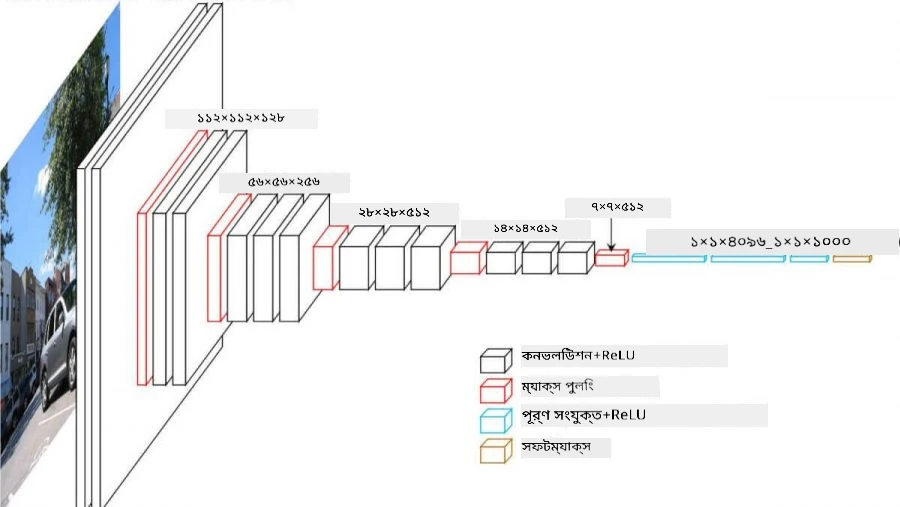
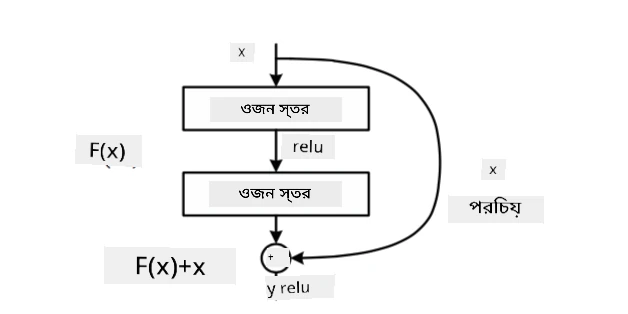
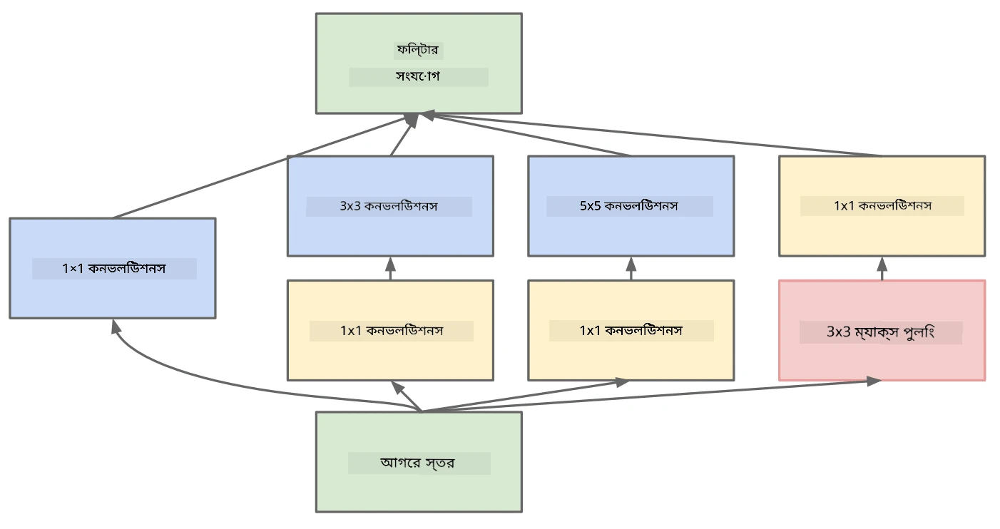

# পরিচিত CNN আর্কিটেকচার

### VGG-16

VGG-16 একটি নেটওয়ার্ক যা ২০১৪ সালে ImageNet টপ-৫ শ্রেণীবিন্যাসে ৯২.৭% সঠিকতা অর্জন করেছিল। এর স্তর কাঠামো নিম্নরূপ:

যেমনটি আপনি দেখতে পাচ্ছেন, VGG একটি ঐতিহ্যবাহী পিরামিড আর্কিটেকচার অনুসরণ করে, যা কনভোলিউশন-পুলিং স্তরের একটি ক্রম।

> ছবি [Researchgate](https://www.researchgate.net/figure/Vgg16-model-structure-To-get-the-VGG-NIN-model-we-replace-the-2-nd-4-th-6-th-7-th_fig2_335194493) থেকে

### ResNet

ResNet হলো Microsoft Research দ্বারা ২০১৫ সালে প্রস্তাবিত মডেলের একটি পরিবার। ResNet-এর মূল ধারণা হলো **residual blocks** ব্যবহার করা:

> ছবি [এই গবেষণাপত্র](https://arxiv.org/pdf/1512.03385.pdf) থেকে

Identity pass-through ব্যবহারের কারণ হলো আমাদের স্তরকে পূর্ববর্তী স্তরের ফলাফল এবং residual block-এর আউটপুটের মধ্যে **পার্থক্য** পূর্বাভাস করতে সক্ষম করা - তাই এর নাম *residual*। এই ব্লকগুলো প্রশিক্ষণ করা অনেক সহজ, এবং কেউ শত শত ব্লক নিয়ে নেটওয়ার্ক তৈরি করতে পারে (সবচেয়ে সাধারণ ভেরিয়েন্ট হলো ResNet-52, ResNet-101 এবং ResNet-152)।

আপনি এই নেটওয়ার্ককে এমনভাবে ভাবতে পারেন যে এটি ডেটাসেটের সাথে তার জটিলতা সামঞ্জস্য করতে পারে। প্রথমে, যখন আপনি নেটওয়ার্ক প্রশিক্ষণ শুরু করেন, তখন ওজনের মান ছোট থাকে, এবং বেশিরভাগ সংকেত passthrough identity স্তর দিয়ে যায়। প্রশিক্ষণ চলাকালীন ওজন বড় হয়ে গেলে, নেটওয়ার্ক প্যারামিটারগুলোর গুরুত্ব বৃদ্ধি পায়, এবং নেটওয়ার্কটি সঠিকভাবে প্রশিক্ষণ চিত্র শ্রেণীবিন্যাস করার জন্য প্রয়োজনীয় প্রকাশ ক্ষমতা সামঞ্জস্য করে।

### Google Inception

Google Inception আর্কিটেকচার এই ধারণাকে আরও এক ধাপ এগিয়ে নিয়ে যায় এবং প্রতিটি নেটওয়ার্ক স্তরকে বিভিন্ন পথের সমন্বয়ে তৈরি করে:

> ছবি [Researchgate](https://www.researchgate.net/figure/Inception-module-with-dimension-reductions-left-and-schema-for-Inception-ResNet-v1_fig2_355547454) থেকে

এখানে, আমাদের ১x১ কনভোলিউশনের ভূমিকা জোর দিতে হবে, কারণ প্রথমে এটি অর্থহীন মনে হতে পারে। কেন আমরা ১x১ ফিল্টার দিয়ে ছবির উপর চালাবো? তবে, মনে রাখতে হবে যে কনভোলিউশন ফিল্টারগুলো বিভিন্ন গভীরতার চ্যানেল (মূলত - RGB রঙ, পরবর্তী স্তরে - বিভিন্ন ফিল্টারের জন্য চ্যানেল) নিয়ে কাজ করে, এবং ১x১ কনভোলিউশন বিভিন্ন প্রশিক্ষণযোগ্য ওজন ব্যবহার করে ইনপুট চ্যানেলগুলোকে একত্রিত করতে ব্যবহৃত হয়। এটি চ্যানেল মাত্রার উপর ডাউনস্যাম্পলিং (পুলিং) হিসেবেও দেখা যেতে পারে।

এখানে [১x১ কনভোলিউশন নিয়ে একটি ভালো ব্লগ পোস্ট](https://medium.com/analytics-vidhya/talented-mr-1x1-comprehensive-look-at-1x1-convolution-in-deep-learning-f6b355825578) এবং [মূল গবেষণাপত্র](https://arxiv.org/pdf/1312.4400.pdf)।

### MobileNet

MobileNet হলো ছোট আকারের মডেলের একটি পরিবার, যা মোবাইল ডিভাইসের জন্য উপযুক্ত। যদি আপনার সম্পদ সীমিত থাকে এবং সামান্য সঠিকতা ত্যাগ করতে পারেন, তবে এগুলো ব্যবহার করুন। এর মূল ধারণা হলো **depthwise separable convolution**, যা কনভোলিউশন ফিল্টারগুলোকে স্থানীয় কনভোলিউশন এবং গভীরতার চ্যানেলের উপর ১x১ কনভোলিউশনের সমন্বয়ে উপস্থাপন করতে দেয়। এটি প্যারামিটারের সংখ্যা উল্লেখযোগ্যভাবে কমিয়ে দেয়, নেটওয়ার্ককে আকারে ছোট করে এবং কম ডেটা দিয়ে প্রশিক্ষণ করা সহজ করে।

এখানে [MobileNet নিয়ে একটি ভালো ব্লগ পোস্ট](https://medium.com/analytics-vidhya/image-classification-with-mobilenet-cc6fbb2cd470)।

## উপসংহার

এই ইউনিটে, আপনি কম্পিউটার ভিশন নিউরাল নেটওয়ার্কের মূল ধারণা শিখেছেন - কনভোলিউশনাল নেটওয়ার্ক। বাস্তব জীবনের আর্কিটেকচারগুলো, যা ইমেজ শ্রেণীবিন্যাস, অবজেক্ট ডিটেকশন এবং এমনকি ইমেজ জেনারেশন নেটওয়ার্ককে শক্তি প্রদান করে, সবই CNN-এর উপর ভিত্তি করে তৈরি, শুধু আরও স্তর এবং কিছু অতিরিক্ত প্রশিক্ষণ কৌশল সহ।

## 🚀 চ্যালেঞ্জ

সংযুক্ত নোটবুকে, নীচে উল্লেখ রয়েছে কিভাবে আরও বেশি সঠিকতা অর্জন করা যায়। কিছু পরীক্ষা-নিরীক্ষা করুন এবং দেখুন আপনি কি আরও বেশি সঠিকতা অর্জন করতে পারেন।

## [পোস্ট-লেকচার কুইজ](https://ff-quizzes.netlify.app/en/ai/quiz/14)

## পর্যালোচনা ও স্ব-অধ্যয়ন

যদিও CNN সাধারণত কম্পিউটার ভিশন কাজের জন্য ব্যবহৃত হয়, এটি সাধারণত নির্দিষ্ট আকারের প্যাটার্ন বের করার জন্য ভালো। উদাহরণস্বরূপ, যদি আমরা শব্দ নিয়ে কাজ করি, আমরা অডিও সিগনালে কিছু নির্দিষ্ট প্যাটার্ন খুঁজতে CNN ব্যবহার করতে চাইতে পারি - এই ক্ষেত্রে ফিল্টারগুলো ১-ডাইমেনশনাল হবে (এবং এই CNN-কে 1D-CNN বলা হবে)। এছাড়াও, কখনও কখনও 3D-CNN ব্যবহার করা হয় বহু-মাত্রিক স্থানে বৈশিষ্ট্য বের করার জন্য, যেমন ভিডিওতে কিছু নির্দিষ্ট ঘটনা ঘটছে - CNN সময়ের সাথে বৈশিষ্ট্যের পরিবর্তনের নির্দিষ্ট প্যাটার্ন ধরতে পারে। CNN দিয়ে করা যেতে পারে এমন অন্যান্য কাজ সম্পর্কে কিছু পর্যালোচনা এবং স্ব-অধ্যয়ন করুন।

## [অ্যাসাইনমেন্ট](lab/README.md)

এই ল্যাবে, আপনাকে বিভিন্ন বিড়াল এবং কুকুরের জাত শ্রেণীবিন্যাস করতে হবে। এই ছবিগুলো MNIST ডেটাসেটের তুলনায় আরও জটিল এবং উচ্চতর মাত্রার, এবং এখানে ১০টির বেশি শ্রেণী রয়েছে।

---

