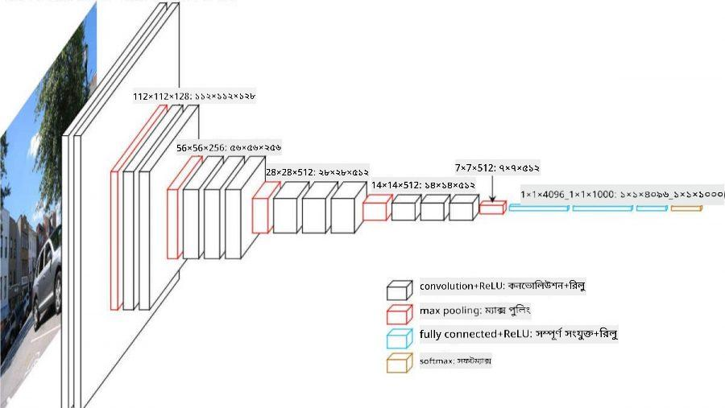

<!--
CO_OP_TRANSLATOR_METADATA:
{
  "original_hash": "088837b42b7d99198bf62db8a42411e0",
  "translation_date": "2025-08-26T09:27:51+00:00",
  "source_file": "lessons/4-ComputerVision/07-ConvNets/README.md",
  "language_code": "bn"
}
-->
# কনভোলিউশনাল নিউরাল নেটওয়ার্ক

আমরা আগেই দেখেছি যে নিউরাল নেটওয়ার্ক চিত্র বিশ্লেষণে বেশ দক্ষ, এমনকি এক-স্তরের পারসেপট্রনও MNIST ডেটাসেট থেকে হাতের লেখা সংখ্যা সনাক্ত করতে সক্ষম। তবে, MNIST ডেটাসেটটি বিশেষভাবে তৈরি, যেখানে সমস্ত সংখ্যা চিত্রের কেন্দ্রে অবস্থান করে, যা কাজটিকে সহজ করে তোলে।

## [পূর্ব-লেকচার কুইজ](https://ff-quizzes.netlify.app/en/ai/quiz/13)

বাস্তব জীবনে, আমরা চাই যে চিত্রে বস্তু সনাক্ত করতে পারি, তা যেখানেই থাকুক না কেন। কম্পিউটার ভিশন সাধারণ শ্রেণীবিন্যাস থেকে আলাদা, কারণ যখন আমরা চিত্রে একটি নির্দিষ্ট বস্তু খুঁজতে চাই, তখন আমরা চিত্রটি স্ক্যান করি এবং কিছু নির্দিষ্ট **প্যাটার্ন** এবং তাদের সংমিশ্রণ খুঁজে বের করি। উদাহরণস্বরূপ, একটি বিড়াল খুঁজতে গেলে, আমরা প্রথমে অনুভূমিক রেখা খুঁজতে পারি, যা গোঁফ তৈরি করতে পারে, এবং তারপর গোঁফের একটি নির্দিষ্ট সংমিশ্রণ আমাদের জানাতে পারে যে এটি আসলে একটি বিড়ালের ছবি। নির্দিষ্ট প্যাটার্নের আপেক্ষিক অবস্থান এবং উপস্থিতি গুরুত্বপূর্ণ, তবে চিত্রে তাদের সঠিক অবস্থান নয়।

প্যাটার্ন বের করতে, আমরা **কনভোলিউশনাল ফিল্টার** ধারণাটি ব্যবহার করব। আপনি জানেন, একটি চিত্র ২D-ম্যাট্রিক্স বা রঙের গভীরতা সহ ৩D-টেনসর দ্বারা উপস্থাপিত হয়। একটি ফিল্টার প্রয়োগ করার অর্থ হল আমরা একটি ছোট **ফিল্টার কার্নেল** ম্যাট্রিক্স নিই এবং মূল চিত্রের প্রতিটি পিক্সেলের জন্য প্রতিবেশী পয়েন্টগুলির সাথে ওজনযুক্ত গড় গণনা করি। আমরা এটি একটি ছোট জানালার মতো দেখতে পারি যা পুরো চিত্রের উপর স্লাইড করে এবং ফিল্টার কার্নেল ম্যাট্রিক্সের ওজন অনুযায়ী সমস্ত পিক্সেল গড় করে।

 | 
----|----

> ছবি: দিমিত্রি সশনিকভ

উদাহরণস্বরূপ, যদি আমরা MNIST সংখ্যাগুলিতে ৩x৩ ভার্টিকাল এজ এবং হরিজন্টাল এজ ফিল্টার প্রয়োগ করি, তাহলে আমরা হাইলাইট (যেমন উচ্চ মান) পেতে পারি যেখানে আমাদের মূল চিত্রে ভার্টিকাল এবং হরিজন্টাল এজ রয়েছে। সুতরাং এই দুটি ফিল্টার "এজ" খুঁজে বের করার জন্য ব্যবহার করা যেতে পারে। অনুরূপভাবে, আমরা অন্যান্য নিম্ন-স্তরের প্যাটার্ন খুঁজে বের করার জন্য বিভিন্ন ফিল্টার ডিজাইন করতে পারি:

> [Leung-Malik Filter Bank](https://www.robots.ox.ac.uk/~vgg/research/texclass/filters.html) এর ছবি

তবে, আমরা যদি কিছু প্যাটার্ন বের করার জন্য ফিল্টারগুলি ম্যানুয়ালি ডিজাইন করতে পারি, আমরা নেটওয়ার্কটিকে এমনভাবে ডিজাইন করতে পারি যাতে এটি স্বয়ংক্রিয়ভাবে প্যাটার্ন শিখতে পারে। এটি CNN-এর পিছনে প্রধান ধারণাগুলির একটি।

## CNN-এর প্রধান ধারণা

CNN কাজ করার পদ্ধতি নিম্নলিখিত গুরুত্বপূর্ণ ধারণাগুলির উপর ভিত্তি করে:

* কনভোলিউশনাল ফিল্টার প্যাটার্ন বের করতে পারে
* আমরা নেটওয়ার্কটিকে এমনভাবে ডিজাইন করতে পারি যাতে ফিল্টারগুলি স্বয়ংক্রিয়ভাবে প্রশিক্ষিত হয়
* আমরা একই পদ্ধতি ব্যবহার করে উচ্চ-স্তরের বৈশিষ্ট্যগুলিতে প্যাটার্ন খুঁজে বের করতে পারি, শুধুমাত্র মূল চিত্রে নয়। সুতরাং CNN বৈশিষ্ট্য নির্যাস একটি বৈশিষ্ট্যের শ্রেণিবিন্যাসে কাজ করে, নিম্ন-স্তরের পিক্সেল সংমিশ্রণ থেকে শুরু করে চিত্রের অংশগুলির উচ্চ-স্তরের সংমিশ্রণ পর্যন্ত।

> ছবি: [Hislop-Lynch এর গবেষণাপত্র](https://www.semanticscholar.org/paper/Computer-vision-based-pedestrian-trajectory-Hislop-Lynch/26e6f74853fc9bbb7487b06dc2cf095d36c9021d), তাদের [গবেষণার উপর ভিত্তি করে](https://dl.acm.org/doi/abs/10.1145/1553374.1553453)

## ✍️ অনুশীলন: কনভোলিউশনাল নিউরাল নেটওয়ার্ক

চলুন কনভোলিউশনাল নিউরাল নেটওয়ার্ক কীভাবে কাজ করে এবং কীভাবে প্রশিক্ষণযোগ্য ফিল্টার অর্জন করা যায় তা অন্বেষণ চালিয়ে যাই, সংশ্লিষ্ট নোটবুকগুলির মাধ্যমে কাজ করে:

* [কনভোলিউশনাল নিউরাল নেটওয়ার্ক - PyTorch](../../../../../lessons/4-ComputerVision/07-ConvNets/ConvNetsPyTorch.ipynb)
* [কনভোলিউশনাল নিউরাল নেটওয়ার্ক - TensorFlow](../../../../../lessons/4-ComputerVision/07-ConvNets/ConvNetsTF.ipynb)

## পিরামিড আর্কিটেকচার

চিত্র প্রক্রিয়াকরণের জন্য ব্যবহৃত বেশিরভাগ CNN তথাকথিত পিরামিড আর্কিটেকচার অনুসরণ করে। মূল চিত্রগুলিতে প্রয়োগ করা প্রথম কনভোলিউশনাল স্তরে সাধারণত তুলনামূলকভাবে কম সংখ্যক ফিল্টার থাকে (৮-১৬), যা বিভিন্ন পিক্সেল সংমিশ্রণের সাথে সম্পর্কিত, যেমন অনুভূমিক/ভার্টিকাল রেখা বা স্ট্রোক। পরবর্তী স্তরে, আমরা নেটওয়ার্কের স্থানিক মাত্রা কমিয়ে দিই এবং ফিল্টারের সংখ্যা বাড়াই, যা সাধারণ বৈশিষ্ট্যের আরও সম্ভাব্য সংমিশ্রণের সাথে সম্পর্কিত। প্রতিটি স্তরে, চূড়ান্ত শ্রেণীবিন্যাসকারীর দিকে এগিয়ে যাওয়ার সাথে সাথে চিত্রের স্থানিক মাত্রা হ্রাস পায় এবং ফিল্টারের সংখ্যা বৃদ্ধি পায়।

উদাহরণস্বরূপ, আসুন VGG-16 এর আর্কিটেকচার দেখি, একটি নেটওয়ার্ক যা ২০১৪ সালে ImageNet-এর টপ-৫ শ্রেণীবিন্যাসে ৯২.৭% সঠিকতা অর্জন করেছিল:

> ছবি: [Researchgate](https://www.researchgate.net/figure/Vgg16-model-structure-To-get-the-VGG-NIN-model-we-replace-the-2-nd-4-th-6-th-7-th_fig2_335194493)

## সর্বাধিক পরিচিত CNN আর্কিটেকচার

[সর্বাধিক পরিচিত CNN আর্কিটেকচার সম্পর্কে আপনার অধ্যয়ন চালিয়ে যান](CNN_Architectures.md)

**অস্বীকৃতি**:  
এই নথিটি AI অনুবাদ পরিষেবা [Co-op Translator](https://github.com/Azure/co-op-translator) ব্যবহার করে অনুবাদ করা হয়েছে। আমরা যথাসম্ভব সঠিক অনুবাদের চেষ্টা করি, তবে অনুগ্রহ করে মনে রাখবেন যে স্বয়ংক্রিয় অনুবাদে ত্রুটি বা অসঙ্গতি থাকতে পারে। নথিটির মূল ভাষায় লেখা সংস্করণটিকেই প্রামাণিক উৎস হিসেবে বিবেচনা করা উচিত। গুরুত্বপূর্ণ তথ্যের জন্য, পেশাদার মানব অনুবাদ ব্যবহার করার পরামর্শ দেওয়া হয়। এই অনুবাদ ব্যবহারের ফলে সৃষ্ট কোনো ভুল বোঝাবুঝি বা ভুল ব্যাখ্যার জন্য আমরা দায়ী নই।