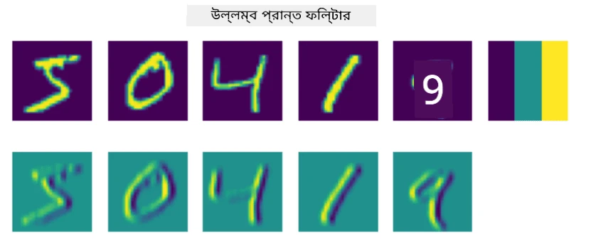
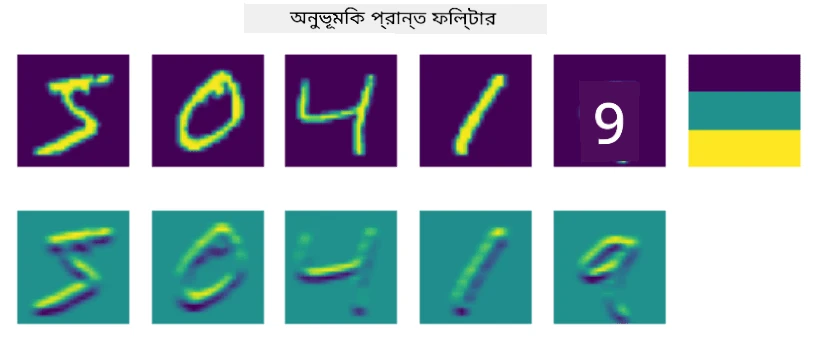
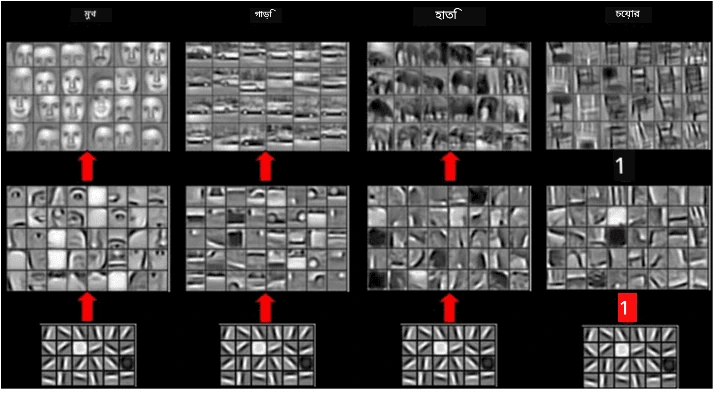

# কনভোলিউশনাল নিউরাল নেটওয়ার্কস

আমরা আগেই দেখেছি যে নিউরাল নেটওয়ার্কস ছবি নিয়ে কাজ করতে বেশ দক্ষ, এমনকি এক-স্তরের পারসেপট্রনও MNIST ডেটাসেট থেকে হাতের লেখা সংখ্যা চেনার ক্ষেত্রে যথেষ্ট সঠিকতা অর্জন করতে পারে। তবে, MNIST ডেটাসেটটি খুবই বিশেষ, এবং সমস্ত সংখ্যা ছবির কেন্দ্রে অবস্থান করে, যা কাজটিকে সহজ করে তোলে।

## [পূর্ব-লেকচার কুইজ](https://ff-quizzes.netlify.app/en/ai/quiz/13)

বাস্তব জীবনে, আমরা চাই যে ছবির নির্দিষ্ট অবস্থান নির্বিশেষে কোনো বস্তু চেনা সম্ভব হোক। কম্পিউটার ভিশন সাধারণ শ্রেণীবিন্যাস থেকে আলাদা, কারণ যখন আমরা ছবিতে কোনো নির্দিষ্ট বস্তু খুঁজতে চাই, তখন আমরা ছবিটি স্ক্যান করে কিছু নির্দিষ্ট **প্যাটার্ন** এবং তাদের সংমিশ্রণ খুঁজে বের করি। উদাহরণস্বরূপ, একটি বিড়াল খুঁজতে গেলে, আমরা প্রথমে অনুভূমিক রেখা খুঁজতে পারি, যা গোঁফ তৈরি করতে পারে, এবং তারপর গোঁফের একটি নির্দিষ্ট সংমিশ্রণ আমাদের জানাতে পারে যে এটি আসলে একটি বিড়ালের ছবি। নির্দিষ্ট প্যাটার্নের আপেক্ষিক অবস্থান এবং উপস্থিতি গুরুত্বপূর্ণ, তবে ছবিতে তাদের সঠিক অবস্থান নয়।

প্যাটার্ন বের করার জন্য, আমরা **কনভোলিউশনাল ফিল্টার** ধারণাটি ব্যবহার করব। আপনি জানেন, একটি ছবি 2D-ম্যাট্রিক্স বা রঙের গভীরতা সহ 3D-টেনসর দ্বারা উপস্থাপিত হয়। একটি ফিল্টার প্রয়োগ করার অর্থ হলো আমরা একটি তুলনামূলকভাবে ছোট **ফিল্টার কের্নেল** ম্যাট্রিক্স নিই, এবং মূল ছবির প্রতিটি পিক্সেলের জন্য আমরা প্রতিবেশী পয়েন্টগুলির সাথে ওজনযুক্ত গড় গণনা করি। আমরা এটি একটি ছোট জানালা হিসেবে দেখতে পারি যা পুরো ছবির উপর দিয়ে স্লাইড করে এবং ফিল্টার কের্নেল ম্যাট্রিক্সের ওজন অনুযায়ী সমস্ত পিক্সেল গড় করে।

 | 
----|----

> ছবি: দিমিত্রি সশনিকভ

উদাহরণস্বরূপ, যদি আমরা MNIST সংখ্যাগুলিতে 3x3 ভার্টিকাল এজ এবং হরিজন্টাল এজ ফিল্টার প্রয়োগ করি, তাহলে আমরা হাইলাইট (যেমন উচ্চ মান) পেতে পারি যেখানে আমাদের মূল ছবিতে ভার্টিকাল এবং হরিজন্টাল এজ রয়েছে। সুতরাং এই দুটি ফিল্টার "এজ" খুঁজে বের করার জন্য ব্যবহার করা যেতে পারে। অনুরূপভাবে, আমরা অন্যান্য নিম্ন-স্তরের প্যাটার্ন খুঁজে বের করার জন্য বিভিন্ন ফিল্টার ডিজাইন করতে পারি:

> [লিউং-মালিক ফিল্টার ব্যাংক](https://www.robots.ox.ac.uk/~vgg/research/texclass/filters.html) এর ছবি

তবে, আমরা যদি কিছু প্যাটার্ন বের করার জন্য ফিল্টার ডিজাইন করতে পারি, আমরা নেটওয়ার্কটিকে এমনভাবে ডিজাইন করতে পারি যাতে এটি স্বয়ংক্রিয়ভাবে প্যাটার্ন শিখতে পারে। এটি CNN-এর পিছনে অন্যতম প্রধান ধারণা।

## CNN-এর প্রধান ধারণা

CNN যেভাবে কাজ করে তা নিম্নলিখিত গুরুত্বপূর্ণ ধারণার উপর ভিত্তি করে:

* কনভোলিউশনাল ফিল্টার প্যাটার্ন বের করতে পারে
* আমরা নেটওয়ার্কটিকে এমনভাবে ডিজাইন করতে পারি যাতে ফিল্টারগুলি স্বয়ংক্রিয়ভাবে প্রশিক্ষিত হয়
* আমরা একই পদ্ধতি ব্যবহার করে উচ্চ-স্তরের বৈশিষ্ট্যগুলিতে প্যাটার্ন খুঁজে বের করতে পারি, শুধুমাত্র মূল ছবিতে নয়। সুতরাং CNN বৈশিষ্ট্য বের করার কাজ বৈশিষ্ট্যের একটি শ্রেণিবিন্যাসে কাজ করে, যা নিম্ন-স্তরের পিক্সেল সংমিশ্রণ থেকে শুরু করে ছবির অংশগুলির উচ্চ-স্তরের সংমিশ্রণে পৌঁছায়।

> ছবি: [হিসলপ-লিঞ্চের গবেষণাপত্র](https://www.semanticscholar.org/paper/Computer-vision-based-pedestrian-trajectory-Hislop-Lynch/26e6f74853fc9bbb7487b06dc2cf095d36c9021d), তাদের [গবেষণার উপর ভিত্তি করে](https://dl.acm.org/doi/abs/10.1145/1553374.1553453)

## ✍️ অনুশীলন: কনভোলিউশনাল নিউরাল নেটওয়ার্কস

চলুন কনভোলিউশনাল নিউরাল নেটওয়ার্কস কীভাবে কাজ করে এবং কীভাবে আমরা প্রশিক্ষণযোগ্য ফিল্টার অর্জন করতে পারি তা অনুসন্ধান চালিয়ে যাই, সংশ্লিষ্ট নোটবুকগুলির মাধ্যমে কাজ করে:

* [কনভোলিউশনাল নিউরাল নেটওয়ার্কস - PyTorch](ConvNetsPyTorch.ipynb)
* [কনভোলিউশনাল নিউরাল নেটওয়ার্কস - TensorFlow](ConvNetsTF.ipynb)

## পিরামিড আর্কিটেকচার

ছবি প্রক্রিয়াকরণের জন্য ব্যবহৃত বেশিরভাগ CNN তথাকথিত পিরামিড আর্কিটেকচার অনুসরণ করে। মূল ছবিতে প্রয়োগ করা প্রথম কনভোলিউশনাল স্তরে সাধারণত তুলনামূলকভাবে কম সংখ্যক ফিল্টার (৮-১৬) থাকে, যা বিভিন্ন পিক্সেল সংমিশ্রণ যেমন অনুভূমিক/ভার্টিকাল রেখা বা স্ট্রোকের সাথে সম্পর্কিত। পরবর্তী স্তরে, আমরা নেটওয়ার্কের স্থানিক মাত্রা কমিয়ে দিই এবং ফিল্টারের সংখ্যা বাড়াই, যা সাধারণ বৈশিষ্ট্যের আরও সম্ভাব্য সংমিশ্রণের সাথে সম্পর্কিত। প্রতিটি স্তরে, চূড়ান্ত শ্রেণীবিন্যাসকারীর দিকে এগিয়ে যাওয়ার সাথে সাথে ছবির স্থানিক মাত্রা কমে যায় এবং ফিল্টারের সংখ্যা বাড়ে।

উদাহরণস্বরূপ, আসুন VGG-16-এর আর্কিটেকচার দেখি, একটি নেটওয়ার্ক যা ২০১৪ সালে ImageNet-এর টপ-৫ শ্রেণীবিন্যাসে ৯২.৭% সঠিকতা অর্জন করেছিল:

> ছবি: [রিসার্চগেট](https://www.researchgate.net/figure/Vgg16-model-structure-To-get-the-VGG-NIN-model-we-replace-the-2-nd-4-th-6-th-7-th_fig2_335194493)

## সর্বাধিক পরিচিত CNN আর্কিটেকচার

[সর্বাধিক পরিচিত CNN আর্কিটেকচার সম্পর্কে আপনার অধ্যয়ন চালিয়ে যান](CNN_Architectures.md)

---

