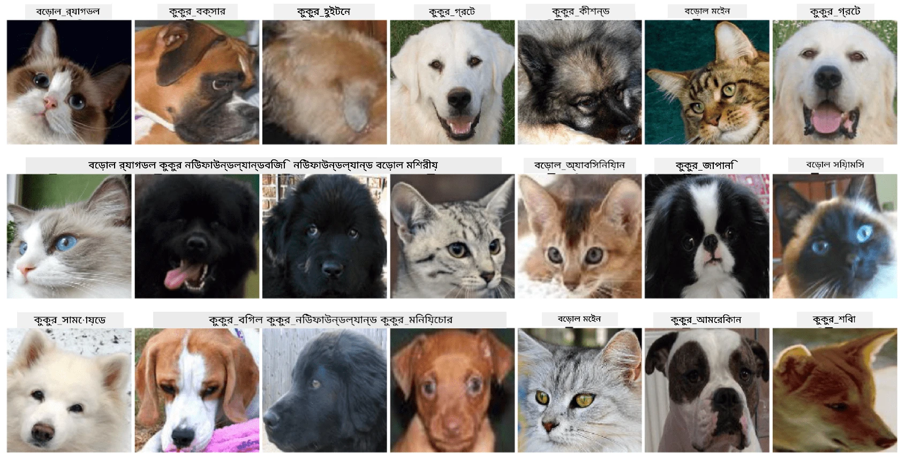

# পোষা প্রাণীর মুখের শ্রেণীবিন্যাস

[AI for Beginners Curriculum](https://github.com/microsoft/ai-for-beginners) থেকে ল্যাব অ্যাসাইনমেন্ট।

## কাজ

ধরুন আপনাকে একটি পোষা প্রাণীর নার্সারি অ্যাপ্লিকেশন তৈরি করতে হবে যেখানে সমস্ত পোষা প্রাণীকে ক্যাটালগ করা হবে। এই ধরনের অ্যাপ্লিকেশনের একটি চমৎকার বৈশিষ্ট্য হতে পারে ফটোগ্রাফ থেকে স্বয়ংক্রিয়ভাবে জাত শনাক্ত করা। এটি নিউরাল নেটওয়ার্ক ব্যবহার করে সফলভাবে করা সম্ভব।

আপনাকে **Pet Faces** ডেটাসেট ব্যবহার করে বিড়াল এবং কুকুরের বিভিন্ন জাত শ্রেণীবিন্যাস করার জন্য একটি কনভোলিউশনাল নিউরাল নেটওয়ার্ক প্রশিক্ষণ দিতে হবে।

## ডেটাসেট

আমরা [Oxford-IIIT Pet Dataset](https://www.robots.ox.ac.uk/~vgg/data/pets/) ব্যবহার করব, যেখানে ৩৭টি ভিন্ন জাতের কুকুর এবং বিড়ালের ছবি রয়েছে।



ডেটাসেট ডাউনলোড করতে, এই কোড স্নিপেটটি ব্যবহার করুন:

```python
!wget https://thor.robots.ox.ac.uk/~vgg/data/pets/images.tar.gz
!tar xfz images.tar.gz
!rm images.tar.gz
```

**নোট:** Oxford-IIIT Pet Dataset-এর ছবিগুলি ফাইলনামের মাধ্যমে সংগঠিত (যেমন, `Abyssinian_1.jpg`, `Bengal_2.jpg`)। নোটবুকে এই ছবিগুলিকে জাত-নির্দিষ্ট সাবডিরেক্টরিতে সংগঠিত করার কোড অন্তর্ভুক্ত রয়েছে, যা শ্রেণীবিন্যাসকে সহজ করে তোলে।

## নোটবুক শুরু করা

ল্যাব শুরু করতে [PetFaces.ipynb](PetFaces.ipynb) খুলুন।

## মূল শিক্ষা

আপনি স্ক্র্যাচ থেকে একটি তুলনামূলকভাবে জটিল ইমেজ শ্রেণীবিন্যাস সমস্যার সমাধান করেছেন! এখানে অনেকগুলো ক্লাস ছিল, তবুও আপনি যুক্তিসঙ্গত সঠিকতা অর্জন করতে পেরেছেন! এটি টপ-k সঠিকতা পরিমাপ করাও যুক্তিযুক্ত, কারণ কিছু ক্লাসকে বিভ্রান্ত করা সহজ, যা মানুষের জন্যও স্পষ্টভাবে আলাদা নয়।

---

**অস্বীকৃতি**:  
এই নথিটি AI অনুবাদ পরিষেবা [Co-op Translator](https://github.com/Azure/co-op-translator) ব্যবহার করে অনুবাদ করা হয়েছে। আমরা যথাসাধ্য সঠিকতার জন্য চেষ্টা করি, তবে অনুগ্রহ করে মনে রাখবেন যে স্বয়ংক্রিয় অনুবাদে ত্রুটি বা অসঙ্গতি থাকতে পারে। মূল ভাষায় থাকা নথিটিকে প্রামাণিক উৎস হিসেবে বিবেচনা করা উচিত। গুরুত্বপূর্ণ তথ্যের জন্য, পেশাদার মানব অনুবাদ সুপারিশ করা হয়। এই অনুবাদ ব্যবহারের ফলে কোনো ভুল বোঝাবুঝি বা ভুল ব্যাখ্যা হলে আমরা দায়বদ্ধ থাকব না।