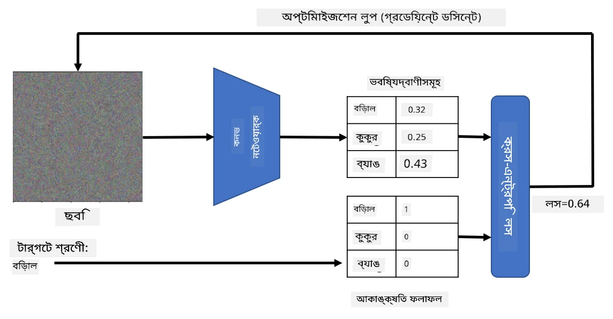

# প্রি-ট্রেইনড নেটওয়ার্ক এবং ট্রান্সফার লার্নিং

CNN ট্রেনিং করতে অনেক সময় লাগে এবং এর জন্য প্রচুর ডেটা প্রয়োজন। তবে, বেশিরভাগ সময় নেটওয়ার্কের জন্য সেরা লো-লেভেল ফিল্টার শেখার কাজে ব্যয় হয়, যা ইমেজ থেকে প্যাটার্ন বের করতে সাহায্য করে। একটি স্বাভাবিক প্রশ্ন উঠে আসে - আমরা কি একটি ডেটাসেটে ট্রেন করা নিউরাল নেটওয়ার্ক ব্যবহার করে সম্পূর্ণ ট্রেনিং প্রক্রিয়া ছাড়াই ভিন্ন ইমেজ শ্রেণীবিন্যাস করতে পারি?

## [প্রি-লেকচার কুইজ](https://ff-quizzes.netlify.app/en/ai/quiz/15)

এই পদ্ধতিকে **ট্রান্সফার লার্নিং** বলা হয়, কারণ আমরা একটি নিউরাল নেটওয়ার্ক মডেল থেকে অন্যটিতে কিছু জ্ঞান স্থানান্তর করি। ট্রান্সফার লার্নিং-এ, আমরা সাধারণত একটি প্রি-ট্রেইনড মডেল দিয়ে শুরু করি, যা **ImageNet** এর মতো বড় ইমেজ ডেটাসেটে ট্রেন করা হয়েছে। এই মডেলগুলো ইতিমধ্যেই সাধারণ ইমেজ থেকে বিভিন্ন বৈশিষ্ট্য বের করতে ভালো কাজ করতে পারে, এবং অনেক ক্ষেত্রে এই বৈশিষ্ট্যগুলোর উপর ভিত্তি করে একটি ক্লাসিফায়ার তৈরি করলেই ভালো ফলাফল পাওয়া যায়।

> ✅ ট্রান্সফার লার্নিং শব্দটি অন্যান্য একাডেমিক ক্ষেত্রে যেমন শিক্ষা ক্ষেত্রেও পাওয়া যায়। এটি একটি ক্ষেত্র থেকে জ্ঞান নিয়ে অন্য ক্ষেত্রে প্রয়োগ করার প্রক্রিয়াকে বোঝায়।

## প্রি-ট্রেইনড মডেলগুলোকে ফিচার এক্সট্রাক্টর হিসেবে ব্যবহার করা

আগের সেকশনে আমরা যে কনভোলিউশনাল নেটওয়ার্ক নিয়ে আলোচনা করেছি, সেগুলোতে বেশ কয়েকটি লেয়ার ছিল, যা ইমেজ থেকে বিভিন্ন বৈশিষ্ট্য বের করার জন্য ডিজাইন করা হয়েছে। এটি লো-লেভেল পিক্সেল কম্বিনেশন (যেমন অনুভূমিক/উল্লম্ব লাইন বা স্ট্রোক) থেকে শুরু করে উচ্চ-লেভেল বৈশিষ্ট্যের কম্বিনেশন পর্যন্ত যেতে পারে, যা একটি আগুনের চোখের মতো জিনিসের সাথে সম্পর্কিত। যদি আমরা একটি বড় এবং বৈচিত্র্যময় ইমেজ ডেটাসেটে CNN ট্রেন করি, তাহলে নেটওয়ার্ক সাধারণ বৈশিষ্ট্যগুলো বের করতে শিখবে।

Keras এবং PyTorch-এ কিছু সাধারণ আর্কিটেকচারের জন্য প্রি-ট্রেইনড নিউরাল নেটওয়ার্ক ওজন সহজেই লোড করার ফাংশন রয়েছে, যেগুলো বেশিরভাগই ImageNet ইমেজে ট্রেন করা হয়েছে। সবচেয়ে বেশি ব্যবহৃত মডেলগুলো আগের লেসনের [CNN Architectures](../07-ConvNets/CNN_Architectures.md) পেজে বর্ণনা করা হয়েছে। বিশেষ করে, আপনি নিম্নলিখিতগুলোর মধ্যে একটি ব্যবহার করতে পারেন:

* **VGG-16/VGG-19**: তুলনামূলকভাবে সহজ মডেল, যা এখনও ভালো একুরেসি দেয়। ট্রান্সফার লার্নিং কেমন কাজ করছে তা দেখতে প্রথম প্রচেষ্টা হিসেবে VGG ব্যবহার করা ভালো।
* **ResNet**: Microsoft Research দ্বারা ২০১৫ সালে প্রস্তাবিত মডেলের একটি পরিবার। এগুলোতে বেশি লেয়ার থাকে, এবং তাই বেশি রিসোর্স লাগে।
* **MobileNet**: ছোট আকারের মডেলের একটি পরিবার, যা মোবাইল ডিভাইসের জন্য উপযুক্ত। যদি আপনার রিসোর্স কম থাকে এবং সামান্য একুরেসি ত্যাগ করতে পারেন, তাহলে এগুলো ব্যবহার করুন।

এখানে VGG-16 নেটওয়ার্ক দ্বারা একটি বিড়ালের ছবির থেকে বের করা বৈশিষ্ট্যের উদাহরণ দেওয়া হয়েছে:

## বিড়াল বনাম কুকুর ডেটাসেট

এই উদাহরণে, আমরা [Cats and Dogs](https://www.microsoft.com/download/details.aspx?id=54765&WT.mc_id=academic-77998-cacaste) ডেটাসেট ব্যবহার করব, যা বাস্তব জীবনের ইমেজ ক্লাসিফিকেশন পরিস্থিতির খুব কাছাকাছি।

## ✍️ অনুশীলন: ট্রান্সফার লার্নিং

চলুন সংশ্লিষ্ট নোটবুকে ট্রান্সফার লার্নিং-এর কার্যকারিতা দেখি:

* [Transfer Learning - PyTorch](TransferLearningPyTorch.ipynb)
* [Transfer Learning - TensorFlow](TransferLearningTF.ipynb)

## অ্যাডভার্সিয়াল বিড়াল ভিজুয়ালাইজ করা

প্রি-ট্রেইনড নিউরাল নেটওয়ার্কের *মস্তিষ্কে* বিভিন্ন প্যাটার্ন থাকে, যার মধ্যে **আদর্শ বিড়াল** (এবং আদর্শ কুকুর, আদর্শ জেব্রা ইত্যাদি) ধারণা অন্তর্ভুক্ত থাকে। এই ইমেজটি কোনোভাবে **ভিজুয়ালাইজ করা** আকর্ষণীয় হবে। তবে, এটি সহজ নয়, কারণ প্যাটার্নগুলো নেটওয়ার্কের ওজনের মধ্যে ছড়িয়ে থাকে এবং একটি হায়ারারকিকাল স্ট্রাকচারে সংগঠিত থাকে।

একটি পদ্ধতি হলো একটি র্যান্ডম ইমেজ দিয়ে শুরু করা এবং তারপর **গ্রেডিয়েন্ট ডিসেন্ট অপ্টিমাইজেশন** পদ্ধতি ব্যবহার করে সেই ইমেজটি এমনভাবে পরিবর্তন করা যাতে নেটওয়ার্কটি মনে করে এটি একটি বিড়াল।

তবে, যদি আমরা এটি করি, তাহলে আমরা এমন কিছু পাব যা র্যান্ডম নয়েজের মতো দেখায়। কারণ *নেটওয়ার্ককে মনে করানোর অনেক উপায় আছে যে ইনপুট ইমেজটি একটি বিড়াল*, যার মধ্যে কিছু ভিজুয়ালি অর্থপূর্ণ নয়। যদিও এই ইমেজগুলোতে বিড়ালের জন্য সাধারণ প্যাটার্ন থাকে, তবুও এগুলোকে ভিজুয়ালি আলাদা করার জন্য কিছু নেই।

ফলাফল উন্নত করতে, আমরা লস ফাংশনে একটি নতুন টার্ম যোগ করতে পারি, যাকে **ভ্যারিয়েশন লস** বলা হয়। এটি একটি মেট্রিক যা দেখায় ইমেজের প্রতিবেশী পিক্সেলগুলো কতটা মিল। ভ্যারিয়েশন লস মিনিমাইজ করলে ইমেজটি মসৃণ হয় এবং নয়েজ দূর হয় - ফলে আরও ভিজুয়ালি আকর্ষণীয় প্যাটার্ন প্রকাশ পায়। এখানে এমন "আদর্শ" ইমেজের উদাহরণ দেওয়া হয়েছে, যা বিড়াল এবং জেব্রা হিসেবে উচ্চ সম্ভাবনায় শ্রেণীবদ্ধ করা হয়েছে:

 | 
-----|-----
 *আদর্শ বিড়াল* | *আদর্শ জেব্রা*

একই পদ্ধতি ব্যবহার করে তথাকথিত **অ্যাডভার্সিয়াল আক্রমণ** করা যেতে পারে নিউরাল নেটওয়ার্কে। ধরুন আমরা একটি কুকুরকে বিড়াল হিসেবে দেখাতে চাই। যদি আমরা কুকুরের একটি ছবি নিই, যা নেটওয়ার্ক দ্বারা কুকুর হিসেবে স্বীকৃত, আমরা তারপর এটি সামান্য পরিবর্তন করতে পারি গ্রেডিয়েন্ট ডিসেন্ট অপ্টিমাইজেশন ব্যবহার করে, যতক্ষণ না নেটওয়ার্ক এটি বিড়াল হিসেবে শ্রেণীবদ্ধ করে:

 | 
-----|-----
*কুকুরের আসল ছবি* | *কুকুরের ছবি যা বিড়াল হিসেবে শ্রেণীবদ্ধ*

উপরের ফলাফল পুনরায় তৈরি করার কোডটি নিম্নলিখিত নোটবুকে দেখুন:

* [Ideal and Adversarial Cat - TensorFlow](AdversarialCat_TF.ipynb)

## উপসংহার

ট্রান্সফার লার্নিং ব্যবহার করে, আপনি দ্রুত একটি কাস্টম অবজেক্ট ক্লাসিফিকেশন টাস্কের জন্য একটি ক্লাসিফায়ার তৈরি করতে পারেন এবং উচ্চ একুরেসি অর্জন করতে পারেন। আপনি দেখতে পাবেন যে আমরা এখন যে আরও জটিল কাজগুলো সমাধান করছি তার জন্য উচ্চতর কম্পিউটেশনাল ক্ষমতা প্রয়োজন এবং CPU-তে সহজে সমাধান করা যায় না। পরবর্তী ইউনিটে, আমরা একই মডেলটি কম কম্পিউট রিসোর্স ব্যবহার করে ট্রেন করার জন্য একটি আরও হালকা ইমপ্লিমেন্টেশন ব্যবহার করার চেষ্টা করব, যা সামান্য কম একুরেসি দেয়।

## 🚀 চ্যালেঞ্জ

সংলগ্ন নোটবুকে, নীচে নোট রয়েছে যে ট্রান্সফার জ্ঞান কিছুটা অনুরূপ ট্রেনিং ডেটার সাথে সবচেয়ে ভালো কাজ করে (সম্ভবত একটি নতুন ধরনের প্রাণী)। সম্পূর্ণ নতুন ধরনের ইমেজ নিয়ে কিছু পরীক্ষা করুন এবং দেখুন আপনার ট্রান্সফার জ্ঞান মডেলগুলো কতটা ভালো বা খারাপ পারফর্ম করে।

## [পোস্ট-লেকচার কুইজ](https://ff-quizzes.netlify.app/en/ai/quiz/16)

## রিভিউ এবং স্ব-অধ্যয়ন

[TrainingTricks.md](TrainingTricks.md) পড়ুন এবং আপনার মডেল ট্রেন করার অন্যান্য উপায় সম্পর্কে জ্ঞান গভীর করুন।

## [অ্যাসাইনমেন্ট](lab/README.md)

এই ল্যাবে, আমরা বাস্তব জীবনের [Oxford-IIIT](https://www.robots.ox.ac.uk/~vgg/data/pets/) পেটস ডেটাসেট ব্যবহার করব, যেখানে বিড়াল এবং কুকুরের ৩৫টি প্রজাতি রয়েছে, এবং আমরা একটি ট্রান্সফার লার্নিং ক্লাসিফায়ার তৈরি করব।

---

