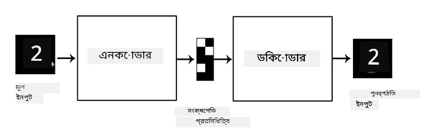
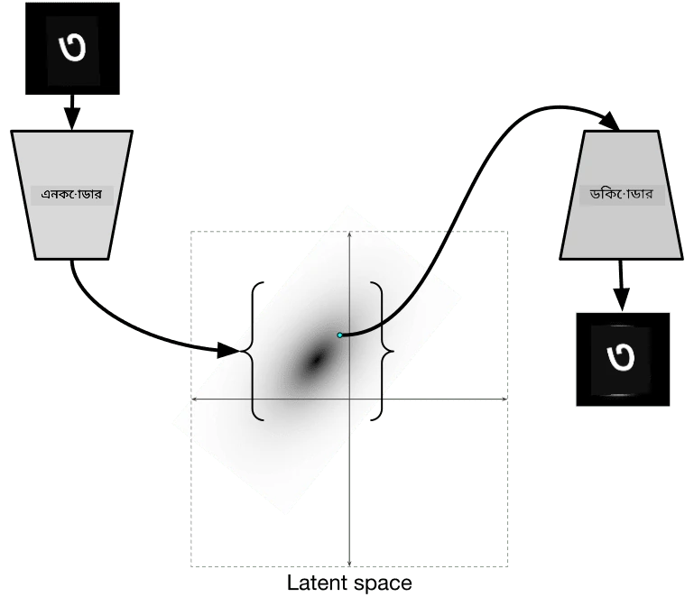

# অটোএনকোডার

CNN প্রশিক্ষণের সময় একটি বড় সমস্যা হলো প্রচুর লেবেলযুক্ত ডেটার প্রয়োজন হয়। উদাহরণস্বরূপ, ইমেজ ক্লাসিফিকেশনের ক্ষেত্রে, আমাদের ইমেজগুলোকে বিভিন্ন শ্রেণিতে ভাগ করতে হয়, যা একটি ম্যানুয়াল কাজ।

## [প্রাক-লেকচার কুইজ](https://ff-quizzes.netlify.app/en/ai/quiz/17)

তবে, আমরা চাইলে কাঁচা (লেবেলবিহীন) ডেটা ব্যবহার করে CNN ফিচার এক্সট্রাক্টর প্রশিক্ষণ দিতে পারি, যাকে **সেলফ-সুপারভাইজড লার্নিং** বলা হয়। লেবেলের পরিবর্তে, আমরা প্রশিক্ষণের জন্য ইমেজগুলোকে নেটওয়ার্কের ইনপুট এবং আউটপুট হিসেবে ব্যবহার করব। **অটোএনকোডার** এর মূল ধারণা হলো আমাদের একটি **এনকোডার নেটওয়ার্ক** থাকবে, যা ইনপুট ইমেজকে কিছু **ল্যাটেন্ট স্পেস**-এ রূপান্তর করবে (সাধারণত এটি একটি ছোট আকারের ভেক্টর), তারপর একটি **ডিকোডার নেটওয়ার্ক**, যার কাজ হবে মূল ইমেজটি পুনর্গঠন করা।

> ✅ একটি [অটোএনকোডার](https://wikipedia.org/wiki/Autoencoder) হলো "এক ধরনের কৃত্রিম নিউরাল নেটওয়ার্ক যা লেবেলবিহীন ডেটার কার্যকর কোডিং শেখার জন্য ব্যবহৃত হয়।"

আমরা যখন অটোএনকোডার প্রশিক্ষণ দিই, তখন এটি মূল ইমেজ থেকে যতটা সম্ভব তথ্য ধারণ করার চেষ্টা করে, যাতে সঠিকভাবে পুনর্গঠন করা যায়। নেটওয়ার্কটি ইনপুট ইমেজগুলোর সেরা **এম্বেডিং** খুঁজে বের করার চেষ্টা করে, যা অর্থপূর্ণ তথ্য ধারণ করে।

> ছবি [Keras ব্লগ](https://blog.keras.io/building-autoencoders-in-keras.html) থেকে

## অটোএনকোডার ব্যবহারের পরিস্থিতি

মূল ইমেজ পুনর্গঠন নিজে থেকে খুব একটা কার্যকর মনে না হলেও, কিছু পরিস্থিতিতে অটোএনকোডার বিশেষভাবে কার্যকর:

* **ইমেজের মাত্রা কমানো** বা **ইমেজ এম্বেডিং প্রশিক্ষণ**। সাধারণত অটোএনকোডার PCA-এর চেয়ে ভালো ফলাফল দেয়, কারণ এটি ইমেজের স্থানিক প্রকৃতি এবং স্তরবিন্যাস বৈশিষ্ট্যগুলো বিবেচনা করে।
* **ডিনয়জিং**, অর্থাৎ ইমেজ থেকে শব্দ (noise) সরানো। শব্দ অনেক অপ্রয়োজনীয় তথ্য বহন করে, যা অটোএনকোডার ছোট ল্যাটেন্ট স্পেসে ধারণ করতে পারে না। ফলে এটি শুধুমাত্র গুরুত্বপূর্ণ অংশ ধারণ করে। ডিনয়জার প্রশিক্ষণের সময়, আমরা মূল ইমেজ দিয়ে শুরু করি এবং কৃত্রিমভাবে যোগ করা শব্দযুক্ত ইমেজকে অটোএনকোডারের ইনপুট হিসেবে ব্যবহার করি।
* **সুপার-রেজোলিউশন**, ইমেজের রেজোলিউশন বৃদ্ধি করা। আমরা উচ্চ-রেজোলিউশন ইমেজ দিয়ে শুরু করি এবং নিম্ন-রেজোলিউশন ইমেজকে অটোএনকোডারের ইনপুট হিসেবে ব্যবহার করি।
* **জেনারেটিভ মডেল**। একবার অটোএনকোডার প্রশিক্ষণ সম্পন্ন হলে, ডিকোডার অংশটি এলোমেলো ল্যাটেন্ট ভেক্টর থেকে নতুন অবজেক্ট তৈরি করতে ব্যবহার করা যায়।

## ভ্যারিয়েশনাল অটোএনকোডার (VAE)

প্রথাগত অটোএনকোডার ইনপুট ডেটার মাত্রা কমিয়ে গুরুত্বপূর্ণ বৈশিষ্ট্যগুলো নির্ধারণ করে। তবে, ল্যাটেন্ট ভেক্টরগুলো প্রায়ই খুব একটা অর্থবহ হয় না। উদাহরণস্বরূপ, MNIST ডেটাসেটের ক্ষেত্রে, বিভিন্ন ল্যাটেন্ট ভেক্টরের সাথে কোন সংখ্যাগুলো সম্পর্কিত তা নির্ধারণ করা সহজ নয়, কারণ কাছাকাছি ল্যাটেন্ট ভেক্টরগুলো একই সংখ্যার সাথে সম্পর্কিত নাও হতে পারে।

অন্যদিকে, *জেনারেটিভ* মডেল প্রশিক্ষণের জন্য ল্যাটেন্ট স্পেস সম্পর্কে কিছু ধারণা থাকা ভালো। এই ধারণা আমাদের **ভ্যারিয়েশনাল অটোএনকোডার** (VAE)-এর দিকে নিয়ে যায়।

VAE হলো এমন একটি অটোএনকোডার যা ল্যাটেন্ট প্যারামিটারের *পরিসংখ্যানগত বিতরণ* (latent distribution) পূর্বাভাস দিতে শেখে। উদাহরণস্বরূপ, আমরা চাইতে পারি ল্যাটেন্ট ভেক্টরগুলো যেন zmean এবং zsigma (উভয়ই d মাত্রার ভেক্টর) এর সাথে স্বাভাবিকভাবে বিতরণ করা হয়। VAE-এর এনকোডার এই প্যারামিটারগুলো পূর্বাভাস দিতে শেখে এবং তারপর ডিকোডার এই বিতরণ থেকে একটি এলোমেলো ভেক্টর নিয়ে অবজেক্ট পুনর্গঠন করে।

সংক্ষেপে:

 * ইনপুট ভেক্টর থেকে আমরা `z_mean` এবং `z_log_sigma` পূর্বাভাস দিই (স্ট্যান্ডার্ড ডেভিয়েশন নিজে পূর্বাভাস না দিয়ে, আমরা এর লগারিদম পূর্বাভাস দিই)
 * আমরা N(zmean,exp(zlog\_sigma)) বিতরণ থেকে একটি `sample` ভেক্টর গ্রহণ করি
 * ডিকোডার `sample` ভেক্টর ব্যবহার করে মূল ইমেজটি ডিকোড করার চেষ্টা করে

 

> ছবি [এই ব্লগ পোস্ট](https://ijdykeman.github.io/ml/2016/12/21/cvae.html) থেকে, লেখক Isaak Dykeman

ভ্যারিয়েশনাল অটোএনকোডার একটি জটিল লস ফাংশন ব্যবহার করে, যা দুটি অংশ নিয়ে গঠিত:

* **রিকনস্ট্রাকশন লস** হলো একটি লস ফাংশন যা দেখায় পুনর্গঠিত ইমেজ কতটা লক্ষ্য ইমেজের কাছাকাছি (এটি Mean Squared Error বা MSE হতে পারে)। এটি সাধারণ অটোএনকোডারের মতোই।
* **KL লস**, যা নিশ্চিত করে যে ল্যাটেন্ট ভেরিয়েবল বিতরণ স্বাভাবিক বিতরণের কাছাকাছি থাকে। এটি [Kullback-Leibler divergence](https://www.countbayesie.com/blog/2017/5/9/kullback-leibler-divergence-explained)-এর ধারণার উপর ভিত্তি করে তৈরি - দুটি পরিসংখ্যানগত বিতরণ কতটা মিল রয়েছে তা পরিমাপ করার একটি পদ্ধতি।

VAE-এর একটি গুরুত্বপূর্ণ সুবিধা হলো এটি নতুন ইমেজ তৈরি করতে তুলনামূলকভাবে সহজ, কারণ আমরা জানি কোন বিতরণ থেকে ল্যাটেন্ট ভেক্টরগুলো গ্রহণ করতে হবে। উদাহরণস্বরূপ, যদি আমরা MNIST-এ 2D ল্যাটেন্ট ভেক্টর দিয়ে VAE প্রশিক্ষণ দিই, তাহলে আমরা ল্যাটেন্ট ভেক্টরের উপাদানগুলো পরিবর্তন করে বিভিন্ন সংখ্যা পেতে পারি:

> ছবি [Dmitry Soshnikov](http://soshnikov.com) দ্বারা

দেখুন কীভাবে ইমেজগুলো একে অপরের সাথে মিশে যায়, যখন আমরা ল্যাটেন্ট প্যারামিটার স্পেসের বিভিন্ন অংশ থেকে ল্যাটেন্ট ভেক্টর গ্রহণ করি। আমরা এই স্পেসটি 2D-তে ভিজুয়ালাইজও করতে পারি:

 

> ছবি [Dmitry Soshnikov](http://soshnikov.com) দ্বারা

## ✍️ অনুশীলন: অটোএনকোডার

এই সম্পর্কিত নোটবুকে অটোএনকোডার সম্পর্কে আরও জানুন:

* [TensorFlow-এ অটোএনকোডার](AutoencodersTF.ipynb)
* [PyTorch-এ অটোএনকোডার](AutoEncodersPyTorch.ipynb)

## অটোএনকোডারের বৈশিষ্ট্য

* **ডেটা নির্দিষ্ট** - এটি শুধুমাত্র সেই ধরনের ইমেজের সাথে ভালো কাজ করে, যা দিয়ে এটি প্রশিক্ষণ দেওয়া হয়েছে। উদাহরণস্বরূপ, যদি আমরা ফুলের উপর একটি সুপার-রেজোলিউশন নেটওয়ার্ক প্রশিক্ষণ দিই, এটি পোর্ট্রেটের উপর ভালো কাজ করবে না। কারণ নেটওয়ার্ক প্রশিক্ষণ ডেটাসেট থেকে শেখা সূক্ষ্ম বৈশিষ্ট্য ব্যবহার করে উচ্চ রেজোলিউশন ইমেজ তৈরি করতে পারে।
* **লসযুক্ত** - পুনর্গঠিত ইমেজটি মূল ইমেজের মতো নয়। লসের প্রকৃতি প্রশিক্ষণের সময় ব্যবহৃত *লস ফাংশন* দ্বারা নির্ধারিত হয়।
* **লেবেলবিহীন ডেটা**-তে কাজ করে

## [পোস্ট-লেকচার কুইজ](https://ff-quizzes.netlify.app/en/ai/quiz/18)

## উপসংহার

এই পাঠে, আপনি AI বিজ্ঞানীদের জন্য উপলব্ধ বিভিন্ন ধরনের অটোএনকোডার সম্পর্কে শিখেছেন। আপনি কীভাবে এগুলো তৈরি করবেন এবং কীভাবে ইমেজ পুনর্গঠন করতে এগুলো ব্যবহার করবেন তা শিখেছেন। আপনি VAE সম্পর্কে এবং নতুন ইমেজ তৈরি করতে এটি কীভাবে ব্যবহার করবেন তা শিখেছেন।

## 🚀 চ্যালেঞ্জ

এই পাঠে, আপনি ইমেজের জন্য অটোএনকোডার ব্যবহার সম্পর্কে শিখেছেন। তবে এগুলো সঙ্গীতের জন্যও ব্যবহার করা যেতে পারে! Magenta প্রকল্পের [MusicVAE](https://magenta.tensorflow.org/music-vae) প্রকল্পটি দেখুন, যা অটোএনকোডার ব্যবহার করে সঙ্গীত পুনর্গঠন করতে শেখে। এই লাইব্রেরি দিয়ে কিছু [পরীক্ষা](https://colab.research.google.com/github/magenta/magenta-demos/blob/master/colab-notebooks/Multitrack_MusicVAE.ipynb) করুন এবং দেখুন আপনি কী তৈরি করতে পারেন।

## [পোস্ট-লেকচার কুইজ](https://ff-quizzes.netlify.app/en/ai/quiz/16)

## পর্যালোচনা ও স্ব-অধ্যয়ন

অটোএনকোডার সম্পর্কে আরও জানতে এই রিসোর্সগুলো পড়ুন:

* [Keras-এ অটোএনকোডার তৈরি](https://blog.keras.io/building-autoencoders-in-keras.html)
* [NeuroHive ব্লগ পোস্ট](https://neurohive.io/ru/osnovy-data-science/variacionnyj-avtojenkoder-vae/)
* [ভ্যারিয়েশনাল অটোএনকোডার ব্যাখ্যা](https://kvfrans.com/variational-autoencoders-explained/)
* [কন্ডিশনাল ভ্যারিয়েশনাল অটোএনকোডার](https://ijdykeman.github.io/ml/2016/12/21/cvae.html)

## অ্যাসাইনমেন্ট

[TensorFlow ব্যবহার করে এই নোটবুকের](AutoencodersTF.ipynb) শেষে একটি 'টাস্ক' রয়েছে - এটি আপনার অ্যাসাইনমেন্ট হিসেবে ব্যবহার করুন।

---

