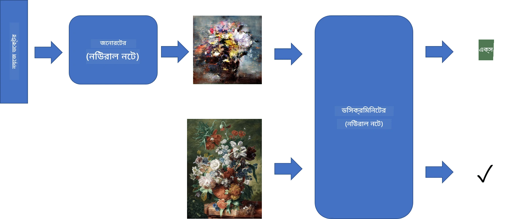
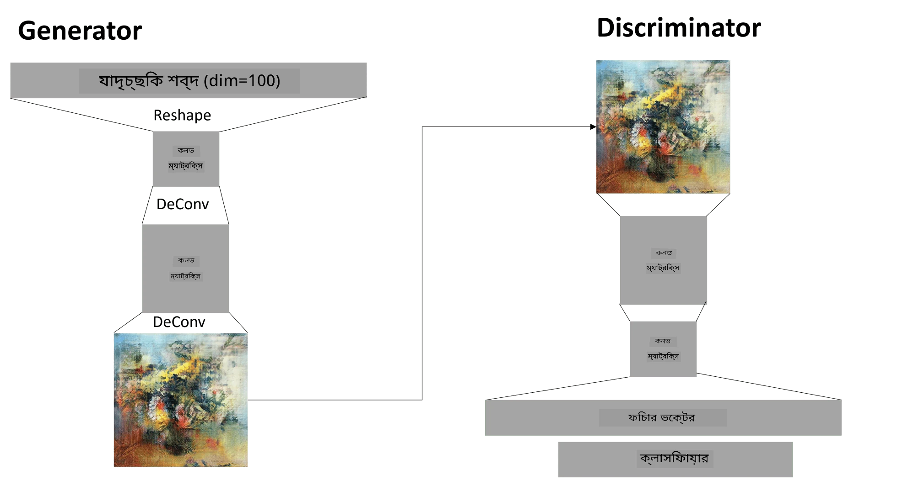

# জেনারেটিভ অ্যাডভার্সারিয়াল নেটওয়ার্কস

পূর্ববর্তী অংশে আমরা **জেনারেটিভ মডেল** সম্পর্কে শিখেছি: এমন মডেল যা প্রশিক্ষণ ডেটাসেটের মতো নতুন ছবি তৈরি করতে পারে। VAE ছিল জেনারেটিভ মডেলের একটি ভালো উদাহরণ।

## [প্রাক-লেকচার কুইজ](https://ff-quizzes.netlify.app/en/ai/quiz/19)

তবে, যদি আমরা সত্যিই অর্থবহ কিছু তৈরি করতে চাই, যেমন একটি যুক্তিসঙ্গত রেজোলিউশনের পেইন্টিং, VAE ব্যবহার করে, তাহলে আমরা দেখতে পাবো যে প্রশিক্ষণ ভালোভাবে কনভার্জ করে না। এই ব্যবহারের ক্ষেত্রে, আমাদের একটি বিশেষ আর্কিটেকচার সম্পর্কে শিখতে হবে যা জেনারেটিভ মডেলের জন্য লক্ষ্য করা হয়েছে - **জেনারেটিভ অ্যাডভার্সারিয়াল নেটওয়ার্কস**, বা GANs।

GAN-এর মূল ধারণা হলো দুটি নিউরাল নেটওয়ার্ক থাকবে যা একে অপরের বিরুদ্ধে প্রশিক্ষিত হবে:

> ছবি: [Dmitry Soshnikov](http://soshnikov.com)

> ✅ কিছু শব্দভাণ্ডার:
> * **জেনারেটর** হলো একটি নেটওয়ার্ক যা কিছু র‍্যান্ডম ভেক্টর গ্রহণ করে এবং ফলাফল হিসেবে একটি ছবি তৈরি করে।
> * **ডিসক্রিমিনেটর** হলো একটি নেটওয়ার্ক যা একটি ছবি গ্রহণ করে এবং এটি একটি বাস্তব ছবি (প্রশিক্ষণ ডেটাসেট থেকে) নাকি এটি জেনারেটর দ্বারা তৈরি হয়েছে তা নির্ধারণ করে। এটি মূলত একটি ইমেজ ক্লাসিফায়ার।

### ডিসক্রিমিনেটর

ডিসক্রিমিনেটরের আর্কিটেকচার সাধারণ ইমেজ ক্লাসিফিকেশন নেটওয়ার্ক থেকে আলাদা নয়। সহজতম ক্ষেত্রে এটি একটি সম্পূর্ণ-সংযুক্ত ক্লাসিফায়ার হতে পারে, তবে সম্ভবত এটি একটি [কনভোলিউশনাল নেটওয়ার্ক](../07-ConvNets/README.md) হবে।

> ✅ কনভোলিউশনাল নেটওয়ার্কের উপর ভিত্তি করে GAN-কে [DCGAN](https://arxiv.org/pdf/1511.06434.pdf) বলা হয়।

একটি CNN ডিসক্রিমিনেটর নিম্নলিখিত স্তরগুলি নিয়ে গঠিত: কয়েকটি কনভোলিউশন+পুলিং (যার স্পেশিয়াল সাইজ কমছে) এবং এক বা একাধিক সম্পূর্ণ-সংযুক্ত স্তর যা "ফিচার ভেক্টর" তৈরি করে, চূড়ান্ত বাইনারি ক্লাসিফায়ার।

> ✅ 'পুলিং' এই প্রসঙ্গে একটি কৌশল যা ছবির আকার কমিয়ে দেয়। "পুলিং স্তরগুলি ডেটার মাত্রা কমিয়ে দেয়, একটি স্তরের নিউরন ক্লাস্টারের আউটপুটকে পরবর্তী স্তরের একটি নিউরনে একত্রিত করে।" - [উৎস](https://wikipedia.org/wiki/Convolutional_neural_network#Pooling_layers)

### জেনারেটর

জেনারেটর একটু বেশি জটিল। আপনি এটিকে একটি বিপরীত ডিসক্রিমিনেটর হিসেবে বিবেচনা করতে পারেন। একটি ল্যাটেন্ট ভেক্টর থেকে শুরু করে (ফিচার ভেক্টরের জায়গায়), এটি প্রয়োজনীয় আকার/আকৃতিতে রূপান্তর করতে একটি সম্পূর্ণ-সংযুক্ত স্তর থাকে, তারপরে ডিকনভোলিউশন+আপস্কেলিং। এটি [অটোএনকোডার](../09-Autoencoders/README.md)-এর *ডিকোডার* অংশের মতো।

> ✅ যেহেতু কনভোলিউশন স্তরটি একটি লিনিয়ার ফিল্টার হিসেবে ছবির উপর দিয়ে চলে, ডিকনভোলিউশন মূলত কনভোলিউশনের মতোই এবং একই স্তর লজিক ব্যবহার করে বাস্তবায়িত হতে পারে।

> ছবি: [Dmitry Soshnikov](http://soshnikov.com)

### GAN প্রশিক্ষণ

GAN-কে **অ্যাডভার্সারিয়াল** বলা হয় কারণ জেনারেটর এবং ডিসক্রিমিনেটরের মধ্যে একটি ক্রমাগত প্রতিযোগিতা থাকে। এই প্রতিযোগিতার সময়, জেনারেটর এবং ডিসক্রিমিনেটর উভয়ই উন্নত হয়, ফলে নেটওয়ার্ক আরও ভালো ছবি তৈরি করতে শেখে।

প্রশিক্ষণ দুটি ধাপে ঘটে:

* **ডিসক্রিমিনেটর প্রশিক্ষণ**। এই কাজটি বেশ সহজ: আমরা জেনারেটর দ্বারা একটি ব্যাচ ছবি তৈরি করি, সেগুলিকে 0 লেবেল করি, যা নকল ছবির জন্য দাঁড়ায়, এবং ইনপুট ডেটাসেট থেকে একটি ব্যাচ ছবি গ্রহণ করি (লেবেল 1, বাস্তব ছবি)। আমরা কিছু *ডিসক্রিমিনেটর লস* পাই এবং ব্যাকপ্রপ করি।
* **জেনারেটর প্রশিক্ষণ**। এটি একটু বেশি জটিল, কারণ আমরা সরাসরি জেনারেটরের প্রত্যাশিত আউটপুট জানি না। আমরা পুরো GAN নেটওয়ার্ক (জেনারেটর এবং ডিসক্রিমিনেটর) গ্রহণ করি, এটিকে কিছু র‍্যান্ডম ভেক্টর দিয়ে ফিড করি এবং আশা করি ফলাফলটি 1 হবে (বাস্তব ছবির সাথে সম্পর্কিত)। আমরা ডিসক্রিমিনেটরের প্যারামিটারগুলি ফ্রিজ করি (এই ধাপে আমরা এটি প্রশিক্ষণ করতে চাই না) এবং ব্যাকপ্রপ করি।

এই প্রক্রিয়ার সময়, জেনারেটর এবং ডিসক্রিমিনেটর উভয়ের লস উল্লেখযোগ্যভাবে কমে না। আদর্শ পরিস্থিতিতে, তারা দোলায়মান হওয়া উচিত, যা উভয় নেটওয়ার্কের কর্মক্ষমতা উন্নতির সাথে সম্পর্কিত।

## ✍️ অনুশীলন: GANs

* [TensorFlow/Keras-এ GAN নোটবুক](GANTF.ipynb)
* [PyTorch-এ GAN নোটবুক](GANPyTorch.ipynb)

### GAN প্রশিক্ষণের সমস্যা

GAN প্রশিক্ষণ বিশেষভাবে কঠিন বলে পরিচিত। এখানে কয়েকটি সমস্যা:

* **মোড কলাপস**। এই শব্দটি দ্বারা বোঝানো হয় যে জেনারেটর একটি সফল ছবি তৈরি করতে শেখে যা ডিসক্রিমিনেটরকে ধোঁকা দেয়, কিন্তু বিভিন্ন ধরনের ছবি তৈরি করে না।
* **হাইপারপ্যারামিটারের প্রতি সংবেদনশীলতা**। প্রায়ই দেখা যায় যে GAN একেবারেই কনভার্জ করে না, এবং তারপর হঠাৎ করে লার্নিং রেট কমিয়ে কনভার্জ করে।
* জেনারেটর এবং ডিসক্রিমিনেটরের মধ্যে **সামঞ্জস্য** বজায় রাখা। অনেক ক্ষেত্রে ডিসক্রিমিনেটর লস তুলনামূলকভাবে দ্রুত শূন্যে নেমে যেতে পারে, যার ফলে জেনারেটর আর প্রশিক্ষণ করতে পারে না। এটি কাটিয়ে উঠতে, আমরা জেনারেটর এবং ডিসক্রিমিনেটরের জন্য ভিন্ন লার্নিং রেট সেট করার চেষ্টা করতে পারি, অথবা যদি লস ইতিমধ্যেই খুব কম হয় তবে ডিসক্রিমিনেটর প্রশিক্ষণ এড়িয়ে যেতে পারি।
* **উচ্চ রেজোলিউশনের জন্য প্রশিক্ষণ**। অটোএনকোডারের মতো একই সমস্যার প্রতিফলন, এই সমস্যাটি ট্রিগার হয় কারণ কনভোলিউশনাল নেটওয়ার্কের খুব বেশি স্তর পুনর্গঠন করার ফলে আর্টিফ্যাক্ট তৈরি হয়। এই সমস্যাটি সাধারণত **প্রগ্রেসিভ গ্রোইং** দিয়ে সমাধান করা হয়, যেখানে প্রথমে কয়েকটি স্তর কম-রেজোলিউশন ছবিতে প্রশিক্ষিত হয়, তারপর স্তরগুলি "আনব্লক" বা যোগ করা হয়। আরেকটি সমাধান হবে স্তরগুলির মধ্যে অতিরিক্ত সংযোগ যোগ করা এবং একাধিক রেজোলিউশন একসাথে প্রশিক্ষণ দেওয়া - বিস্তারিত জানার জন্য এই [মাল্টি-স্কেল গ্রেডিয়েন্ট GANs পেপার](https://arxiv.org/abs/1903.06048) দেখুন।

## স্টাইল ট্রান্সফার

GANs শিল্পময় ছবি তৈরি করার একটি চমৎকার উপায়। আরেকটি আকর্ষণীয় কৌশল হলো **স্টাইল ট্রান্সফার**, যা একটি **কন্টেন্ট ইমেজ** গ্রহণ করে এবং এটি একটি ভিন্ন স্টাইলে পুনরায় আঁকে, **স্টাইল ইমেজ** থেকে ফিল্টার প্রয়োগ করে।

এটি যেভাবে কাজ করে তা হলো:
* আমরা একটি র‍্যান্ডম নয়েজ ইমেজ (বা একটি কন্টেন্ট ইমেজ দিয়ে শুরু করি, তবে বোঝার সুবিধার জন্য র‍্যান্ডম নয়েজ দিয়ে শুরু করা সহজ)।
* আমাদের লক্ষ্য হবে এমন একটি ছবি তৈরি করা, যা কন্টেন্ট ইমেজ এবং স্টাইল ইমেজ উভয়ের কাছাকাছি হবে। এটি দুটি লস ফাংশন দ্বারা নির্ধারিত হবে:
   - **কন্টেন্ট লস** বর্তমান ছবি এবং কন্টেন্ট ইমেজ থেকে CNN দ্বারা নির্দিষ্ট স্তরে বের করা ফিচারের উপর ভিত্তি করে গণনা করা হয়।
   - **স্টাইল লস** বর্তমান ছবি এবং স্টাইল ইমেজের মধ্যে একটি চতুর উপায়ে গ্রাম ম্যাট্রিক্স ব্যবহার করে গণনা করা হয় (বিস্তারিত [উদাহরণ নোটবুকে](StyleTransfer.ipynb) দেখুন)।
* ছবিকে মসৃণ এবং নয়েজ সরাতে, আমরা **ভেরিয়েশন লস** পরিচয় করাই, যা প্রতিবেশী পিক্সেলের গড় দূরত্ব গণনা করে।
* প্রধান অপ্টিমাইজেশন লুপ বর্তমান ছবিকে গ্রেডিয়েন্ট ডিসেন্ট (বা অন্য কোনো অপ্টিমাইজেশন অ্যালগরিদম) ব্যবহার করে সামগ্রিক লস কমানোর জন্য সামঞ্জস্য করে, যা তিনটি লসের ওজনযুক্ত যোগফল।

## ✍️ উদাহরণ: [স্টাইল ট্রান্সফার](StyleTransfer.ipynb)

## [পোস্ট-লেকচার কুইজ](https://ff-quizzes.netlify.app/en/ai/quiz/20)

## উপসংহার

এই পাঠে, আপনি GANs এবং সেগুলিকে কীভাবে প্রশিক্ষণ দিতে হয় তা শিখেছেন। আপনি এই ধরনের নিউরাল নেটওয়ার্কের মুখোমুখি হওয়া বিশেষ চ্যালেঞ্জ এবং সেগুলি কাটিয়ে ওঠার কিছু কৌশলও শিখেছেন।

## 🚀 চ্যালেঞ্জ

[স্টাইল ট্রান্সফার নোটবুক](StyleTransfer.ipynb) চালান এবং আপনার নিজের ছবিগুলি ব্যবহার করুন।

## পর্যালোচনা ও স্ব-অধ্যয়ন

GANs সম্পর্কে আরও পড়ার জন্য, এই রিসোর্সগুলি দেখুন:

* Marco Pasini, [10 Lessons I Learned Training GANs for one Year](https://towardsdatascience.com/10-lessons-i-learned-training-generative-adversarial-networks-gans-for-a-year-c9071159628)
* [StyleGAN](https://en.wikipedia.org/wiki/StyleGAN), একটি *ডি ফ্যাক্টো* GAN আর্কিটেকচার বিবেচনা করার জন্য
* [Creating Generative Art using GANs on Azure ML](https://soshnikov.com/scienceart/creating-generative-art-using-gan-on-azureml/)

## অ্যাসাইনমেন্ট

এই পাঠের সাথে সম্পর্কিত দুটি নোটবুকের একটি পুনরায় দেখুন এবং GAN-কে আপনার নিজের ছবিতে পুনরায় প্রশিক্ষণ দিন। আপনি কী তৈরি করতে পারেন?

---

