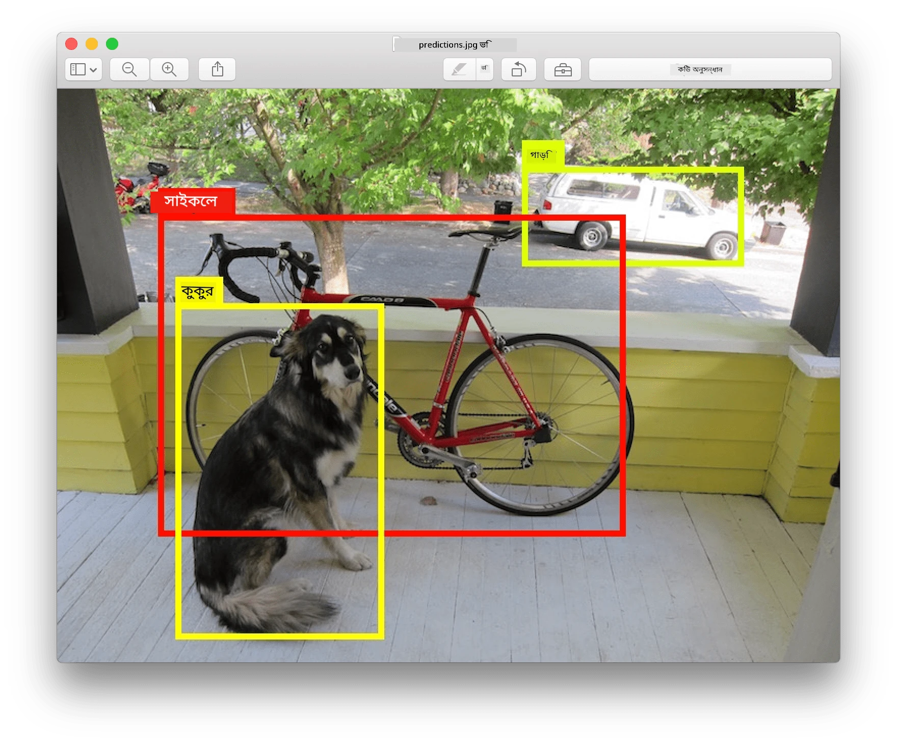
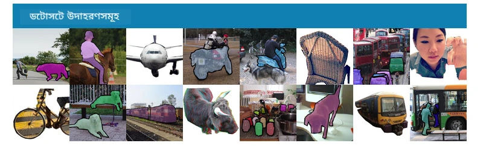
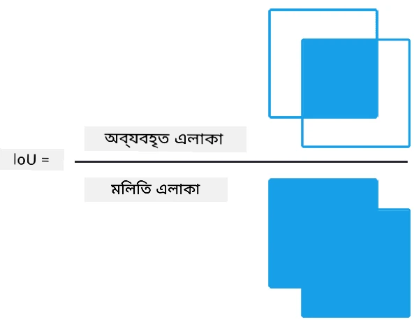
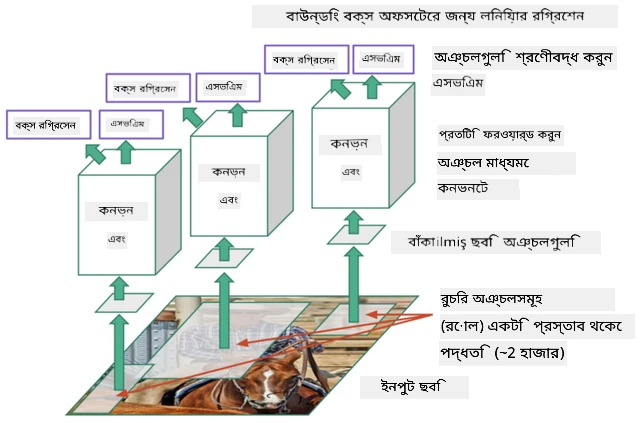
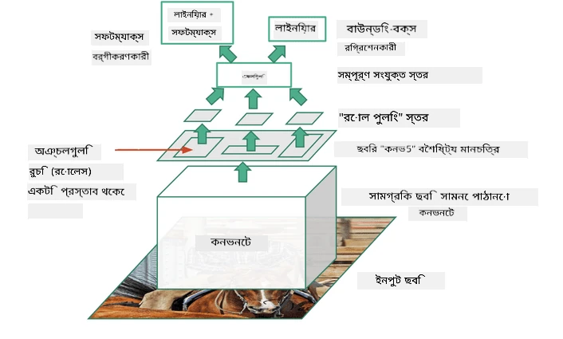
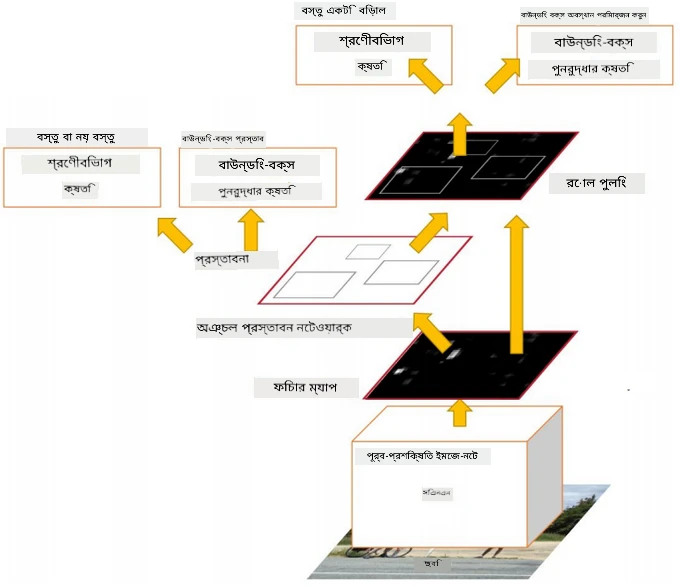
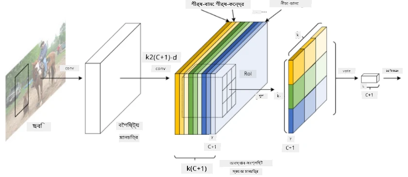
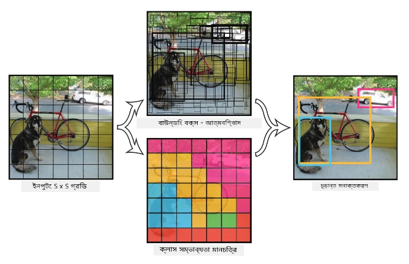

# অবজেক্ট ডিটেকশন

যে ইমেজ ক্লাসিফিকেশন মডেলগুলো আমরা এখন পর্যন্ত ব্যবহার করেছি, সেগুলো একটি ইমেজ নিয়ে একটি ক্যাটেগরিক্যাল ফলাফল তৈরি করত, যেমন MNIST সমস্যায় 'সংখ্যা' ক্লাস। তবে, অনেক ক্ষেত্রে আমরা শুধু জানতে চাই না যে একটি ছবি কোনো বস্তু প্রদর্শন করছে - আমরা তাদের সঠিক অবস্থান নির্ধারণ করতে চাই। **অবজেক্ট ডিটেকশন** ঠিক এই কাজটি করে।

## [পূর্ব-লেকচার কুইজ](https://ff-quizzes.netlify.app/en/ai/quiz/21)

> ছবি [YOLO v2 ওয়েবসাইট](https://pjreddie.com/darknet/yolov2/) থেকে নেওয়া

## অবজেক্ট ডিটেকশনের একটি সাধারণ পদ্ধতি

ধরা যাক আমরা একটি ছবিতে একটি বিড়াল খুঁজতে চাই। অবজেক্ট ডিটেকশনের একটি খুব সাধারণ পদ্ধতি হতে পারে নিম্নলিখিত:

1. ছবিটিকে একাধিক টাইলসে ভাগ করুন।
2. প্রতিটি টাইলের উপর ইমেজ ক্লাসিফিকেশন চালান।
3. যেসব টাইল যথেষ্ট উচ্চ অ্যাক্টিভেশন দেখায়, সেগুলোতে কাঙ্ক্ষিত বস্তুটি রয়েছে বলে বিবেচনা করুন।

> *ছবি [এক্সারসাইজ নোটবুক](ObjectDetection-TF.ipynb) থেকে নেওয়া*

তবে, এই পদ্ধতি আদর্শ থেকে অনেক দূরে, কারণ এটি বস্তুটির বাউন্ডিং বক্স খুবই অদক্ষভাবে নির্ধারণ করতে পারে। আরও সঠিক অবস্থান নির্ধারণের জন্য, আমাদের **রিগ্রেশন** চালাতে হবে বাউন্ডিং বক্সের কোঅর্ডিনেট প্রেডিক্ট করতে - এবং এর জন্য আমাদের নির্দিষ্ট ডেটাসেট প্রয়োজন।

## অবজেক্ট ডিটেকশনের জন্য রিগ্রেশন

[এই ব্লগ পোস্ট](https://towardsdatascience.com/object-detection-with-neural-networks-a4e2c46b4491) অবজেক্ট ডিটেকশনের জন্য আকৃতিগুলো শনাক্ত করার একটি চমৎকার পরিচিতি প্রদান করে।

## অবজেক্ট ডিটেকশনের জন্য ডেটাসেট

এই কাজের জন্য আপনি নিম্নলিখিত ডেটাসেটগুলো দেখতে পারেন:

* [PASCAL VOC](http://host.robots.ox.ac.uk/pascal/VOC/) - ২০টি ক্লাস
* [COCO](http://cocodataset.org/#home) - সাধারণ বস্তুসমূহের প্রসঙ্গ। ৮০টি ক্লাস, বাউন্ডিং বক্স এবং সেগমেন্টেশন মাস্ক।

## অবজেক্ট ডিটেকশন মেট্রিকস

### ইন্টারসেকশন ওভার ইউনিয়ন

যেখানে ইমেজ ক্লাসিফিকেশনের ক্ষেত্রে অ্যালগরিদম কতটা ভালো কাজ করছে তা পরিমাপ করা সহজ, অবজেক্ট ডিটেকশনের ক্ষেত্রে আমাদের ক্লাসের সঠিকতা এবং অনুমিত বাউন্ডিং বক্সের অবস্থানের নির্ভুলতা উভয়ই পরিমাপ করতে হবে। এর জন্য আমরা **ইন্টারসেকশন ওভার ইউনিয়ন** (IoU) ব্যবহার করি, যা দুটি বক্স (বা দুটি এলাকা) কতটা ওভারল্যাপ করছে তা পরিমাপ করে।

> *[এই চমৎকার ব্লগ পোস্ট](https://pyimagesearch.com/2016/11/07/intersection-over-union-iou-for-object-detection/) থেকে ফিগার ২*

আইডিয়াটি সহজ - আমরা দুটি ফিগারের মধ্যে ইন্টারসেকশনের এলাকা তাদের ইউনিয়নের এলাকা দ্বারা ভাগ করি। দুটি অভিন্ন এলাকার জন্য IoU হবে ১, যেখানে সম্পূর্ণ পৃথক এলাকার জন্য এটি হবে ০। অন্যথায় এটি ০ থেকে ১ পর্যন্ত পরিবর্তিত হবে। আমরা সাধারণত শুধুমাত্র সেই বাউন্ডিং বক্সগুলো বিবেচনা করি যেগুলোর IoU একটি নির্দিষ্ট মানের উপরে।

### গড় নির্ভুলতা (Average Precision)

ধরা যাক আমরা একটি নির্দিষ্ট ক্লাসের বস্তু $C$ কতটা ভালোভাবে শনাক্ত হচ্ছে তা পরিমাপ করতে চাই। এটি পরিমাপ করার জন্য আমরা **গড় নির্ভুলতা** মেট্রিকস ব্যবহার করি, যা নিম্নলিখিতভাবে গণনা করা হয়:

1. প্রিসিশন-রিকল কার্ভ দেখায় যে ডিটেকশন থ্রেশহোল্ড মান (০ থেকে ১) এর উপর নির্ভুলতা কীভাবে পরিবর্তিত হয়।
2. থ্রেশহোল্ডের উপর নির্ভর করে, আমরা ছবিতে বেশি বা কম বস্তু শনাক্ত করব এবং প্রিসিশন এবং রিকলের বিভিন্ন মান পাব।
3. কার্ভটি দেখতে এরকম হবে:

> *ছবি [NeuroWorkshop](http://github.com/shwars/NeuroWorkshop) থেকে নেওয়া*

একটি নির্দিষ্ট ক্লাস $C$ এর জন্য গড় নির্ভুলতা হল এই কার্ভের নিচের এলাকা। আরও নির্দিষ্টভাবে, রিকল অক্ষ সাধারণত ১০টি অংশে বিভক্ত হয় এবং প্রিসিশন এই পয়েন্টগুলোর উপর গড় করা হয়:

$$
AP = {1\over11}\sum_{i=0}^{10}\mbox{Precision}(\mbox{Recall}={i\over10})
$$

### AP এবং IoU

আমরা শুধুমাত্র সেই ডিটেকশনগুলো বিবেচনা করব, যেগুলোর IoU একটি নির্দিষ্ট মানের উপরে। উদাহরণস্বরূপ, PASCAL VOC ডেটাসেটে সাধারণত $\mbox{IoU Threshold} = 0.5$ ধরা হয়, যেখানে COCO-তে AP বিভিন্ন $\mbox{IoU Threshold}$ মানের জন্য পরিমাপ করা হয়।

> *ছবি [NeuroWorkshop](http://github.com/shwars/NeuroWorkshop) থেকে নেওয়া*

### গড় গড় নির্ভুলতা - mAP

অবজেক্ট ডিটেকশনের প্রধান মেট্রিকসকে **গড় গড় নির্ভুলতা** বা **mAP** বলা হয়। এটি গড় নির্ভুলতার মান, যা সমস্ত অবজেক্ট ক্লাসের উপর গড় করা হয় এবং কখনও কখনও $\mbox{IoU Threshold}$ এর উপরও গড় করা হয়। **mAP** গণনার প্রক্রিয়া বিস্তারিতভাবে
[এই ব্লগ পোস্টে](https://medium.com/@timothycarlen/understanding-the-map-evaluation-metric-for-object-detection-a07fe6962cf3) এবং [কোড নমুনাসহ এখানে](https://gist.github.com/tarlen5/008809c3decf19313de216b9208f3734) বর্ণনা করা হয়েছে।

## বিভিন্ন অবজেক্ট ডিটেকশন পদ্ধতি

অবজেক্ট ডিটেকশন অ্যালগরিদমের দুটি প্রধান শ্রেণি রয়েছে:

* **রিজন প্রপোজাল নেটওয়ার্কস** (R-CNN, Fast R-CNN, Faster R-CNN)। মূল ধারণাটি হল **রিজনস অফ ইন্টারেস্ট** (ROI) তৈরি করা এবং সেগুলোর উপর CNN চালানো, সর্বাধিক অ্যাক্টিভেশন খুঁজে বের করার জন্য। এটি সাধারণ পদ্ধতির মতো, তবে ROI আরও বুদ্ধিমানের সাথে তৈরি করা হয়। এই পদ্ধতির একটি বড় অসুবিধা হল এটি ধীর, কারণ ছবির উপর CNN ক্লাসিফায়ার অনেকবার চালাতে হয়।
* **ওয়ান-পাস** (YOLO, SSD, RetinaNet) পদ্ধতি। এই আর্কিটেকচারে আমরা নেটওয়ার্ক ডিজাইন করি যাতে এটি একবারে ক্লাস এবং ROI উভয়ই প্রেডিক্ট করতে পারে।

### R-CNN: রিজন-বেসড CNN

[R-CNN](http://islab.ulsan.ac.kr/files/announcement/513/rcnn_pami.pdf) [Selective Search](http://www.huppelen.nl/publications/selectiveSearchDraft.pdf) ব্যবহার করে ROI অঞ্চলের একটি হায়ারারকিকাল স্ট্রাকচার তৈরি করে, যা পরে CNN ফিচার এক্সট্রাক্টর এবং SVM-ক্লাসিফায়ারগুলোর মাধ্যমে বস্তু ক্লাস নির্ধারণ করে এবং লিনিয়ার রিগ্রেশন ব্যবহার করে *বাউন্ডিং বক্স* এর কোঅর্ডিনেট নির্ধারণ করে। [অফিশিয়াল পেপার](https://arxiv.org/pdf/1506.01497v1.pdf)

> *ছবি van de Sande et al. ICCV’11*

> *ছবি [এই ব্লগ](https://towardsdatascience.com/r-cnn-fast-r-cnn-faster-r-cnn-yolo-object-detection-algorithms-36d53571365e) থেকে নেওয়া*

### F-RCNN - ফাস্ট R-CNN

এই পদ্ধতি R-CNN এর মতোই, তবে রিজনগুলো কনভোলিউশন লেয়ার প্রয়োগ করার পরে নির্ধারণ করা হয়।

> ছবি [অফিশিয়াল পেপার](https://www.cv-foundation.org/openaccess/content_iccv_2015/papers/Girshick_Fast_R-CNN_ICCV_2015_paper.pdf), [arXiv](https://arxiv.org/pdf/1504.08083.pdf), ২০১৫

### Faster R-CNN

এই পদ্ধতির মূল ধারণাটি হল রিজন প্রেডিক্ট করতে নিউরাল নেটওয়ার্ক ব্যবহার করা - যাকে *রিজন প্রপোজাল নেটওয়ার্ক* বলা হয়। [পেপার](https://arxiv.org/pdf/1506.01497.pdf), ২০১৬

> ছবি [অফিশিয়াল পেপার](https://arxiv.org/pdf/1506.01497.pdf) থেকে নেওয়া

### R-FCN: রিজন-বেসড ফুলি কনভোলিউশনাল নেটওয়ার্ক

এই অ্যালগরিদম Faster R-CNN এর চেয়েও দ্রুত। এর মূল ধারণাটি নিম্নলিখিত:

1. আমরা ResNet-101 ব্যবহার করে ফিচার এক্সট্রাক্ট করি।
2. ফিচারগুলো **পজিশন-সেনসিটিভ স্কোর ম্যাপ** দ্বারা প্রক্রিয়াকৃত হয়। $C$ ক্লাসের প্রতিটি অবজেক্টকে $k\times k$ অঞ্চলে ভাগ করা হয় এবং আমরা অবজেক্টের অংশগুলো প্রেডিক্ট করতে প্রশিক্ষণ দিই।
3. $k\times k$ অঞ্চলের প্রতিটি অংশের জন্য সমস্ত নেটওয়ার্ক অবজেক্ট ক্লাসের জন্য ভোট দেয় এবং সর্বাধিক ভোট পাওয়া অবজেক্ট ক্লাসটি নির্বাচিত হয়।

> ছবি [অফিশিয়াল পেপার](https://arxiv.org/abs/1605.06409) থেকে নেওয়া

### YOLO - ইউ অনলি লুক ওন্স

YOLO একটি রিয়েলটাইম ওয়ান-পাস অ্যালগরিদম। এর মূল ধারণাটি নিম্নলিখিত:

 * ছবিটিকে $S\times S$ অঞ্চলে ভাগ করা হয়।
 * প্রতিটি অঞ্চলের জন্য, **CNN** $n$ সম্ভাব্য অবজেক্ট, *বাউন্ডিং বক্স* এর কোঅর্ডিনেট এবং *কনফিডেন্স*=*প্রোবাবিলিটি* * IoU প্রেডিক্ট করে।

 

> ছবি [অফিশিয়াল পেপার](https://arxiv.org/abs/1506.02640) থেকে নেওয়া

### অন্যান্য অ্যালগরিদম

* RetinaNet: [অফিশিয়াল পেপার](https://arxiv.org/abs/1708.02002)
   - [Torchvision-এ PyTorch ইমপ্লিমেন্টেশন](https://pytorch.org/vision/stable/_modules/torchvision/models/detection/retinanet.html)
   - [Keras ইমপ্লিমেন্টেশন](https://github.com/fizyr/keras-retinanet)
   - [Keras উদাহরণে RetinaNet দিয়ে অবজেক্ট ডিটেকশন](https://keras.io/examples/vision/retinanet/)
* SSD (Single Shot Detector): [অফিশিয়াল পেপার](https://arxiv.org/abs/1512.02325)

## ✍️ এক্সারসাইজ: অবজেক্ট ডিটেকশন

নিম্নলিখিত নোটবুকে আপনার শেখা চালিয়ে যান:

[ObjectDetection.ipynb](ObjectDetection.ipynb)

## উপসংহার

এই পাঠে আপনি অবজেক্ট ডিটেকশন সম্পন্ন করার বিভিন্ন পদ্ধতির একটি দ্রুত পর্যালোচনা করেছেন!

## 🚀 চ্যালেঞ্জ

এই নিবন্ধ এবং নোটবুকগুলো পড়ুন এবং YOLO নিজে চেষ্টা করুন:

* [YOLO সম্পর্কে একটি ভালো ব্লগ পোস্ট](https://www.analyticsvidhya.com/blog/2018/12/practical-guide-object-detection-yolo-framewor-python/)
 * [অফিশিয়াল সাইট](https://pjreddie.com/darknet/yolo/)
 * YOLO: [Keras ইমপ্লিমেন্টেশন](https://github.com/experiencor/keras-yolo2), [স্টেপ-বাই-স্টেপ নোটবুক](https://github.com/experiencor/basic-yolo-keras/blob/master/Yolo%20Step-by-Step.ipynb)
 * YOLO v2: [Keras ইমপ্লিমেন্টেশন](https://github.com/experiencor/keras-yolo2), [স্টেপ-বাই-স্টেপ নোটবুক](https://github.com/experiencor/keras-yolo2/blob/master/Yolo%20Step-by-Step.ipynb)

## [পোস্ট-লেকচার কুইজ](https://ff-quizzes.netlify.app/en/ai/quiz/22)

## পর্যালোচনা ও স্ব-অধ্যয়ন

* [অবজেক্ট ডিটেকশন](https://tjmachinelearning.com/lectures/1718/obj/) নিখিল সারদানার দ্বারা
* [অবজেক্ট ডিটেকশন অ্যালগরিদমের একটি ভালো তুলনা](https://lilianweng.github.io/lil-log/2018/12/27/object-detection-part-4.html)
* [অবজেক্ট ডিটেকশনের জন্য ডিপ লার্নিং অ্যালগরিদমের পর্যালোচনা](https://medium.com/comet-app/review-of-deep-learning-algorithms-for-object-detection-c1f3d437b852)
* [অবজেক্ট ডিটেকশন অ্যালগরিদমের একটি ধাপে ধাপে পরিচিতি](https://www.analyticsvidhya.com/blog/2018/10/a-step-by-step-introduction-to-the-basic-object-detection-algorithms-part-1/)
* [Python-এ Faster R-CNN দিয়ে অবজেক্ট ডিটেকশনের ইমপ্লিমেন্টেশন](https://www.analyticsvidhya.com/blog/2018/11/implementation-faster-r-cnn-python-object-detection/)

## [অ্যাসাইনমেন্ট: অবজেক্ট ডিটেকশন](lab/README.md)

---

