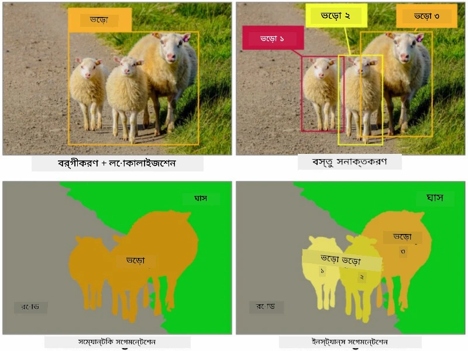
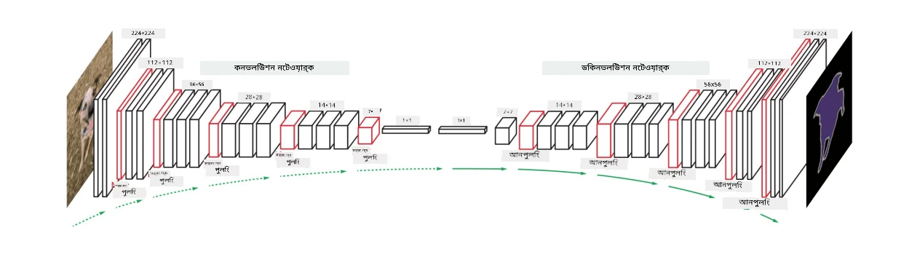
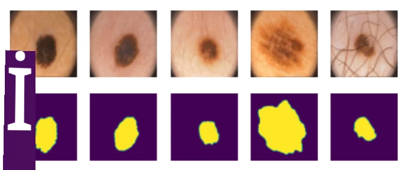

# সেগমেন্টেশন

আমরা আগেই অবজেক্ট ডিটেকশন সম্পর্কে শিখেছি, যা আমাদের ইমেজে অবজেক্টের অবস্থান নির্ধারণ করতে সাহায্য করে *বাউন্ডিং বক্স* প্রেডিক্ট করার মাধ্যমে। তবে, কিছু কাজের জন্য শুধুমাত্র বাউন্ডিং বক্স যথেষ্ট নয়; আমাদের আরও নির্ভুলভাবে অবজেক্টের অবস্থান নির্ধারণ করতে হয়। এই কাজটিকে **সেগমেন্টেশন** বলা হয়।

## [পূর্ব-লেকচার কুইজ](https://ff-quizzes.netlify.app/en/ai/quiz/23)

সেগমেন্টেশনকে **পিক্সেল ক্লাসিফিকেশন** হিসেবে দেখা যেতে পারে, যেখানে ইমেজের **প্রতিটি** পিক্সেলের জন্য তার ক্লাস (*ব্যাকগ্রাউন্ড* একটি ক্লাস হিসেবে গণ্য) প্রেডিক্ট করতে হয়। সেগমেন্টেশনের দুটি প্রধান অ্যালগরিদম রয়েছে:

* **সেমান্টিক সেগমেন্টেশন** শুধুমাত্র পিক্সেলের ক্লাস বলে দেয়, একই ক্লাসের বিভিন্ন অবজেক্টের মধ্যে পার্থক্য করে না।
* **ইনস্ট্যান্স সেগমেন্টেশন** ক্লাসগুলোকে বিভিন্ন ইনস্ট্যান্সে ভাগ করে।

উদাহরণস্বরূপ, ইনস্ট্যান্স সেগমেন্টেশনে এই ভেড়াগুলো আলাদা অবজেক্ট হিসেবে গণ্য হয়, কিন্তু সেমান্টিক সেগমেন্টেশনে সব ভেড়া একটি ক্লাস হিসেবে দেখানো হয়।

> ছবি [এই ব্লগ পোস্ট](https://nirmalamurali.medium.com/image-classification-vs-semantic-segmentation-vs-instance-segmentation-625c33a08d50) থেকে নেওয়া হয়েছে

সেগমেন্টেশনের জন্য বিভিন্ন নিউরাল আর্কিটেকচার রয়েছে, তবে সেগুলোর গঠন একই রকম। একভাবে এটি সেই অটোএনকোডারের মতো, যা আপনি আগেই শিখেছেন, তবে এখানে মূল ইমেজ ডিকন্সট্রাক্ট করার পরিবর্তে আমাদের লক্ষ্য একটি **মাস্ক** ডিকন্সট্রাক্ট করা। তাই, একটি সেগমেন্টেশন নেটওয়ার্কে নিম্নলিখিত অংশগুলো থাকে:

* **এনকোডার** ইনপুট ইমেজ থেকে ফিচার বের করে
* **ডিকোডার** সেই ফিচারগুলোকে **মাস্ক ইমেজে** রূপান্তর করে, যার আকার এবং চ্যানেলের সংখ্যা ক্লাসের সংখ্যার সাথে মিলে যায়।

> ছবি [এই প্রকাশনা](https://arxiv.org/pdf/2001.05566.pdf) থেকে নেওয়া হয়েছে

বিশেষভাবে উল্লেখযোগ্য হলো সেগমেন্টেশনের জন্য ব্যবহৃত লস ফাংশন। ক্লাসিক্যাল অটোএনকোডার ব্যবহার করার সময়, আমাদের দুটি ইমেজের মধ্যে সাদৃশ্য পরিমাপ করতে হয়, এবং আমরা এর জন্য মীন স্কোয়ার এরর (MSE) ব্যবহার করতে পারি। সেগমেন্টেশনে, টার্গেট মাস্ক ইমেজের প্রতিটি পিক্সেল ক্লাস নম্বর (তৃতীয় ডাইমেনশনে ওয়ান-হট-এনকোডেড) উপস্থাপন করে, তাই আমাদের ক্লাসিফিকেশনের জন্য নির্দিষ্ট লস ফাংশন ব্যবহার করতে হয় - ক্রস-এন্ট্রপি লস, যা সব পিক্সেলের উপর গড় করা হয়। যদি মাস্ক বাইনারি হয় - **বাইনারি ক্রস-এন্ট্রপি লস** (BCE) ব্যবহার করা হয়।

> ✅ ওয়ান-হট এনকোডিং হলো একটি ক্লাস লেবেলকে ক্লাসের সংখ্যার সমান দৈর্ঘ্যের ভেক্টরে এনকোড করার একটি পদ্ধতি। এই পদ্ধতি সম্পর্কে আরও জানতে [এই আর্টিকেলটি](https://datagy.io/sklearn-one-hot-encode/) দেখুন।

## মেডিকেল ইমেজিংয়ের জন্য সেগমেন্টেশন

এই পাঠে, আমরা সেগমেন্টেশনকে কাজে লাগিয়ে একটি নেটওয়ার্ক ট্রেন করব, যা মেডিকেল ইমেজে মানব নেভি (যা মোল নামেও পরিচিত) শনাক্ত করতে সক্ষম হবে। আমরা <a href="https://www.fc.up.pt/addi/ph2%20database.html">PH2 ডাটাবেস</a> ব্যবহার করব, যা ডার্মোস্কোপি ইমেজের একটি উৎস। এই ডাটাসেটে তিনটি ক্লাসের ২০০টি ইমেজ রয়েছে: টিপিক্যাল নেভাস, অ্যাটিপিক্যাল নেভাস, এবং মেলানোমা। প্রতিটি ইমেজের সাথে একটি **মাস্ক** রয়েছে, যা নেভাসের আউটলাইন দেখায়।

> ✅ এই পদ্ধতি মেডিকেল ইমেজিংয়ের জন্য বিশেষভাবে উপযুক্ত, তবে আপনি আর কী কী বাস্তব জীবনের প্রয়োগ কল্পনা করতে পারেন?

> ছবি PH2 ডাটাবেস থেকে নেওয়া হয়েছে

আমরা একটি মডেল ট্রেন করব, যা ব্যাকগ্রাউন্ড থেকে যেকোনো নেভাস সেগমেন্ট করতে পারবে।

## ✍️ অনুশীলন: সেমান্টিক সেগমেন্টেশন

নিচের নোটবুকগুলো খুলে বিভিন্ন সেমান্টিক সেগমেন্টেশন আর্কিটেকচার সম্পর্কে জানুন, সেগুলো নিয়ে কাজ করুন এবং সেগুলোকে বাস্তবে দেখুন।

* [সেমান্টিক সেগমেন্টেশন পাইটর্চ](SemanticSegmentationPytorch.ipynb)
* [সেমান্টিক সেগমেন্টেশন টেন্সরফ্লো](SemanticSegmentationTF.ipynb)

## [পোস্ট-লেকচার কুইজ](https://ff-quizzes.netlify.app/en/ai/quiz/24)

## উপসংহার

সেগমেন্টেশন একটি অত্যন্ত শক্তিশালী পদ্ধতি, যা ইমেজ ক্লাসিফিকেশনে বাউন্ডিং বক্সের বাইরে গিয়ে পিক্সেল-লেভেল ক্লাসিফিকেশন করতে সক্ষম। এটি মেডিকেল ইমেজিংসহ অন্যান্য ক্ষেত্রে ব্যবহৃত হয়।

## 🚀 চ্যালেঞ্জ

শরীরের সেগমেন্টেশন হলো মানুষের ইমেজ নিয়ে করা সাধারণ কাজগুলোর একটি। আরেকটি গুরুত্বপূর্ণ কাজ হলো **স্কেলেটন ডিটেকশন** এবং **পোজ ডিটেকশন**। [OpenPose](https://github.com/CMU-Perceptual-Computing-Lab/openpose) লাইব্রেরি ব্যবহার করে দেখুন কীভাবে পোজ ডিটেকশন কাজে লাগানো যায়।

## পুনরালোচনা ও স্ব-অধ্যয়ন

এই [উইকিপিডিয়া আর্টিকেল](https://wikipedia.org/wiki/Image_segmentation) সেগমেন্টেশনের বিভিন্ন প্রয়োগ সম্পর্কে একটি ভালো ধারণা দেয়। ইনস্ট্যান্স সেগমেন্টেশন এবং প্যানোপটিক সেগমেন্টেশনের উপ-ক্ষেত্রগুলো সম্পর্কে আরও জানুন।

## [অ্যাসাইনমেন্ট](lab/README.md)

এই ল্যাবে, [Segmentation Full Body MADS Dataset](https://www.kaggle.com/datasets/tapakah68/segmentation-full-body-mads-dataset) ব্যবহার করে **মানব শরীরের সেগমেন্টেশন** চেষ্টা করুন।

---

