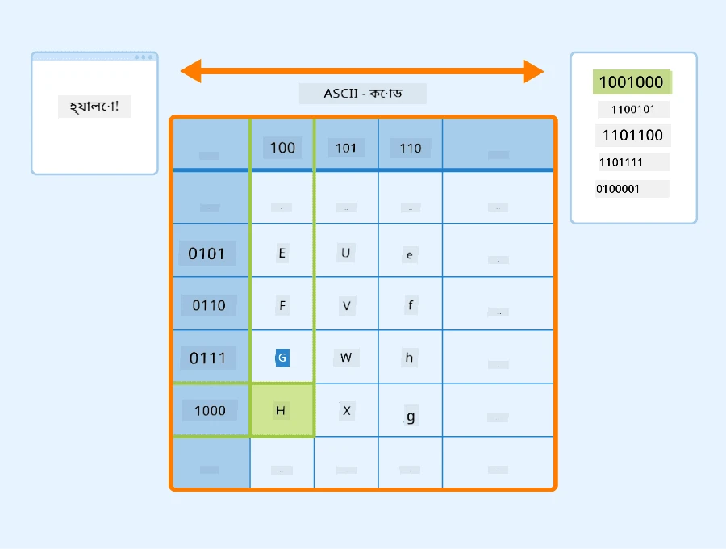
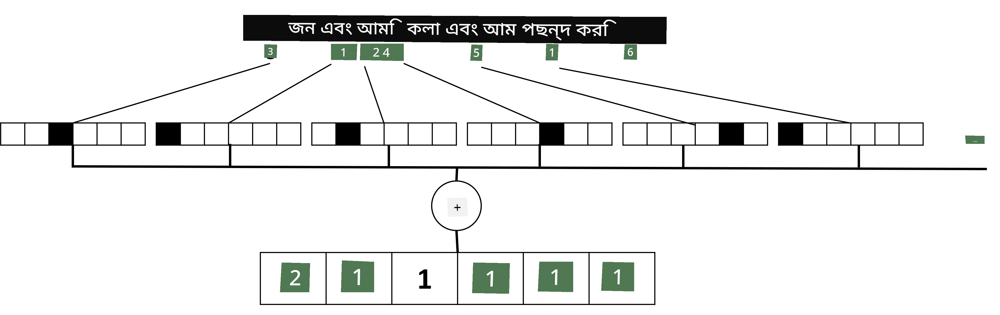

# টেক্সটকে টেনসর হিসেবে উপস্থাপন করা

## [পূর্ব-লেকচার কুইজ](https://ff-quizzes.netlify.app/en/ai/quiz/25)

## টেক্সট শ্রেণীবিন্যাস

এই অংশের প্রথম ভাগে আমরা **টেক্সট শ্রেণীবিন্যাস** কাজের উপর মনোযোগ দেব। আমরা [AG News](https://www.kaggle.com/amananandrai/ag-news-classification-dataset) ডেটাসেট ব্যবহার করব, যেখানে নিম্নলিখিত ধরনের সংবাদ নিবন্ধ রয়েছে:

* বিভাগ: বিজ্ঞান/প্রযুক্তি  
* শিরোনাম: Ky. Company Wins Grant to Study Peptides (AP)  
* বডি: AP - লুইসভিল বিশ্ববিদ্যালয়ের একজন রসায়ন গবেষকের প্রতিষ্ঠিত একটি কোম্পানি একটি অনুদান জিতেছে...

আমাদের লক্ষ্য হবে টেক্সটের ভিত্তিতে সংবাদটি একটি নির্দিষ্ট বিভাগে শ্রেণীবদ্ধ করা।

## টেক্সট উপস্থাপন

যদি আমরা নিউরাল নেটওয়ার্ক ব্যবহার করে প্রাকৃতিক ভাষা প্রক্রিয়াকরণ (NLP) কাজ সমাধান করতে চাই, তাহলে আমাদের টেক্সটকে টেনসর হিসেবে উপস্থাপন করার একটি উপায় দরকার। কম্পিউটার ইতিমধ্যেই ASCII বা UTF-8 এর মতো এনকোডিং ব্যবহার করে টেক্সট চরিত্রগুলোকে সংখ্যায় উপস্থাপন করে, যা আপনার স্ক্রিনে ফন্টে ম্যাপ করে।

> [চিত্রের উৎস](https://www.seobility.net/en/wiki/ASCII)

মানুষ হিসেবে আমরা বুঝি প্রতিটি অক্ষর **কী উপস্থাপন করে**, এবং কীভাবে সব অক্ষর একত্রিত হয়ে একটি বাক্যের শব্দ তৈরি করে। তবে, কম্পিউটার নিজে থেকে এমন বোঝাপড়া রাখে না, এবং নিউরাল নেটওয়ার্ককে প্রশিক্ষণের সময় অর্থ শিখতে হয়।

তাই, টেক্সট উপস্থাপনের জন্য আমরা বিভিন্ন পদ্ধতি ব্যবহার করতে পারি:

* **চরিত্র-স্তরের উপস্থাপন**, যেখানে আমরা প্রতিটি চরিত্রকে একটি সংখ্যা হিসেবে বিবেচনা করি। যদি আমাদের টেক্সট কর্পাসে *C* সংখ্যক ভিন্ন চরিত্র থাকে, তাহলে *Hello* শব্দটি 5x*C* টেনসর হিসেবে উপস্থাপিত হবে। প্রতিটি অক্ষর এক-হট এনকোডিংয়ে একটি টেনসর কলামের সাথে সম্পর্কিত হবে।  
* **শব্দ-স্তরের উপস্থাপন**, যেখানে আমরা আমাদের টেক্সটের সমস্ত শব্দের একটি **শব্দভাণ্ডার** তৈরি করি এবং তারপর এক-হট এনকোডিং ব্যবহার করে শব্দগুলোকে উপস্থাপন করি। এই পদ্ধতি কিছুটা ভালো, কারণ প্রতিটি অক্ষর নিজে থেকে খুব বেশি অর্থ বহন করে না, এবং উচ্চ-স্তরের অর্থপূর্ণ ধারণা - শব্দ - ব্যবহার করে আমরা নিউরাল নেটওয়ার্কের জন্য কাজটি সহজ করি। তবে, বড় ডিকশনারি সাইজের কারণে আমাদের উচ্চ-মাত্রার স্পার্স টেনসরের সাথে কাজ করতে হয়।

যে কোনো উপস্থাপনের ক্ষেত্রে, প্রথমে আমাদের টেক্সটকে **টোকেন** এর একটি ক্রমে রূপান্তর করতে হয়, যেখানে একটি টোকেন হয় একটি চরিত্র, একটি শব্দ, বা কখনও কখনও একটি শব্দের অংশ। তারপর, আমরা **শব্দভাণ্ডার** ব্যবহার করে টোকেনকে একটি সংখ্যায় রূপান্তর করি, এবং এই সংখ্যা এক-হট এনকোডিং ব্যবহার করে নিউরাল নেটওয়ার্কে পাঠানো যায়।

## এন-গ্রাম

প্রাকৃতিক ভাষায়, শব্দের সঠিক অর্থ শুধুমাত্র প্রসঙ্গের মধ্যে নির্ধারণ করা যায়। উদাহরণস্বরূপ, *neural network* এবং *fishing network* এর অর্থ সম্পূর্ণ ভিন্ন। এটি বিবেচনা করার একটি উপায় হল আমাদের মডেলটি শব্দের জোড়ার উপর ভিত্তি করে তৈরি করা এবং শব্দের জোড়াগুলোকে আলাদা শব্দভাণ্ডার টোকেন হিসেবে বিবেচনা করা। এইভাবে, *I like to go fishing* বাক্যটি নিম্নলিখিত টোকেন ক্রমে উপস্থাপিত হবে: *I like*, *like to*, *to go*, *go fishing*। এই পদ্ধতির সমস্যা হল ডিকশনারি সাইজ উল্লেখযোগ্যভাবে বৃদ্ধি পায়, এবং *go fishing* এবং *go shopping* এর মতো সংমিশ্রণগুলো আলাদা টোকেন দ্বারা উপস্থাপিত হয়, যা একই ক্রিয়াপদ থাকা সত্ত্বেও কোনো অর্থগত সাদৃশ্য ভাগ করে না।

কিছু ক্ষেত্রে, আমরা তিনটি শব্দের সংমিশ্রণ - ট্রাই-গ্রাম - ব্যবহার করার কথা বিবেচনা করতে পারি। তাই এই পদ্ধতিকে প্রায়ই **এন-গ্রাম** বলা হয়। এছাড়াও, চরিত্র-স্তরের উপস্থাপনের সাথে এন-গ্রাম ব্যবহার করাও যুক্তিসঙ্গত, যেখানে এন-গ্রাম প্রায় বিভিন্ন শব্দাংশের সাথে সম্পর্কিত হবে।

## ব্যাগ-অফ-ওয়ার্ডস এবং TF/IDF

যখন টেক্সট শ্রেণীবিন্যাসের মতো কাজ সমাধান করতে হয়, তখন আমাদের একটি নির্দিষ্ট আকারের ভেক্টর দ্বারা টেক্সট উপস্থাপন করতে হয়, যা আমরা চূড়ান্ত ঘন শ্রেণীবিন্যাসকারীর ইনপুট হিসেবে ব্যবহার করব। এটি করার সবচেয়ে সহজ উপায় হল সমস্ত পৃথক শব্দের উপস্থাপনাগুলোকে একত্রিত করা, যেমন তাদের যোগ করে। যদি আমরা প্রতিটি শব্দের এক-হট এনকোডিং যোগ করি, তাহলে আমরা একটি ফ্রিকোয়েন্সি ভেক্টর পাব, যা দেখাবে প্রতিটি শব্দ টেক্সটের মধ্যে কতবার উপস্থিত হয়েছে। এই ধরনের টেক্সট উপস্থাপনাকে **ব্যাগ-অফ-ওয়ার্ডস** (BoW) বলা হয়।

> লেখকের তৈরি চিত্র

BoW মূলত টেক্সটে কোন শব্দগুলো উপস্থিত এবং কোন পরিমাণে তা উপস্থাপন করে, যা টেক্সটটি কী সম্পর্কে তা বোঝার একটি ভালো ইঙ্গিত হতে পারে। উদাহরণস্বরূপ, রাজনীতির উপর একটি সংবাদ নিবন্ধে *president* এবং *country* এর মতো শব্দ থাকতে পারে, যেখানে বৈজ্ঞানিক প্রকাশনায় *collider*, *discovered* ইত্যাদি থাকতে পারে। তাই, অনেক ক্ষেত্রে শব্দের ফ্রিকোয়েন্সি টেক্সটের বিষয়বস্তু বোঝার একটি ভালো সূচক হতে পারে।

BoW-এর সমস্যা হল কিছু সাধারণ শব্দ, যেমন *and*, *is* ইত্যাদি বেশিরভাগ টেক্সটে উপস্থিত হয় এবং তাদের ফ্রিকোয়েন্সি সর্বোচ্চ হয়, যা সত্যিই গুরুত্বপূর্ণ শব্দগুলোকে আড়াল করে দেয়। আমরা এই শব্দগুলোর গুরুত্ব কমাতে পারি যদি আমরা পুরো ডকুমেন্ট সংগ্রহে শব্দগুলো কতবার উপস্থিত হয় তা বিবেচনা করি। এটি TF/IDF পদ্ধতির মূল ধারণা, যা এই পাঠের সাথে সংযুক্ত নোটবুকে আরও বিস্তারিতভাবে আলোচনা করা হয়েছে।

তবে, এই পদ্ধতিগুলো টেক্সটের **অর্থ** পুরোপুরি বিবেচনা করতে পারে না। এটি করার জন্য আমাদের আরও শক্তিশালী নিউরাল নেটওয়ার্ক মডেলের প্রয়োজন, যা আমরা এই অংশে পরে আলোচনা করব।

## ✍️ অনুশীলন: টেক্সট উপস্থাপন

নিম্নলিখিত নোটবুকে আপনার শেখা চালিয়ে যান:

* [PyTorch দিয়ে টেক্সট উপস্থাপন](TextRepresentationPyTorch.ipynb)  
* [TensorFlow দিয়ে টেক্সট উপস্থাপন](TextRepresentationTF.ipynb)

## উপসংহার

এখন পর্যন্ত, আমরা এমন কৌশলগুলো অধ্যয়ন করেছি যা বিভিন্ন শব্দে ফ্রিকোয়েন্সি ওজন যোগ করতে পারে। তবে, এগুলো অর্থ বা ক্রম উপস্থাপন করতে অক্ষম। বিখ্যাত ভাষাবিদ জে. আর. ফার্থ ১৯৩৫ সালে বলেছিলেন, "একটি শব্দের সম্পূর্ণ অর্থ সর্বদা প্রসঙ্গগত, এবং প্রসঙ্গ ছাড়া অর্থের কোনো অধ্যয়নকে গুরুত্ব সহকারে নেওয়া যায় না।" আমরা এই কোর্সে পরে শিখব কীভাবে ভাষা মডেলিং ব্যবহার করে টেক্সট থেকে প্রসঙ্গগত তথ্য ধারণ করা যায়।

## 🚀 চ্যালেঞ্জ

ব্যাগ-অফ-ওয়ার্ডস এবং বিভিন্ন ডেটা মডেল ব্যবহার করে কিছু অন্যান্য অনুশীলন চেষ্টা করুন। আপনি এই [কাগল প্রতিযোগিতা](https://www.kaggle.com/competitions/word2vec-nlp-tutorial/overview/part-1-for-beginners-bag-of-words) থেকে অনুপ্রাণিত হতে পারেন।

## [পোস্ট-লেকচার কুইজ](https://ff-quizzes.netlify.app/en/ai/quiz/26)

## পর্যালোচনা ও স্ব-অধ্যয়ন

[Microsoft Learn](https://docs.microsoft.com/learn/modules/intro-natural-language-processing-pytorch/?WT.mc_id=academic-77998-cacaste) এ টেক্সট এমবেডিং এবং ব্যাগ-অফ-ওয়ার্ডস কৌশল নিয়ে আপনার দক্ষতা অনুশীলন করুন।

## [অ্যাসাইনমেন্ট: নোটবুক](assignment.md)

---

