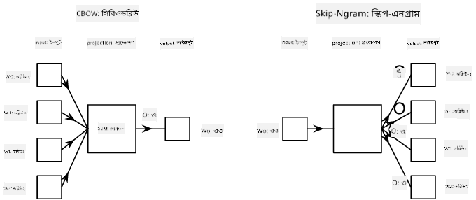

<!--
CO_OP_TRANSLATOR_METADATA:
{
  "original_hash": "31b46ba1f3aa78578134d4829f88be53",
  "translation_date": "2025-08-26T08:29:59+00:00",
  "source_file": "lessons/5-NLP/15-LanguageModeling/README.md",
  "language_code": "bn"
}
-->
# ভাষা মডেলিং

সেমান্টিক এম্বেডিং, যেমন Word2Vec এবং GloVe, আসলে **ভাষা মডেলিং** এর দিকে প্রথম পদক্ষেপ - এমন মডেল তৈরি করা যা কোনোভাবে ভাষার প্রকৃতি *বোঝে* (বা *প্রতিনিধিত্ব করে*)।

## [পূর্ব-লেকচার কুইজ](https://ff-quizzes.netlify.app/en/ai/quiz/29)

ভাষা মডেলিংয়ের মূল ধারণা হল তাদেরকে লেবেলবিহীন ডেটাসেটে প্রশিক্ষণ দেওয়া, যা একটি অসুপারভাইজড পদ্ধতিতে করা হয়। এটি গুরুত্বপূর্ণ কারণ আমাদের কাছে প্রচুর পরিমাণে লেবেলবিহীন টেক্সট উপলব্ধ রয়েছে, যেখানে লেবেলযুক্ত টেক্সটের পরিমাণ সবসময় সীমিত থাকবে, কারণ লেবেলিংয়ে আমরা যতটা প্রচেষ্টা করতে পারি তা দ্বারা সীমাবদ্ধ। বেশিরভাগ সময়, আমরা এমন ভাষা মডেল তৈরি করতে পারি যা **অনুপস্থিত শব্দগুলি পূর্বানুমান করতে পারে** টেক্সটে, কারণ টেক্সটে একটি র্যান্ডম শব্দ মাস্ক করা এবং এটি প্রশিক্ষণের নমুনা হিসাবে ব্যবহার করা সহজ।

## এম্বেডিং প্রশিক্ষণ

আমাদের আগের উদাহরণগুলিতে, আমরা প্রি-ট্রেইন্ড সেমান্টিক এম্বেডিং ব্যবহার করেছি, তবে এটি দেখতে আকর্ষণীয় যে কীভাবে এই এম্বেডিংগুলি প্রশিক্ষণ দেওয়া যায়। এখানে কয়েকটি সম্ভাব্য ধারণা রয়েছে যা ব্যবহার করা যেতে পারে:

* **N-Gram** ভাষা মডেলিং, যেখানে আমরা N পূর্ববর্তী টোকেন (N-গ্রাম) দেখে একটি টোকেন পূর্বানুমান করি।
* **কন্টিনিউয়াস ব্যাগ-অফ-ওয়ার্ডস** (CBoW), যেখানে আমরা একটি টোকেন সিকোয়েন্স $W_{-N}$, ..., $W_N$ এর মধ্যে $W_0$ টোকেন পূর্বানুমান করি।
* **স্কিপ-গ্রাম**, যেখানে আমরা মধ্যবর্তী টোকেন $W_0$ থেকে পার্শ্ববর্তী টোকেনগুলির সেট {$W_{-N},\dots, W_{-1}, W_1,\dots, W_N$} পূর্বানুমান করি।

> চিত্র [এই পেপার](https://arxiv.org/pdf/1301.3781.pdf) থেকে

## ✍️ উদাহরণ নোটবুক: CBoW মডেল প্রশিক্ষণ

নিম্নলিখিত নোটবুকগুলিতে আপনার শেখা চালিয়ে যান:

* [TensorFlow দিয়ে CBoW Word2Vec প্রশিক্ষণ](../../../../../lessons/5-NLP/15-LanguageModeling/CBoW-TF.ipynb)
* [PyTorch দিয়ে CBoW Word2Vec প্রশিক্ষণ](../../../../../lessons/5-NLP/15-LanguageModeling/CBoW-PyTorch.ipynb)

## উপসংহার

পূর্ববর্তী পাঠে আমরা দেখেছি যে শব্দ এম্বেডিংগুলি জাদুর মতো কাজ করে! এখন আমরা জানি যে শব্দ এম্বেডিং প্রশিক্ষণ দেওয়া খুব জটিল কাজ নয়, এবং প্রয়োজনে আমরা ডোমেইন-নির্দিষ্ট টেক্সটের জন্য আমাদের নিজস্ব শব্দ এম্বেডিং প্রশিক্ষণ দিতে সক্ষম হওয়া উচিত।

## [পোস্ট-লেকচার কুইজ](https://ff-quizzes.netlify.app/en/ai/quiz/30)

## পর্যালোচনা ও স্ব-অধ্যয়ন

* [PyTorch এর অফিসিয়াল ভাষা মডেলিং টিউটোরিয়াল](https://pytorch.org/tutorials/beginner/nlp/word_embeddings_tutorial.html)।
* [TensorFlow এর অফিসিয়াল Word2Vec মডেল প্রশিক্ষণ টিউটোরিয়াল](https://www.TensorFlow.org/tutorials/text/word2vec)।
* **gensim** ফ্রেমওয়ার্ক ব্যবহার করে কয়েকটি লাইনে সবচেয়ে সাধারণ এম্বেডিং প্রশিক্ষণের পদ্ধতি [এই ডকুমেন্টেশনে](https://pytorch.org/tutorials/beginner/nlp/word_embeddings_tutorial.html) বর্ণনা করা হয়েছে।

## 🚀 [অ্যাসাইনমেন্ট: স্কিপ-গ্রাম মডেল প্রশিক্ষণ](lab/README.md)

ল্যাবে, আমরা আপনাকে এই পাঠের কোড পরিবর্তন করে CBoW এর পরিবর্তে স্কিপ-গ্রাম মডেল প্রশিক্ষণ দেওয়ার চ্যালেঞ্জ দিচ্ছি। [বিস্তারিত পড়ুন](lab/README.md)

**অস্বীকৃতি**:  
এই নথিটি AI অনুবাদ পরিষেবা [Co-op Translator](https://github.com/Azure/co-op-translator) ব্যবহার করে অনুবাদ করা হয়েছে। আমরা যথাসাধ্য সঠিকতা নিশ্চিত করার চেষ্টা করি, তবে অনুগ্রহ করে মনে রাখবেন যে স্বয়ংক্রিয় অনুবাদে ত্রুটি বা অসঙ্গতি থাকতে পারে। মূল ভাষায় থাকা নথিটিকে প্রামাণিক উৎস হিসেবে বিবেচনা করা উচিত। গুরুত্বপূর্ণ তথ্যের জন্য, পেশাদার মানব অনুবাদ সুপারিশ করা হয়। এই অনুবাদ ব্যবহারের ফলে কোনো ভুল বোঝাবুঝি বা ভুল ব্যাখ্যা হলে আমরা দায়বদ্ধ থাকব না।