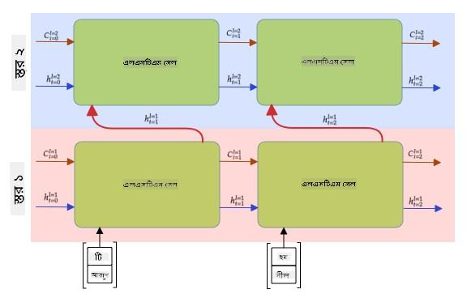

<!--
CO_OP_TRANSLATOR_METADATA:
{
  "original_hash": "58bf4adb210aab53e8f78c8082040e7c",
  "translation_date": "2025-08-26T08:08:48+00:00",
  "source_file": "lessons/5-NLP/16-RNN/README.md",
  "language_code": "bn"
}
-->
# পুনরাবৃত্ত নিউরাল নেটওয়ার্ক

## [পূর্ব-লেকচার কুইজ](https://ff-quizzes.netlify.app/en/ai/quiz/31)

পূর্ববর্তী অংশগুলোতে, আমরা টেক্সটের সমৃদ্ধ সেমান্টিক উপস্থাপনাগুলি এবং এম্বেডিংয়ের উপরে একটি সাধারণ লিনিয়ার ক্লাসিফায়ার ব্যবহার করেছি। এই আর্কিটেকচারের কাজ হলো একটি বাক্যের শব্দগুলোর সম্মিলিত অর্থ ধারণ করা, কিন্তু এটি শব্দগুলোর **ক্রম** বিবেচনা করে না, কারণ এম্বেডিংয়ের উপরে অ্যাগ্রিগেশন অপারেশন মূল টেক্সট থেকে এই তথ্যটি সরিয়ে দেয়। যেহেতু এই মডেলগুলো শব্দের ক্রম মডেল করতে অক্ষম, তাই তারা টেক্সট জেনারেশন বা প্রশ্নোত্তরের মতো জটিল বা দ্ব্যর্থক কাজ সমাধান করতে পারে না।

টেক্সট সিকোয়েন্সের অর্থ ধারণ করতে, আমাদের আরেকটি নিউরাল নেটওয়ার্ক আর্কিটেকচার ব্যবহার করতে হবে, যাকে বলা হয় **পুনরাবৃত্ত নিউরাল নেটওয়ার্ক**, বা RNN। RNN-এ, আমরা আমাদের বাক্যটি নেটওয়ার্কের মধ্য দিয়ে একবারে একটি প্রতীক পাঠাই, এবং নেটওয়ার্কটি কিছু **অবস্থা** তৈরি করে, যা আমরা পরবর্তী প্রতীকের সাথে আবার নেটওয়ার্কে পাঠাই।

> লেখকের চিত্র

প্রতীকগুলোর ইনপুট সিকোয়েন্স X0,...,Xn দেওয়া হলে, RNN একটি নিউরাল নেটওয়ার্ক ব্লকের সিকোয়েন্স তৈরি করে এবং ব্যাকপ্রোপাগেশনের মাধ্যমে এই সিকোয়েন্সটি এন্ড-টু-এন্ড প্রশিক্ষণ দেয়। প্রতিটি নেটওয়ার্ক ব্লক (Xi,Si) জোড়াকে ইনপুট হিসেবে নেয় এবং ফলাফল হিসেবে Si+1 তৈরি করে। চূড়ান্ত অবস্থা Sn বা (আউটপুট Yn) একটি লিনিয়ার ক্লাসিফায়ারে যায় ফলাফল তৈরি করতে। সমস্ত নেটওয়ার্ক ব্লক একই ওজন শেয়ার করে এবং একবার ব্যাকপ্রোপাগেশন পাসের মাধ্যমে এন্ড-টু-এন্ড প্রশিক্ষণ পায়।

কারণ অবস্থা ভেক্টর S0,...,Sn নেটওয়ার্কের মধ্য দিয়ে পাঠানো হয়, এটি শব্দগুলোর ক্রমিক নির্ভরতা শিখতে সক্ষম। উদাহরণস্বরূপ, যখন *not* শব্দটি সিকোয়েন্সের কোথাও উপস্থিত হয়, এটি অবস্থা ভেক্টরের নির্দিষ্ট উপাদানগুলোকে নেগেট করতে শিখতে পারে, যার ফলে নেগেশন ঘটে।

> ✅ যেহেতু উপরের ছবিতে সমস্ত RNN ব্লকের ওজন শেয়ার করা হয়, একই ছবি একটি ব্লক (ডানদিকে) হিসেবে উপস্থাপন করা যেতে পারে একটি পুনরাবৃত্ত ফিডব্যাক লুপ সহ, যা নেটওয়ার্কের আউটপুট অবস্থা ইনপুটে ফেরত পাঠায়।

## একটি RNN সেলের গঠন

চলুন দেখি একটি সাধারণ RNN সেল কীভাবে সংগঠিত। এটি পূর্ববর্তী অবস্থা Si-1 এবং বর্তমান প্রতীক Xi ইনপুট হিসেবে গ্রহণ করে এবং আউটপুট অবস্থা Si তৈরি করতে হয় (এবং, কখনও কখনও, আমরা অন্য কিছু আউটপুট Yi সম্পর্কেও আগ্রহী, যেমন জেনারেটিভ নেটওয়ার্কের ক্ষেত্রে)।

একটি সাধারণ RNN সেলের ভিতরে দুটি ওজন ম্যাট্রিক্স থাকে: একটি ইনপুট প্রতীককে রূপান্তর করে (আমরা একে W বলি), এবং অন্যটি ইনপুট অবস্থাকে রূপান্তর করে (H)। এই ক্ষেত্রে নেটওয়ার্কের আউটপুট হিসাব করা হয় σ(W×Xi+H×Si-1+b), যেখানে σ হলো অ্যাক্টিভেশন ফাংশন এবং b হলো অতিরিক্ত বায়াস।

> লেখকের চিত্র

অনেক ক্ষেত্রে, ইনপুট প্রতীকগুলো RNN-এ প্রবেশ করার আগে এম্বেডিং লেয়ারের মধ্য দিয়ে পাঠানো হয় ডাইমেনশনালিটি কমানোর জন্য। এই ক্ষেত্রে, যদি ইনপুট ভেক্টরের ডাইমেনশন *emb_size* হয়, এবং অবস্থা ভেক্টর *hid_size* হয় - তবে W-এর আকার হবে *emb_size*×*hid_size*, এবং H-এর আকার হবে *hid_size*×*hid_size*।

## লং শর্ট টার্ম মেমোরি (LSTM)

ক্লাসিক্যাল RNN-এর প্রধান সমস্যাগুলোর একটি হলো **ভ্যানিশিং গ্রেডিয়েন্টস** সমস্যা। যেহেতু RNN-গুলো একবার ব্যাকপ্রোপাগেশন পাসে এন্ড-টু-এন্ড প্রশিক্ষণ পায়, এটি নেটওয়ার্কের প্রথম স্তরগুলোতে ত্রুটি প্রোপাগেট করতে অসুবিধা হয়, এবং এর ফলে নেটওয়ার্ক দূরবর্তী প্রতীকগুলোর মধ্যে সম্পর্ক শিখতে পারে না। এই সমস্যাটি এড়ানোর একটি উপায় হলো **স্পষ্ট অবস্থা ব্যবস্থাপনা** প্রবর্তন করা **গেট** ব্যবহার করে। এই ধরনের দুটি সুপরিচিত আর্কিটেকচার হলো: **লং শর্ট টার্ম মেমোরি** (LSTM) এবং **গেটেড রিলে ইউনিট** (GRU)।

> চিত্রের উৎস TBD

LSTM নেটওয়ার্ক RNN-এর মতোই সংগঠিত, কিন্তু এখানে দুটি অবস্থা স্তর থেকে স্তরে পাঠানো হয়: প্রকৃত অবস্থা C এবং হিডেন ভেক্টর H। প্রতিটি ইউনিটে, হিডেন ভেক্টর Hi ইনপুট Xi-এর সাথে একত্রিত হয়, এবং তারা **গেট**-এর মাধ্যমে অবস্থা C-তে কী ঘটবে তা নিয়ন্ত্রণ করে। প্রতিটি গেট হলো সিগময়েড অ্যাক্টিভেশন সহ একটি নিউরাল নেটওয়ার্ক (আউটপুট [0,1] পরিসরে), যা অবস্থা ভেক্টরের সাথে গুণিত হলে বিটওয়াইজ মাস্ক হিসেবে বিবেচনা করা যেতে পারে। নিচে গেটগুলো উল্লেখ করা হলো (উপরের ছবিতে বাম থেকে ডানে):

* **ফরগেট গেট** একটি হিডেন ভেক্টর গ্রহণ করে এবং নির্ধারণ করে কোন উপাদানগুলো অবস্থা C থেকে ভুলে যেতে হবে এবং কোনগুলো পাস করতে হবে।
* **ইনপুট গেট** ইনপুট এবং হিডেন ভেক্টর থেকে কিছু তথ্য গ্রহণ করে এবং তা অবস্থায় যোগ করে।
* **আউটপুট গেট** অবস্থা একটি লিনিয়ার লেয়ারের মাধ্যমে রূপান্তর করে *tanh* অ্যাক্টিভেশন সহ, তারপর এর কিছু উপাদান নির্বাচন করে একটি নতুন অবস্থা Ci+1 তৈরি করতে।

অবস্থা C-এর উপাদানগুলোকে কিছু ফ্ল্যাগ হিসেবে বিবেচনা করা যেতে পারে যা চালু এবং বন্ধ করা যায়। উদাহরণস্বরূপ, যখন আমরা সিকোয়েন্সে *Alice* নামটি পাই, আমরা ধরে নিতে পারি এটি একটি মহিলা চরিত্রকে নির্দেশ করে, এবং অবস্থায় একটি ফ্ল্যাগ উত্থাপন করি যে বাক্যে একটি মহিলা বিশেষ্য রয়েছে। যখন আমরা আরও *and Tom* বাক্যাংশটি পাই, আমরা ফ্ল্যাগ উত্থাপন করি যে এখানে একটি বহুবচন বিশেষ্য রয়েছে। এভাবে অবস্থার মাধ্যমে আমরা বাক্যের অংশগুলোর ব্যাকরণগত বৈশিষ্ট্যগুলো ট্র্যাক করতে পারি।

> ✅ LSTM-এর অভ্যন্তরীণ বিষয়গুলো বোঝার জন্য একটি চমৎকার রিসোর্স হলো ক্রিস্টোফার ওলাহের এই অসাধারণ নিবন্ধ [Understanding LSTM Networks](https://colah.github.io/posts/2015-08-Understanding-LSTMs/)।

## বাইডাইরেকশনাল এবং মাল্টিলেয়ার RNN

আমরা এমন পুনরাবৃত্ত নেটওয়ার্ক নিয়ে আলোচনা করেছি যা একদিকে কাজ করে, সিকোয়েন্সের শুরু থেকে শেষ পর্যন্ত। এটি স্বাভাবিক মনে হয়, কারণ এটি পড়া এবং বক্তৃতা শোনার পদ্ধতির সাথে সাদৃশ্যপূর্ণ। তবে, অনেক বাস্তব ক্ষেত্রে আমাদের ইনপুট সিকোয়েন্সে র‍্যান্ডম অ্যাক্সেস থাকে, তাই পুনরাবৃত্ত গণনা উভয় দিকেই চালানো যৌক্তিক হতে পারে। এমন নেটওয়ার্কগুলোকে বলা হয় **বাইডাইরেকশনাল** RNN। বাইডাইরেকশনাল নেটওয়ার্কের ক্ষেত্রে, আমাদের দুটি হিডেন স্টেট ভেক্টর প্রয়োজন হবে, প্রতিটি দিকের জন্য একটি।

একটি পুনরাবৃত্ত নেটওয়ার্ক, একদিকীয় বা বাইডাইরেকশনাল, একটি সিকোয়েন্সের নির্দিষ্ট প্যাটার্নগুলো ধারণ করে এবং সেগুলোকে একটি স্টেট ভেক্টরে সংরক্ষণ করতে পারে বা আউটপুটে পাস করতে পারে। কনভলিউশনাল নেটওয়ার্কের মতো, আমরা প্রথম স্তর দ্বারা নির্যাসিত নিম্ন-স্তরের প্যাটার্ন থেকে উচ্চ-স্তরের প্যাটার্ন ধারণ করতে প্রথম স্তরের উপরে আরেকটি পুনরাবৃত্ত স্তর তৈরি করতে পারি। এটি আমাদের **মাল্টি-লেয়ার RNN** ধারণায় নিয়ে যায়, যা দুটি বা তার বেশি পুনরাবৃত্ত নেটওয়ার্ক নিয়ে গঠিত, যেখানে পূর্ববর্তী স্তরের আউটপুট পরবর্তী স্তরের ইনপুট হিসেবে পাস হয়।

*[এই চমৎকার পোস্ট](https://towardsdatascience.com/from-a-lstm-cell-to-a-multilayer-lstm-network-with-pytorch-2899eb5696f3) থেকে ফার্নান্দো লোপেজের ছবি*

## ✍️ অনুশীলন: এম্বেডিং

নিম্নলিখিত নোটবুকগুলোতে আপনার শেখা চালিয়ে যান:

* [PyTorch দিয়ে RNN](../../../../../lessons/5-NLP/16-RNN/RNNPyTorch.ipynb)
* [TensorFlow দিয়ে RNN](../../../../../lessons/5-NLP/16-RNN/RNNTF.ipynb)

## উপসংহার

এই ইউনিটে, আমরা দেখেছি যে RNN সিকোয়েন্স ক্লাসিফিকেশনের জন্য ব্যবহার করা যেতে পারে, কিন্তু প্রকৃতপক্ষে, তারা আরও অনেক কাজ পরিচালনা করতে পারে, যেমন টেক্সট জেনারেশন, মেশিন ট্রান্সলেশন, এবং আরও অনেক কিছু। আমরা পরবর্তী ইউনিটে এই কাজগুলো বিবেচনা করব।

## 🚀 চ্যালেঞ্জ

LSTM সম্পর্কে কিছু সাহিত্য পড়ুন এবং তাদের প্রয়োগ বিবেচনা করুন:

- [Grid Long Short-Term Memory](https://arxiv.org/pdf/1507.01526v1.pdf)
- [Show, Attend and Tell: Neural Image Caption
Generation with Visual Attention](https://arxiv.org/pdf/1502.03044v2.pdf)

## [পোস্ট-লেকচার কুইজ](https://ff-quizzes.netlify.app/en/ai/quiz/32)

## পর্যালোচনা ও স্ব-অধ্যয়ন

- [Understanding LSTM Networks](https://colah.github.io/posts/2015-08-Understanding-LSTMs/) ক্রিস্টোফার ওলাহের দ্বারা।

## [অ্যাসাইনমেন্ট: নোটবুক](assignment.md)

**অস্বীকৃতি**:  
এই নথিটি AI অনুবাদ পরিষেবা [Co-op Translator](https://github.com/Azure/co-op-translator) ব্যবহার করে অনুবাদ করা হয়েছে। আমরা যথাসাধ্য সঠিকতা নিশ্চিত করার চেষ্টা করি, তবে অনুগ্রহ করে মনে রাখবেন যে স্বয়ংক্রিয় অনুবাদে ত্রুটি বা অসঙ্গতি থাকতে পারে। মূল ভাষায় থাকা নথিটিকে প্রামাণিক উৎস হিসেবে বিবেচনা করা উচিত। গুরুত্বপূর্ণ তথ্যের জন্য, পেশাদার মানব অনুবাদ সুপারিশ করা হয়। এই অনুবাদ ব্যবহারের ফলে কোনো ভুল বোঝাবুঝি বা ভুল ব্যাখ্যা হলে আমরা দায়বদ্ধ থাকব না।